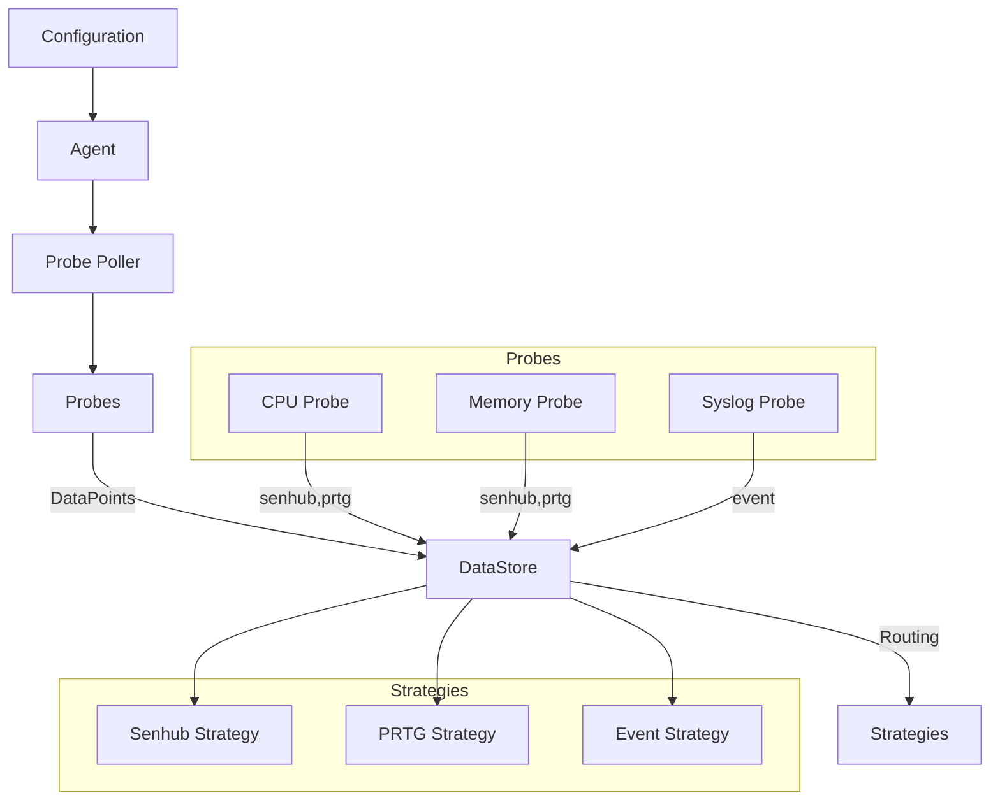

# SenHub agent

## Install for development

```bash
make install
```

## Running the project

You need to have go installed on your machine.
At the time of writing, the project is using go 1.23.2

To run the project in development mode, you need to run the following command:

```bash
make watch
```

This will start the project in development mode, and it will watch for changes
in the code.

To run the project in production mode, you need to run the following command:

```bash
make build
./senhub-agent start --authentication-key some_key --server-url "http://localhost:8080"
```

### Build environment

Project can be built in `development` or `production` mode by setting `ENV`
variable.

```bash
ENV=development make build
```

## Running the tests

To run the tests, you need to run the following command:

```bash
make test
```

## Configuration

Agent configuration is read from senhub server.
A valid configuration mathes the following structure:

```json
{
  "agent": {
    "version": "0.1.0",
    "registry_url": "https://eu-west-1.intake.senhub.io/"
  },
  "probes": [
    {
      "name": "load_webapp",
      "params": { "url": "http://www.google.fr", "timeout": 5 }
    },
    { "name": "ping_webapp", "params": { "url": "http://example.org:8080" } },
    { "name": "ping_gateway", "params": {} },
    { "name": "wifi_signal_strength", "params": {} },
    { "name": "memory", "params": {} }
  ],
  "storage": [
    { "name": "senhub", "params": {} },
    {
      "name": "prtg",
      "params": {
        "data_retention_period": "2m",
        "server_url": "http://localhost:8080"
      }
    }
  ]
}
```

### Agent

- `version` (optional): required version for the agent. Can be in the form of `x.y.z`,
  `latest`, `>=x.y.z`, `<=x.y.z`, `>x.y.z`, `<x.y.z`, `!=x.y.z`
- `registry_url` (optional): URL to the registry server, default is
  `https://eu-west-1.intake.senhub.io/`
=======
# Data Collection System Architecture

## Overview

The data collection system is designed to be flexible and extensible, allowing collection of different types of data (metrics and events) and routing them to different backends.



## Data Types

### 1. Regular DataPoint
Used for standard metrics (CPU, memory, etc.)

```go
type DataPoint struct {
    Name      string     // Metric name
    Timestamp time.Time  // Measurement timestamp
    Value     float32    // Numeric value
    Tags      []tags.Tag // Associated tags
}
```

### 2. EventDataPoint
Used for events (logs, alerts, etc.)

```go
type EventDataPoint map[string]interface{}
```

## Key Components

### 1. Probes
- Collect data
- Implement `types.Probe` interface
- Can implement `types.ProbeWithCallback` for event-driven processing
- Indicate their target strategies via `StrategyRouter`

### 2. Probe Poller
- Manages probe lifecycle
- Configures callbacks
- Orchestrates periodic collection

### 3. DataStore
- Receives data from probes
- Routes data to appropriate strategies
- Manages strategy configuration

### 4. Strategies
- Senhub: For standard metrics
- PRTG: For PRTG metrics
- Event: For events

## Configuration

The configuration defines:
1. Which probes to enable
2. Probe parameters
3. Which strategies to use
4. Strategy configuration

Example:
```json
[
    {"name": "senhub", "params": {}},
    {"name": "event", "params": {
        "server_url": "https://server/event",
        "queue_size": 1000,
        "sync_interval": "30s"
    }}
]
```

## Data Flow

1. Configuration is loaded
2. Probes are initialized via Probe Poller
3. Probes collect data:
   - Periodically for metrics
   - On event for events
4. Data is converted to DataPoints
5. DataStore routes data to appropriate strategies
6. Strategies send data to their destination

## Example: Syslog Probe

The Syslog Probe illustrates the architecture well:
1. Listens for syslog messages (UDP/TCP)
2. Converts messages to DataPoints
3. Uses formatter for conversion to EventDataPoints
4. Routes only to "event" strategy
5. Implements ProbeWithCallback for event-driven processing

## Extending the System

To add a new collection type:
1. Create a new probe
2. Implement required interfaces
3. Define target strategies
4. Add constructor to probe registry

To add a new destination:
1. Create a new strategy
2. Implement SyncStrategy interface
3. Add strategy to configuration

## Interfaces

### Probe Interface
```go
type Probe interface {
    GetName() string
    ShouldStart() bool
    GetInterval() time.Duration
    Collect() ([]DataPoint, error)
    OnStart(chan struct{}) error
    OnShutdown(context.Context) error
}
```

### ProbeWithCallback Interface
```go
type ProbeWithCallback interface {
    Probe
    SetCallback(func([]DataPoint) error)
}
```

### StrategyRouter Interface
```go
type StrategyRouter interface {
    GetTargetStrategies() []string
}
```

### SyncStrategy Interface
```go
type SyncStrategy interface {
    GetStrategyName() string
    GetStrategyParams() map[string]interface{}
    ValidateConfigParams(StorageConfigParams) error
    Start() error
    AddDataPoints([]DataPoint) error
    Shutdown(context.Context) error
}
```

## Best Practices

1. **Error Handling**
   - Always handle and log errors appropriately
   - Return meaningful error messages
   - Consider retry mechanisms for network operations

2. **Configuration**
   - Provide sensible defaults
   - Validate all configuration parameters
   - Document configuration options

3. **Resource Management**
   - Properly clean up resources in Shutdown
   - Use appropriate buffer sizes
   - Implement graceful shutdown

4. **Data Routing**
   - Define clear routing rules
   - Handle routing failures gracefully
   - Monitor routing performance

5. **Testing**
   - Unit test all components
   - Test error conditions
   - Mock external dependencies
