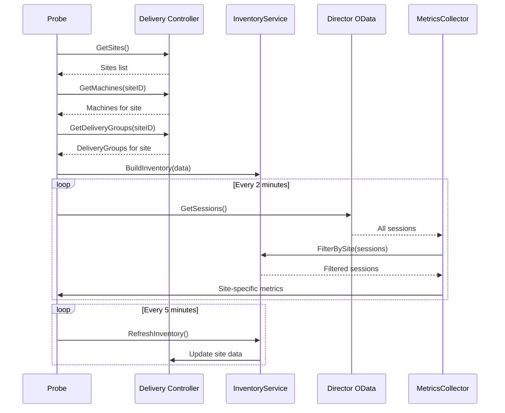

# Plan d'Evolution: Filtrage par Site Citrix via Delivery Controller

## 📋 Analyse de l'Existant

### Architecture Actuelle
1. **OData API (Director)**: Collecte les métriques via `/Citrix/Monitor/OData/v4/Data`
   - Sessions, Machines, DesktopGroups, ConnectionFailures
   - Pas de notion de "Site" dans les données OData
   - Toutes les métriques sont globales ou par DesktopGroup

2. **Delivery Controller (DDC)**: Infrastructure partiellement implémentée
   - Interface `DeliveryControllerClient` existe
   - Méthodes `GetSites()` et `GetMachinesBySite()` définies
   - Client HTTP avec token Bearer pour CVAD REST API
   - Configuration YAML avec `delivery_controller` section

3. **Problème Identifié**
   - Les API OData ne filtrent pas nativement par site
   - Les métriques incluent TOUS les sites du farm Citrix
   - Impossible de séparer les statistiques par datacenter/site

## 🎯 Objectif
Permettre le filtrage des métriques par site Citrix en utilisant les API du Delivery Controller pour créer un inventaire et filtrer les résultats OData.

## 🏗️ Architecture Proposée

### Phase 1: Inventaire des Sites
```
Delivery Controller API
    ├── /cvad/manage/Sites → Liste des sites
    ├── /cvad/manage/Machines → Machines par site
    ├── /cvad/manage/DeliveryGroups → Groupes par site
    └── /cvad/manage/Controllers → Controllers par site
```

### Phase 2: Mapping et Filtrage
```
Inventaire DDC → Filtre → OData API → Métriques Filtrées
    │                         │              │
    Sites/Machines       Données brutes   Par site uniquement
```

## 📝 Plan de Développement Détaillé

### Étape 1: Compléter l'API Delivery Controller
**Fichiers à modifier:**
- `ddc_methods.go`: Implémenter les méthodes manquantes
- `ddc_types.go`: Ajouter les structures de données

**APIs à implémenter:**
```go
// Inventaire complet
GetMachines(ctx, siteID string) ([]DDCMachine, error)
GetDeliveryGroups(ctx, siteID string) ([]DDCDeliveryGroup, error)
GetApplications(ctx, siteID string) ([]DDCApplication, error)
GetControllers(ctx, siteID string) ([]DDCController, error)
```

**Structures de données:**
```go
type DDCMachine struct {
    Id               string
    Name            string
    DNSName         string
    SiteId          string
    DeliveryGroupId string
    ControllerDNSName string
}

type DDCDeliveryGroup struct {
    Id      string
    Name    string
    SiteId  string
    Machines []string // Machine IDs
}
```

### Étape 2: Créer le Service d'Inventaire
**Nouveau fichier:** `site_inventory.go`

```go
type SiteInventory struct {
    SiteID           string
    SiteName         string
    Machines         map[string]DDCMachine        // MachineDNS → Machine
    DeliveryGroups   map[string]DDCDeliveryGroup  // GroupID → Group
    Controllers      map[string]bool               // ControllerDNS → exists
    LastUpdate       time.Time
}

type InventoryService struct {
    ddcClient  DeliveryControllerClient
    cache      *SiteInventory
    cacheTTL   time.Duration
    logger     *logger.ModuleLogger
}
```

**Méthodes principales:**
```go
func (s *InventoryService) RefreshInventory(ctx, siteFilter string) error
func (s *InventoryService) IsInSite(machineDNS string) bool
func (s *InventoryService) GetDeliveryGroupsForSite() []string
func (s *InventoryService) GetControllersForSite() []string
```

### Étape 3: Intégrer le Filtrage dans MetricsCollector
**Modifier:** `metrics_collector.go`

```go
type MetricsCollector struct {
    client       CitrixClient
    inventory    *InventoryService  // NEW
    siteFilter   string             // NEW
    // ...
}

// Modifier les méthodes de collecte
func (mc *MetricsCollector) CollectSessionMetrics(ctx, timestamp) {
    sessions := mc.client.GetSessions(ctx, timestamp)
    
    // NOUVEAU: Filtrer par site
    if mc.inventory != nil && mc.siteFilter != "" {
        sessions = mc.filterSessionsBySite(sessions)
    }
    
    // Suite du traitement...
}

func (mc *MetricsCollector) filterSessionsBySite(sessions []Session) []Session {
    filtered := []Session{}
    for _, session := range sessions {
        // Vérifier si la machine est dans le site
        if mc.inventory.IsInSite(session.MachineDNSName) {
            filtered = append(filtered, session)
        }
    }
    return filtered
}
```

### Étape 4: Mise à jour du Probe Principal
**Modifier:** `citrixProbe.go`

```go
func (p *citrixProbe) OnStart(quitChannel chan struct{}) error {
    // ... initialisation existante ...
    
    // NOUVEAU: Initialiser l'inventaire si DDC configuré
    if p.ddcConfig != nil && p.siteFilter != "" {
        p.inventoryService = NewInventoryService(
            p.ddcClient,
            5 * time.Minute, // Cache TTL
            p.logger,
        )
        
        // Charger l'inventaire initial
        if err := p.inventoryService.RefreshInventory(p.ctx, p.siteFilter); err != nil {
            return fmt.Errorf("failed to load site inventory: %v", err)
        }
        
        // Lancer le refresh périodique
        go p.inventoryService.StartPeriodicRefresh(p.ctx, 5*time.Minute)
    }
    
    // Passer l'inventaire au MetricsCollector
    p.metricsCollector = NewMetricsCollectorWithInventory(
        p.client,
        p.inventoryService,
        p.siteFilter,
        p.environment,
        p.baseURL,
        p.logger.Logger,
    )
}
```

### Étape 5: Gestion des Cas d'Erreur
**Stratégies de fallback:**

1. **DDC indisponible**: Continuer sans filtrage
2. **Site inexistant**: Logger warning, collecter tout
3. **Cache expiré**: Utiliser dernier inventaire valide
4. **Machines non trouvées**: Exclure des métriques

```go
func (p *citrixProbe) handleInventoryError(err error) {
    p.logger.Warn().
        Err(err).
        Str("site", p.siteFilter).
        Msg("Site filtering disabled due to error - collecting all metrics")
    
    // Désactiver temporairement le filtrage
    p.metricsCollector.DisableFiltering()
}
```

## 🔄 Flux de Données Complet



## 📊 Métriques Affectées par le Filtrage

### Métriques à Filtrer
- **Sessions**: Par machine DNS name
- **Machines**: Par machine ID/DNS
- **Connection Failures**: Par DeliveryGroupId
- **Logon Performance**: Par session machine

### Métriques Globales (non filtrées)
- **Controllers**: Health status (tous les DDC)
- **Licensing**: Utilisation globale
- **Site Health**: Vue d'ensemble

## 🧪 Plan de Tests

### Tests Unitaires
1. `TestInventoryService_BuildFromDDCData`
2. `TestMetricsCollector_FilterSessionsBySite`
3. `TestDDCClient_GetMachinesBySite`
4. `TestInventoryCache_Expiration`

### Tests d'Intégration
1. Configuration avec site valide → métriques filtrées
2. Configuration sans DDC → toutes les métriques
3. DDC timeout → fallback gracieux
4. Site inexistant → warning + toutes métriques

### Tests de Performance
1. Inventaire avec 1000+ machines
2. Filtrage de 10000+ sessions
3. Impact sur latence de collecte

## 🚀 Phases de Déploiement

### Phase 1 (MVP)
- API DDC basiques (Sites, Machines)
- Filtrage des sessions uniquement
- Cache simple en mémoire

### Phase 2 (Complet)
- Toutes les API DDC
- Filtrage complet (toutes métriques)
- Cache persistant avec TTL

### Phase 3 (Avancé)
- Multi-site simultané
- Agrégation cross-site
- Métriques de comparaison

## ⚠️ Points d'Attention

### Sécurité
- Authentification DDC (Bearer token)
- Rotation automatique des tokens
- Audit des accès API

### Performance
- Cache inventaire (5 min TTL)
- Requêtes parallèles DDC
- Pagination pour grandes listes

### Compatibilité
- CVAD 7.x vs 2xxx versions
- Director vs DDC API versions
- Sites vs Zones (ancienne nomenclature)

## 📝 Configuration Exemple

```yaml
probes:
  - name: citrix
    params:
      base_url: "https://director.company.com/Citrix/Monitor/OData/v4/Data"
      
      delivery_controller:
        url: "https://ddc1.company.com"
        fallback_urls:
          - "https://ddc2.company.com"
        site_filter: "Paris-DataCenter"
        inventory_cache_ttl: 300  # 5 minutes
        
      # Comportement si DDC indisponible
      fallback_behavior: "collect_all"  # ou "fail"
```

## 🔍 Monitoring et Logs

### Métriques Internes
- `citrix_inventory_refresh_duration_ms`
- `citrix_inventory_machine_count`
- `citrix_filtering_enabled` (0/1)
- `citrix_sessions_filtered_count`

### Logs Importants
```
INFO: Site inventory loaded - site=Paris machines=156
WARN: DDC unavailable - disabling site filtering
DEBUG: Filtered 234/567 sessions for site Paris
ERROR: Failed to refresh inventory - using cached data
```

## 📚 Documentation à Créer

1. **README_SITE_FILTERING.md**: Guide utilisateur
2. **API_DDC_REFERENCE.md**: Documentation API
3. **TROUBLESHOOTING_SITES.md**: Résolution problèmes
4. **MIGRATION_GUIDE.md**: Migration configs existantes

## ✅ Checklist Avant Production

- [ ] Tests unitaires (coverage > 80%)
- [ ] Tests d'intégration multi-sites
- [ ] Documentation complète
- [ ] Logs structurés avec contexte
- [ ] Métriques de monitoring
- [ ] Gestion erreurs robuste
- [ ] Configuration exemple
- [ ] Guide de migration
- [ ] Tests de charge
- [ ] Validation sécurité

## 🎯 Résultat Attendu

L'agent pourra:
1. Identifier les sites disponibles via DDC
2. Créer un inventaire des ressources par site
3. Filtrer toutes les métriques OData par site
4. Supporter multi-sites avec instances séparées
5. Gérer les erreurs gracieusement

Cela permettra un monitoring précis par datacenter/site sans pollution cross-site des métriques.