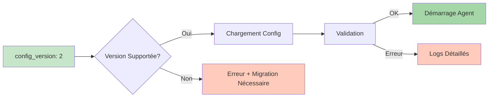
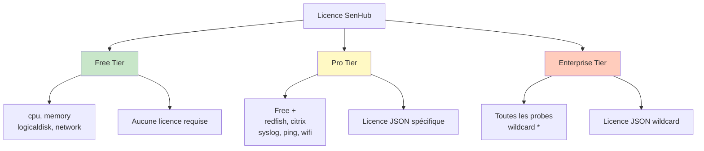
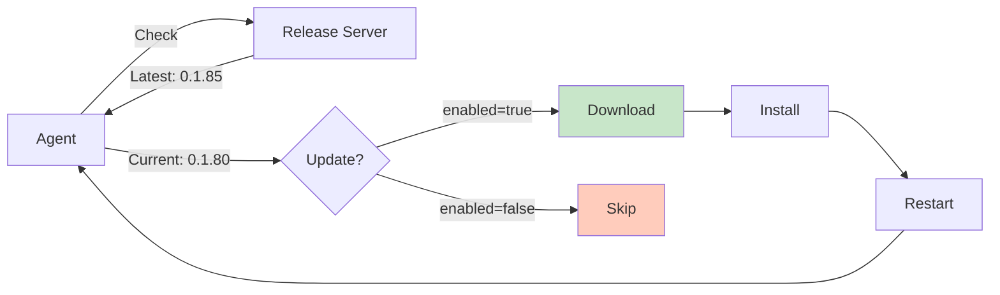
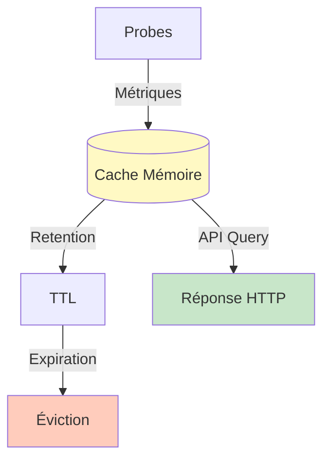

# SenHub Agent - Configuration de l'Agent

## Table des Matières

- [Structure du Fichier de Configuration](#structure-du-fichier-de-configuration)
- [Configuration Agent](#configuration-agent)
- [Système de Licence](#système-de-licence)
- [Configuration Auto-Update](#configuration-auto-update)
- [Configuration Cache](#configuration-cache)
- [Exemples Complets](#exemples-complets)
- [Validation de la Configuration](#validation-de-la-configuration)

---

## Structure du Fichier de Configuration

### Emplacement du Fichier

| Plateforme | Chemin par Défaut | Chemin Personnalisé |
|------------|-------------------|---------------------|
| **Windows** | `C:\Program Files\SenHub\agent-config.yaml` | `--config-path C:\Custom\Path\config.yaml` |
| **Linux** | `/etc/senhub-agent/agent-config.yaml` | `--config-path /custom/path/config.yaml` |
| **macOS** | `/usr/local/etc/senhub-agent/agent-config.yaml` | `--config-path /custom/path/config.yaml` |

### Format YAML

Le fichier utilise le format YAML version 2 avec validation stricte.

```yaml
# Commentaires autorisés
config_version: 2  # Version obligatoire (actuellement : 2)

agent:
  # Configuration agent

auto_update:
  # Configuration auto-update

cache:
  # Configuration cache

storage:
  # Configuration stockage (strategies)

probes:
  # Configuration probes
```

### Version de Configuration



**⚠️ Important** : Ne **jamais** modifier `config_version` manuellement. Cette valeur est gérée automatiquement par l'agent lors des migrations.

---

## Configuration Agent

### Section Agent

```yaml
agent:
  key: "<agent-key>"           # Clé d'authentification (UUID ou plateforme)
  mode: offline|online         # Mode de fonctionnement
  # license: ""                # Licence (optionnel, voir section dédiée)
```

### Agent Key

#### Mode Offline (UUID Généré)

Lors d'une installation offline, l'agent génère automatiquement un UUID v4 :

```yaml
agent:
  key: "f47ac10b-58cc-4372-a567-0e02b2c3d479"  # UUID v4 aléatoire
```

**Récupération de la clé après installation** :

```bash
# Linux/macOS
cat /etc/senhub-agent/agent-config.yaml | grep "key:"

# Windows
type "C:\Program Files\SenHub\agent-config.yaml" | findstr "key:"

# Ou via API
curl http://localhost:8080/api/info/system
# Retourne : {"agent_key": "f47ac10b-58cc-4372-a567-0e02b2c3d479", ...}
```

**📸 SCREENSHOT À INSÉRER** : Terminal affichant la sortie de `grep "key:"` avec l'UUID surligné

#### Mode Online (Clé Plateforme)

En mode online, la clé est fournie par la plateforme SenHub :

```yaml
agent:
  key: "platform-abc123def456ghi789"  # Fournie par SenHub
```

**Obtention de la clé** :
1. Se connecter au portail SenHub
2. Section "Agents" > "Add Agent"
3. Copier la clé générée

**📸 SCREENSHOT À INSÉRER** : Portail SenHub avec dialogue "Add Agent" montrant une clé générée et bouton "Copy"

### Mode de Fonctionnement

```yaml
agent:
  mode: offline  # ou "online"
```

| Mode | Description | Configuration |
|------|-------------|---------------|
| `offline` | Autonome, fichier YAML local | Lecture `agent-config.yaml` |
| `online` | Connecté à la plateforme SenHub | Téléchargement config depuis serveur |

> **📖 Détails** : Voir [OPERATING-MODES.md](./OPERATING-MODES.md) pour une comparaison complète

---

## Système de Licence

### Vue d'Ensemble des Tiers



### Tableau des Tiers

| Tier | Probes Incluses | Coût | Licence Requise |
|------|-----------------|------|-----------------|
| **Free** | `cpu`, `memory`, `logicaldisk`, `network` | Gratuit | ❌ Non |
| **Pro** | Free + `redfish`, `citrix`, `syslog`, `ping_gateway`, `ping_webapp`, `load_webapp`, `wifi_signal_strength` | Payant | ✅ Oui (JSON) |
| **Enterprise** | Toutes les probes (wildcard `*`) | Payant | ✅ Oui (JSON wildcard) |

### Demande de Licence

#### Étape 1 : Contacter le Support

**📧 Email** : `support@senhub.io`

**Informations à Fournir** :

```
Objet : Demande de Licence SenHub Agent

Bonjour,

Je souhaite obtenir une licence pour SenHub Agent.

Informations :
- Entreprise : [Nom de l'entreprise]
- Contact : [Nom, Prénom]
- Email : [email@entreprise.com]
- Téléphone : [+33 X XX XX XX XX]

Besoins :
- Tier souhaité : [Pro / Enterprise]
- Probes nécessaires : [redfish, citrix, etc.]
- Nombre d'agents : [ex: 5 agents]
- Environnement : [Production / Développement / POC]
- Durée souhaitée : [1 an / 2 ans / etc.]

Cas d'usage :
[Description brève de votre cas d'usage]

Merci,
[Signature]
```

**📸 SCREENSHOT À INSÉRER** : Client email (Outlook/Gmail) avec modèle d'email de demande de licence

#### Étape 2 : Réception de la Licence

Le support SenHub vous enverra un email contenant :

1. **Licence au format JSON**
2. **Instructions d'installation**
3. **Date d'expiration**
4. **Probes autorisées**

**Exemple de réponse** :

```
Bonjour,

Voici votre licence SenHub Agent Pro valable jusqu'au 31/12/2025 :

[Fichier JSON attaché : senhub-license-CUSTOMER-2025.json]

Installation :
1. Ouvrir le fichier agent-config.yaml
2. Décommenter la ligne "# license: """
3. Coller le contenu JSON (voir instructions ci-dessous)
4. Redémarrer l'agent

Support : support@senhub.io
Documentation : https://docs.senhub.io

Cordialement,
Équipe SenHub
```

### Format de la Licence

#### Licence Pro (Probes Spécifiques)

```json
{
  "tier": "pro",
  "authorized_probes": ["redfish", "citrix", "syslog"],
  "expires_at": "2025-12-31T23:59:59Z",
  "issued_at": "2025-01-01T00:00:00Z",
  "subject": "customer-company-name"
}
```

#### Licence Enterprise (Toutes les Probes)

```json
{
  "tier": "enterprise",
  "authorized_probes": ["*"],
  "expires_at": "2026-12-31T23:59:59Z",
  "issued_at": "2025-01-01T00:00:00Z",
  "subject": "enterprise-customer"
}
```

**Champs de la Licence** :

| Champ | Type | Description | Exemple |
|-------|------|-------------|---------|
| `tier` | String | Niveau de licence | `"pro"` ou `"enterprise"` |
| `authorized_probes` | Array | Liste des probes autorisées | `["redfish", "citrix"]` ou `["*"]` |
| `expires_at` | ISO 8601 | Date d'expiration | `"2025-12-31T23:59:59Z"` |
| `issued_at` | ISO 8601 | Date d'émission | `"2025-01-01T00:00:00Z"` |
| `subject` | String | Identifiant client | `"customer-id"` |

### Installation de la Licence

#### Méthode 1 : Via Fichier de Configuration (Recommandée)

```yaml
agent:
  key: "f47ac10b-58cc-4372-a567-0e02b2c3d479"
  mode: offline
  license: |
    {
      "tier": "pro",
      "authorized_probes": ["redfish", "citrix"],
      "expires_at": "2025-12-31T23:59:59Z",
      "issued_at": "2025-01-01T00:00:00Z",
      "subject": "customer-company"
    }
```

**⚠️ Important** :
- Respecter l'indentation YAML (2 espaces)
- Utiliser le pipe `|` pour le JSON multi-lignes
- Pas de guillemets autour du JSON

**📸 SCREENSHOT À INSÉRER** : Éditeur nano/vim montrant agent-config.yaml avec licence JSON correctement indentée

#### Méthode 2 : Via Variable d'Environnement (Alternative)

```bash
# Linux/macOS
export SENHUB_LICENSE='{"tier":"pro","authorized_probes":["redfish","citrix"],"expires_at":"2025-12-31T23:59:59Z","issued_at":"2025-01-01T00:00:00Z","subject":"customer"}'

# Windows PowerShell
$env:SENHUB_LICENSE='{"tier":"pro","authorized_probes":["redfish","citrix"],"expires_at":"2025-12-31T23:59:59Z","issued_at":"2025-01-01T00:00:00Z","subject":"customer"}'
```

**Priorité** : Variable d'environnement > Fichier de configuration

#### Étapes d'Installation

```bash
# 1. Arrêter l'agent
sudo systemctl stop senhub-agent  # Linux
sudo launchctl unload /Library/LaunchDaemons/io.senhub.agent.plist  # macOS
sc stop "SenHub Agent"  # Windows

# 2. Éditer la configuration
sudo nano /etc/senhub-agent/agent-config.yaml

# 3. Ajouter la licence (décommenter et coller JSON)
agent:
  license: |
    {
      "tier": "pro",
      ...
    }

# 4. Sauvegarder et redémarrer
sudo systemctl start senhub-agent  # Linux
sudo launchctl load /Library/LaunchDaemons/io.senhub.agent.plist  # macOS
sc start "SenHub Agent"  # Windows

# 5. Vérifier
curl http://localhost:8080/api/{agentkey}/license/status
```

### Vérification de la Licence

#### Via API REST

```bash
curl http://localhost:8080/api/{AGENT_KEY}/license/status
```

**Réponse (Licence Active)** :

```json
{
  "status": "active",
  "tier": "pro",
  "expires_at": "2025-12-31T23:59:59Z",
  "days_remaining": 180,
  "authorized_probes": ["redfish", "citrix", "syslog"],
  "free_tier_probes": ["cpu", "memory", "logicaldisk", "network"]
}
```

**Réponse (Période de Grâce)** :

```json
{
  "status": "grace_period",
  "tier": "pro",
  "expires_at": "2025-06-15T23:59:59Z",
  "days_remaining": -3,
  "grace_period_days_remaining": 4,
  "authorized_probes": ["redfish", "citrix"],
  "warning": "License expired 3 days ago. Grace period active for 4 more days."
}
```

**Réponse (Licence Expirée)** :

```json
{
  "status": "expired",
  "tier": "free",
  "expires_at": "2025-06-15T23:59:59Z",
  "days_remaining": -10,
  "authorized_probes": [],
  "free_tier_probes": ["cpu", "memory", "logicaldisk", "network"],
  "error": "License expired 10 days ago. Only free tier probes available."
}
```

#### Via Dashboard Web

**URL** : `http://localhost:8080/web/{AGENT_KEY}/dashboard`

**Section "License Information"** :

**📸 SCREENSHOT À INSÉRER** : Dashboard web montrant la carte "License Information" avec :
- Status: Active (badge vert)
- Tier: Pro
- Expires: 31/12/2025 (180 days remaining)
- Authorized Probes: badges "redfish", "citrix", "syslog"

#### Via Logs

```bash
# Linux
sudo tail -f /var/log/senhub-agent/agent.log

# Licence active
2025-12-18T10:00:00Z INF License validated tier=pro expires=2025-12-31 module=agent.core

# Licence proche expiration (< 30 jours)
2025-12-18T10:00:00Z WRN License expires soon days_remaining=15 module=agent.core

# Période de grâce
2025-12-18T10:00:00Z WRN License expired, grace period active grace_days=4 module=agent.core

# Licence expirée
2025-12-18T10:00:00Z ERR License expired, paid probes disabled module=agent.core
```

### Période de Grâce

```mermaid
gantt
    title Cycle de Vie d'une Licence
    dateFormat YYYY-MM-DD
    section Licence Active
    Licence valide           :active, 2025-01-01, 2025-12-31
    section Période de Grâce
    7 jours supplémentaires  :crit, 2025-12-31, 7d
    section Expiration
    Licence expirée          :done, after 7d, 1d

    style active fill:#c8e6c9
    style crit fill:#fff9c4
    style done fill:#ffccbc
```

**Comportement** :

| Période | Durée | Probes Payantes | Alertes |
|---------|-------|-----------------|---------|
| **Active** | Jusqu'à expiration | ✅ Actives | Aucune |
| **Expiration proche** | J-30 à J-1 | ✅ Actives | Warning dans logs (quotidien) |
| **Période de grâce** | 7 jours après expiration | ✅ Actives | Warning dans logs + dashboard |
| **Expirée** | Après période de grâce | ❌ Désactivées | Error dans logs + dashboard |

**Pendant la Période de Grâce** :

- Les probes payantes continuent de fonctionner
- Warnings dans les logs à chaque démarrage
- Banner dans le dashboard
- Email de rappel (si mode online)

**Après la Période de Grâce** :

- Les probes payantes sont désactivées au prochain redémarrage
- Seules les probes free tier restent actives
- Les métriques existantes en cache restent accessibles

### Renouvellement de Licence

#### Avant Expiration (Recommandé)

```bash
# 1. Contacter support@senhub.io 2 semaines avant expiration

# 2. Recevoir nouvelle licence

# 3. Remplacer dans agent-config.yaml
agent:
  license: |
    {
      "tier": "pro",
      "expires_at": "2026-12-31T23:59:59Z",  # Nouvelle date
      ...
    }

# 4. Redémarrer (sans interruption de service)
sudo systemctl restart senhub-agent
```

#### Après Expiration (Période de Grâce)

Même procédure, mais attention :
- Les probes payantes se réactiveront immédiatement
- Pas de perte de données en cache

#### Après Expiration Totale

```bash
# 1. Obtenir nouvelle licence

# 2. Installer la licence

# 3. Redémarrer l'agent
sudo systemctl restart senhub-agent

# 4. Les probes payantes redémarrent automatiquement
```

### Troubleshooting Licences

#### Erreur : "Invalid license format"

**Cause** : JSON mal formaté

**Solution** :
```bash
# Vérifier le JSON avec jq
echo '{"tier":"pro","authorized_probes":["redfish"],"expires_at":"2025-12-31T23:59:59Z","issued_at":"2025-01-01T00:00:00Z","subject":"customer"}' | jq .

# Si erreur, corriger le format dans agent-config.yaml
```

#### Erreur : "License signature invalid"

**Cause** : Licence corrompue ou modifiée

**Solution** :
- Redemander la licence à support@senhub.io
- Copier-coller directement depuis l'email (pas de modification manuelle)

#### Erreur : "License expired"

**Cause** : Licence expirée et période de grâce terminée

**Solution** :
```bash
# Contacter support pour renouvellement
# En attendant, seul free tier disponible
```

#### Probes Payantes Non Démarrées

```bash
# Vérifier statut licence
curl http://localhost:8080/api/{agentkey}/license/status

# Vérifier logs
sudo tail -100 /var/log/senhub-agent/agent.log | grep -i license

# Si "License not found", ajouter la licence
# Si "License expired", renouveler
# Si "Invalid format", corriger le JSON
```

**📸 SCREENSHOT À INSÉRER** : Terminal avec sortie de logs montrant une erreur de licence claire "License validation failed: expired"

---

## Configuration Auto-Update

### Principe



### Configuration

```yaml
auto_update:
  enabled: true   # Activer/désactiver les auto-updates
  url: "https://eu-west-1.intake.senhub.io/releases"
```

### Comportement par Mode

| Mode | `enabled: true` | `enabled: false` |
|------|-----------------|------------------|
| **Online** | Vérification automatique + download + install | Aucune vérification |
| **Offline** | Vérification si internet disponible (pas d'install forcée) | Aucune vérification |

### Fréquence de Vérification

- **Mode Online** : Toutes les 6 heures
- **Mode Offline** : Au démarrage uniquement

### Update Manuel (Offline)

```bash
# 1. Arrêter l'agent
sudo systemctl stop senhub-agent

# 2. Télécharger nouvelle version
wget https://github.com/senhub-io/senhub-agent/releases/download/v0.1.85-beta/senhub-agent_linux_amd64

# 3. Remplacer binaire
sudo mv senhub-agent_linux_amd64 /usr/local/bin/senhub-agent
sudo chmod +x /usr/local/bin/senhub-agent

# 4. Redémarrer
sudo systemctl start senhub-agent

# 5. Vérifier version
senhub-agent version
```

---

## Configuration Cache

### Principe



### Configuration

```yaml
cache:
  retention_minutes: 5  # Durée de rétention des métriques
```

### Recommandations

| Environnement | Valeur | Mémoire Estimée | Use Case |
|---------------|--------|-----------------|----------|
| **Développement** | 5 min | ~50 MB | Tests rapides |
| **Production** | 10 min | ~100 MB | Monitoring standard |
| **Troubleshooting** | 30 min | ~300 MB | Investigation problèmes |
| **Ressources limitées** | 2 min | ~20 MB | Edge devices (IoT) |

### Impact

**Cache Court (1-2 min)** :
- ✅ Faible consommation mémoire
- ❌ Historique très limité
- ❌ Graphiques saccadés

**Cache Long (20-30 min)** :
- ✅ Historique plus complet
- ✅ Graphiques fluides
- ❌ Consommation mémoire élevée

---

## Exemples Complets

### Configuration Minimale (Free Tier)

```yaml
config_version: 2

agent:
  key: "f47ac10b-58cc-4372-a567-0e02b2c3d479"
  mode: offline

auto_update:
  enabled: true
  url: "https://eu-west-1.intake.senhub.io/releases"

cache:
  retention_minutes: 5

storage:
  - name: http
    params:
      port: 8080
      bind_address: "127.0.0.1"
      endpoints: ["prtg", "web", "nagios"]

probes:
  - name: cpu
    type: cpu
    params:
      interval: 30

  - name: memory
    type: memory
    params:
      interval: 30
```

### Configuration Production (Pro Tier + HTTPS)

```yaml
config_version: 2

agent:
  key: "f47ac10b-58cc-4372-a567-0e02b2c3d479"
  mode: offline
  license: |
    {
      "tier": "pro",
      "authorized_probes": ["redfish", "citrix", "syslog"],
      "expires_at": "2025-12-31T23:59:59Z",
      "issued_at": "2025-01-01T00:00:00Z",
      "subject": "production-datacenter"
    }

auto_update:
  enabled: true
  url: "https://eu-west-1.intake.senhub.io/releases"

cache:
  retention_minutes: 10

storage:
  - name: http
    params:
      port: 8443
      bind_address: "0.0.0.0"
      endpoints: ["prtg", "web", "nagios"]
      tls:
        enabled: true
        min_tls_version: "1.2"
        cert_file: "/etc/ssl/certs/monitoring.crt"
        key_file: "/etc/ssl/private/monitoring.key"

probes:
  # Free tier
  - name: cpu
    type: cpu
    params:
      interval: 30

  - name: memory
    type: memory
    params:
      interval: 30

  # Pro tier
  - name: "Production iDRAC"
    type: redfish
    params:
      endpoint: "https://idrac.company.com"
      username: "monitoring"
      password: "SecurePassword123"
      interval: 300
      verify_ssl: true
```

**📸 SCREENSHOT À INSÉRER** : Fichier de configuration complet dans un éditeur avec coloration syntaxique YAML

---

## Validation de la Configuration

### Validation Automatique

L'agent valide automatiquement la configuration au démarrage :

```bash
sudo systemctl start senhub-agent
sudo journalctl -u senhub-agent -n 20

# Logs attendus
2025-12-18T10:00:00Z INF Configuration loaded version=2 module=configuration.local
2025-12-18T10:00:00Z INF License validated tier=pro module=agent.core
2025-12-18T10:00:01Z INF Probe started probe=cpu module=probe.cpu
```

### Validation Manuelle

```bash
# Tester la configuration sans démarrer l'agent
senhub-agent validate --config-path /etc/senhub-agent/agent-config.yaml

# Sortie OK
✅ Configuration valid
   - Config version: 2
   - Agent key: f47ac10b-58cc-4372-a567-0e02b2c3d479
   - Mode: offline
   - License: pro (valid until 2025-12-31)
   - Probes: 5 configured
   - Storage: 1 strategy

# Sortie Erreur
❌ Configuration invalid:
   - Line 12: Invalid probe type "redfish" (license required)
   - Line 25: Missing required field "endpoint" for probe "redfish"
```

### Checklist de Validation

- [ ] `config_version: 2` présent
- [ ] `agent.key` non vide
- [ ] `agent.mode` = `offline` ou `online`
- [ ] Si licence : JSON valide et non expiré
- [ ] `storage` contient au moins une strategy
- [ ] `probes` : chaque probe a `name`, `type`, `params`
- [ ] Syntaxe YAML correcte (indentation 2 espaces)

---

**Prochaines étapes** :
- **Configuration HTTP/HTTPS** : [HTTP-HTTPS-CONFIGURATION.md](./HTTP-HTTPS-CONFIGURATION.md)
- **Configuration des Probes** : [PROBES-CONFIGURATION.md](./PROBES-CONFIGURATION.md)
- **Troubleshooting** : [TROUBLESHOOTING.md](./TROUBLESHOOTING.md)
