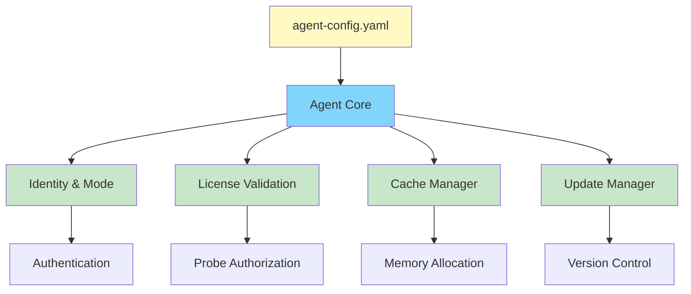
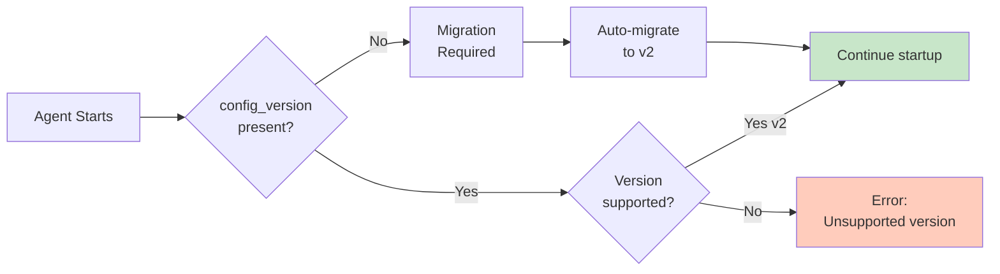
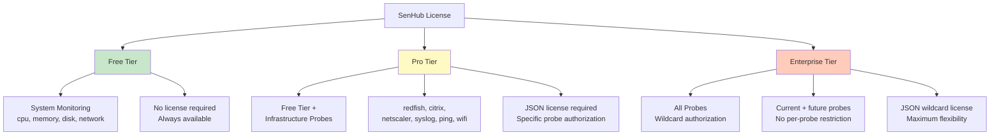
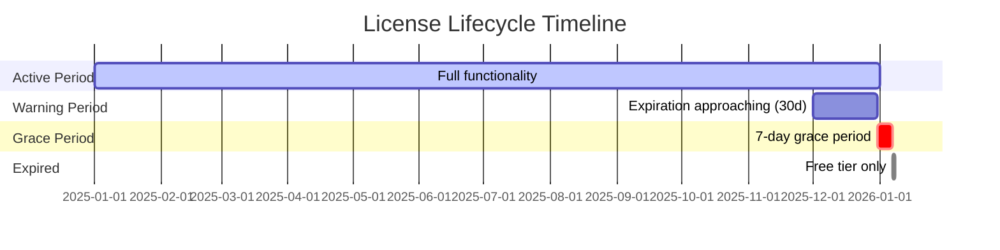
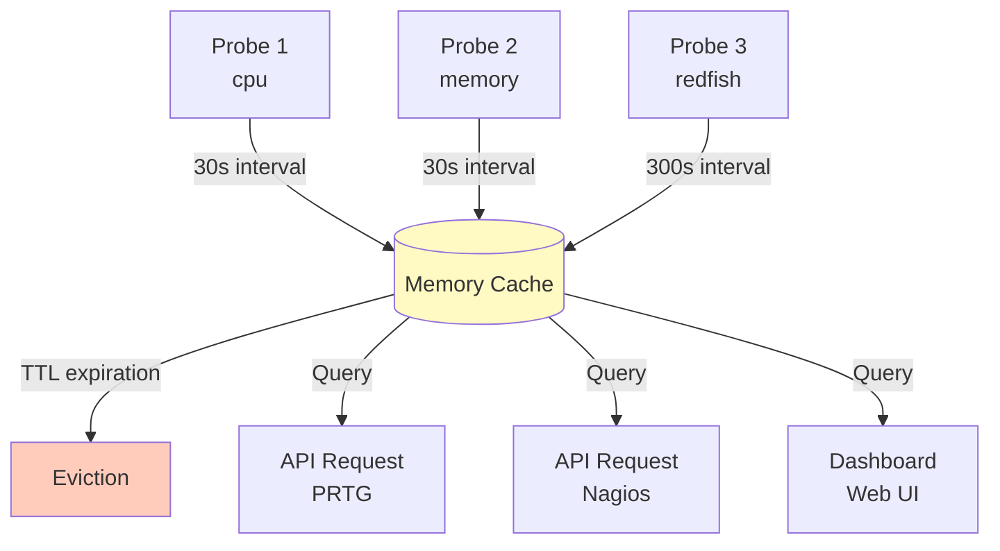
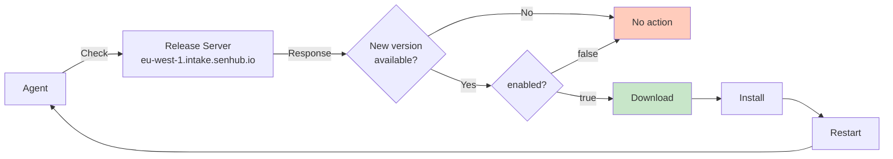
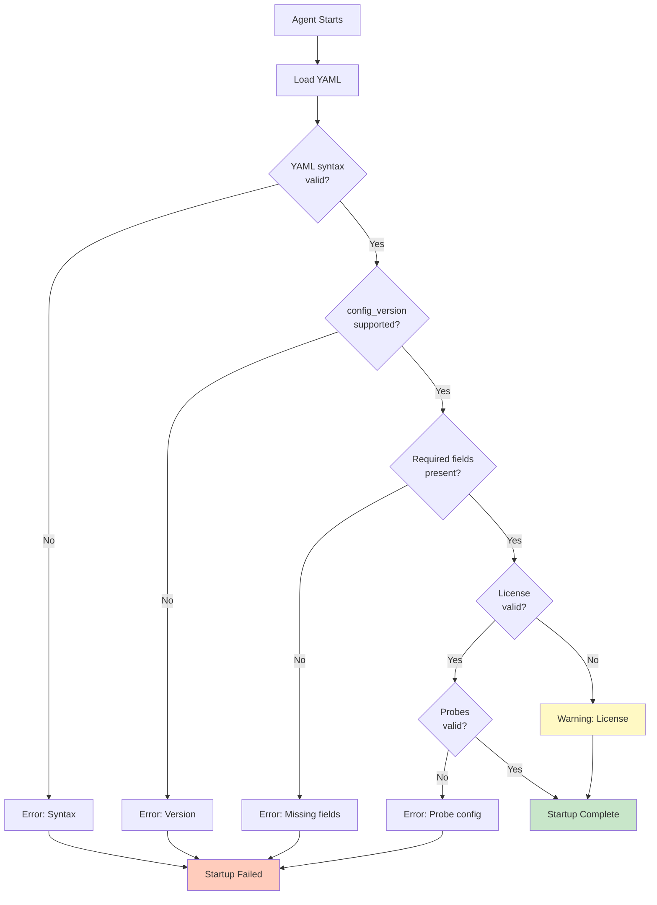

# Agent Configuration

This guide covers the core agent configuration parameters that control authentication, licensing, caching behavior, and update management. Understanding these settings is essential for tailoring the agent's operation to your environment's requirements and constraints.

## Table of Contents

- [Understanding Agent Configuration](#understanding-agent-configuration)
- [Configuration File Structure](#configuration-file-structure)
- [Agent Identity and Mode](#agent-identity-and-mode)
- [License System](#license-system)
- [Cache Configuration](#cache-configuration)
- [Auto-Update Configuration](#auto-update-configuration)
- [Configuration Validation](#configuration-validation)

---

## Understanding Agent Configuration

The agent configuration file (`agent-config.yaml`) serves as the central control point for the agent's operational behavior. While probe-specific settings define *what* to monitor, the agent configuration defines *how* the agent operates, authenticates, and manages resources.

### Configuration Scope

The agent configuration controls four critical aspects:

**1. Identity and Operating Mode**
- Agent authentication key (UUID in offline mode, platform key in online mode)
- Operating mode selection (offline vs online)
- License definition (if using paid probe tiers)

**2. Resource Management**
- Memory cache retention duration
- Storage overhead implications
- Performance characteristics

**3. Update Policy**
- Automatic update enablement
- Update source configuration
- Version management strategy

**4. Data Exposure**
- HTTP/HTTPS interface configuration (covered in separate document)
- API endpoint enablement
- TLS certificate management

### Configuration Architecture



**Design philosophy:** The agent configuration is intentionally simple and minimal. Complex operational logic (probe definitions, collection intervals, data transformations) is handled separately, keeping the core configuration focused on fundamental operational parameters.

---

## Configuration File Structure

### File Locations

The configuration file location varies by platform, following OS-standard configuration directories:

| Platform | Default Path | Alternative |
|----------|--------------|-------------|
| **Linux** | `/etc/senhub-agent/agent-config.yaml` | `--config-path /custom/path/config.yaml` |
| **Windows** | `C:\Program Files\SenHub\agent-config.yaml` | `--config-path C:\Custom\Path\config.yaml` |
| **macOS** | `/usr/local/etc/senhub-agent/agent-config.yaml` | `--config-path /custom/path/config.yaml` |

**Operational consideration:** Standard locations are recommended for production deployments to facilitate troubleshooting and automation. Custom paths are useful for multi-instance deployments or containerized environments where standard paths may conflict.

### YAML Format Requirements

The configuration uses YAML 2.0 syntax with strict validation:

```yaml
# Comments supported (using # prefix)
config_version: 2  # Version indicator (required, automatically managed)

agent:
  # Agent identity and mode

auto_update:
  # Update policy configuration

cache:
  # Memory cache parameters

storage:
  # Data exposure strategies (HTTP/HTTPS interface)

probes:
  # Monitoring probe definitions
```

**Key YAML requirements:**
- **Indentation:** 2 spaces (not tabs)
- **Boolean values:** `true` / `false` (lowercase)
- **Strings:** Quote special characters (`"value"`)
- **Multi-line:** Use pipe `|` for JSON or long strings

### Configuration Version Management



**Important:** The `config_version` field is automatically managed by the agent during configuration migrations. Never manually modify this value. Current version is `2`.

**Version history:**
- **Version 1:** Legacy format (deprecated, auto-migrated)
- **Version 2:** Current format with enhanced probe configuration structure

---

## Agent Identity and Mode

### Authentication Key

The agent key serves two purposes: **authentication** for API access and **unique identification** for the agent instance.

#### Offline Mode - Generated UUID

In offline mode, the agent generates a random UUID v4 during installation:

```yaml
agent:
  key: "f47ac10b-58cc-4372-a567-0e02b2c3d479"  # UUID v4 format
  mode: offline
```

**Key characteristics:**
- **Format:** UUID v4 (RFC 4122 compliant)
- **Generation:** Automatic during `install --offline`
- **Uniqueness:** Cryptographically random (collision probability negligible)
- **Persistence:** Stored in configuration, remains constant across restarts

**Retrieving the key after installation:**

```bash
# Linux/macOS
grep "key:" /etc/senhub-agent/agent-config.yaml

# Windows PowerShell
Select-String -Path "C:\Program Files\SenHub\agent-config.yaml" -Pattern "key:"

# Via API (returns system information including key)
curl http://localhost:8080/api/info/system
```

**Security consideration:** The agent key grants access to all API endpoints and metrics. In offline mode with network-accessible HTTPS interface (bind_address: "0.0.0.0"), restrict network access via firewall rules to trusted monitoring systems only.

#### Online Mode - Platform-Issued Key

In online mode, the key is provided by the SenHub platform during agent enrollment:

```yaml
agent:
  key: "platform-abc123def456ghi789jkl012"  # Platform-generated
  mode: online
```

**Key characteristics:**
- **Format:** Platform-specific format (variable length alphanumeric)
- **Generation:** Platform generates during enrollment
- **Revocation:** Platform can revoke keys remotely
- **Management:** Centralized key lifecycle management via platform

**Obtaining a platform key:**
1. Login to SenHub platform web interface
2. Navigate to Agents → Enroll New Agent
3. Platform generates unique key for this agent
4. Copy key for use in installation command

### Operating Mode

```yaml
agent:
  mode: offline  # or "online"
```

**Mode implications:**

| Aspect | offline | online |
|--------|---------|--------|
| **Configuration source** | Local YAML file | Downloaded from platform |
| **Key format** | UUID v4 | Platform-issued string |
| **API exposure** | Required (HTTP/HTTPS) | Optional (HTTP strategy) |
| **External connectivity** | None required | HTTPS to platform required |

For complete mode comparison and selection guidance, see [Operating Modes](./OPERATING-MODES.md).

---

## License System

### Understanding License Tiers

SenHub Agent uses a tiered licensing model that controls access to infrastructure monitoring probes beyond basic system metrics. The licensing system exists to differentiate between general-purpose system monitoring (free tier) and specialized infrastructure monitoring requiring vendor-specific integrations (paid tiers).

### Tier Overview



### Tier Comparison

| Tier | Available Probes | License Required | Use Case |
|------|------------------|------------------|----------|
| **Free** | `cpu`, `memory`, `logicaldisk`, `network` | No | Basic system monitoring, development, POC |
| **Pro** | Free + `redfish`, `citrix`, `netscaler`, `syslog`, `ping_gateway`, `ping_webapp`, `load_webapp`, `wifi_signal_strength` | Yes (JSON with probe list) | Infrastructure monitoring for specific platforms |
| **Enterprise** | All probes (wildcard `*`) | Yes (JSON with wildcard) | Comprehensive infrastructure monitoring, future-proof deployment |

**Business rationale:** The free tier provides comprehensive system-level monitoring sufficient for most server deployments. Pro and Enterprise tiers add specialized probes requiring vendor-specific API integrations (Redfish for hardware, Citrix for VDI, NetScaler for load balancers), justifying the licensing cost through expanded monitoring capabilities.

### Requesting a License

#### Step 1: Contact SenHub Support

**Email:** support@senhub.io

**Subject:** SenHub Agent License Request

**Required information:**

```
Company: [Company name]
Contact: [Full name]
Email: [your.email@company.com]
Phone: [International format: +XX X XX XX XX XX]

License Requirements:
- Desired tier: [Pro / Enterprise]
- Required probes: [List specific probes, e.g., "redfish, citrix, netscaler"]
- Number of agents: [e.g., 5 agents across 2 datacenters]
- Environment: [Production / Staging / Development / POC]
- Desired duration: [1 year / 2 years / other]

Use Case:
[Brief description of deployment scenario, e.g., "Monitoring 50 Dell PowerEdge servers via iDRAC for hardware health tracking in production datacenter"]

Additional Requirements:
[Any specific needs or questions]
```

**Response time:** Typically 1-2 business days.

#### Step 2: License Receipt

SenHub support will provide:

1. **License file** in JSON format (attached or embedded in email)
2. **Installation instructions** specific to your environment
3. **Expiration date** and renewal reminder schedule
4. **Authorized probes** listing for verification

**Example Pro license JSON:**

```json
{
  "tier": "pro",
  "authorized_probes": ["redfish", "citrix", "netscaler"],
  "expires_at": "2025-12-31T23:59:59Z",
  "issued_at": "2025-01-01T00:00:00Z",
  "subject": "customer-company-name"
}
```

**Example Enterprise license JSON:**

```json
{
  "tier": "enterprise",
  "authorized_probes": ["*"],
  "expires_at": "2026-12-31T23:59:59Z",
  "issued_at": "2025-01-01T00:00:00Z",
  "subject": "enterprise-customer-id"
}
```

**License field definitions:**

| Field | Type | Description | Example |
|-------|------|-------------|---------|
| `tier` | String | License level | `"pro"` or `"enterprise"` |
| `authorized_probes` | Array | Authorized probe types | `["redfish", "citrix"]` or `["*"]` for wildcard |
| `expires_at` | ISO 8601 | License expiration timestamp (UTC) | `"2025-12-31T23:59:59Z"` |
| `issued_at` | ISO 8601 | License issue timestamp (UTC) | `"2025-01-01T00:00:00Z"` |
| `subject` | String | Customer identifier | `"company-name"` or `"customer-id"` |

### Installing the License

#### Method 1: Configuration File (Recommended)

Add the license JSON to the agent configuration using YAML multi-line syntax:

```yaml
agent:
  key: "f47ac10b-58cc-4372-a567-0e02b2c3d479"
  mode: offline
  license: |
    {
      "tier": "pro",
      "authorized_probes": ["redfish", "citrix", "netscaler"],
      "expires_at": "2025-12-31T23:59:59Z",
      "issued_at": "2025-01-01T00:00:00Z",
      "subject": "customer-company-name"
    }
```

**Critical YAML formatting requirements:**
- Use pipe `|` after `license:` for multi-line content
- Indent JSON content by 4 spaces (2 spaces per YAML level)
- Do NOT wrap JSON in quotes
- Preserve JSON formatting exactly as received

**Installation procedure:**

```bash
# Step 1: Stop the agent
sudo systemctl stop senhub-agent  # Linux
Stop-Service SenHubAgent  # Windows PowerShell
sudo launchctl unload /Library/LaunchDaemons/io.senhub.agent.plist  # macOS

# Step 2: Edit configuration
sudo nano /etc/senhub-agent/agent-config.yaml  # Linux/macOS
notepad "C:\Program Files\SenHub\agent-config.yaml"  # Windows

# Step 3: Add license block (uncomment if present, add if missing)
# Paste JSON exactly as provided by support

# Step 4: Save file and restart agent
sudo systemctl start senhub-agent  # Linux
Start-Service SenHubAgent  # Windows
sudo launchctl load /Library/LaunchDaemons/io.senhub.agent.plist  # macOS

# Step 5: Verify license activation
curl http://localhost:8080/api/{agent-key}/license/status
```

#### Method 2: Environment Variable (Alternative)

For containerized deployments or environments where configuration file modification is impractical:

```bash
# Linux/macOS
export SENHUB_LICENSE='{"tier":"pro","authorized_probes":["redfish","citrix"],"expires_at":"2025-12-31T23:59:59Z","issued_at":"2025-01-01T00:00:00Z","subject":"customer"}'

# Windows PowerShell
$env:SENHUB_LICENSE='{"tier":"pro","authorized_probes":["redfish","citrix"],"expires_at":"2025-12-31T23:59:59Z","issued_at":"2025-01-01T00:00:00Z","subject":"customer"}'
```

**Priority:** Environment variable takes precedence over configuration file if both are present.

### Verifying License Status

#### Via REST API

```bash
curl http://localhost:8080/api/{agent-key}/license/status
```

**Response - Active License:**

```json
{
  "status": "active",
  "tier": "pro",
  "expires_at": "2025-12-31T23:59:59Z",
  "days_remaining": 180,
  "authorized_probes": ["redfish", "citrix", "netscaler"],
  "free_tier_probes": ["cpu", "memory", "logicaldisk", "network"]
}
```

**Response - Grace Period (within 7 days of expiration):**

```json
{
  "status": "grace_period",
  "tier": "pro",
  "expires_at": "2025-06-15T23:59:59Z",
  "days_remaining": -3,
  "grace_period_days_remaining": 4,
  "authorized_probes": ["redfish", "citrix", "netscaler"],
  "warning": "License expired 3 days ago. Grace period active for 4 more days."
}
```

**Response - Expired License:**

```json
{
  "status": "expired",
  "tier": "free",
  "expires_at": "2025-06-15T23:59:59Z",
  "days_remaining": -10,
  "authorized_probes": [],
  "free_tier_probes": ["cpu", "memory", "logicaldisk", "network"],
  "error": "License expired 10 days ago. Only free tier probes available."
}
```

#### Via Web Dashboard

Navigate to the web dashboard:

```
http(s)://server:port/web/{agent-key}/dashboard
```

The dashboard includes a **License Information** card showing:
- Current status (Active / Grace Period / Expired)
- License tier (Free / Pro / Enterprise)
- Expiration date and days remaining
- Authorized probes list
- Visual indicators (green for active, yellow for grace period, red for expired)

#### Via Logs

```bash
# Linux
sudo journalctl -u senhub-agent -n 50 | grep -i license

# Windows
Get-EventLog -LogName Application -Source "SenHub Agent" | Where-Object {$_.Message -like "*license*"}

# macOS
tail -100 /Library/Logs/SenHub/agent.log | grep -i license
```

**Log messages:**

```
# Active license
INF License validated tier=pro expires=2025-12-31 days_remaining=180

# Approaching expiration (< 30 days)
WRN License expires soon days_remaining=15 expires_at=2025-12-31

# Grace period active
WRN License expired, grace period active grace_days=4 expires_at=2025-06-15

# Fully expired
ERR License expired, paid probes disabled free_tier_available=true
```

### License Lifecycle and Grace Period



**License lifecycle phases:**

| Phase | Duration | Paid Probes | Alert Frequency | Action Required |
|-------|----------|-------------|-----------------|-----------------|
| **Active** | Until expiration - 30 days | Fully operational | None | None |
| **Expiring Soon** | 30 days before expiration | Fully operational | Daily warning in logs | Contact support for renewal |
| **Grace Period** | 7 days after expiration | Fully operational | Daily warning + dashboard banner | Immediate renewal recommended |
| **Expired** | After grace period ends | Disabled | Error at each startup | Renewal required to restore paid probes |

**Grace period behavior:**

During the 7-day grace period following license expiration:
- Paid probes continue operating normally
- Warnings appear in logs at each agent startup
- Web dashboard displays expiration banner
- Email notifications sent (if online mode with notification configured)
- Metrics collection continues without interruption

**Post-grace-period behavior:**

Once the grace period expires (7 days after license expiration):
- Paid probes are disabled at next agent restart
- Only free tier probes (cpu, memory, logicaldisk, network) remain active
- Existing cached metrics remain accessible via API
- Probe configurations remain in file but are ignored
- License renewal immediately restores paid probe functionality

### License Renewal

#### Before Expiration (Recommended Approach)

Contact support at least 2 weeks before expiration:

```bash
# Check current expiration
curl http://localhost:8080/api/{agent-key}/license/status | grep expires_at
```

Request renewal from support@senhub.io with:
- Current license subject (customer ID)
- Desired renewal duration
- Any changes to probe requirements

**Installation procedure for renewed license:**

```bash
# Step 1: Receive new license from support

# Step 2: Stop agent
sudo systemctl stop senhub-agent

# Step 3: Replace license in agent-config.yaml
agent:
  license: |
    {
      "tier": "pro",
      "expires_at": "2026-12-31T23:59:59Z",  # Updated expiration
      ...
    }

# Step 4: Restart agent
sudo systemctl start senhub-agent

# Step 5: Verify new expiration
curl http://localhost:8080/api/{agent-key}/license/status
```

**Zero downtime:** Configuration changes in YAML can be applied without service interruption if done correctly. The agent reads configuration only at startup, so prepare the new configuration and restart quickly during a low-impact window.

#### During Grace Period

Same procedure as above. Paid probes will continue operating without interruption if renewed during grace period.

#### After Full Expiration

```bash
# Paid probes are disabled
# Install renewed license using standard procedure
# Paid probes will reactivate at next agent restart
```

### License Troubleshooting

#### Error: "Invalid license format"

**Symptom:** Agent logs show "license validation failed: invalid format"

**Cause:** Malformed JSON in license field

**Solution:**

```bash
# Extract license from configuration
grep -A 10 "license:" /etc/senhub-agent/agent-config.yaml > license.json

# Validate JSON syntax
jq . license.json

# If error output appears, JSON is malformed
# Request fresh license from support@senhub.io
```

**Common formatting errors:**
- Missing quotes around JSON field names
- Incorrect comma placement (trailing commas not allowed in JSON)
- Unescaped special characters in subject field
- Wrong YAML indentation (must be 4 spaces for JSON content)

#### Error: "License expired"

**Symptom:** Paid probes not starting, logs show "license expired"

**Cause:** License expiration date passed and grace period exhausted

**Solution:**

```bash
# Check exact expiration
curl http://localhost:8080/api/{agent-key}/license/status

# Contact support@senhub.io for renewal
# Provide subject field from expired license for faster processing
```

#### Paid Probes Not Starting Despite Valid License

**Diagnostic procedure:**

```bash
# Step 1: Verify license API response
curl http://localhost:8080/api/{agent-key}/license/status

# Expected: status "active" and probe name in authorized_probes array

# Step 2: Check probe configuration
grep -A 5 "type: redfish" /etc/senhub-agent/agent-config.yaml

# Verify probe type matches authorized_probes exactly

# Step 3: Check startup logs
sudo journalctl -u senhub-agent -b | grep -E "(license|probe|redfish)"

# Look for initialization errors

# Step 4: Verify probe name authorization
# If probe type not in authorized_probes, license does not cover this probe
# Request license update from support
```

---

## Cache Configuration

### Understanding Memory Cache

The agent stores collected metrics in an in-memory cache with time-based retention. This cache serves two purposes: **decoupling probe collection from API queries** and **providing historical data** for time-series visualizations.

### Cache Architecture



**Operational behavior:**
- Probes collect metrics at configured intervals (30-300 seconds typical)
- Metrics stored in cache with timestamp
- API queries read from cache (not directly from probes)
- Metrics older than retention duration are evicted
- Eviction occurs continuously (not batch purge)

### Configuration

```yaml
cache:
  retention_minutes: 5  # Duration in minutes
```

**Valid range:** 1-60 minutes

### Resource Implications

Memory consumption scales linearly with retention duration and probe count:

| Retention | Probe Count | Estimated Memory | Use Case |
|-----------|-------------|------------------|----------|
| **2 min** | 5 probes | ~20 MB | Edge devices, IoT, memory-constrained environments |
| **5 min** | 5 probes | ~50 MB | Development, testing, default installation |
| **10 min** | 10 probes | ~100 MB | Production standard, balanced history vs resources |
| **20 min** | 15 probes | ~250 MB | Troubleshooting, detailed historical analysis |
| **30 min** | 20 probes | ~400 MB | Investigation mode, maximum retention without persistence |

**Calculation methodology:** Memory per probe depends on metric cardinality (number of individual metrics). System probes (cpu, memory) generate 5-10 metrics. Infrastructure probes (redfish, citrix) generate 50-200 metrics per collection. Estimates above assume mixed probe types.

### Operational Tradeoffs

**Short retention (1-5 minutes):**

Advantages:
- Minimal memory footprint
- Suitable for resource-constrained environments
- Fast cache queries (smaller dataset)

Disadvantages:
- Limited historical visibility in dashboards
- Difficult to correlate events separated by more than retention window
- Choppy time-series graphs if polling interval approaches retention duration

**Long retention (15-30 minutes):**

Advantages:
- Comprehensive historical view for troubleshooting
- Smooth time-series visualizations
- Better anomaly detection (longer baseline)

Disadvantages:
- Increased memory consumption
- Larger dataset to query (slightly slower API responses)
- Not suitable for memory-limited deployments

### Retention Duration Selection Guide

**Choose 2-5 minutes when:**
- Deploying on edge devices or IoT platforms with limited RAM
- Using external time-series database for long-term storage (metrics forwarded immediately)
- Monitoring simple systems with few probes
- Memory constraints are critical

**Choose 10-15 minutes when:**
- Standard production deployment with adequate resources
- Balancing historical visibility with resource efficiency
- Dashboard access frequency is moderate (once per hour or less)
- Typical server hardware (4+ GB RAM available)

**Choose 20-30 minutes when:**
- Troubleshooting performance issues requiring detailed history
- High-frequency dashboard access (continuous monitoring)
- Ample memory resources available (8+ GB RAM)
- Investigating intermittent issues that may span extended periods

**Operational recommendation:** Start with default 5-minute retention. Monitor memory consumption via dashboard or system tools. Increase retention if historical visibility is insufficient; decrease if memory consumption becomes problematic.

---

## Auto-Update Configuration

### Understanding Auto-Update

The auto-update system enables the agent to detect, download, and install new versions automatically. This capability reduces operational overhead for security patching and feature updates while maintaining deployment flexibility through enable/disable controls.

### Configuration

```yaml
auto_update:
  enabled: true  # or false
  url: "https://eu-west-1.intake.senhub.io/releases"
```

### Update Architecture



**Update process:**
1. Agent queries release server for latest version
2. Compares latest version to current running version
3. If newer version available and `enabled: true`, downloads new binary
4. Verifies download integrity (checksum validation)
5. Replaces current binary with new version
6. Restarts agent service
7. Startup with new version

### Behavior by Operating Mode

| Mode | enabled: true | enabled: false |
|------|---------------|----------------|
| **Online** | Automatic check every 6 hours; download and install immediately | No version checks performed |
| **Offline** | Check at startup only if internet available; download if newer version found | No version checks performed |

**Operational distinction:** Online mode agents maintain persistent platform connectivity, enabling automatic updates without user intervention. Offline mode agents only check during startup and require internet connectivity to access the release server, even if configured with `enabled: true`.

### Update Frequency and Timing

**Online mode:**
- Check interval: Every 6 hours
- Download: Automatic when new version detected
- Installation: Immediate (agent restart within 60 seconds)
- User notification: None (silent update)

**Offline mode:**
- Check interval: At startup only
- Download: Only if internet available
- Installation: Immediate if download successful
- User notification: Log entries only

**Operational consideration for offline mode:** If deployed in air-gapped environment (no internet), set `enabled: false` to prevent unnecessary connection attempts during startup. If internet connectivity is intermittent, `enabled: true` allows opportunistic updates during connected periods.

### Network Requirements

**Outbound connectivity required for auto-update and diagnostic features:**

| Feature | Destination | Port | Protocol | Required For |
|---------|-------------|------|----------|--------------|
| **Auto-update** | `eu-west-1.intake.senhub.io` | 443 | HTTPS | Downloading new agent versions |
| **Diagnostic logs** | `eu-west-1.intake.senhub.io` | 443 | HTTPS | Sending logs to Sensor Factory for analysis |
| **Online mode** | `eu-west-1.intake.senhub.io` | 443 | HTTPS + WebSocket | Configuration and metrics transmission |

**Important notes:**
- **Offline mode with auto-update disabled:** No outbound connectivity required
- **Offline mode with auto-update enabled:** Connectivity required only during startup (for version check)
- **Online mode:** Persistent connectivity required for operation

**Firewall configuration:**
```bash
# Allow outbound HTTPS to SenHub infrastructure
# Adjust according to your firewall solution

# iptables (Linux)
sudo iptables -A OUTPUT -p tcp -d eu-west-1.intake.senhub.io --dport 443 -j ACCEPT

# Windows Firewall
New-NetFirewallRule -DisplayName "SenHub Agent Outbound" `
  -Direction Outbound -Protocol TCP -RemoteAddress eu-west-1.intake.senhub.io `
  -RemotePort 443 -Action Allow
```

### Manual Update Procedure

For environments where automatic updates are disabled or internet access is unavailable:

**Linux:**

```bash
# Step 1: Stop agent
sudo systemctl stop senhub-agent

# Step 2: Download new version
wget https://eu-west-1.intake.senhub.io/releases/senhub-agent_linux_amd64

# Step 3: Verify download (optional but recommended)
sha256sum senhub-agent_linux_amd64
# Compare against published checksum

# Step 4: Replace binary
sudo mv senhub-agent_linux_amd64 /usr/local/bin/senhub-agent
sudo chmod +x /usr/local/bin/senhub-agent

# Step 5: Restart agent
sudo systemctl start senhub-agent

# Step 6: Verify new version
senhub-agent version
```

**Windows:**

```powershell
# Step 1: Stop service
Stop-Service SenHubAgent

# Step 2: Download new version
Invoke-WebRequest -Uri "https://eu-west-1.intake.senhub.io/releases/senhub-agent_windows_amd64.exe" -OutFile "senhub-agent.exe"

# Step 3: Replace binary
Move-Item -Force senhub-agent.exe "C:\Program Files\SenHub\senhub-agent.exe"

# Step 4: Start service
Start-Service SenHubAgent

# Step 5: Verify version
& "C:\Program Files\SenHub\senhub-agent.exe" version
```

**macOS:**

```bash
# Step 1: Stop LaunchDaemon
sudo launchctl unload /Library/LaunchDaemons/io.senhub.agent.plist

# Step 2: Download appropriate version
# Intel
curl -LO https://eu-west-1.intake.senhub.io/releases/senhub-agent_darwin_amd64
# Apple Silicon
curl -LO https://eu-west-1.intake.senhub.io/releases/senhub-agent_darwin_arm64

# Step 3: Replace binary
sudo mv senhub-agent_darwin_* /usr/local/bin/senhub-agent
sudo chmod +x /usr/local/bin/senhub-agent

# Step 4: Start LaunchDaemon
sudo launchctl load /Library/LaunchDaemons/io.senhub.agent.plist

# Step 5: Verify version
senhub-agent version
```

### Update Strategy by Environment

**Production environments:**
- **Recommendation:** `enabled: false`
- **Rationale:** Updates should be tested in staging before production deployment; controlled update windows preferred
- **Workflow:** Manual update during maintenance window after staging validation

**Development/testing environments:**
- **Recommendation:** `enabled: true`
- **Rationale:** Automatic updates ensure latest features and bug fixes available for testing
- **Workflow:** Automatic updates acceptable; downtime non-critical

**Edge computing/remote sites:**
- **Recommendation:** `enabled: true` if connectivity available
- **Rationale:** Opportunistic updates reduce need for manual intervention at remote locations
- **Workflow:** Updates occur automatically when connectivity available

**Air-gapped environments:**
- **Recommendation:** `enabled: false`
- **Rationale:** No internet access; updates must be manual via USB/local mirror
- **Workflow:** Periodic manual updates following security review

---

## Configuration Validation

### Automatic Validation at Startup

The agent performs comprehensive configuration validation during startup:



**Validation stages:**
1. **YAML syntax:** Parse configuration file for syntax errors
2. **Version check:** Verify `config_version` is supported
3. **Required fields:** Ensure `agent.key`, `agent.mode` present
4. **License validation:** Check license format and expiration (if present)
5. **Probe configuration:** Verify probe types, required parameters
6. **Storage configuration:** Validate HTTP strategy parameters

**Startup behavior on validation failure:**
- Syntax errors, missing required fields, or invalid probe configuration → Startup fails, agent exits
- Invalid or expired license → Startup continues with warning, paid probes disabled

**Log output example (successful validation):**

```
2025-12-19T10:00:00Z INF Configuration loaded version=2 path=/etc/senhub-agent/agent-config.yaml
2025-12-19T10:00:00Z INF License validated tier=pro expires=2025-12-31 days_remaining=180
2025-12-19T10:00:01Z INF Probe initialized probe=cpu interval=30
2025-12-19T10:00:01Z INF Probe initialized probe=memory interval=30
2025-12-19T10:00:02Z INF HTTP strategy started port=8443 tls=true
2025-12-19T10:00:02Z INF Agent startup complete mode=offline
```

### Manual Validation

For pre-deployment validation without starting the agent:

```bash
senhub-agent validate --config-path /etc/senhub-agent/agent-config.yaml
```

**Output (valid configuration):**

```
Configuration validation successful

Configuration Version: 2
Agent Key: f47ac10b-58cc-4372-a567-0e02b2c3d479
Operating Mode: offline
License: pro (valid until 2025-12-31, 180 days remaining)
Probes: 5 configured (cpu, memory, logicaldisk, network, redfish)
Storage Strategies: 1 (http on port 8443, TLS enabled)

No errors detected. Configuration ready for deployment.
```

**Output (invalid configuration):**

```
Configuration validation failed

Errors:
  Line 12: Probe type "redfish" requires Pro or Enterprise license
  Line 25: Missing required parameter "endpoint" for probe type "redfish"
  Line 38: Invalid TLS version "1.0" (minimum: 1.2)

Warnings:
  Line 8: License expires in 15 days (2025-12-31)

Configuration cannot be loaded. Resolve errors before starting agent.
```

### Configuration Validation Checklist

Before deploying or modifying configuration, verify:

- [ ] YAML syntax correct (2-space indentation, no tabs)
- [ ] `config_version: 2` present and unmodified
- [ ] `agent.key` field present and not empty
- [ ] `agent.mode` is either `offline` or `online`
- [ ] License (if present) is valid JSON and not expired
- [ ] Each probe has `name`, `type`, and `params` fields
- [ ] Probe types match authorized_probes in license (for paid probes)
- [ ] Storage section contains at least one strategy
- [ ] HTTP strategy has valid `port` (1-65535) and `bind_address`
- [ ] TLS configuration (if enabled) references valid certificate paths

### Troubleshooting Configuration Errors

**Error: "YAML syntax error at line X"**

Cause: Invalid YAML formatting

Solution:
```bash
# Use YAML linter to identify syntax error
yamllint /etc/senhub-agent/agent-config.yaml

# Common causes: incorrect indentation, missing colons, unquoted special characters
```

**Error: "Unknown probe type: X"**

Cause: Probe type not recognized by agent

Solution:
```bash
# Check available probe types in registry
senhub-agent probes list

# Verify spelling matches exactly (case-sensitive)
# For infrastructure probes (redfish, citrix), verify license is installed
```

**Error: "License validation failed: invalid format"**

Cause: License JSON malformed in configuration

Solution:
```bash
# Extract license from configuration
grep -A 10 "license:" /etc/senhub-agent/agent-config.yaml > /tmp/license.json

# Validate JSON
jq . /tmp/license.json

# If error, request fresh license from support@senhub.io
```

**Error: "HTTP strategy failed to start: address already in use"**

Cause: Another process listening on configured port

Solution:
```bash
# Identify process using port
sudo lsof -i :8443  # Linux/macOS
netstat -ano | findstr :8443  # Windows

# Either stop conflicting process or change agent port in configuration
```

---

## Complete Configuration Examples

### Minimal Configuration (Free Tier)

Suitable for development, testing, or basic system monitoring:

```yaml
config_version: 2

agent:
  key: "f47ac10b-58cc-4372-a567-0e02b2c3d479"
  mode: offline

auto_update:
  enabled: true
  url: "https://eu-west-1.intake.senhub.io/releases"

cache:
  retention_minutes: 5

storage:
  - name: http
    params:
      port: 8080
      bind_address: "127.0.0.1"
      endpoints: ["prtg", "web", "nagios"]

probes:
  - name: cpu
    type: cpu
    params:
      interval: 30

  - name: memory
    type: memory
    params:
      interval: 30

  - name: logicaldisk
    type: logicaldisk
    params:
      interval: 60

  - name: network
    type: network
    params:
      interval: 60
```

**Characteristics:**
- Free tier only (no license required)
- HTTP on localhost (development mode)
- Default cache retention (5 minutes)
- Auto-update enabled (opportunistic updates)
- Basic system monitoring (cpu, memory, disk, network)

### Production Configuration (Pro Tier + HTTPS)

Suitable for production infrastructure monitoring with network accessibility:

```yaml
config_version: 2

agent:
  key: "f47ac10b-58cc-4372-a567-0e02b2c3d479"
  mode: offline
  license: |
    {
      "tier": "pro",
      "authorized_probes": ["redfish", "citrix", "netscaler", "syslog"],
      "expires_at": "2025-12-31T23:59:59Z",
      "issued_at": "2025-01-01T00:00:00Z",
      "subject": "production-datacenter"
    }

auto_update:
  enabled: false

cache:
  retention_minutes: 10

storage:
  - name: http
    params:
      port: 8443
      bind_address: "0.0.0.0"
      endpoints: ["prtg", "web", "nagios"]
      tls:
        enabled: true
        min_tls_version: "1.2"
        cert_file: "/etc/ssl/certs/monitoring.crt"
        key_file: "/etc/ssl/private/monitoring.key"

probes:
  # Free tier probes
  - name: cpu
    type: cpu
    params:
      interval: 30

  - name: memory
    type: memory
    params:
      interval: 30

  - name: logicaldisk
    type: logicaldisk
    params:
      interval: 60
      exclude_filesystems: ["tmpfs", "devtmpfs"]

  - name: network
    type: network
    params:
      interval: 60
      exclude_interfaces: ["lo", "docker*"]

  # Pro tier probes
  - name: "Datacenter Server iDRAC"
    type: redfish
    params:
      endpoint: "https://idrac-srv01.company.com"
      username: "monitoring"
      password: "SecurePassword123"
      interval: 300
      verify_ssl: true

  - name: "Citrix VDI Production"
    type: citrix
    params:
      base_url: "https://director.company.com"
      interval: 120
      auth:
        username: "DOMAIN\\monitoring"
        password: "CitrixPassword"
      tls:
        verify_ssl: true
```

**Characteristics:**
- Pro tier license with specific infrastructure probes
- HTTPS on all interfaces (network accessible)
- Extended cache retention (10 minutes for production)
- Auto-update disabled (controlled update windows)
- Comprehensive monitoring (system + infrastructure)

---

## Summary

Agent configuration controls the fundamental operational parameters that define how the agent authenticates, manages resources, and handles updates. Understanding these settings enables you to tailor the agent's behavior to your environment's specific requirements, security policies, and resource constraints.

**Key configuration decisions:**
- **Operating mode:** Offline (autonomous) vs online (platform-managed)
- **License tier:** Free (system monitoring) vs Pro/Enterprise (infrastructure monitoring)
- **Cache retention:** Balance historical visibility against memory consumption
- **Auto-update policy:** Automatic updates (convenience) vs manual control (stability)

**Next steps:**
- [HTTP/HTTPS Configuration](./HTTP-HTTPS-CONFIGURATION.md) - Configure local API endpoint and TLS certificates
- [Probes Configuration](./PROBES-CONFIGURATION.md) - Add monitoring probes for your infrastructure
- [Troubleshooting](./TROUBLESHOOTING.md) - Diagnostic procedures and log analysis
