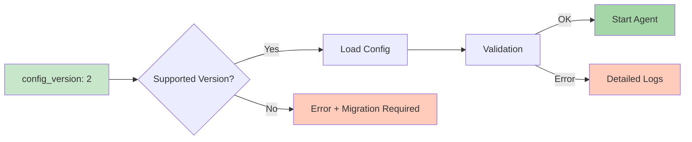
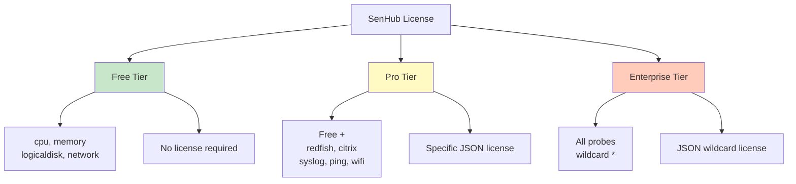
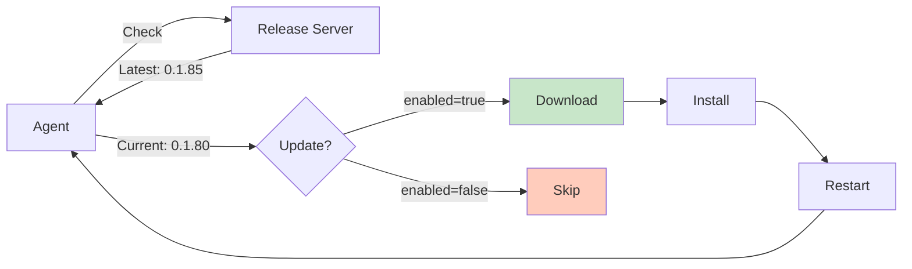
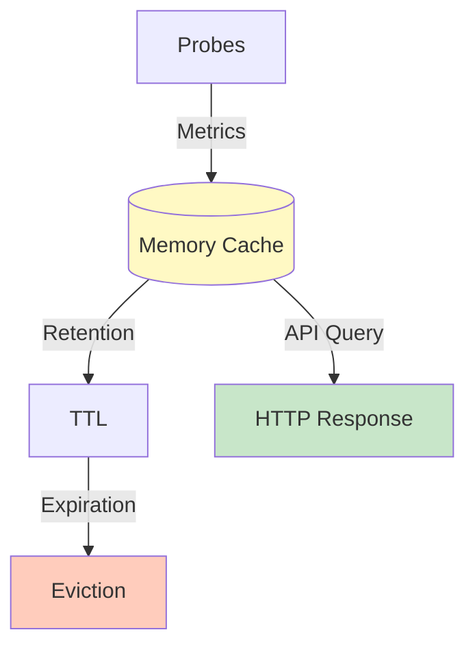

# SenHub Agent - Agent Configuration

## Table of Contents

- [Configuration File Structure](#configuration-file-structure)
- [Agent Configuration](#agent-configuration)
- [License System](#license-system)
- [Auto-Update Configuration](#auto-update-configuration)
- [Cache Configuration](#cache-configuration)
- [Complete Examples](#complete-examples)
- [Configuration Validation](#configuration-validation)

---

## Configuration File Structure

### File Location

| Platform | Default Path | Custom Path |
|----------|--------------|-------------|
| **Windows** | `C:\Program Files\SenHub\agent-config.yaml` | `--config-path C:\Custom\Path\config.yaml` |
| **Linux** | `/etc/senhub-agent/agent-config.yaml` | `--config-path /custom/path/config.yaml` |
| **macOS** | `/usr/local/etc/senhub-agent/agent-config.yaml` | `--config-path /custom/path/config.yaml` |

### YAML Format

The file uses YAML version 2 format with strict validation.

```yaml
# Comments allowed
config_version: 2  # Version required (currently: 2)

agent:
  # Agent configuration

auto_update:
  # Auto-update configuration

cache:
  # Cache configuration

storage:
  # Storage configuration (strategies)

probes:
  # Probes configuration
```

### Configuration Version



**⚠️ Important**: **Never** modify `config_version` manually. This value is automatically managed by the agent during migrations.

---

## Agent Configuration

### Agent Section

```yaml
agent:
  key: "<agent-key>"           # Authentication key (UUID or platform)
  mode: offline|online         # Operating mode
  # license: ""                # License (optional, see dedicated section)
```

### Agent Key

#### Offline Mode (Generated UUID)

During offline installation, the agent automatically generates a UUID v4:

```yaml
agent:
  key: "f47ac10b-58cc-4372-a567-0e02b2c3d479"  # Random UUID v4
```

**Retrieving the key after installation**:

```bash
# Linux/macOS
cat /etc/senhub-agent/agent-config.yaml | grep "key:"

# Windows
type "C:\Program Files\SenHub\agent-config.yaml" | findstr "key:"

# Or via API
curl http://localhost:8080/api/info/system
# Returns: {"agent_key": "f47ac10b-58cc-4372-a567-0e02b2c3d479", ...}
```

**📸 SCREENSHOT TO INSERT**: Terminal showing output of `grep "key:"` with highlighted UUID

#### Online Mode (Platform Key)

In online mode, the key is provided by the SenHub platform:

```yaml
agent:
  key: "platform-abc123def456ghi789"  # Provided by SenHub
```

**Getting the key**:
1. Log in to SenHub portal
2. Section "Agents" > "Add Agent"
3. Copy the generated key

**📸 SCREENSHOT TO INSERT**: SenHub portal with "Add Agent" dialog showing generated key and "Copy" button

### Operating Mode

```yaml
agent:
  mode: offline  # or "online"
```

| Mode | Description | Configuration |
|------|-------------|---------------|
| `offline` | Autonomous, local YAML file | Reads `agent-config.yaml` |
| `online` | Connected to SenHub platform | Downloads config from server |

> **📖 Details**: See [OPERATING-MODES.md](./OPERATING-MODES.md) for complete comparison

---

## License System

### Tiers Overview



### Tiers Table

| Tier | Included Probes | Cost | License Required |
|------|-----------------|------|------------------|
| **Free** | `cpu`, `memory`, `logicaldisk`, `network` | Free | ❌ No |
| **Pro** | Free + `redfish`, `citrix`, `syslog`, `ping_gateway`, `ping_webapp`, `load_webapp`, `wifi_signal_strength` | Paid | ✅ Yes (JSON) |
| **Enterprise** | All probes (wildcard `*`) | Paid | ✅ Yes (JSON wildcard) |

### License Request

#### Step 1: Contact Support

**📧 Email**: `support@senhub.io`

**Information to Provide**:

```
Subject: SenHub Agent License Request

Hello,

I would like to obtain a license for SenHub Agent.

Information:
- Company: [Company name]
- Contact: [First name, Last name]
- Email: [email@company.com]
- Phone: [+XX X XX XX XX XX]

Requirements:
- Desired tier: [Pro / Enterprise]
- Required probes: [redfish, citrix, etc.]
- Number of agents: [e.g., 5 agents]
- Environment: [Production / Development / POC]
- Desired duration: [1 year / 2 years / etc.]

Use case:
[Brief description of your use case]

Thank you,
[Signature]
```

**📸 SCREENSHOT TO INSERT**: Email client (Outlook/Gmail) with license request email template

#### Step 2: License Receipt

SenHub support will send you an email containing:

1. **License in JSON format**
2. **Installation instructions**
3. **Expiration date**
4. **Authorized probes**

**Example response**:

```
Hello,

Here is your SenHub Agent Pro license valid until 12/31/2025:

[Attached JSON file: senhub-license-CUSTOMER-2025.json]

Installation:
1. Open the agent-config.yaml file
2. Uncomment the line "# license: ""
3. Paste the JSON content (see instructions below)
4. Restart the agent

Support: support@senhub.io
Documentation: https://docs.senhub.io

Best regards,
SenHub Team
```

### License Format

#### Pro License (Specific Probes)

```json
{
  "tier": "pro",
  "authorized_probes": ["redfish", "citrix", "syslog"],
  "expires_at": "2025-12-31T23:59:59Z",
  "issued_at": "2025-01-01T00:00:00Z",
  "subject": "customer-company-name"
}
```

#### Enterprise License (All Probes)

```json
{
  "tier": "enterprise",
  "authorized_probes": ["*"],
  "expires_at": "2026-12-31T23:59:59Z",
  "issued_at": "2025-01-01T00:00:00Z",
  "subject": "enterprise-customer"
}
```

**License Fields**:

| Field | Type | Description | Example |
|-------|------|-------------|---------|
| `tier` | String | License level | `"pro"` or `"enterprise"` |
| `authorized_probes` | Array | List of authorized probes | `["redfish", "citrix"]` or `["*"]` |
| `expires_at` | ISO 8601 | Expiration date | `"2025-12-31T23:59:59Z"` |
| `issued_at` | ISO 8601 | Issue date | `"2025-01-01T00:00:00Z"` |
| `subject` | String | Customer identifier | `"customer-id"` |

### License Installation

#### Method 1: Via Configuration File (Recommended)

```yaml
agent:
  key: "f47ac10b-58cc-4372-a567-0e02b2c3d479"
  mode: offline
  license: |
    {
      "tier": "pro",
      "authorized_probes": ["redfish", "citrix"],
      "expires_at": "2025-12-31T23:59:59Z",
      "issued_at": "2025-01-01T00:00:00Z",
      "subject": "customer-company"
    }
```

**⚠️ Important**:
- Respect YAML indentation (2 spaces)
- Use pipe `|` for multi-line JSON
- No quotes around JSON

**📸 SCREENSHOT TO INSERT**: nano/vim editor showing agent-config.yaml with correctly indented JSON license

#### Method 2: Via Environment Variable (Alternative)

```bash
# Linux/macOS
export SENHUB_LICENSE='{"tier":"pro","authorized_probes":["redfish","citrix"],"expires_at":"2025-12-31T23:59:59Z","issued_at":"2025-01-01T00:00:00Z","subject":"customer"}'

# Windows PowerShell
$env:SENHUB_LICENSE='{"tier":"pro","authorized_probes":["redfish","citrix"],"expires_at":"2025-12-31T23:59:59Z","issued_at":"2025-01-01T00:00:00Z","subject":"customer"}'
```

**Priority**: Environment variable > Configuration file

#### Installation Steps

```bash
# 1. Stop the agent
sudo systemctl stop senhub-agent  # Linux
sudo launchctl unload /Library/LaunchDaemons/io.senhub.agent.plist  # macOS
sc stop "SenHub Agent"  # Windows

# 2. Edit configuration
sudo nano /etc/senhub-agent/agent-config.yaml

# 3. Add license (uncomment and paste JSON)
agent:
  license: |
    {
      "tier": "pro",
      ...
    }

# 4. Save and restart
sudo systemctl start senhub-agent  # Linux
sudo launchctl load /Library/LaunchDaemons/io.senhub.agent.plist  # macOS
sc start "SenHub Agent"  # Windows

# 5. Verify
curl http://localhost:8080/api/{agentkey}/license/status
```

### License Verification

#### Via REST API

```bash
curl http://localhost:8080/api/{AGENT_KEY}/license/status
```

**Response (Active License)**:

```json
{
  "status": "active",
  "tier": "pro",
  "expires_at": "2025-12-31T23:59:59Z",
  "days_remaining": 180,
  "authorized_probes": ["redfish", "citrix", "syslog"],
  "free_tier_probes": ["cpu", "memory", "logicaldisk", "network"]
}
```

**Response (Grace Period)**:

```json
{
  "status": "grace_period",
  "tier": "pro",
  "expires_at": "2025-06-15T23:59:59Z",
  "days_remaining": -3,
  "grace_period_days_remaining": 4,
  "authorized_probes": ["redfish", "citrix"],
  "warning": "License expired 3 days ago. Grace period active for 4 more days."
}
```

**Response (Expired License)**:

```json
{
  "status": "expired",
  "tier": "free",
  "expires_at": "2025-06-15T23:59:59Z",
  "days_remaining": -10,
  "authorized_probes": [],
  "free_tier_probes": ["cpu", "memory", "logicaldisk", "network"],
  "error": "License expired 10 days ago. Only free tier probes available."
}
```

#### Via Web Dashboard

**URL**: `http://localhost:8080/web/{AGENT_KEY}/dashboard`

**"License Information" Section**:

**📸 SCREENSHOT TO INSERT**: Web dashboard showing "License Information" card with:
- Status: Active (green badge)
- Tier: Pro
- Expires: 12/31/2025 (180 days remaining)
- Authorized Probes: "redfish", "citrix", "syslog" badges

#### Via Logs

```bash
# Linux
sudo tail -f /var/log/senhub-agent/agent.log

# Active license
2025-12-18T10:00:00Z INF License validated tier=pro expires=2025-12-31 module=agent.core

# License expiring soon (< 30 days)
2025-12-18T10:00:00Z WRN License expires soon days_remaining=15 module=agent.core

# Grace period
2025-12-18T10:00:00Z WRN License expired, grace period active grace_days=4 module=agent.core

# Expired license
2025-12-18T10:00:00Z ERR License expired, paid probes disabled module=agent.core
```

### Grace Period

```mermaid
gantt
    title License Lifecycle
    dateFormat YYYY-MM-DD
    section Active License
    Valid license             :active, 2025-01-01, 2025-12-31
    section Grace Period
    7 additional days         :crit, 2025-12-31, 7d
    section Expiration
    License expired           :done, after 7d, 1d

    style active fill:#c8e6c9
    style crit fill:#fff9c4
    style done fill:#ffccbc
```

**Behavior**:

| Period | Duration | Paid Probes | Alerts |
|--------|----------|-------------|--------|
| **Active** | Until expiration | ✅ Active | None |
| **Expiring soon** | D-30 to D-1 | ✅ Active | Warning in logs (daily) |
| **Grace period** | 7 days after expiration | ✅ Active | Warning in logs + dashboard |
| **Expired** | After grace period | ❌ Disabled | Error in logs + dashboard |

**During Grace Period**:

- Paid probes continue working
- Warnings in logs at each startup
- Banner in dashboard
- Reminder email (if online mode)

**After Grace Period**:

- Paid probes are disabled at next restart
- Only free tier probes remain active
- Existing cached metrics remain accessible

### License Renewal

#### Before Expiration (Recommended)

```bash
# 1. Contact support@senhub.io 2 weeks before expiration

# 2. Receive new license

# 3. Replace in agent-config.yaml
agent:
  license: |
    {
      "tier": "pro",
      "expires_at": "2026-12-31T23:59:59Z",  # New date
      ...
    }

# 4. Restart (without service interruption)
sudo systemctl restart senhub-agent
```

#### After Expiration (Grace Period)

Same procedure, but note:
- Paid probes will reactivate immediately
- No cached data loss

#### After Full Expiration

```bash
# 1. Obtain new license

# 2. Install license

# 3. Restart agent
sudo systemctl restart senhub-agent

# 4. Paid probes restart automatically
```

### License Troubleshooting

#### Error: "Invalid license format"

**Cause**: Malformed JSON

**Solution**:
```bash
# Verify JSON with jq
echo '{"tier":"pro","authorized_probes":["redfish"],"expires_at":"2025-12-31T23:59:59Z","issued_at":"2025-01-01T00:00:00Z","subject":"customer"}' | jq .

# If error, fix format in agent-config.yaml
```

#### Error: "License signature invalid"

**Cause**: Corrupted or modified license

**Solution**:
- Request license again from support@senhub.io
- Copy-paste directly from email (no manual modification)

#### Error: "License expired"

**Cause**: License expired and grace period over

**Solution**:
```bash
# Contact support for renewal
# Meanwhile, only free tier available
```

#### Paid Probes Not Starting

```bash
# Check license status
curl http://localhost:8080/api/{agentkey}/license/status

# Check logs
sudo tail -100 /var/log/senhub-agent/agent.log | grep -i license

# If "License not found", add license
# If "License expired", renew
# If "Invalid format", fix JSON
```

**📸 SCREENSHOT TO INSERT**: Terminal with log output showing clear license error "License validation failed: expired"

---

## Auto-Update Configuration

### Principle



### Configuration

```yaml
auto_update:
  enabled: true   # Enable/disable auto-updates
  url: "https://eu-west-1.intake.senhub.io/releases"
```

### Behavior by Mode

| Mode | `enabled: true` | `enabled: false` |
|------|-----------------|------------------|
| **Online** | Automatic check + download + install | No check |
| **Offline** | Check if internet available (no forced install) | No check |

### Check Frequency

- **Online Mode**: Every 6 hours
- **Offline Mode**: At startup only

### Manual Update (Offline)

```bash
# 1. Stop agent
sudo systemctl stop senhub-agent

# 2. Download new version
wget https://github.com/senhub-io/senhub-agent/releases/download/v0.1.85-beta/senhub-agent_linux_amd64

# 3. Replace binary
sudo mv senhub-agent_linux_amd64 /usr/local/bin/senhub-agent
sudo chmod +x /usr/local/bin/senhub-agent

# 4. Restart
sudo systemctl start senhub-agent

# 5. Verify version
senhub-agent version
```

---

## Cache Configuration

### Principle



### Configuration

```yaml
cache:
  retention_minutes: 5  # Metrics retention duration
```

### Recommendations

| Environment | Value | Estimated Memory | Use Case |
|-------------|-------|------------------|----------|
| **Development** | 5 min | ~50 MB | Quick tests |
| **Production** | 10 min | ~100 MB | Standard monitoring |
| **Troubleshooting** | 30 min | ~300 MB | Problem investigation |
| **Limited resources** | 2 min | ~20 MB | Edge devices (IoT) |

### Impact

**Short Cache (1-2 min)**:
- ✅ Low memory consumption
- ❌ Very limited history
- ❌ Choppy graphs

**Long Cache (20-30 min)**:
- ✅ More complete history
- ✅ Smooth graphs
- ❌ High memory consumption

---

## Complete Examples

### Minimal Configuration (Free Tier)

```yaml
config_version: 2

agent:
  key: "f47ac10b-58cc-4372-a567-0e02b2c3d479"
  mode: offline

auto_update:
  enabled: true
  url: "https://eu-west-1.intake.senhub.io/releases"

cache:
  retention_minutes: 5

storage:
  - name: http
    params:
      port: 8080
      bind_address: "127.0.0.1"
      endpoints: ["prtg", "web", "nagios"]

probes:
  - name: cpu
    type: cpu
    params:
      interval: 30

  - name: memory
    type: memory
    params:
      interval: 30
```

### Production Configuration (Pro Tier + HTTPS)

```yaml
config_version: 2

agent:
  key: "f47ac10b-58cc-4372-a567-0e02b2c3d479"
  mode: offline
  license: |
    {
      "tier": "pro",
      "authorized_probes": ["redfish", "citrix", "syslog"],
      "expires_at": "2025-12-31T23:59:59Z",
      "issued_at": "2025-01-01T00:00:00Z",
      "subject": "production-datacenter"
    }

auto_update:
  enabled: true
  url: "https://eu-west-1.intake.senhub.io/releases"

cache:
  retention_minutes: 10

storage:
  - name: http
    params:
      port: 8443
      bind_address: "0.0.0.0"
      endpoints: ["prtg", "web", "nagios"]
      tls:
        enabled: true
        min_tls_version: "1.2"
        cert_file: "/etc/ssl/certs/monitoring.crt"
        key_file: "/etc/ssl/private/monitoring.key"

probes:
  # Free tier
  - name: cpu
    type: cpu
    params:
      interval: 30

  - name: memory
    type: memory
    params:
      interval: 30

  # Pro tier
  - name: "Production iDRAC"
    type: redfish
    params:
      endpoint: "https://idrac.company.com"
      username: "monitoring"
      password: "SecurePassword123"
      interval: 300
      verify_ssl: true
```

**📸 SCREENSHOT TO INSERT**: Complete configuration file in editor with YAML syntax highlighting

---

## Configuration Validation

### Automatic Validation

The agent automatically validates configuration at startup:

```bash
sudo systemctl start senhub-agent
sudo journalctl -u senhub-agent -n 20

# Expected logs
2025-12-18T10:00:00Z INF Configuration loaded version=2 module=configuration.local
2025-12-18T10:00:00Z INF License validated tier=pro module=agent.core
2025-12-18T10:00:01Z INF Probe started probe=cpu module=probe.cpu
```

### Manual Validation

```bash
# Test configuration without starting agent
senhub-agent validate --config-path /etc/senhub-agent/agent-config.yaml

# OK output
✅ Configuration valid
   - Config version: 2
   - Agent key: f47ac10b-58cc-4372-a567-0e02b2c3d479
   - Mode: offline
   - License: pro (valid until 2025-12-31)
   - Probes: 5 configured
   - Storage: 1 strategy

# Error output
❌ Configuration invalid:
   - Line 12: Invalid probe type "redfish" (license required)
   - Line 25: Missing required field "endpoint" for probe "redfish"
```

### Validation Checklist

- [ ] `config_version: 2` present
- [ ] `agent.key` not empty
- [ ] `agent.mode` = `offline` or `online`
- [ ] If license: valid JSON and not expired
- [ ] `storage` contains at least one strategy
- [ ] `probes`: each probe has `name`, `type`, `params`
- [ ] Correct YAML syntax (2 space indentation)

---

**Next steps**:
- **HTTP/HTTPS Configuration**: [HTTP-HTTPS-CONFIGURATION.md](./HTTP-HTTPS-CONFIGURATION.md)
- **Probes Configuration**: [PROBES-CONFIGURATION.md](./PROBES-CONFIGURATION.md)
- **Troubleshooting**: [TROUBLESHOOTING.md](./TROUBLESHOOTING.md)
