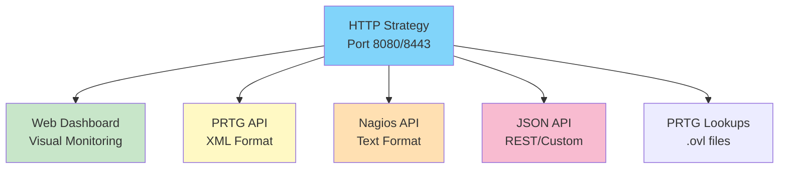
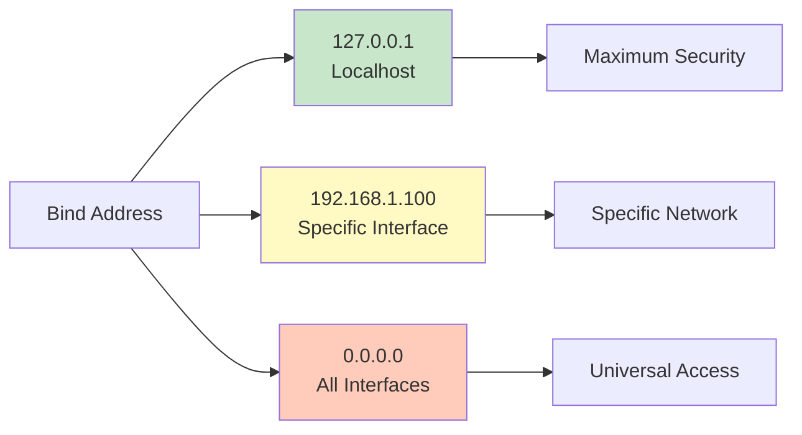

# SenHub Agent - HTTP/HTTPS Configuration

## Table of Contents

- [HTTP Strategy Overview](#http-strategy-overview)
- [HTTP Configuration (Unsecured)](#http-configuration-unsecured)
- [HTTPS Configuration (Secured)](#https-configuration-secured)
- [Advanced TLS Configuration](#advanced-tls-configuration)
- [Bind Address Configuration](#bind-address-configuration)
- [Available API Endpoints](#available-api-endpoints)
- [Security Best Practices](#security-best-practices)

---

## HTTP Strategy Overview

The HTTP strategy exposes the agent via a local REST API allowing:



---

## HTTP Configuration (Unsecured)

### Basic Configuration

```yaml
storage:
  - name: http
    params:
      port: 8080
      bind_address: "127.0.0.1"  # Localhost only
      endpoints: ["prtg", "web", "nagios"]
```

**📸 SCREENSHOT TO INSERT**: Dashboard accessible at http://localhost:8080/web/{key}/dashboard

### Endpoint Access

| Endpoint | URL | Usage |
|----------|-----|-------|
| **Dashboard** | `http://localhost:8080/web/{key}/dashboard` | Visual interface |
| **PRTG XML** | `http://localhost:8080/api/{key}/prtg/metrics` | PRTG Sensors |
| **Nagios** | `http://localhost:8080/api/{key}/nagios/status` | Nagios Checks |
| **JSON** | `http://localhost:8080/api/{key}/metrics` | REST API |

---

## HTTPS Configuration (Secured)

### Option 1: Auto-Generated Certificates

**Installation**:
```bash
senhub-agent install --offline --enable-https
```

**Generated configuration**:
```yaml
storage:
  - name: http
    params:
      port: 8443
      bind_address: "0.0.0.0"
      endpoints: ["prtg", "web", "nagios"]
      tls:
        enabled: true
        min_tls_version: "1.2"
        cert_file: "./certs/agent-cert.pem"
        key_file: "./certs/agent-key.pem"
```

**Certificate Properties**:
- Type: Self-signed X.509
- RSA: 2048 bits
- Validity: 365 days
- SANs: localhost, 127.0.0.1 + custom hosts

**📸 SCREENSHOT TO INSERT**: File explorer showing ./certs/ with agent-cert.pem and agent-key.pem

### Option 2: Custom Certificates (Let's Encrypt)

**Installation**:
```bash
senhub-agent install --offline --enable-https \
  --cert-file /etc/letsencrypt/live/monitoring.company.com/fullchain.pem \
  --key-file /etc/letsencrypt/live/monitoring.company.com/privkey.pem
```

**Configuration**:
```yaml
storage:
  - name: http
    params:
      port: 8443
      bind_address: "0.0.0.0"
      endpoints: ["prtg", "web", "nagios"]
      tls:
        enabled: true
        min_tls_version: "1.2"
        cert_file: "/etc/letsencrypt/live/monitoring.company.com/fullchain.pem"
        key_file: "/etc/letsencrypt/live/monitoring.company.com/privkey.pem"
```

---

## Advanced TLS Configuration

### TLS Versions

```yaml
tls:
  min_tls_version: "1.3"  # 1.0, 1.1, 1.2, 1.3
```

**Recommendations**:
- **Production**: TLS 1.2 minimum (TLS 1.3 optimal)
- **Legacy**: TLS 1.1 (only if necessary)
- **⚠️ Deprecated**: TLS 1.0 (known vulnerabilities)

### Cipher Suites

**TLS 1.3 (Recommended)**:
```yaml
tls:
  min_tls_version: "1.3"
  cipher_suites:
    - "TLS_AES_128_GCM_SHA256"
    - "TLS_AES_256_GCM_SHA384"
    - "TLS_CHACHA20_POLY1305_SHA256"
```

**TLS 1.2**:
```yaml
tls:
  min_tls_version: "1.2"
  cipher_suites:
    - "TLS_ECDHE_RSA_WITH_AES_128_GCM_SHA256"
    - "TLS_ECDHE_RSA_WITH_AES_256_GCM_SHA384"
    - "TLS_ECDHE_ECDSA_WITH_AES_128_GCM_SHA256"
```

**📸 SCREENSHOT TO INSERT**: Browser showing HTTPS connection details (green lock, valid certificate)

---

## Bind Address Configuration



### Localhost (Development)

```yaml
bind_address: "127.0.0.1"
```

**Use case**: Local development, testing

### Specific Interface

```yaml
bind_address: "192.168.1.100"
```

**Use case**: Multi-homing, precise network control

### All Interfaces (Production HTTPS)

```yaml
bind_address: "0.0.0.0"
```

**⚠️ WARNING**: Use only with HTTPS + firewall

---

## Available API Endpoints

### System Endpoints

| Endpoint | Method | Description |
|----------|--------|-------------|
| `/api/{key}/info/system` | GET | Agent system info |
| `/api/{key}/info/probes` | GET | Active probes list |
| `/api/{key}/license/status` | GET | License status |

### Metrics Endpoints

| Endpoint | Method | Format | Description |
|----------|--------|--------|-------------|
| `/api/{key}/metrics` | GET | JSON | All metrics |
| `/api/{key}/prtg/metrics` | GET | XML | PRTG format |
| `/api/{key}/prtg/metrics/{probe}` | GET | XML | PRTG per probe |
| `/api/{key}/nagios/status` | GET | Text | Nagios format |

### Lookups Endpoints

| Endpoint | Method | Description |
|----------|--------|-------------|
| `/api/{key}/prtg/lookups/download` | GET | Download all .ovl files |

**📸 SCREENSHOT TO INSERT**: API Explorer in web dashboard showing endpoint list

---

## Security Best Practices

### ✅ Production Recommendations

```yaml
# Secure Production Configuration
storage:
  - name: http
    params:
      port: 8443
      bind_address: "0.0.0.0"  # With firewall
      endpoints: ["prtg", "web", "nagios"]
      tls:
        enabled: true
        min_tls_version: "1.2"  # Or 1.3
        cert_file: "/etc/ssl/certs/monitoring.crt"  # Valid CA certificate
        key_file: "/etc/ssl/private/monitoring.key"
```

### ❌ To Avoid

- ❌ HTTP in production (except localhost)
- ❌ Self-signed certificates in production
- ❌ bind_address 0.0.0.0 without HTTPS
- ❌ TLS < 1.2
- ❌ Obsolete cipher suites (RC4, 3DES)

---

**Next steps**: [PROBES-CONFIGURATION.md](./PROBES-CONFIGURATION.md)
