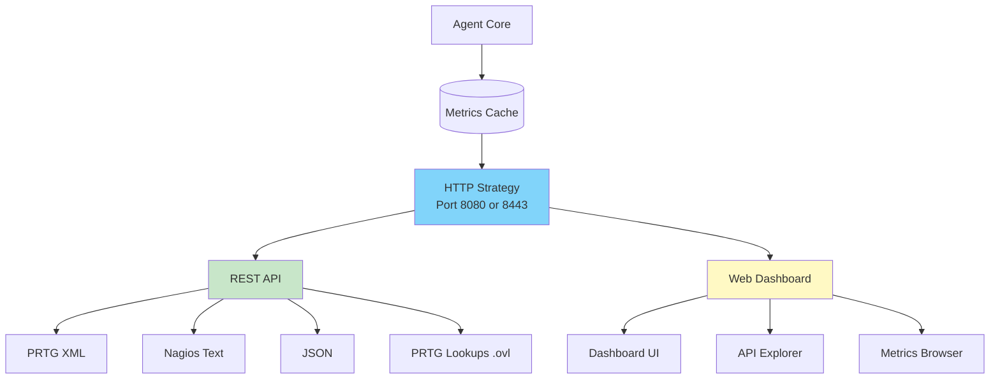
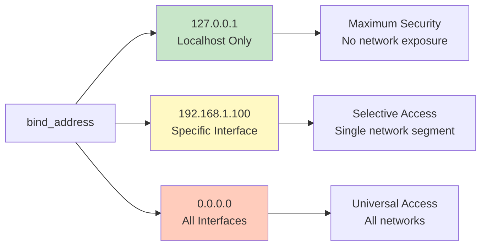

# HTTP/HTTPS Configuration

This guide covers the HTTP strategy configuration that exposes the agent's REST API for metrics access and web dashboard. Understanding the security implications of HTTP versus HTTPS deployment is critical for protecting sensitive infrastructure data and maintaining compliance with security policies.

## Table of Contents

- [Understanding HTTP Strategy](#understanding-http-strategy)
- [HTTP Configuration - Development Mode](#http-configuration---development-mode)
- [HTTPS Configuration - Production Mode](#https-configuration---production-mode)
- [Certificate Management](#certificate-management)
- [Network Binding Configuration](#network-binding-configuration)
- [API Endpoints Reference](#api-endpoints-reference)
- [Security Considerations](#security-considerations)

---

## Understanding HTTP Strategy

### What HTTP Strategy Provides

The HTTP strategy is the primary data exposure mechanism in offline mode, providing a REST API and web dashboard for accessing collected metrics. This strategy transforms the agent from a data collector into an accessible monitoring endpoint.



### HTTP vs HTTPS: Security Decision

The choice between HTTP and HTTPS fundamentally affects the security posture of your monitoring infrastructure:

**HTTP (Unencrypted)**
- Metrics transmitted in plaintext over network
- Agent key visible in network traffic
- Vulnerable to eavesdropping and man-in-the-middle attacks
- Suitable ONLY for localhost-bound development environments

**HTTPS (Encrypted)**
- All traffic encrypted with TLS 1.2+ (AES-256-GCM or ChaCha20-Poly1305)
- Agent key protected during transmission
- Certificate-based server authentication
- Industry-standard security for production deployments

**Compliance consideration:** Many security frameworks (PCI-DSS, HIPAA, SOC 2) require encryption for monitoring data transmission. HTTP mode fails these requirements even for internal networks.

### Port Selection

| Port | Protocol | Standard Use Case | Firewall Impact |
|------|----------|-------------------|-----------------|
| **8080** | HTTP | Development, localhost-only access | Minimal (localhost binding) |
| **8443** | HTTPS | Production, network-accessible | Requires inbound firewall rule |
| **443** | HTTPS | Production with reverse proxy | Standard HTTPS port (often pre-allowed) |

**Operational consideration:** Port 8443 is commonly used for alternate HTTPS services, making it less likely to conflict with existing infrastructure compared to standard port 443. However, it requires explicit firewall rule configuration.

---

## HTTP Configuration - Development Mode

### When to Use HTTP Mode

HTTP mode is appropriate ONLY when:
- Agent binds to localhost (127.0.0.1) exclusively
- Metrics accessed only from local machine (same server)
- Development or testing environment (not production)
- No network transmission of metrics occurs

**Never use HTTP mode with network binding (0.0.0.0) in production.**

### Configuration

```yaml
storage:
  - name: http
    params:
      port: 8080
      bind_address: "127.0.0.1"  # Localhost binding mandatory for HTTP
      endpoints: ["prtg", "web", "nagios"]
```

### Access URLs

When bound to localhost, all endpoints accessed locally:

| Endpoint | URL | Purpose |
|----------|-----|---------|
| **Dashboard** | `http://localhost:8080/web/{key}/dashboard` | Visual monitoring interface |
| **API Explorer** | `http://localhost:8080/web/{key}/api-explorer` | Interactive API testing |
| **PRTG Metrics** | `http://localhost:8080/api/{key}/prtg/metrics` | PRTG sensor data |
| **Nagios Status** | `http://localhost:8080/api/{key}/nagios/status` | Nagios check output |
| **JSON Metrics** | `http://localhost:8080/api/{key}/json/metrics` | Raw JSON metrics |

### Localhost SSH Tunneling

For remote access to localhost-bound HTTP agent without exposing HTTP over network:

```bash
# Establish SSH tunnel from local machine to remote agent server
ssh -L 8080:localhost:8080 user@agent-server.company.com

# Access agent via tunnel
curl http://localhost:8080/api/{key}/info/system

# Dashboard accessible at http://localhost:8080/web/{key}/dashboard
```

**Security benefit:** Metrics encrypted via SSH tunnel during transmission, avoiding need for HTTPS certificate management in development environments.

---

## HTTPS Configuration - Production Mode

### When to Use HTTPS Mode

HTTPS mode is mandatory when:
- Agent accessible over network (not localhost-only)
- Monitoring systems on different servers query agent API
- Production environment with security requirements
- Compliance frameworks apply (PCI-DSS, HIPAA, SOC 2)
- Metrics contain sensitive infrastructure data

### Installation with Auto-Generated Certificates

**Installation command:**

```bash
senhub-agent install --offline --enable-https
```

**Generated configuration:**

```yaml
storage:
  - name: http
    params:
      port: 8443
      bind_address: "0.0.0.0"  # Network accessible
      endpoints: ["prtg", "web", "nagios"]
      tls:
        enabled: true
        min_tls_version: "1.2"
        cert_file: "/etc/senhub-agent/certs/agent-cert.pem"
        key_file: "/etc/senhub-agent/certs/agent-key.pem"
```

**Auto-generated certificate properties:**
- **Type:** Self-signed X.509 certificate
- **Key size:** RSA 2048 bits
- **Validity:** 365 days from installation
- **Subject Alternative Names (SANs):** localhost, 127.0.0.1, server hostname, server IP
- **Common Name (CN):** Server hostname

**Certificate location:**
- **Linux:** `/etc/senhub-agent/certs/`
- **Windows:** `C:\Program Files\SenHub\certs\`
- **macOS:** `/usr/local/etc/senhub-agent/certs/`

### Installation with Custom Certificates

**Use cases for custom certificates:**
- Certificate Authority (CA) signed certificate (organizational PKI)
- Let's Encrypt certificate (publicly trusted, free)
- Wildcard certificate (*.company.com)
- Extended Validation (EV) certificate (enhanced trust)

**Installation command:**

```bash
senhub-agent install --offline --enable-https \
  --cert-file /etc/ssl/certs/monitoring.company.com.crt \
  --key-file /etc/ssl/private/monitoring.company.com.key
```

**Generated configuration:**

```yaml
storage:
  - name: http
    params:
      port: 8443
      bind_address: "0.0.0.0"
      endpoints: ["prtg", "web", "nagios"]
      tls:
        enabled: true
        min_tls_version: "1.2"
        cert_file: "/etc/ssl/certs/monitoring.company.com.crt"
        key_file: "/etc/ssl/private/monitoring.company.com.key"
```

### Access URLs (HTTPS)

With network binding, endpoints accessible from any network location:

```
https://agent-server.company.com:8443/web/{key}/dashboard
https://192.168.1.100:8443/api/{key}/prtg/metrics/cpu
https://monitoring.company.com:8443/api/{key}/json/metrics
```

**Certificate validation:** Browsers and monitoring systems verify certificate matches accessed hostname. Self-signed certificates require explicit trust configuration; CA-signed certificates trusted automatically.

---

## Certificate Management

### Self-Signed Certificates

**Advantages:**
- Zero cost (generated locally)
- No external dependencies (offline capable)
- Immediate availability (no CA approval process)
- Suitable for internal networks without internet access

**Disadvantages:**
- Not trusted by default (browsers show warning)
- Requires manual trust configuration in monitoring systems
- 365-day validity (annual renewal required)
- No revocation capability (compromised cert remains valid until expiration)

**When to use self-signed certificates:**
- Air-gapped environments without CA access
- Internal monitoring networks with controlled trust configuration
- Development and testing environments
- Cost-sensitive deployments where CA fees are prohibitive

### CA-Signed Certificates

**Advantages:**
- Trusted by default (no browser warnings)
- Automatic trust in monitoring systems
- Revocation capability (CRL, OCSP)
- Professional appearance for external-facing services

**Disadvantages:**
- Cost (varies by CA, $0-500+ annually)
- Renewal process (annual or multi-year)
- Requires domain ownership validation
- May require internet access for validation

**When to use CA-signed certificates:**
- Production environments requiring browser access
- Compliance requirements mandating trusted certificates
- External vendor access to monitoring data
- Organizations with existing PKI infrastructure

### Let's Encrypt Certificates

Let's Encrypt provides free, automated CA-signed certificates with 90-day validity and automatic renewal.

**Obtaining Let's Encrypt certificate:**

```bash
# Install certbot
sudo apt install certbot  # Ubuntu/Debian
sudo yum install certbot  # RHEL/CentOS

# Generate certificate (requires port 80 accessible externally)
sudo certbot certonly --standalone -d monitoring.company.com

# Certificate location
# /etc/letsencrypt/live/monitoring.company.com/fullchain.pem (certificate)
# /etc/letsencrypt/live/monitoring.company.com/privkey.pem (private key)

# Configure agent to use certificate
senhub-agent install --offline --enable-https \
  --cert-file /etc/letsencrypt/live/monitoring.company.com/fullchain.pem \
  --key-file /etc/letsencrypt/live/monitoring.company.com/privkey.pem
```

**Automatic renewal configuration:**

```bash
# Certbot automatic renewal (runs daily)
sudo certbot renew --deploy-hook "systemctl restart senhub-agent"
```

**When to use Let's Encrypt:**
- Production deployments with internet-accessible servers
- Cost-conscious organizations
- Environments with automated certificate management
- Servers with public DNS records

### Certificate Renewal

**Self-signed certificate renewal:**

```bash
# Generate new self-signed certificate (valid 365 days)
openssl req -newkey rsa:2048 -nodes -keyout agent-key.pem \
  -x509 -days 365 -out agent-cert.pem \
  -subj "/CN=monitoring.company.com"

# Replace in configuration and restart agent
sudo cp agent-cert.pem /etc/senhub-agent/certs/
sudo cp agent-key.pem /etc/senhub-agent/certs/
sudo systemctl restart senhub-agent
```

**CA-signed certificate renewal:**

Follow CA's renewal process (varies by provider). Typically involves:
1. Generate new Certificate Signing Request (CSR)
2. Submit CSR to CA for signing
3. Receive renewed certificate from CA
4. Replace certificate files and restart agent

---

## Network Binding Configuration

### Binding Concepts

The `bind_address` parameter controls which network interfaces the agent listens on:



### Localhost Binding (127.0.0.1)

**Configuration:**

```yaml
bind_address: "127.0.0.1"
```

**Security posture:**
- Agent accessible ONLY from local machine
- No network traffic possible (firewall irrelevant)
- Immune to network-based attacks
- Requires local login or SSH tunnel for access

**Use cases:**
- Development environments
- Testing configurations before production deployment
- Servers where monitoring system runs locally
- Maximum security requirement (defense in depth)

**Access method:**

```bash
# Local access
curl http://localhost:8080/api/{key}/info/system

# Remote access via SSH tunnel
ssh -L 8080:localhost:8080 user@agent-server
curl http://localhost:8080/api/{key}/info/system
```

### Specific Interface Binding

**Configuration:**

```yaml
bind_address: "192.168.1.100"  # Specific server IP
```

**Security posture:**
- Agent accessible on specified interface only
- Other network interfaces ignored
- Useful for multi-homed servers (multiple NICs)
- Firewall still required for access control

**Use cases:**
- Multi-homed servers with separate management and production networks
- Binding to management VLAN interface only
- Precise network segment control
- Compliance requirement for network segregation

**Example scenario:** Server with two NICs - production network (192.168.1.100) and management network (10.0.0.50). Binding to 10.0.0.50 ensures agent only accessible from management network, isolating monitoring traffic from production.

### All Interfaces Binding (0.0.0.0)

**Configuration:**

```yaml
bind_address: "0.0.0.0"
```

**Security posture:**
- Agent listens on ALL network interfaces
- Accessible from any connected network
- **Requires firewall configuration** for access control
- **Requires HTTPS** for production use

**Use cases:**
- Production deployments with centralized monitoring servers
- Docker/Kubernetes environments with dynamic networking
- Servers with multiple interfaces all requiring agent access
- Simplified configuration in secured network environments

**Firewall requirement:**

This configuration exposes the agent to all networks, requiring firewall rules to restrict access:

**Linux (UFW):**

```bash
# Allow access from PRTG server only
sudo ufw allow from 192.168.1.50 to any port 8443 proto tcp comment "PRTG Server"

# Allow access from monitoring subnet
sudo ufw allow from 192.168.10.0/24 to any port 8443 proto tcp comment "Monitoring VLAN"

# Enable firewall
sudo ufw enable
```

**Linux (firewalld):**

```bash
# Create rich rule for specific source
sudo firewall-cmd --permanent --add-rich-rule='rule family="ipv4" source address="192.168.1.50" port port="8443" protocol="tcp" accept'

# Reload firewall
sudo firewall-cmd --reload
```

**Windows Firewall:**

```powershell
# Allow access from PRTG server only
New-NetFirewallRule -DisplayName "SenHub Agent - PRTG Access" `
  -Direction Inbound -Protocol TCP -LocalPort 8443 `
  -RemoteAddress 192.168.1.50 -Action Allow

# Allow access from monitoring subnet
New-NetFirewallRule -DisplayName "SenHub Agent - Monitoring VLAN" `
  -Direction Inbound -Protocol TCP -LocalPort 8443 `
  -RemoteAddress 192.168.10.0/24 -Action Allow
```

### Binding Selection Guide

**Choose localhost (127.0.0.1) when:**
- Development or testing environment
- Monitoring system runs locally on same server
- Maximum security required
- No network access needed

**Choose specific interface when:**
- Multi-homed server with network segregation
- Binding to dedicated management network
- Compliance requirement for interface isolation
- Network architect specifies interface-level access control

**Choose all interfaces (0.0.0.0) when:**
- Production deployment with network monitoring systems
- Docker/Kubernetes dynamic networking
- Simplified configuration in secured environment
- Multiple interfaces all require access

---

## API Endpoints Reference

### System Information Endpoints

| Endpoint | Method | Description | Example Response |
|----------|--------|-------------|------------------|
| `/api/{key}/info/system` | GET | Agent system information | Hostname, OS, version, mode |
| `/api/{key}/info/probes` | GET | List active probes | Probe names, types, intervals |
| `/api/{key}/license/status` | GET | License status | Tier, expiration, authorized probes |
| `/api/{key}/cache/stats` | GET | Cache statistics | Retention, memory usage, metrics count |

**Example usage:**

```bash
# Get agent information
curl https://monitoring.company.com:8443/api/{key}/info/system

# Response
{
  "hostname": "prod-server-01",
  "os": "linux",
  "arch": "amd64",
  "agent_version": "0.1.72",
  "mode": "offline",
  "uptime_seconds": 86400
}
```

### Metrics Endpoints

| Endpoint | Method | Format | Description |
|----------|--------|--------|-------------|
| `/api/{key}/metrics` | GET | JSON | All cached metrics |
| `/api/{key}/json/metrics` | GET | JSON | All metrics (alias) |
| `/api/{key}/json/metrics/{probe}` | GET | JSON | Specific probe metrics |
| `/api/{key}/prtg/metrics` | GET | XML | PRTG sensor format (all probes) |
| `/api/{key}/prtg/metrics/{probe}` | GET | XML | PRTG sensor format (specific probe) |
| `/api/{key}/nagios/status` | GET | Text | Nagios check format |

**Example usage (PRTG):**

```bash
# Query CPU metrics for PRTG
curl https://monitoring.company.com:8443/api/{key}/prtg/metrics/cpu

# Response (PRTG XML format)
<?xml version="1.0" encoding="UTF-8"?>
<prtg>
  <result>
    <channel>CPU Usage Total</channel>
    <value>35.2</value>
    <unit>Percent</unit>
    <float>1</float>
  </result>
  <text>CPU monitoring active</text>
</prtg>
```

### Web Dashboard Endpoints

| Endpoint | Description |
|----------|-------------|
| `/web/{key}/dashboard` | Main monitoring dashboard |
| `/web/{key}/api-explorer` | Interactive API endpoint testing |
| `/web/{key}/metrics-browser` | Browse and filter cached metrics |
| `/web/{key}/probes-status` | Probe diagnostics and status |
| `/web/{key}/license-info` | License details and expiration |

### Lookups Download Endpoint

| Endpoint | Method | Description | Content-Type |
|----------|--------|-------------|--------------|
| `/api/{key}/prtg/lookups/download` | GET | Download all PRTG .ovl lookup files as ZIP | application/zip |

**Usage in PRTG:**

After downloading ZIP:
1. Extract .ovl files
2. Copy to PRTG lookups directory: `C:\Program Files (x86)\PRTG Network Monitor\lookups\custom\`
3. Reload lookups in PRTG: Setup → System Administration → Administrative Tools → Load Lookups

---

## Security Considerations

### Production Security Checklist

Before deploying agent with network access, verify:

- [ ] HTTPS enabled (`tls.enabled: true`)
- [ ] TLS 1.2 or higher (`min_tls_version: "1.2"` or `"1.3"`)
- [ ] Appropriate bind address for environment
- [ ] Firewall rules configured if using `bind_address: "0.0.0.0"`
- [ ] CA-signed certificate or self-signed with documented trust configuration
- [ ] Agent key treated as sensitive credential (not exposed in logs, configs versioned publicly)
- [ ] Network segmentation separates monitoring traffic from production traffic (if required)
- [ ] Certificate expiration monitored (renewal process documented)

### Recommended Production Configuration

**Scenario:** Production server with external monitoring system (PRTG on 192.168.10.50)

```yaml
storage:
  - name: http
    params:
      port: 8443
      bind_address: "0.0.0.0"
      endpoints: ["prtg", "web", "nagios"]
      tls:
        enabled: true
        min_tls_version: "1.2"
        cert_file: "/etc/ssl/certs/monitoring.company.com.crt"  # CA-signed
        key_file: "/etc/ssl/private/monitoring.company.com.key"
        cipher_suites:
          - "TLS_ECDHE_RSA_WITH_AES_128_GCM_SHA256"
          - "TLS_ECDHE_RSA_WITH_AES_256_GCM_SHA384"
          - "TLS_ECDHE_ECDSA_WITH_AES_128_GCM_SHA256"
```

**Firewall configuration:**

```bash
# Linux (UFW)
sudo ufw allow from 192.168.10.50 to any port 8443 proto tcp comment "PRTG Server"
```

### What to Avoid

**Never in production:**
- HTTP mode with network binding (`bind_address: "0.0.0.0"` + no TLS)
- TLS 1.0 or 1.1 (deprecated, known vulnerabilities)
- No firewall rules with all-interfaces binding
- Hardcoded agent keys in publicly accessible documentation
- Self-signed certificates without trust configuration documentation

**Security anti-patterns:**
- Disabling certificate validation in monitoring systems (defeats purpose of HTTPS)
- Using weak cipher suites (RC4, 3DES, DES)
- Storing private keys in world-readable locations
- Sharing agent keys across multiple agents (breaks audit trail)

### Compliance Considerations

**PCI-DSS Requirements:**
- Encryption of cardholder data in transit (HTTPS mandatory)
- TLS 1.2 or higher required
- Regular vulnerability scanning (including TLS configuration)
- Access control to sensitive data (firewall rules, authentication)

**HIPAA Requirements:**
- Encryption of ePHI in transit (if metrics contain health data)
- Access controls (firewall rules, authentication)
- Audit logging (agent access logs)
- Risk analysis documentation (security configuration rationale)

**SOC 2 Requirements:**
- Encryption in transit (HTTPS)
- Access controls (least privilege, firewall rules)
- Change management (configuration changes documented)
- Monitoring and alerting (certificate expiration monitoring)

---

## Troubleshooting

### Certificate Validation Failures

**Symptom:** Browser or monitoring system shows "certificate error" or "untrusted certificate"

**Cause:** Self-signed certificate not trusted, or certificate CN/SAN doesn't match accessed hostname

**Solution for self-signed certificates:**

**Browser (Firefox):**
1. Navigate to `https://agent-server:8443`
2. Click "Advanced" → "Accept the Risk and Continue"
3. Certificate trusted for this browser

**Browser (Chrome):**
1. Navigate to `https://agent-server:8443`
2. Click "Advanced" → "Proceed to agent-server (unsafe)"
3. Certificate trusted for this browser

**PRTG:**
1. PRTG Core Server → Setup → System Administration → Core & Probes
2. Add certificate fingerprint to "SSL Certificate Fingerprints" whitelist
3. Restart PRTG Core Service

**Curl (command line):**

```bash
# Skip certificate validation (testing only, not recommended for production)
curl -k https://agent-server:8443/api/{key}/info/system

# Or add certificate to trusted store
sudo cp agent-cert.pem /usr/local/share/ca-certificates/senhub-agent.crt
sudo update-ca-certificates
```

### Port Already in Use

**Symptom:** Agent fails to start with error "bind: address already in use"

**Cause:** Another process listening on configured port

**Solution:**

```bash
# Identify process using port
sudo lsof -i :8443  # Linux/macOS
netstat -ano | findstr :8443  # Windows

# Example output
# COMMAND   PID USER   FD   TYPE DEVICE SIZE/OFF NODE NAME
# nginx   12345 root    6u  IPv4 123456      0t0  TCP *:8443 (LISTEN)

# Stop conflicting process or change agent port in configuration
```

### Certificate Expired

**Symptom:** HTTPS connections fail with "certificate expired" error

**Cause:** Self-signed certificate reached 365-day expiration

**Solution:** Generate and install new certificate following renewal procedure above

### Firewall Blocking Access

**Symptom:** Agent accessible locally but not from network

**Cause:** Firewall blocking inbound connections on agent port

**Solution:**

```bash
# Verify firewall rules (Linux)
sudo ufw status verbose

# Check if rule exists for port 8443
# If missing, add rule for monitoring system IP
sudo ufw allow from 192.168.10.50 to any port 8443 proto tcp
```

---

## Summary

HTTP/HTTPS configuration determines how the agent exposes metrics and the security posture of that exposure. Production deployments should always use HTTPS with appropriate certificate management and firewall configuration to protect sensitive monitoring data. Development environments can use HTTP with localhost binding for simplified configuration without security concerns.

**Configuration decision matrix:**

| Environment | Binding | Protocol | Certificate | Firewall |
|-------------|---------|----------|-------------|----------|
| **Development** | 127.0.0.1 | HTTP | Not required | Not required |
| **Testing** | 127.0.0.1 or 0.0.0.0 | HTTPS | Self-signed | Optional |
| **Production** | 0.0.0.0 or specific interface | HTTPS | CA-signed or self-signed | Required |

**Next steps:**
- [Probes Configuration](./PROBES-CONFIGURATION.md) - Configure monitoring probes
- [Web Interface](./WEB-INTERFACE.md) - Use the dashboard and API Explorer
- [Troubleshooting](./TROUBLESHOOTING.md) - Diagnostic procedures and log analysis
