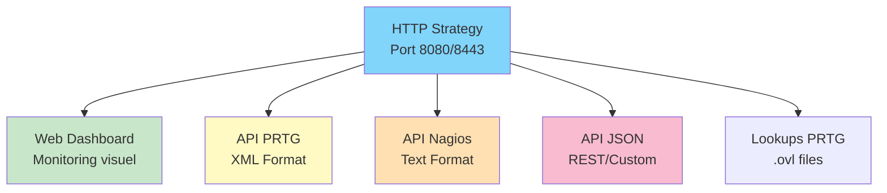
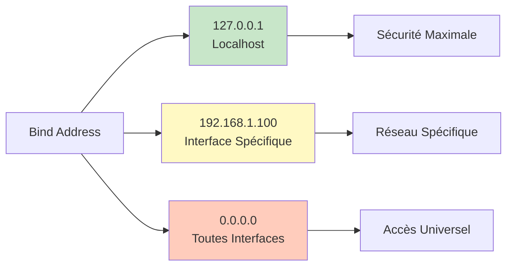

# SenHub Agent - Configuration HTTP/HTTPS

## Table des Matières

- [Vue d'Ensemble HTTP Strategy](#vue-densemble-http-strategy)
- [Configuration HTTP (Non Sécurisé)](#configuration-http-non-sécurisé)
- [Configuration HTTPS (Sécurisé)](#configuration-https-sécurisé)
- [Configuration TLS Avancée](#configuration-tls-avancée)
- [Configuration Bind Address](#configuration-bind-address)
- [Endpoints API Disponibles](#endpoints-api-disponibles)
- [Best Practices de Sécurité](#best-practices-de-sécurité)

---

## Vue d'Ensemble HTTP Strategy

La HTTP strategy expose l'agent via une API REST locale permettant :



---

## Configuration HTTP (Non Sécurisé)

### Configuration Basique

```yaml
storage:
  - name: http
    params:
      port: 8080
      bind_address: "127.0.0.1"  # Localhost uniquement
      endpoints: ["prtg", "web", "nagios"]
```

**📸 SCREENSHOT À INSÉRER** : Dashboard accessible sur http://localhost:8080/web/{key}/dashboard

### Accès aux Endpoints

| Endpoint | URL | Usage |
|----------|-----|-------|
| **Dashboard** | `http://localhost:8080/web/{key}/dashboard` | Interface visuelle |
| **PRTG XML** | `http://localhost:8080/api/{key}/prtg/metrics` | Sensors PRTG |
| **Nagios** | `http://localhost:8080/api/{key}/nagios/status` | Checks Nagios |
| **JSON** | `http://localhost:8080/api/{key}/metrics` | API REST |

---

## Configuration HTTPS (Sécurisé)

### Option 1 : Certificats Auto-Générés

**Installation** :
```bash
senhub-agent install --offline --enable-https
```

**Configuration générée** :
```yaml
storage:
  - name: http
    params:
      port: 8443
      bind_address: "0.0.0.0"
      endpoints: ["prtg", "web", "nagios"]
      tls:
        enabled: true
        min_tls_version: "1.2"
        cert_file: "./certs/agent-cert.pem"
        key_file: "./certs/agent-key.pem"
```

**Propriétés du Certificat** :
- Type : Self-signed X.509
- RSA : 2048 bits
- Validité : 365 jours
- SANs : localhost, 127.0.0.1 + hosts personnalisés

**📸 SCREENSHOT À INSÉRER** : Explorateur de fichiers montrant ./certs/ avec agent-cert.pem et agent-key.pem

### Option 2 : Certificats Personnalisés (Let's Encrypt)

**Installation** :
```bash
senhub-agent install --offline --enable-https \
  --cert-file /etc/letsencrypt/live/monitoring.company.com/fullchain.pem \
  --key-file /etc/letsencrypt/live/monitoring.company.com/privkey.pem
```

**Configuration** :
```yaml
storage:
  - name: http
    params:
      port: 8443
      bind_address: "0.0.0.0"
      endpoints: ["prtg", "web", "nagios"]
      tls:
        enabled: true
        min_tls_version: "1.2"
        cert_file: "/etc/letsencrypt/live/monitoring.company.com/fullchain.pem"
        key_file: "/etc/letsencrypt/live/monitoring.company.com/privkey.pem"
```

---

## Configuration TLS Avancée

### Versions TLS

```yaml
tls:
  min_tls_version: "1.3"  # 1.0, 1.1, 1.2, 1.3
```

**Recommandations** :
- **Production** : TLS 1.2 minimum (TLS 1.3 optimal)
- **Legacy** : TLS 1.1 (uniquement si nécessaire)
- **⚠️ Déprécié** : TLS 1.0 (vulnérabilités connues)

### Cipher Suites

**TLS 1.3 (Recommandé)** :
```yaml
tls:
  min_tls_version: "1.3"
  cipher_suites:
    - "TLS_AES_128_GCM_SHA256"
    - "TLS_AES_256_GCM_SHA384"
    - "TLS_CHACHA20_POLY1305_SHA256"
```

**TLS 1.2** :
```yaml
tls:
  min_tls_version: "1.2"
  cipher_suites:
    - "TLS_ECDHE_RSA_WITH_AES_128_GCM_SHA256"
    - "TLS_ECDHE_RSA_WITH_AES_256_GCM_SHA384"
    - "TLS_ECDHE_ECDSA_WITH_AES_128_GCM_SHA256"
```

**📸 SCREENSHOT À INSÉRER** : Navigateur montrant les détails de connexion HTTPS (cadenas vert, certificat valide)

---

## Configuration Bind Address



### Localhost (Développement)

```yaml
bind_address: "127.0.0.1"
```

**Cas d'usage** : Développement local, tests

### Interface Spécifique

```yaml
bind_address: "192.168.1.100"
```

**Cas d'usage** : Multi-homing, contrôle réseau précis

### Toutes Interfaces (Production HTTPS)

```yaml
bind_address: "0.0.0.0"
```

**⚠️ ATTENTION** : Utiliser uniquement avec HTTPS + firewall

---

## Endpoints API Disponibles

### Endpoints Système

| Endpoint | Méthode | Description |
|----------|---------|-------------|
| `/api/{key}/info/system` | GET | Info système agent |
| `/api/{key}/info/probes` | GET | Liste probes actives |
| `/api/{key}/license/status` | GET | Statut licence |

### Endpoints Métriques

| Endpoint | Méthode | Format | Description |
|----------|---------|--------|-------------|
| `/api/{key}/metrics` | GET | JSON | Toutes métriques |
| `/api/{key}/prtg/metrics` | GET | XML | Format PRTG |
| `/api/{key}/prtg/metrics/{probe}` | GET | XML | PRTG par probe |
| `/api/{key}/nagios/status` | GET | Text | Format Nagios |

### Endpoints Lookups

| Endpoint | Méthode | Description |
|----------|---------|-------------|
| `/api/{key}/prtg/lookups/download` | GET | Télécharge tous les .ovl |

**📸 SCREENSHOT À INSÉRER** : API Explorer dans le dashboard web montrant la liste des endpoints

---

## Best Practices de Sécurité

### ✅ Recommandations Production

```yaml
# Configuration Production Sécurisée
storage:
  - name: http
    params:
      port: 8443
      bind_address: "0.0.0.0"  # Avec firewall
      endpoints: ["prtg", "web", "nagios"]
      tls:
        enabled: true
        min_tls_version: "1.2"  # Ou 1.3
        cert_file: "/etc/ssl/certs/monitoring.crt"  # Certificat CA valide
        key_file: "/etc/ssl/private/monitoring.key"
```

### ❌ À Éviter

- ❌ HTTP en production (sauf localhost)
- ❌ Certificats auto-signés en production
- ❌ bind_address 0.0.0.0 sans HTTPS
- ❌ TLS < 1.2
- ❌ Cipher suites obsolètes (RC4, 3DES)

---

**Prochaines étapes** : [PROBES-CONFIGURATION.md](./PROBES-CONFIGURATION.md)
