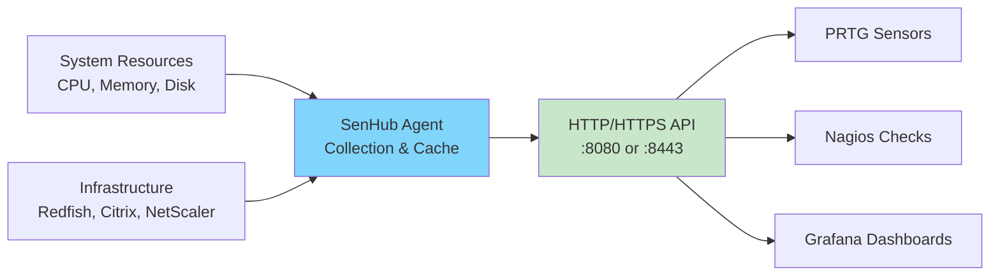

# Installing SenHub Agent

This guide covers the complete installation process for SenHub Agent across Windows, Linux, and macOS environments. The installation is designed to be completed in under 10 minutes, with minimal dependencies and straightforward configuration options.

## Table of Contents

- [Understanding the Installation](#understanding-the-installation)
- [System Requirements](#system-requirements)
- [Download](#download)
- [Windows Installation](#windows-installation)
- [Linux Installation](#linux-installation)
- [macOS Installation](#macos-installation)
- [Post-Installation](#post-installation)
- [Uninstallation](#uninstallation)

---

## Understanding the Installation

Before starting, it's important to understand what you're deploying and the choices you'll make during installation.

### What SenHub Agent Provides

SenHub Agent is a monitoring collector that runs locally on your infrastructure and exposes metrics via HTTP/HTTPS API. Think of it as a metrics aggregation layer that sits between your systems and your monitoring tools (PRTG, Nagios, Grafana, etc.).



### Default Installation Mode: Offline

The standard installation configures the agent in **offline mode**, which means:

- **Autonomous operation**: The agent runs independently without external dependencies
- **Local configuration**: Settings managed via local YAML file
- **No outbound connections**: Suitable for air-gapped environments or DMZ servers
- **Local data exposure**: Metrics accessible only via local HTTP/HTTPS interface

This mode is ideal for:
- Production environments with strict security policies
- Development and testing scenarios
- Edge computing deployments
- Infrastructure with limited or no internet connectivity

> **Note**: An **online mode** exists for integration with the SenHub centralized platform, but this is a reserved feature and not covered in this guide.

---

## System Requirements

### Supported Platforms

SenHub Agent is compiled for all major operating systems and architectures:

| Platform | Versions | Architecture | Notes |
|----------|----------|--------------|-------|
| **Windows** | Server 2012+, Windows 10+ | x64 | Runs as Windows Service |
| **Linux** | RHEL 7+, Ubuntu 18.04+, Debian 10+ | x64, ARM64 | Systemd-based distributions |
| **macOS** | macOS 10.13+ (High Sierra) | x64, ARM64 (M1/M2) | LaunchDaemon integration |

### Resource Requirements

The agent is designed for minimal resource consumption:

| Resource | Minimum | Typical | Notes |
|----------|---------|---------|-------|
| **CPU** | 1 core | 1 core | Low CPU usage (~1-2% idle) |
| **RAM** | 256 MB | 512 MB | Varies with cache retention settings |
| **Disk** | 100 MB | 500 MB | Binary + logs + cache |

**Real-world consumption example**: With 5 active probes (CPU, memory, disk, network, redfish) collecting every 60 seconds:
- CPU: ~2-3% on average
- RAM: ~80-120 MB
- Disk I/O: Minimal (log rotation configured)

### Network Ports

The agent requires one listening port for its HTTP/HTTPS interface:

| Port | Protocol | Usage | Configuration |
|------|----------|-------|---------------|
| **8080** | HTTP | Default (development) | `--offline` |
| **8443** | HTTPS | Production (recommended) | `--offline --enable-https` |

**Additional ports** (only if specific probes are enabled):
- **514 UDP/TCP**: Syslog reception (if syslog probe configured)

**Outbound connectivity** (only for online mode - not covered here):
- `eu-west-1.intake.senhub.io:443` (HTTPS)

### Required Permissions

Installation requires administrative privileges to:
- Create system service (Windows Service, systemd unit, or LaunchDaemon)
- Write to system directories (`/usr/local/bin`, `/etc`, `/var/log`)
- Generate TLS certificates (if HTTPS enabled)

**Platforms**:
- Windows: Administrator account
- Linux: root or sudo access
- macOS: root or sudo access

---

## Download

All official releases are available at:

```
https://eu-west-1.intake.senhub.io/releases
```

### Selecting Your Binary

Choose the binary matching your platform and architecture:

**Windows**:
```
senhub-agent_windows_amd64.exe
```

**Linux**:
```
senhub-agent_linux_amd64       # Standard x64 servers
senhub-agent_linux_arm64       # ARM-based systems (Raspberry Pi, AWS Graviton)
```

**macOS**:
```
senhub-agent_darwin_amd64      # Intel-based Macs
senhub-agent_darwin_arm64      # Apple Silicon (M1/M2/M3)
```

### Verifying Download Integrity

For security-critical deployments, verify the binary checksum:

```bash
# Download checksum file
curl -O https://eu-west-1.intake.senhub.io/releases/{version}/checksums.txt

# Verify (Linux/macOS)
sha256sum -c checksums.txt

# Verify (Windows PowerShell)
Get-FileHash senhub-agent_windows_amd64.exe -Algorithm SHA256
```

---

## Windows Installation

This section covers installation on Windows Server (2012+) and Windows 10/11 client systems.

### Installation Overview

The Windows installation process:
1. Creates installation directory (`C:\Program Files\SenHub`)
2. Installs the binary with execution permissions
3. Generates configuration file (`agent-config.yaml`)
4. Creates Windows Service (auto-start enabled)
5. Optionally generates self-signed TLS certificates

### Step 1: Download and Prepare

Open PowerShell as Administrator:

```powershell
# Create installation directory
New-Item -ItemType Directory -Force -Path "C:\Program Files\SenHub"
cd "C:\Program Files\SenHub"

# Download binary (using curl or browser)
# Then move to installation directory
Move-Item "$env:USERPROFILE\Downloads\senhub-agent_windows_amd64.exe" .

# Rename for convenience
Rename-Item senhub-agent_windows_amd64.exe senhub-agent.exe
```

### Step 2: Choose Installation Mode

You must choose between HTTP (development) or HTTPS (production) installation.

#### HTTP Installation - Development/Testing

**Use case**: Local development, testing environments, or when accessing only via localhost.

```powershell
.\senhub-agent.exe install --offline
```

**Configuration created**:
- **Port**: 8080
- **Bind address**: 127.0.0.1 (localhost only)
- **Protocol**: HTTP (unencrypted)
- **Access URL**: `http://localhost:8080/web/{key}/dashboard`

**Security note**: This configuration is only accessible from the local machine. Suitable for development but not for production networks.

#### HTTPS Installation - Production (Recommended)

**Use case**: Production deployments requiring network access from monitoring systems.

```powershell
.\senhub-agent.exe install --offline --enable-https
```

**Configuration created**:
- **Port**: 8443
- **Bind address**: 0.0.0.0 (accessible from network)
- **Protocol**: HTTPS with TLS 1.2+
- **Certificates**: Auto-generated self-signed (365 days validity)
- **Access URL**: `https://server-hostname:8443/web/{key}/dashboard`

**Custom certificate installation** (optional):

```powershell
.\senhub-agent.exe install --offline --enable-https \
  --cert-file "C:\Certs\monitoring.crt" \
  --key-file "C:\Certs\monitoring.key"
```

**Certificate requirements**:
- X.509 format (PEM-encoded)
- Valid for agent hostname or IP
- Includes complete certificate chain (if CA-signed)

### Step 3: Note Your Agent Key

During installation, the agent generates a unique UUID authentication key. This key is required to access the web interface and API.

**Save this key securely** - you'll need it for:
- Accessing the web dashboard
- Configuring PRTG sensors
- Setting up Nagios checks

**Retrieving the key later**:

```powershell
# Read from configuration file
Select-String -Path "C:\Program Files\SenHub\agent-config.yaml" -Pattern "key:"
```

### Step 4: Verify Installation

Check that the Windows Service is running:

```powershell
# Check service status
Get-Service SenHubAgent

# Should show: Status = Running

# Test HTTP endpoint
curl http://localhost:8080/api/{YOUR-KEY}/info/system
# Or for HTTPS:
curl -k https://localhost:8443/api/{YOUR-KEY}/info/system
```

Expected response:
```json
{
  "hostname": "SERVER-01",
  "os": "windows",
  "agent_version": "0.1.72",
  "mode": "offline"
}
```

### Windows Firewall Configuration

If accessing from other machines, configure Windows Firewall:

```powershell
# Allow inbound HTTPS
New-NetFirewallRule -DisplayName "SenHub Agent HTTPS" `
  -Direction Inbound -Protocol TCP -LocalPort 8443 -Action Allow

# Or for HTTP
New-NetFirewallRule -DisplayName "SenHub Agent HTTP" `
  -Direction Inbound -Protocol TCP -LocalPort 8080 -Action Allow
```

---

## Linux Installation

This section covers installation on systemd-based Linux distributions (RHEL, CentOS, Ubuntu, Debian).

### Installation Overview

The Linux installation process:
1. Installs binary to `/usr/local/bin`
2. Creates configuration directory (`/etc/senhub-agent`)
3. Generates configuration file
4. Creates systemd service unit
5. Enables auto-start on boot

### Step 1: Download Binary

```bash
# Download appropriate binary
cd /tmp
curl -LO https://eu-west-1.intake.senhub.io/releases/senhub-agent_linux_amd64

# Verify permissions
chmod +x senhub-agent_linux_amd64
```

### Step 2: Choose Installation Mode

#### HTTP Installation - Development/Testing

```bash
sudo ./senhub-agent_linux_amd64 install --offline
```

**Configuration created**:
- **Port**: 8080
- **Bind**: 127.0.0.1
- **Protocol**: HTTP
- **Access**: `http://localhost:8080/web/{key}/dashboard`

#### HTTPS Installation - Production (Recommended)

```bash
sudo ./senhub-agent_linux_amd64 install --offline --enable-https
```

**Configuration created**:
- **Port**: 8443
- **Bind**: 0.0.0.0
- **Protocol**: HTTPS
- **Certificates**: `/etc/senhub-agent/certs/`
- **Access**: `https://server-hostname:8443/web/{key}/dashboard`

**Custom certificates** (Let's Encrypt or CA-signed):

```bash
sudo ./senhub-agent_linux_amd64 install --offline --enable-https \
  --cert-file /etc/letsencrypt/live/monitoring.company.com/fullchain.pem \
  --key-file /etc/letsencrypt/live/monitoring.company.com/privkey.pem
```

### Step 3: Save Agent Key

During installation, note the generated agent key:

```bash
# Retrieve key from configuration
sudo grep "key:" /etc/senhub-agent/agent-config.yaml
```

Output example:
```yaml
agent:
  key: "f47ac10b-58cc-4372-a567-0e02b2c3d479"
```

### Step 4: Verify Installation

```bash
# Check systemd service
sudo systemctl status senhub-agent

# Should show: Active: active (running)

# Test endpoint
curl http://localhost:8080/api/{YOUR-KEY}/info/system
# Or for HTTPS:
curl -k https://localhost:8443/api/{YOUR-KEY}/info/system
```

### Step 5: Configure Firewall

**UFW (Ubuntu/Debian)**:
```bash
sudo ufw allow 8443/tcp comment "SenHub Agent HTTPS"
sudo ufw reload
```

**Firewalld (RHEL/CentOS)**:
```bash
sudo firewall-cmd --permanent --add-port=8443/tcp
sudo firewall-cmd --reload
```

### Systemd Service Management

```bash
# Start/Stop/Restart
sudo systemctl start senhub-agent
sudo systemctl stop senhub-agent
sudo systemctl restart senhub-agent

# Enable/Disable auto-start
sudo systemctl enable senhub-agent
sudo systemctl disable senhub-agent

# View logs
sudo journalctl -u senhub-agent -f
```

---

## macOS Installation

This section covers installation on macOS 10.13+ (High Sierra and later), supporting both Intel and Apple Silicon.

### Installation Overview

macOS installation creates a LaunchDaemon for system-level service management.

### Step 1: Download Binary

```bash
# Intel Macs
curl -LO https://eu-west-1.intake.senhub.io/releases/senhub-agent_darwin_amd64

# Apple Silicon (M1/M2/M3)
curl -LO https://eu-west-1.intake.senhub.io/releases/senhub-agent_darwin_arm64

# Make executable
chmod +x senhub-agent_darwin_*
```

### Step 2: Install

#### HTTP Mode:
```bash
sudo ./senhub-agent_darwin_amd64 install --offline
```

#### HTTPS Mode (Recommended):
```bash
sudo ./senhub-agent_darwin_amd64 install --offline --enable-https
```

Configuration locations:
- **Binary**: `/usr/local/bin/senhub-agent`
- **Config**: `/usr/local/etc/senhub-agent/agent-config.yaml`
- **LaunchDaemon**: `/Library/LaunchDaemons/io.senhub.agent.plist`
- **Logs**: `/Library/Logs/SenHub/agent.log`

### Step 3: Verify Installation

```bash
# Check LaunchDaemon status
sudo launchctl list | grep senhub

# Test endpoint
curl http://localhost:8080/api/{YOUR-KEY}/info/system
```

### LaunchDaemon Management

```bash
# Start
sudo launchctl load /Library/LaunchDaemons/io.senhub.agent.plist

# Stop
sudo launchctl unload /Library/LaunchDaemons/io.senhub.agent.plist

# View logs
tail -f /Library/Logs/SenHub/agent.log
```

---

## Post-Installation

After installation, complete these steps to start using the agent.

### Access the Web Dashboard

The web dashboard provides a visual interface for monitoring and configuration.

**URL format**:
```
http(s)://<hostname>:<port>/web/{agent-key}/dashboard
```

**Examples**:
```
# HTTP local access
http://localhost:8080/web/f47ac10b-58cc-4372-a567-0e02b2c3d479/dashboard

# HTTPS network access
https://monitoring.company.com:8443/web/f47ac10b-58cc-4372-a567-0e02b2c3d479/dashboard
```

### Configure Initial Probes

The default installation includes basic system probes (CPU, memory, disk, network). To add additional monitoring capabilities, edit the configuration file.

**Configuration file locations**:
- **Windows**: `C:\Program Files\SenHub\agent-config.yaml`
- **Linux**: `/etc/senhub-agent/agent-config.yaml`
- **macOS**: `/usr/local/etc/senhub-agent/agent-config.yaml`

**Example - Adding Redfish hardware monitoring**:

```yaml
probes:
  # Existing system probes
  - name: cpu
    type: cpu
    params:
      interval: 30

  # Add Redfish probe
  - name: "Production Server iDRAC"
    type: redfish
    params:
      endpoint: "https://idrac.company.com"
      username: "monitoring"
      password: "SecurePassword"
      interval: 300
      verify_ssl: true
```

After editing, restart the agent:
```bash
# Windows
Restart-Service SenHubAgent

# Linux
sudo systemctl restart senhub-agent

# macOS
sudo launchctl unload /Library/LaunchDaemons/io.senhub.agent.plist
sudo launchctl load /Library/LaunchDaemons/io.senhub.agent.plist
```

See [Probes Configuration](./PROBES-CONFIGURATION.md) for complete probe documentation.

### Integrate with Monitoring Tools

The agent exposes metrics in formats compatible with popular monitoring platforms:

**PRTG Network Monitor**:
```
Sensor Type: HTTP XML/REST Value
URL: https://monitoring.company.com:8443/api/{key}/prtg/metrics/cpu
```

**Nagios/Icinga**:
```bash
define command {
    command_name    check_senhub
    command_line    $USER1$/check_http -H $HOSTADDRESS$ -p 8443 -S \
                    -u /api/{key}/nagios/status
}
```

**Grafana**:
```
Datasource: JSON API
URL: https://monitoring.company.com:8443
Custom Header: X-API-Key: {your-key}
```

See [Metrics Usage](./METRICS-USAGE.md) for detailed integration guides.

---

## Uninstallation

### Windows

```powershell
# Stop and remove service
cd "C:\Program Files\SenHub"
.\senhub-agent.exe uninstall

# Remove files
cd ..
Remove-Item -Recurse -Force SenHub
```

### Linux

```bash
# Stop and remove service
sudo systemctl stop senhub-agent
sudo systemctl disable senhub-agent
sudo rm /etc/systemd/system/senhub-agent.service
sudo systemctl daemon-reload

# Remove files
sudo rm /usr/local/bin/senhub-agent
sudo rm -rf /etc/senhub-agent
sudo rm -rf /var/log/senhub-agent
```

### macOS

```bash
# Stop and remove LaunchDaemon
sudo launchctl unload /Library/LaunchDaemons/io.senhub.agent.plist
sudo rm /Library/LaunchDaemons/io.senhub.agent.plist

# Remove files
sudo rm /usr/local/bin/senhub-agent
sudo rm -rf /usr/local/etc/senhub-agent
sudo rm -rf /Library/Logs/SenHub
```

---

## Next Steps

After installation:

1. **[Configure Operating Mode](./OPERATING-MODES.md)** - Understand offline vs online mode
2. **[Configure the Agent](./AGENT-CONFIGURATION.md)** - License, cache, auto-update settings
3. **[Add Monitoring Probes](./PROBES-CONFIGURATION.md)** - Enable additional metrics collection
4. **[Access Web Interface](./WEB-INTERFACE.md)** - Explore the dashboard and API Explorer
5. **[Integrate with Tools](./METRICS-USAGE.md)** - Connect PRTG, Nagios, or Grafana

For installation issues, see [Troubleshooting](./TROUBLESHOOTING.md).
