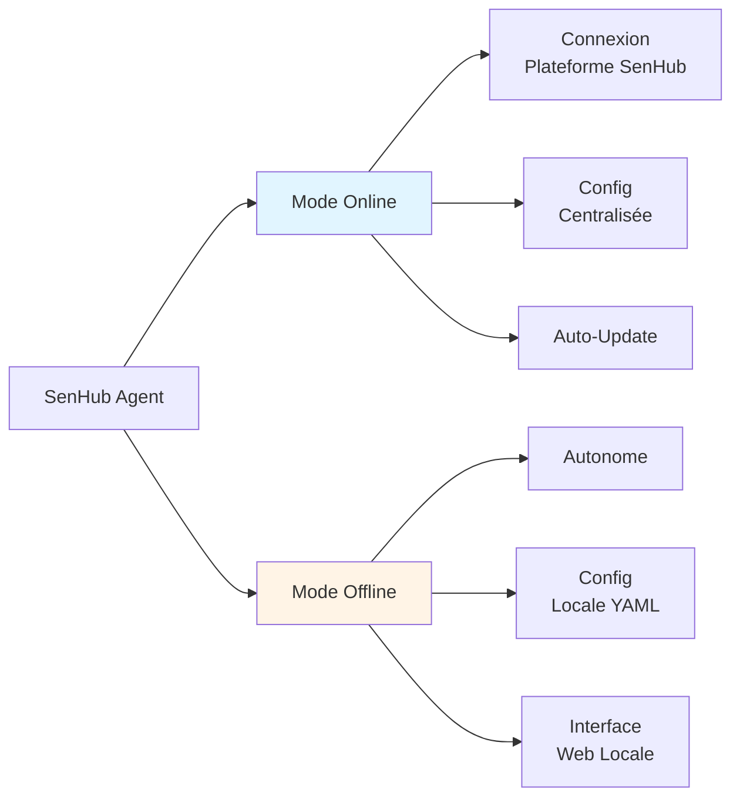

# SenHub Agent - Guide d'Installation

## Table des Matières

- [Prérequis Système](#prérequis-système)
- [Modes de Déploiement](#modes-de-déploiement)
- [Installation Windows](#installation-windows)
- [Installation Linux](#installation-linux)
- [Installation macOS](#installation-macos)
- [Options d'Installation](#options-dinstallation)
- [Vérification de l'Installation](#vérification-de-linstallation)
- [Désinstallation](#désinstallation)

---

## Prérequis Système

### Systèmes d'Exploitation Supportés

| Plateforme | Versions Supportées | Architecture |
|------------|---------------------|--------------|
| **Windows** | Windows Server 2012+ / Windows 10+ | x64 |
| **Linux** | Ubuntu 18.04+, RHEL 7+, CentOS 7+, Debian 10+ | x64, ARM64 |
| **macOS** | macOS 10.13+ (High Sierra et supérieurs) | x64, ARM64 (M1/M2) |

### Ressources Minimales

| Ressource | Minimum | Recommandé |
|-----------|---------|------------|
| **CPU** | 1 core | 2 cores |
| **RAM** | 256 MB | 512 MB |
| **Disque** | 100 MB | 500 MB |
| **Réseau** | - | 1 Mbps (mode online) |

> **Note**: Les ressources varient selon le nombre de probes actives et la fréquence de collecte.

### Ports Réseau Requis

| Port | Protocole | Usage | Mode |
|------|-----------|-------|------|
| **8080** | HTTP | Interface web, API (défaut) | Offline |
| **8443** | HTTPS | Interface web, API sécurisée | Offline (HTTPS) |
| **443** | HTTPS | Communication plateforme SenHub | Online |
| **514** | UDP/TCP | Réception syslog (si probe syslog) | Optionnel |

### Permissions Nécessaires

- **Windows**: Administrateur (installation service)
- **Linux**: root ou sudo (installation service systemd)
- **macOS**: root ou sudo (installation LaunchDaemon)

> **💡 Astuce**: L'agent peut aussi être lancé manuellement sans privilèges élevés (mode console uniquement).

---

## Modes de Déploiement

L'agent SenHub supporte deux modes de fonctionnement :



| Aspect | Mode Online | Mode Offline |
|--------|-------------|--------------|
| **Connexion externe** | ✅ Requise | ❌ Aucune |
| **Configuration** | Serveur centralisé | Fichier local `agent-config.yaml` |
| **Agent Key** | Fournie par plateforme | Générée localement (UUID) |
| **Interface web** | Optionnelle | Obligatoire (principal accès) |
| **Cas d'usage** | Monitoring centralisé | Air-gap, edge, développement |

> **📖 Documentation détaillée**: Voir [OPERATING-MODES.md](./OPERATING-MODES.md)

---

## Installation Windows

### Méthode 1 : Installation en tant que Service (Recommandée)

#### Mode Online

```powershell
# Télécharger le binaire depuis https://github.com/senhub-io/senhub-agent/releases
# Exemple : senhub-agent_windows_amd64.exe

# Ouvrir PowerShell en Administrateur
cd C:\Program Files\SenHub

# Installer le service avec clé d'authentification
.\senhub-agent_windows_amd64.exe install --authentication-key "YOUR_PLATFORM_KEY"

# Démarrer le service
.\senhub-agent_windows_amd64.exe start

# Vérifier le statut
.\senhub-agent_windows_amd64.exe status
```

**📸 SCREENSHOT À INSÉRER**: PowerShell avec sortie de `senhub-agent install` montrant "Service installed successfully"

#### Mode Offline (HTTP)

```powershell
# Installation offline basique (HTTP sur localhost:8080)
.\senhub-agent_windows_amd64.exe install --offline

# Démarrer le service
.\senhub-agent_windows_amd64.exe start
```

**Accès**: `http://localhost:8080/web/{agentkey}/dashboard`

> **🔑 Note**: La clé agent (UUID) est affichée lors de l'installation. Notez-la pour accéder à l'interface web.

#### Mode Offline (HTTPS)

```powershell
# Installation offline avec HTTPS (certificats auto-générés)
.\senhub-agent_windows_amd64.exe install --offline --enable-https

# Démarrer le service
.\senhub-agent_windows_amd64.exe start
```

**Accès**: `https://localhost:8443/web/{agentkey}/dashboard`

**Certificats générés**: `C:\Program Files\SenHub\certs\`
- `agent-cert.pem` (certificat)
- `agent-key.pem` (clé privée)

**📸 SCREENSHOT À INSÉRER**: Explorateur Windows montrant le dossier `certs/` avec les fichiers générés

### Méthode 2 : Installation MSI (À venir)

> **🚧 En développement**: Package MSI pour installation graphique

### Configuration du Firewall Windows

```powershell
# Autoriser le port 8080 (HTTP)
New-NetFirewallRule -DisplayName "SenHub Agent HTTP" -Direction Inbound -Protocol TCP -LocalPort 8080 -Action Allow

# Autoriser le port 8443 (HTTPS)
New-NetFirewallRule -DisplayName "SenHub Agent HTTPS" -Direction Inbound -Protocol TCP -LocalPort 8443 -Action Allow
```

### Fichiers et Dossiers Windows

```
C:\Program Files\SenHub\
├── senhub-agent_windows_amd64.exe    # Binaire
├── agent-config.yaml                 # Configuration
└── certs\                            # Certificats (si HTTPS)
    ├── agent-cert.pem
    └── agent-key.pem

C:\ProgramData\SenHub\Logs\
└── agent.log                         # Logs
```

---

## Installation Linux

### Méthode 1 : Installation via Package (.deb)

#### Ubuntu / Debian

```bash
# Télécharger le package .deb
wget https://github.com/senhub-io/senhub-agent/releases/download/v0.1.80-beta/senhub-agent_linux_amd64.deb

# Installer
sudo dpkg -i senhub-agent_linux_amd64.deb

# Si dépendances manquantes
sudo apt-get install -f

# Configurer (mode offline HTTPS)
sudo /usr/local/bin/senhub-agent install --offline --enable-https

# Activer et démarrer le service
sudo systemctl enable senhub-agent
sudo systemctl start senhub-agent

# Vérifier le statut
sudo systemctl status senhub-agent
```

**📸 SCREENSHOT À INSÉRER**: Terminal avec sortie de `systemctl status senhub-agent` montrant "active (running)"

#### RHEL / CentOS / Rocky Linux

```bash
# Télécharger le package .rpm
wget https://github.com/senhub-io/senhub-agent/releases/download/v0.1.80-beta/senhub-agent_linux_amd64.rpm

# Installer
sudo rpm -i senhub-agent_linux_amd64.rpm

# Ou avec yum/dnf
sudo yum install ./senhub-agent_linux_amd64.rpm

# Configurer et démarrer
sudo /usr/local/bin/senhub-agent install --offline --enable-https
sudo systemctl enable senhub-agent
sudo systemctl start senhub-agent
```

### Méthode 2 : Installation Manuelle (Binaire)

```bash
# Télécharger le binaire
wget https://github.com/senhub-io/senhub-agent/releases/download/v0.1.80-beta/senhub-agent_linux_amd64

# Rendre exécutable
chmod +x senhub-agent_linux_amd64

# Déplacer vers /usr/local/bin
sudo mv senhub-agent_linux_amd64 /usr/local/bin/senhub-agent

# Installer le service
sudo senhub-agent install --offline --enable-https

# Démarrer
sudo systemctl start senhub-agent
```

### Configuration Systemd

Le service systemd est automatiquement créé dans `/etc/systemd/system/senhub-agent.service`

```ini
[Unit]
Description=SenHub Agent
After=network.target

[Service]
Type=simple
ExecStart=/usr/local/bin/senhub-agent run --offline
Restart=on-failure
RestartSec=10s

[Install]
WantedBy=multi-user.target
```

### Configuration Firewall Linux

#### UFW (Ubuntu)

```bash
sudo ufw allow 8080/tcp comment 'SenHub Agent HTTP'
sudo ufw allow 8443/tcp comment 'SenHub Agent HTTPS'
sudo ufw reload
```

#### firewalld (RHEL/CentOS)

```bash
sudo firewall-cmd --permanent --add-port=8080/tcp
sudo firewall-cmd --permanent --add-port=8443/tcp
sudo firewall-cmd --reload
```

### Fichiers et Dossiers Linux

```
/usr/local/bin/
└── senhub-agent                      # Binaire

/etc/senhub-agent/
└── agent-config.yaml                 # Configuration (optionnel)

/var/lib/senhub-agent/
└── certs/                            # Certificats (si HTTPS)
    ├── agent-cert.pem
    └── agent-key.pem

/var/log/senhub-agent/
└── agent.log                         # Logs
```

---

## Installation macOS

### Installation Manuelle

```bash
# Télécharger le binaire (Intel x64)
curl -LO https://github.com/senhub-io/senhub-agent/releases/download/v0.1.80-beta/senhub-agent_darwin_amd64

# Ou pour Apple Silicon (M1/M2)
curl -LO https://github.com/senhub-io/senhub-agent/releases/download/v0.1.80-beta/senhub-agent_darwin_arm64

# Rendre exécutable
chmod +x senhub-agent_darwin_amd64

# Déplacer vers /usr/local/bin
sudo mv senhub-agent_darwin_amd64 /usr/local/bin/senhub-agent

# Installer le service (LaunchDaemon)
sudo senhub-agent install --offline --enable-https

# Démarrer le service
sudo launchctl load /Library/LaunchDaemons/io.senhub.agent.plist

# Vérifier
sudo launchctl list | grep senhub
```

**📸 SCREENSHOT À INSÉRER**: Terminal macOS avec sortie de `launchctl list | grep senhub`

### Configuration LaunchDaemon

Le fichier est créé dans `/Library/LaunchDaemons/io.senhub.agent.plist`

```xml
<?xml version="1.0" encoding="UTF-8"?>
<!DOCTYPE plist PUBLIC "-//Apple//DTD PLIST 1.0//EN" "http://www.apple.com/DTDs/PropertyList-1.0.dtd">
<plist version="1.0">
<dict>
    <key>Label</key>
    <string>io.senhub.agent</string>
    <key>ProgramArguments</key>
    <array>
        <string>/usr/local/bin/senhub-agent</string>
        <string>run</string>
        <string>--offline</string>
    </array>
    <key>RunAtLoad</key>
    <true/>
    <key>KeepAlive</key>
    <true/>
</dict>
</plist>
```

### Sécurité macOS

Lors de la première exécution, macOS peut bloquer le binaire :

```bash
# Autoriser l'exécution
sudo xattr -d com.apple.quarantine /usr/local/bin/senhub-agent

# Ou via Préférences Système > Sécurité > Autoriser
```

**📸 SCREENSHOT À INSÉRER**: Dialogue macOS "L'application ne peut pas être ouverte" avec bouton "Ouvrir quand même"

### Fichiers et Dossiers macOS

```
/usr/local/bin/
└── senhub-agent                      # Binaire

/usr/local/etc/senhub-agent/
└── agent-config.yaml                 # Configuration

/usr/local/var/senhub-agent/
└── certs/                            # Certificats (si HTTPS)
    ├── agent-cert.pem
    └── agent-key.pem

/Library/Logs/SenHub/
└── agent.log                         # Logs
```

---

## Options d'Installation

### Options Communes (Toutes Plateformes)

| Option | Description | Valeur par Défaut | Exemple |
|--------|-------------|-------------------|---------|
| `--authentication-key KEY` | Mode online avec clé plateforme | - | `--authentication-key "abc123..."` |
| `--offline` | Mode offline autonome | `false` | `--offline` |
| `--config-path PATH` | Chemin du fichier de configuration | `./agent-config.yaml` | `--config-path /etc/agent/config.yaml` |
| `--verbose` | Active tous les logs debug | `false` | `--verbose` |
| `--debug-modules MODULES` | Logs debug pour modules spécifiques | - | `--debug-modules "probe.cpu,strategy.http"` |

### Options HTTPS/TLS

| Option | Description | Valeur par Défaut | Exemple |
|--------|-------------|-------------------|---------|
| `--enable-https` | Active HTTPS avec certificats auto-générés | `false` | `--enable-https` |
| `--https-port PORT` | Port HTTPS | `8443` | `--https-port 9443` |
| `--https-hosts HOSTS` | SANs pour certificat auto-généré | `localhost,127.0.0.1` | `--https-hosts "server.local,192.168.1.100"` |
| `--cert-file PATH` | Chemin certificat SSL personnalisé | - | `--cert-file /etc/ssl/certs/server.crt` |
| `--key-file PATH` | Chemin clé privée SSL | - | `--key-file /etc/ssl/private/server.key` |
| `--min-tls-version VER` | Version TLS minimale | `1.2` | `--min-tls-version 1.3` |

### Exemples d'Installation

#### Installation Offline Basique (HTTP, localhost uniquement)

```bash
senhub-agent install --offline
```

- Port : 8080
- Bind : 127.0.0.1 (localhost)
- Protocole : HTTP
- Accès : `http://localhost:8080/web/{key}/dashboard`

#### Installation Offline Production (HTTPS, tous réseaux)

```bash
senhub-agent install --offline --enable-https \
  --https-hosts "monitoring.company.com,192.168.1.100"
```

- Port : 8443
- Bind : 0.0.0.0 (tous réseaux)
- Protocole : HTTPS
- Certificat : Auto-généré avec SANs
- Accès : `https://monitoring.company.com:8443/web/{key}/dashboard`

#### Installation Offline avec Certificat Let's Encrypt

```bash
senhub-agent install --offline --enable-https \
  --cert-file /etc/letsencrypt/live/monitoring.company.com/fullchain.pem \
  --key-file /etc/letsencrypt/live/monitoring.company.com/privkey.pem
```

#### Installation Online avec Auto-Update

```bash
senhub-agent install --authentication-key "YOUR_PLATFORM_KEY"
```

- Configuration téléchargée depuis la plateforme
- Auto-update activé
- Métriques envoyées à SenHub

---

## Vérification de l'Installation

### 1. Vérifier le Service

**Windows**
```powershell
# Vérifier le statut du service
sc query "SenHub Agent"

# Ou via l'agent
.\senhub-agent.exe status
```

**Linux/macOS**
```bash
# Systemd (Linux)
sudo systemctl status senhub-agent

# LaunchDaemon (macOS)
sudo launchctl list | grep senhub

# Ou via l'agent
sudo senhub-agent status
```

**📸 SCREENSHOT À INSÉRER**: Commande `systemctl status senhub-agent` avec statut "active (running)" en vert

### 2. Vérifier les Logs de Démarrage

**Windows**
```powershell
Get-Content C:\ProgramData\SenHub\Logs\agent.log -Tail 20
```

**Linux**
```bash
sudo tail -20 /var/log/senhub-agent/agent.log
```

**macOS**
```bash
sudo tail -20 /Library/Logs/SenHub/agent.log
```

**Logs attendus (démarrage réussi)**
```
2025-12-18T10:00:00Z INF Agent started version=0.1.80-beta module=agent.core
2025-12-18T10:00:00Z INF Running in offline mode module=configuration.local
2025-12-18T10:00:01Z INF HTTP server started port=8443 tls=true module=strategy.http
2025-12-18T10:00:01Z INF Probe started probe=cpu interval=30s module=probe.cpu
2025-12-18T10:00:01Z INF Probe started probe=memory interval=30s module=probe.memory
```

### 3. Accès à l'Interface Web

**Récupérer la clé agent**

Mode Offline (UUID affiché lors de l'installation) :
```bash
# La clé est dans la configuration
cat /etc/senhub-agent/agent-config.yaml | grep "key:"
```

**Tester l'accès**

```bash
# HTTP (offline basique)
curl http://localhost:8080/api/{AGENT_KEY}/info/system

# HTTPS (offline sécurisé)
curl -k https://localhost:8443/api/{AGENT_KEY}/info/system
```

**Réponse attendue**
```json
{
  "status": "running",
  "version": "0.1.80-beta",
  "port": 8443,
  "uptime": "2m 15s",
  "health": {
    "services": {
      "http_server": "healthy",
      "cache": "healthy"
    }
  }
}
```

**📸 SCREENSHOT À INSÉRER**: Navigateur web affichant le dashboard avec métriques CPU/Memory/Disk/Network

### 4. Vérifier les Probes Actives

```bash
curl http://localhost:8080/api/{AGENT_KEY}/info/probes
```

**Réponse attendue**
```json
{
  "probes": ["cpu", "memory", "logicaldisk", "network"],
  "probe_metrics": {
    "cpu": 12,
    "memory": 8,
    "logicaldisk": 15,
    "network": 24
  }
}
```

### Checklist de Vérification

- [ ] Service démarré et actif
- [ ] Logs sans erreurs critiques
- [ ] Interface web accessible (HTTP ou HTTPS)
- [ ] API répond correctement (`/info/system`)
- [ ] Probes collectent des métriques (`/info/probes`)
- [ ] Dashboard affiche les métriques en temps réel

---

## Désinstallation

### Désinstallation Standard

**Windows**
```powershell
# Arrêter le service
.\senhub-agent.exe stop

# Désinstaller
.\senhub-agent.exe uninstall

# Supprimer les fichiers manuellement
Remove-Item -Recurse "C:\Program Files\SenHub"
Remove-Item -Recurse "C:\ProgramData\SenHub"
```

**Linux**
```bash
# Arrêter le service
sudo systemctl stop senhub-agent

# Désinstaller
sudo senhub-agent uninstall

# Supprimer le package (si installé via .deb/.rpm)
sudo apt remove senhub-agent  # Ubuntu/Debian
sudo yum remove senhub-agent  # RHEL/CentOS

# Supprimer les fichiers
sudo rm -rf /usr/local/bin/senhub-agent
sudo rm -rf /var/log/senhub-agent
sudo rm -rf /etc/senhub-agent
```

**macOS**
```bash
# Arrêter le service
sudo launchctl unload /Library/LaunchDaemons/io.senhub.agent.plist

# Désinstaller
sudo senhub-agent uninstall

# Supprimer les fichiers
sudo rm -rf /usr/local/bin/senhub-agent
sudo rm -rf /Library/Logs/SenHub
sudo rm -rf /usr/local/etc/senhub-agent
```

### Désinstallation Complète (Purge)

Supprime également la configuration et les certificats :

```bash
# Toutes plateformes
sudo senhub-agent uninstall --purge
```

**Fichiers supprimés avec --purge**
- Configuration (`agent-config.yaml`)
- Certificats SSL (`certs/`)
- Logs (`agent.log`)
- Cache local

---

## Dépannage Installation

### Problème : Service ne démarre pas

**Vérifier les logs**
```bash
# Linux
sudo journalctl -u senhub-agent -n 50

# macOS
sudo tail -50 /Library/Logs/SenHub/agent.log

# Windows
Get-Content C:\ProgramData\SenHub\Logs\agent.log -Tail 50
```

**Erreurs communes**
- Port déjà utilisé (8080 ou 8443)
- Permissions insuffisantes
- Configuration invalide

### Problème : Port déjà utilisé

```bash
# Vérifier quel processus utilise le port
sudo lsof -i :8080  # Linux/macOS
netstat -ano | findstr :8080  # Windows

# Solution : Utiliser un port différent
senhub-agent install --offline --enable-https --https-port 9443
```

### Problème : Certificats HTTPS invalides

```bash
# Régénérer les certificats
sudo senhub-agent stop
sudo rm -rf ./certs/
sudo senhub-agent install --offline --enable-https --https-hosts "..."
sudo senhub-agent start
```

### Support

- Documentation : https://github.com/senhub-io/senhub-agent/docs
- Issues : https://github.com/senhub-io/senhub-agent/issues
- Contact : support@senhub.io

---

**Prochaines étapes** : Voir [OPERATING-MODES.md](./OPERATING-MODES.md) pour comprendre les différences entre mode online et offline, puis [AGENT-CONFIGURATION.md](./AGENT-CONFIGURATION.md) pour configurer l'agent.
