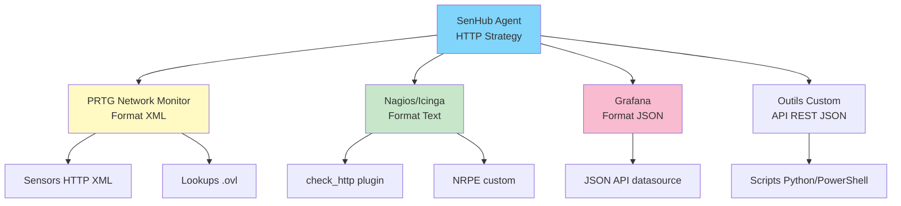
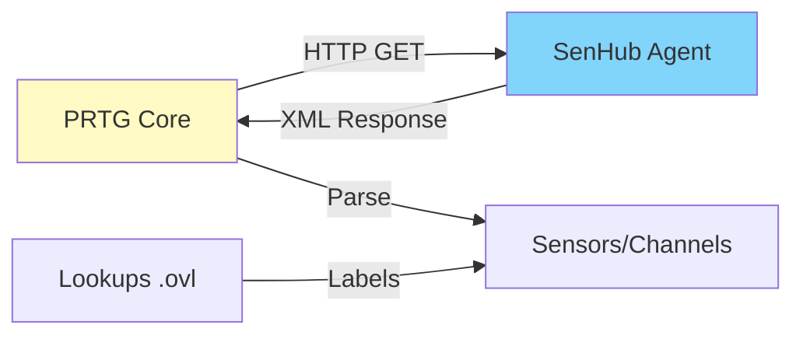
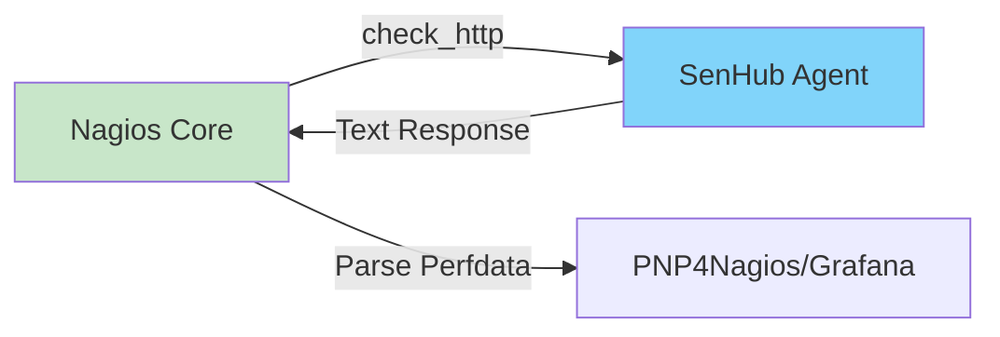
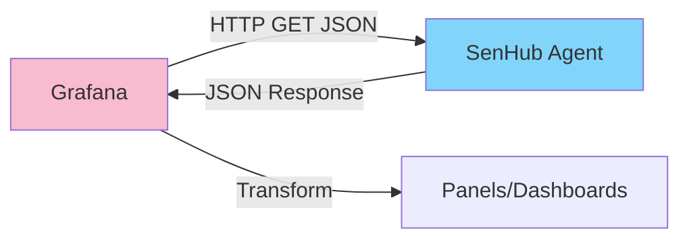
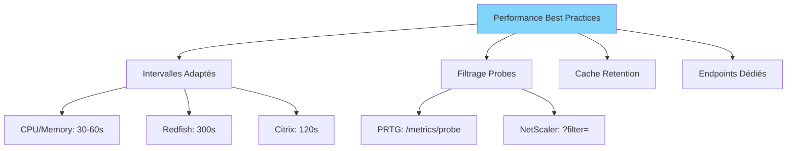

# SenHub Agent - Utilisation des Métriques

## Table des Matières

- [Vue d'Ensemble](#vue-densemble)
- [Intégration PRTG](#intégration-prtg)
- [Intégration Nagios](#intégration-nagios)
- [Intégration Grafana](#intégration-grafana)
- [API REST Custom](#api-rest-custom)
- [Exemples par Probe](#exemples-par-probe)
- [Best Practices](#best-practices)
- [Troubleshooting](#troubleshooting)

---

## Vue d'Ensemble

SenHub Agent expose les métriques collectées via plusieurs formats adaptés aux outils de monitoring populaires.



### Formats Disponibles

| Format | Endpoint | Outil Cible | Description |
|--------|----------|-------------|-------------|
| **PRTG XML** | `/api/{key}/prtg/metrics` | PRTG | Format XML natif PRTG |
| **Nagios Text** | `/api/{key}/nagios/status` | Nagios/Icinga | Format text performance data |
| **JSON** | `/api/{key}/metrics` | Grafana/Custom | Format JSON structuré |
| **Lookups** | `/api/{key}/prtg/lookups/download` | PRTG | Fichiers .ovl pour labels |

---

## Intégration PRTG

PRTG Network Monitor peut consommer les métriques SenHub Agent via des sensors HTTP XML/REST.



### Configuration Sensor PRTG

#### Sensor Type: HTTP XML/REST Value

**Étapes** :

1. **Ajouter un Device dans PRTG**
   - IP/Hostname : `monitoring.company.com` (ou IP)
   - Port : Laisser vide (géré par URL)

2. **Ajouter un Sensor**
   - Type : **HTTP XML/REST Value Sensor**
   - Name : `SenHub Agent - CPU Metrics`

3. **Configuration du Sensor**

**Basic Settings** :
```
Sensor Name: SenHub Agent - CPU Metrics
Tags: senhub, system, cpu
Priority: 3 stars
```

**HTTP Specific** :
```
REST Configuration:
  URL: https://monitoring.company.com:8443/api/f47ac10b-58cc-4372-a567-0e02b2c3d479/prtg/metrics/cpu

Port: [empty - included in URL]
Method: GET
Request Headers: [empty]
Authentication: None (key in URL)
Timeout (Sec): 60
```

**REST Configuration** :
```
REST Query: [empty]
Content Type: [empty - auto-detect XML]
```

**Scanning Interval** :
```
Scanning Interval: 60 seconds
```

**📸 SCREENSHOT À INSÉRER** : Configuration PRTG sensor montrant les champs URL et REST Configuration

---

#### URLs par Probe

**Probes Système (Free)** :
```
CPU:
https://monitoring.company.com:8443/api/{key}/prtg/metrics/cpu

Memory:
https://monitoring.company.com:8443/api/{key}/prtg/metrics/memory

Logical Disk:
https://monitoring.company.com:8443/api/{key}/prtg/metrics/logicaldisk

Network:
https://monitoring.company.com:8443/api/{key}/prtg/metrics/network
```

**Probes Infrastructure (Pro/Enterprise)** :
```
Redfish:
https://monitoring.company.com:8443/api/{key}/prtg/metrics/redfish

Citrix:
https://monitoring.company.com:8443/api/{key}/prtg/metrics/citrix

NetScaler:
https://monitoring.company.com:8443/api/{key}/prtg/metrics/netscaler

Syslog:
https://monitoring.company.com:8443/api/{key}/prtg/metrics/syslog
```

---

### Exemple: Sensor CPU complet

**Résultat PRTG après configuration** :

```
Sensor: SenHub Agent - CPU Metrics
Status: Up (100%)
Last Scan: 30 seconds ago

Channels:
├─ CPU Usage Total: 45.2% [OK]
├─ CPU User: 32.1% [OK]
├─ CPU System: 13.1% [OK]
├─ CPU Load 1min: 1.23 [OK]
├─ CPU Load 5min: 1.45 [OK]
├─ CPU Load 15min: 1.67 [OK]
├─ CPU Core 0 Usage: 48.3% [OK]
├─ CPU Core 1 Usage: 42.1% [OK]
└─ ... (tous les cores)
```

**Limites configurables** :
- Warning : 80%
- Error : 95%

**📸 SCREENSHOT À INSÉRER** : PRTG sensor affichant tous les channels CPU avec graphiques

---

### Installation des Lookups PRTG

Les lookups permettent d'afficher des labels texte au lieu de codes numériques pour NetScaler.

**Étape 1 : Télécharger les lookups**

Via l'interface web SenHub Agent :
```
Dashboard → API Explorer → PRTG Lookups → Download
```

Ou directement :
```
https://monitoring.company.com:8443/api/{key}/prtg/lookups/download
```

**Étape 2 : Extraire le ZIP**

Contenu :
```
senhub-lookups.zip
├─ netscaler.metric_type.ovl
├─ netscaler.metric_view.ovl
└─ README.txt
```

**Étape 3 : Copier dans PRTG**

```powershell
# Windows - PRTG Server
Copy-Item *.ovl "C:\Program Files (x86)\PRTG Network Monitor\lookups\custom\"
```

**Étape 4 : Recharger les lookups**

Dans PRTG :
```
Setup → Administrative Tools → Load Lookups and File Lists
```

**Vérification** :
- Sensors NetScaler affichent maintenant "Rate" au lieu de "0"
- Labels "Load Balancing", "SSL", "System" au lieu de codes

**📸 SCREENSHOT À INSÉRER** : Avant/après installation lookups (codes vs labels texte)

---

### Sensor NetScaler avec Filtrage

**Créer plusieurs sensors filtrés** :

**Sensor 1 : Load Balancing uniquement**
```
Name: NetScaler - Load Balancing
URL: https://monitoring.company.com:8443/api/{key}/prtg/metrics/netscaler?filter=metric_view:load_balancing
```

**Sensor 2 : SSL Monitoring**
```
Name: NetScaler - SSL Metrics
URL: https://monitoring.company.com:8443/api/{key}/prtg/metrics/netscaler?filter=metric_view:ssl
```

**Sensor 3 : Virtual Server spécifique**
```
Name: NetScaler - Web vServer
URL: https://monitoring.company.com:8443/api/{key}/prtg/metrics/netscaler?filter=vserver_name:Web-vServer
```

**Avantages** :
- Sensors plus légers (moins de channels)
- Organisation claire par fonction
- Alertes ciblées

---

### Multi-Instance avec PRTG

**Scénario** : Plusieurs serveurs avec SenHub Agent

```
Device: PROD-SERVER-01 (192.168.1.10:8443)
├─ Sensor: CPU Metrics
│  URL: https://192.168.1.10:8443/api/{key-01}/prtg/metrics/cpu
├─ Sensor: Memory Metrics
│  URL: https://192.168.1.10:8443/api/{key-01}/prtg/metrics/memory
└─ Sensor: Redfish Hardware
   URL: https://192.168.1.10:8443/api/{key-01}/prtg/metrics/redfish

Device: PROD-SERVER-02 (192.168.1.11:8443)
├─ Sensor: CPU Metrics
│  URL: https://192.168.1.11:8443/api/{key-02}/prtg/metrics/cpu
└─ ...
```

**📸 SCREENSHOT À INSÉRER** : PRTG tree view avec plusieurs devices SenHub Agent

---

## Intégration Nagios

Nagios/Icinga peut monitorer SenHub Agent via le plugin `check_http`.



### Configuration Nagios Check

#### Command Definition

**`/etc/nagios/objects/commands.cfg`** :

```cfg
define command {
    command_name    check_senhub_metrics
    command_line    $USER1$/check_http -H $ARG1$ -p $ARG2$ -S \
                    -u /api/$ARG3$/nagios/status \
                    -s "OK" \
                    -w 5 -c 10
}
```

**Paramètres** :
- `-H $ARG1$` : Hostname/IP
- `-p $ARG2$` : Port (8443)
- `-S` : Use HTTPS
- `-u /api/$ARG3$/nagios/status` : URL endpoint
- `-s "OK"` : String to expect
- `-w 5 -c 10` : Timeout warning/critical (secondes)

---

#### Service Definition

**`/etc/nagios/objects/services.cfg`** :

```cfg
define service {
    use                     generic-service
    host_name               PROD-SERVER-01
    service_description     SenHub Agent - System Metrics
    check_command           check_senhub_metrics!monitoring.company.com!8443!f47ac10b-58cc-4372-a567-0e02b2c3d479
    check_interval          5
    retry_interval          1
}
```

**Résultat Nagios** :
```
OK - CPU: 45.2% | cpu_usage=45.2%;80;95;0;100 memory_usage=67.8%;80;95;0;100
```

**Performance Data** :
```
cpu_usage=45.2%;80;95;0;100
memory_usage=67.8%;80;95;0;100
disk_c_usage=35.4%;80;95;0;100
network_eth0_bytes_sent=1234567
```

**📸 SCREENSHOT À INSÉRER** : Nagios service status montrant SenHub checks avec performance data

---

### Check avancé par Probe

**Définir des checks séparés** :

```cfg
# CPU Check
define service {
    host_name               PROD-SERVER-01
    service_description     SenHub - CPU
    check_command           check_senhub_metrics!monitoring.company.com!8443!{key}
    check_interval          1
}

# Memory Check
define service {
    host_name               PROD-SERVER-01
    service_description     SenHub - Memory
    check_command           check_senhub_metrics!monitoring.company.com!8443!{key}
    check_interval          1
}

# Redfish Check
define service {
    host_name               PROD-SERVER-01
    service_description     SenHub - Hardware (Redfish)
    check_command           check_senhub_metrics!monitoring.company.com!8443!{key}
    check_interval          5
}
```

**Note** : Actuellement l'endpoint `/nagios/status` retourne toutes les métriques. Filtrage par probe à venir dans version future.

---

### NRPE Custom Script

Pour plus de flexibilité, créer un script NRPE custom.

**`/usr/lib/nagios/plugins/check_senhub_custom.sh`** :

```bash
#!/bin/bash

HOST=$1
PORT=$2
KEY=$3
PROBE=$4

URL="https://${HOST}:${PORT}/api/${KEY}/metrics?probe=${PROBE}"

# Récupérer métriques JSON
RESPONSE=$(curl -s -k "$URL")

# Parser avec jq
CPU_USAGE=$(echo "$RESPONSE" | jq -r '.metrics[] | select(.name=="cpu_usage_total") | .value')

# Appliquer seuils
if (( $(echo "$CPU_USAGE > 95" | bc -l) )); then
    echo "CRITICAL - CPU: ${CPU_USAGE}% | cpu_usage=${CPU_USAGE};80;95;0;100"
    exit 2
elif (( $(echo "$CPU_USAGE > 80" | bc -l) )); then
    echo "WARNING - CPU: ${CPU_USAGE}% | cpu_usage=${CPU_USAGE};80;95;0;100"
    exit 1
else
    echo "OK - CPU: ${CPU_USAGE}% | cpu_usage=${CPU_USAGE};80;95;0;100"
    exit 0
fi
```

**Rendre exécutable** :
```bash
chmod +x /usr/lib/nagios/plugins/check_senhub_custom.sh
```

**Command definition** :
```cfg
define command {
    command_name    check_senhub_custom
    command_line    $USER1$/check_senhub_custom.sh $ARG1$ $ARG2$ $ARG3$ $ARG4$
}
```

**Service** :
```cfg
define service {
    host_name               PROD-SERVER-01
    service_description     SenHub - CPU Custom
    check_command           check_senhub_custom!monitoring.company.com!8443!{key}!cpu
}
```

---

## Intégration Grafana

Grafana peut consommer les métriques SenHub Agent via le plugin JSON API datasource.



### Installation Plugin JSON API

```bash
grafana-cli plugins install simpod-json-datasource
systemctl restart grafana-server
```

### Configuration Datasource

**Grafana UI** :

1. **Configuration → Data Sources → Add data source**
2. **Type** : JSON API
3. **Settings** :

```
Name: SenHub Agent - PROD-SERVER-01
URL: https://monitoring.company.com:8443
```

4. **Custom HTTP Headers** :
```
Header: X-API-Key
Value: f47ac10b-58cc-4372-a567-0e02b2c3d479
```

5. **TLS Settings** :
```
Skip TLS Verify: ☑ (si certificat auto-signé)
```

6. **Save & Test**

**📸 SCREENSHOT À INSÉRER** : Grafana datasource configuration pour SenHub Agent

---

### Créer un Dashboard

**Panel 1 : CPU Usage**

```json
{
  "title": "CPU Usage",
  "type": "graph",
  "datasource": "SenHub Agent - PROD-SERVER-01",
  "targets": [
    {
      "target": "cpu_usage_total",
      "refId": "A",
      "type": "timeserie",
      "data": {
        "url": "/api/f47ac10b-58cc-4372-a567-0e02b2c3d479/metrics?probe=cpu"
      }
    }
  ]
}
```

**Panel 2 : Memory Usage**

```json
{
  "title": "Memory Usage",
  "type": "gauge",
  "datasource": "SenHub Agent - PROD-SERVER-01",
  "targets": [
    {
      "target": "memory_usage_percent",
      "data": {
        "url": "/api/{key}/metrics?probe=memory"
      }
    }
  ],
  "options": {
    "min": 0,
    "max": 100,
    "thresholds": {
      "mode": "absolute",
      "steps": [
        { "value": 0, "color": "green" },
        { "value": 80, "color": "yellow" },
        { "value": 95, "color": "red" }
      ]
    }
  }
}
```

**📸 SCREENSHOT À INSÉRER** : Dashboard Grafana avec panels CPU, Memory, Network

---

### Transformation Grafana

**Transformer JSON → Time Series** :

Les métriques SenHub sont exposées avec timestamp. Grafana peut les transformer directement.

**Exemple de réponse JSON** :
```json
{
  "metrics": [
    {
      "name": "cpu_usage_total",
      "value": 45.2,
      "unit": "percent",
      "timestamp": "2025-01-15T10:30:45Z"
    }
  ]
}
```

**Grafana Query** :
```
Metric: cpu_usage_total
JSONPath: $.metrics[?(@.name=='cpu_usage_total')].value
```

---

### Dashboard Multi-Server

**Variables Grafana** :

```
Variable: server
Type: Custom
Values: server01, server02, server03

Variable: probe
Type: Custom
Values: cpu, memory, logicaldisk, redfish
```

**Query dynamique** :
```
URL: https://$server.company.com:8443/api/{key}/metrics?probe=$probe
```

**Résultat** :
- Dropdown pour sélectionner serveur
- Dropdown pour sélectionner probe
- Panels se mettent à jour automatiquement

**📸 SCREENSHOT À INSÉRER** : Dashboard Grafana avec variables et multi-panels

---

## API REST Custom

Pour des intégrations custom (scripts, outils maison), utiliser l'API REST JSON.

### Exemples Python

**Script 1 : Récupérer toutes les métriques**

```python
#!/usr/bin/env python3
import requests
import json

AGENT_URL = "https://monitoring.company.com:8443"
API_KEY = "f47ac10b-58cc-4372-a567-0e02b2c3d479"

def get_all_metrics():
    url = f"{AGENT_URL}/api/{API_KEY}/metrics"
    response = requests.get(url, verify=False)  # verify=True en prod

    if response.status_code == 200:
        data = response.json()
        print(json.dumps(data, indent=2))
        return data
    else:
        print(f"Error: {response.status_code}")
        return None

if __name__ == "__main__":
    metrics = get_all_metrics()
```

---

**Script 2 : Alerting custom**

```python
#!/usr/bin/env python3
import requests
import smtplib
from email.mime.text import MIMEText

AGENT_URL = "https://monitoring.company.com:8443"
API_KEY = "f47ac10b-58cc-4372-a567-0e02b2c3d479"
CPU_THRESHOLD = 80.0
MEMORY_THRESHOLD = 90.0

def check_metrics():
    url = f"{AGENT_URL}/api/{API_KEY}/metrics?probe=cpu,memory"
    response = requests.get(url, verify=False)

    if response.status_code != 200:
        send_alert("Agent unreachable", f"HTTP {response.status_code}")
        return

    data = response.json()

    for metric in data.get("metrics", []):
        name = metric.get("name")
        value = metric.get("value")

        if name == "cpu_usage_total" and value > CPU_THRESHOLD:
            send_alert(
                f"CPU High: {value}%",
                f"CPU usage exceeded threshold ({CPU_THRESHOLD}%)"
            )

        if name == "memory_usage_percent" and value > MEMORY_THRESHOLD:
            send_alert(
                f"Memory High: {value}%",
                f"Memory usage exceeded threshold ({MEMORY_THRESHOLD}%)"
            )

def send_alert(subject, body):
    msg = MIMEText(body)
    msg["Subject"] = f"[SenHub Alert] {subject}"
    msg["From"] = "monitoring@company.com"
    msg["To"] = "admin@company.com"

    smtp = smtplib.SMTP("localhost")
    smtp.send_message(msg)
    smtp.quit()

    print(f"Alert sent: {subject}")

if __name__ == "__main__":
    check_metrics()
```

**Cron** :
```bash
# Vérifier toutes les 5 minutes
*/5 * * * * /usr/local/bin/check_senhub_alerts.py
```

---

**Script 3 : Export CSV**

```python
#!/usr/bin/env python3
import requests
import csv
from datetime import datetime

AGENT_URL = "https://monitoring.company.com:8443"
API_KEY = "f47ac10b-58cc-4372-a567-0e02b2c3d479"

def export_metrics_csv(probe, output_file):
    url = f"{AGENT_URL}/api/{API_KEY}/metrics?probe={probe}"
    response = requests.get(url, verify=False)

    if response.status_code != 200:
        print(f"Error: {response.status_code}")
        return

    data = response.json()

    with open(output_file, 'w', newline='') as csvfile:
        fieldnames = ['timestamp', 'metric_name', 'value', 'unit', 'tags']
        writer = csv.DictWriter(csvfile, fieldnames=fieldnames)

        writer.writeheader()

        for metric in data.get("metrics", []):
            writer.writerow({
                'timestamp': metric.get('timestamp', datetime.now().isoformat()),
                'metric_name': metric.get('name'),
                'value': metric.get('value'),
                'unit': metric.get('unit', ''),
                'tags': str(metric.get('tags', {}))
            })

    print(f"Exported {len(data.get('metrics', []))} metrics to {output_file}")

if __name__ == "__main__":
    export_metrics_csv("cpu", "cpu_metrics.csv")
    export_metrics_csv("redfish", "redfish_metrics.csv")
```

---

### Exemples PowerShell

**Script 1 : Récupérer métriques**

```powershell
$AgentUrl = "https://monitoring.company.com:8443"
$ApiKey = "f47ac10b-58cc-4372-a567-0e02b2c3d479"

function Get-SenHubMetrics {
    param(
        [string]$Probe = ""
    )

    $url = "$AgentUrl/api/$ApiKey/metrics"
    if ($Probe) {
        $url += "?probe=$Probe"
    }

    try {
        $response = Invoke-RestMethod -Uri $url -Method Get -SkipCertificateCheck
        return $response
    }
    catch {
        Write-Error "Failed to get metrics: $_"
        return $null
    }
}

# Usage
$metrics = Get-SenHubMetrics -Probe "cpu"
$metrics.metrics | Format-Table -Property name, value, unit
```

---

**Script 2 : Monitoring Windows Event Log**

```powershell
$AgentUrl = "https://monitoring.company.com:8443"
$ApiKey = "f47ac10b-58cc-4372-a567-0e02b2c3d479"

function Check-SenHubHealth {
    $url = "$AgentUrl/api/$ApiKey/info/system"

    try {
        $response = Invoke-RestMethod -Uri $url -Method Get -SkipCertificateCheck

        Write-EventLog -LogName Application -Source "SenHub Monitor" `
            -EntryType Information -EventId 1000 `
            -Message "SenHub Agent healthy: Version $($response.agent_version), Uptime $($response.uptime_seconds)s"

        return $true
    }
    catch {
        Write-EventLog -LogName Application -Source "SenHub Monitor" `
            -EntryType Error -EventId 1001 `
            -Message "SenHub Agent unreachable: $_"

        return $false
    }
}

# Créer event source (une fois)
New-EventLog -LogName Application -Source "SenHub Monitor" -ErrorAction SilentlyContinue

# Check
Check-SenHubHealth
```

**Scheduled Task** :
```powershell
$action = New-ScheduledTaskAction -Execute "PowerShell.exe" `
    -Argument "-File C:\Scripts\Check-SenHubHealth.ps1"

$trigger = New-ScheduledTaskTrigger -Once -At (Get-Date) `
    -RepetitionInterval (New-TimeSpan -Minutes 5)

Register-ScheduledTask -TaskName "SenHub Health Check" `
    -Action $action -Trigger $trigger -User "SYSTEM"
```

---

## Exemples par Probe

### CPU Metrics

**PRTG** :
```
URL: https://monitoring.company.com:8443/api/{key}/prtg/metrics/cpu
Interval: 60s
Channels: cpu_usage_total, cpu_load1, cpu_load5, cpu_core_*
```

**Nagios** :
```bash
check_http -H monitoring.company.com -p 8443 -S \
  -u /api/{key}/nagios/status \
  -s "OK - CPU"
```

**Grafana Panel** :
```json
{
  "title": "CPU Usage",
  "type": "timeseries",
  "targets": [
    {"metric": "cpu_usage_total"},
    {"metric": "cpu_user"},
    {"metric": "cpu_system"}
  ]
}
```

---

### Memory Metrics

**PRTG** :
```
URL: https://monitoring.company.com:8443/api/{key}/prtg/metrics/memory
Channels: memory_usage_percent, memory_available, swap_used
Limits: Warning 80%, Error 95%
```

**Grafana Gauge** :
```json
{
  "title": "Memory Usage",
  "type": "gauge",
  "options": {
    "thresholds": [
      {"value": 0, "color": "green"},
      {"value": 80, "color": "yellow"},
      {"value": 95, "color": "red"}
    ]
  }
}
```

---

### Redfish Hardware

**PRTG Multi-Sensor** :
```
Sensor 1: Temperatures
URL: .../prtg/metrics/redfish
Filter channels: *temperature*

Sensor 2: Fan Speeds
Filter channels: *fan_speed*

Sensor 3: Power
Filter channels: *power*
```

**Alertes** :
- Temperature > 75°C : Warning
- Temperature > 85°C : Critical
- Fan Speed < 30% : Warning
- Fan Speed = 0% : Critical

**📸 SCREENSHOT À INSÉRER** : PRTG sensors Redfish avec températures, ventilateurs et power

---

### Citrix VDI

**PRTG Sensors** :
```
Sensor 1: Session Metrics
URL: .../prtg/metrics/citrix
Channels: active_sessions, disconnected_sessions

Sensor 2: Logon Performance
Channels: logon_duration_seconds, logon_success_rate

Sensor 3: Server Load
Channels: server_load_percent, server_session_count
```

**Grafana Dashboard** :
```
Panel 1: Active Sessions (Time Series)
Panel 2: Logon Duration (Heatmap)
Panel 3: Server Load Distribution (Bar Gauge)
```

---

### NetScaler ADC

**PRTG avec Lookups** :
```
1. Télécharger lookups: .../prtg/lookups/download
2. Installer .ovl dans PRTG
3. Créer sensors filtrés:
   - Load Balancing: ?filter=metric_view:load_balancing
   - SSL: ?filter=metric_view:ssl
   - System: ?filter=metric_view:system
```

**Channels importants** :
- `netscaler_vserver_state` : État vServer (UP/DOWN)
- `netscaler_vserver_hits` : Nombre de hits
- `netscaler_ssl_cert_days_to_expire` : Expiration certificats
- `netscaler_cpu_usage` : CPU appliance

**Alertes critiques** :
- vServer DOWN : Immédiat
- Certificat SSL < 30 jours : Warning
- Certificat SSL < 7 jours : Critical

---

## Best Practices

### Performance



**Recommandations** :

1. **Intervalles de Scanning**
   ```
   Métriques temps réel (CPU, Memory): 30-60s
   Hardware (Redfish): 300s (5min)
   VDI/Apps (Citrix): 120s (2min)
   Network (NetScaler): 120s (2min)
   ```

2. **Filtrage PRTG**
   - ✅ Utiliser `/prtg/metrics/{probe}` au lieu de `/prtg/metrics`
   - ✅ Utiliser filtres tags pour NetScaler
   - ❌ Éviter sensor global "tout-en-un" (trop de channels)

3. **Cache Agent**
   ```yaml
   cache:
     retention_minutes: 10  # Balance fraîcheur/mémoire
   ```

4. **Timeout PRTG/Nagios**
   ```
   PRTG: 60 secondes
   Nagios: 10 secondes (warning: 5s, critical: 10s)
   ```

---

### Sécurité

**✅ Configuration Sécurisée** :

```yaml
# HTTPS obligatoire en production
storage:
  - name: http
    params:
      port: 8443
      bind_address: "192.168.1.100"
      tls:
        enabled: true
        min_tls_version: "1.2"
```

**Firewall** :
```bash
# Autoriser uniquement monitoring servers
sudo ufw allow from 192.168.1.50 to any port 8443 comment "PRTG Server"
sudo ufw allow from 192.168.1.51 to any port 8443 comment "Nagios Server"
```

**Authentication Key** :
- ✅ UUID complexe : `f47ac10b-58cc-4372-a567-0e02b2c3d479`
- ❌ Key simple : `test`, `admin`, `monitoring`

---

### Alerting

**Seuils recommandés** :

| Métrique | Warning | Critical |
|----------|---------|----------|
| CPU Usage | 80% | 95% |
| Memory Usage | 80% | 95% |
| Disk Free | 20% | 10% |
| Temperature | 75°C | 85°C |
| Fan Speed | < 30% | 0% (arrêté) |

**Escalation** :
```
1. Warning → Email équipe ops
2. Critical → Email + SMS astreinte
3. Critical > 15min → Appel téléphonique
```

---

### Documentation

**Conventions de Nommage** :

```
PRTG Sensors:
- Format: "SenHub - {Probe Type} - {Server}"
- Exemples:
  - "SenHub - CPU - PROD-SERVER-01"
  - "SenHub - Redfish Hardware - PROD-SERVER-01"
  - "SenHub - NetScaler LB - NETSCALER-PROD"

Nagios Services:
- Format: "SenHub {Probe Type}"
- Exemples:
  - "SenHub CPU"
  - "SenHub Memory"
  - "SenHub Redfish"
```

**Tags PRTG** :
```
senhub, system, cpu
senhub, system, memory
senhub, hardware, redfish
senhub, vdi, citrix
senhub, network, netscaler
```

---

## Troubleshooting

### PRTG Sensor Status "Down"

**Symptômes** :
```
Sensor: Down (0%)
Last Message: No Response (HTTP 503)
```

**Diagnostic** :
```bash
# 1. Vérifier agent accessible
curl -k https://monitoring.company.com:8443/api/{key}/info/system

# 2. Tester endpoint exact
curl -k https://monitoring.company.com:8443/api/{key}/prtg/metrics/cpu

# 3. Vérifier timeout
time curl -k https://monitoring.company.com:8443/api/{key}/prtg/metrics/cpu
# Si > 60s → Augmenter timeout PRTG
```

**Solutions** :
1. Agent down → Redémarrer agent
2. Timeout → Augmenter timeout sensor (60s → 120s)
3. Probe en erreur → Voir logs agent
4. URL incorrecte → Vérifier {key} et probe name

---

### Nagios Check CRITICAL

**Symptômes** :
```
CRITICAL - Socket timeout after 10 seconds
```

**Solutions** :
```bash
# 1. Augmenter timeout check
check_http ... -w 15 -c 30  # Au lieu de -w 5 -c 10

# 2. Vérifier probe interval vs check interval
# Si probe interval = 300s et check interval = 60s
# → Métriques pas encore disponibles au moment du check
```

---

### Grafana "No Data"

**Symptômes** :
```
Panel: No data
```

**Solutions** :
1. **Vérifier datasource**
   ```
   Grafana → Data Sources → Test (devrait retourner 200 OK)
   ```

2. **Vérifier query**
   ```json
   {
     "url": "/api/{key}/metrics?probe=cpu",
     "jsonPath": "$.metrics[?(@.name=='cpu_usage_total')].value"
   }
   ```

3. **Vérifier timestamp format**
   - Agent retourne ISO 8601: `2025-01-15T10:30:45Z`
   - Grafana attend timestamp en ms ou ISO 8601

---

### Lookups PRTG Non Appliqués

**Symptômes** :
- Sensors NetScaler affichent "0", "1", "2" au lieu de "Rate", "Counter", "Gauge"

**Solutions** :
```powershell
# 1. Vérifier fichiers .ovl présents
dir "C:\Program Files (x86)\PRTG Network Monitor\lookups\custom\netscaler*.ovl"

# 2. Recharger lookups
PRTG → Setup → Administrative Tools → Load Lookups and File Lists

# 3. Recréer sensor (pas juste refresh)
# Supprimer sensor → Recréer avec même URL
```

---

**Support** :
- **Email** : support@senhub.io
- **Documentation** : [Installation](./INSTALLATION.md), [Configuration](./AGENT-CONFIGURATION.md), [Troubleshooting](./TROUBLESHOOTING.md)
