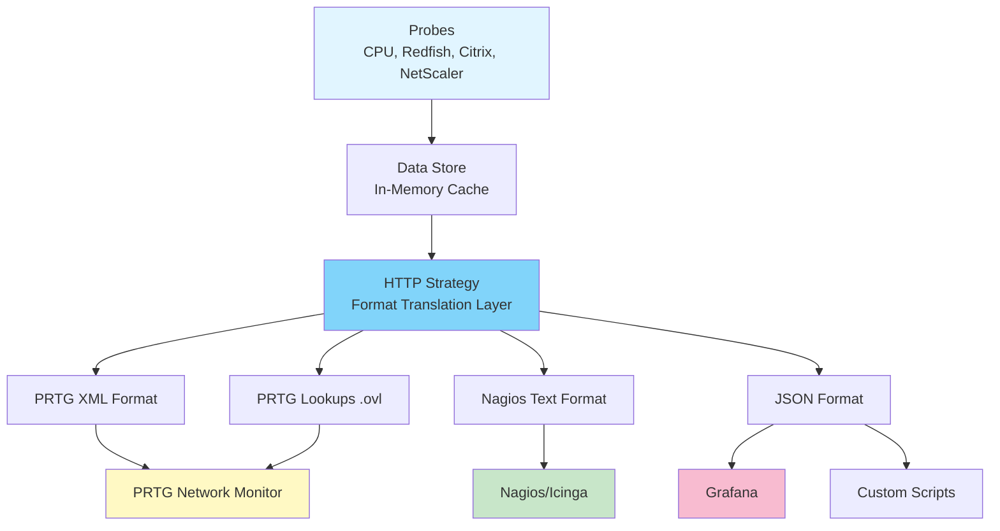
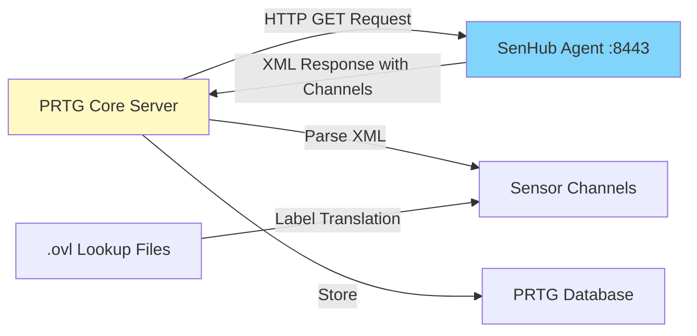
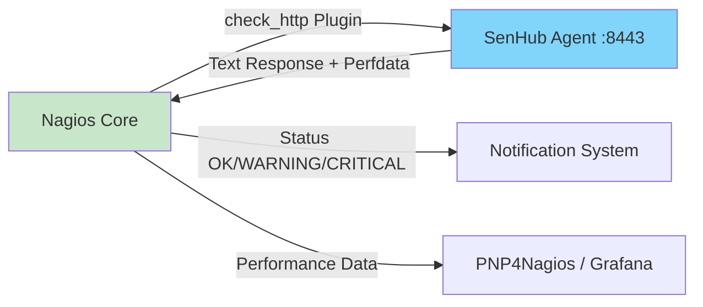
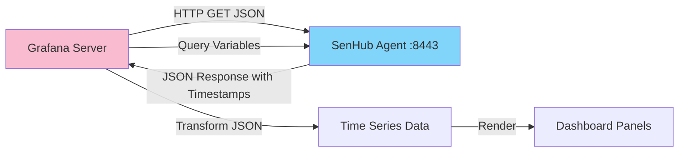
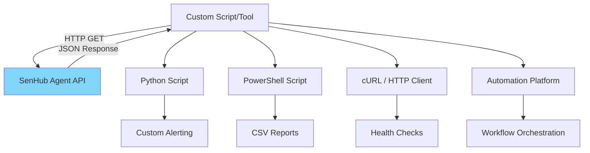
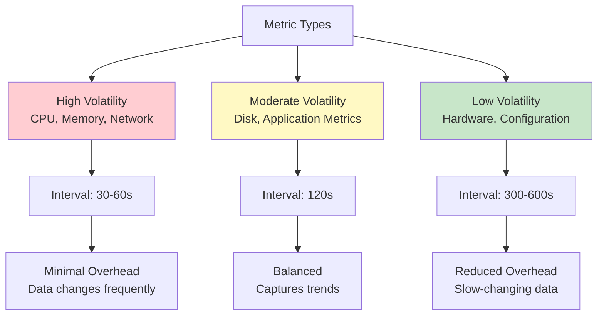
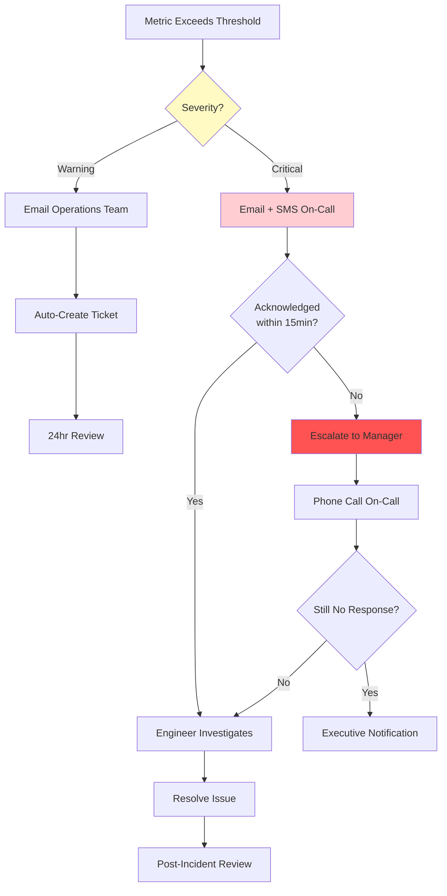

# Using SenHub Agent Metrics in Monitoring Systems

This guide provides comprehensive integration instructions for connecting SenHub Agent to your monitoring infrastructure. Whether you're implementing PRTG sensors, Nagios checks, Grafana dashboards, or custom scripts, this document walks through the complete integration workflow from initial configuration to production deployment.

## Table of Contents

- [Understanding Metrics Integration](#understanding-metrics-integration)
- [PRTG Network Monitor Integration](#prtg-network-monitor-integration)
- [Nagios and Icinga Integration](#nagios-and-icinga-integration)
- [Grafana Integration](#grafana-integration)
- [Custom REST API Integration](#custom-rest-api-integration)
- [Integration Examples by Probe Type](#integration-examples-by-probe-type)
- [Best Practices for Production](#best-practices-for-production)
- [Troubleshooting Integration Issues](#troubleshooting-integration-issues)

---

## Understanding Metrics Integration

Before configuring sensors and checks, it's important to understand how SenHub Agent exposes metrics and the integration architecture that connects it to your monitoring tools.

### Integration Architecture

SenHub Agent functions as a metrics aggregation gateway that translates between probe data sources and monitoring system formats:



**Key architectural principles:**

1. **Single Source, Multiple Formats**: Probes collect data once; the HTTP strategy exposes it in multiple formats simultaneously
2. **Cached Delivery**: Metrics are served from cache (5-30 minute retention), eliminating repeated collection overhead
3. **Pull-Based Model**: Monitoring systems request metrics on demand; no push configuration required
4. **Format-Specific Endpoints**: Each monitoring tool accesses data via dedicated endpoints optimized for its format

### Available Formats and Use Cases

| Format | Endpoint Pattern | Primary Use Case | Response Type | Key Feature |
|--------|-----------------|------------------|---------------|-------------|
| **PRTG XML** | `/api/{key}/prtg/metrics/{probe}` | PRTG HTTP XML/REST sensors | XML | Native channels with units |
| **Nagios Text** | `/api/{key}/nagios/status` | Nagios/Icinga check_http | Plain text | Performance data format |
| **JSON** | `/api/{key}/metrics` | Grafana, custom scripts | JSON | Structured with metadata |
| **PRTG Lookups** | `/api/{key}/prtg/lookups/download` | Value-to-label translation | ZIP (.ovl files) | NetScaler metric labels |

### Integration Decision Criteria

**Choose PRTG Integration when:**
- You have existing PRTG infrastructure deployed
- You need visual dashboards with historical graphs and alerting
- You require hierarchical device/sensor organization
- You want automated alert escalation and notification workflows
- Your environment: Windows-centric infrastructure, enterprise monitoring teams

**Choose Nagios Integration when:**
- You have Nagios/Icinga/Shinken deployed
- You need flexible check_command configuration
- You require custom alert handlers and notification logic
- Your environment: Linux-centric infrastructure, DevOps teams preferring configuration-as-code

**Choose Grafana Integration when:**
- You need customizable, real-time visualization dashboards
- You require correlation across multiple data sources (Prometheus, Elasticsearch, etc.)
- You want templated dashboards with variables for multi-server views
- Your environment: Modern cloud-native infrastructure, developer-focused monitoring

**Choose Custom API Integration when:**
- You have in-house monitoring tools or scripts
- You need programmatic access for automation workflows
- You require integration with ticketing systems or CMDB
- Your environment: Custom monitoring pipelines, DevOps automation platforms

### Authentication and Security Model

All metric endpoints require authentication via the agent key embedded in the URL:

```
https://monitoring-server:8443/api/{agent-key}/metrics
                                     └─────┬─────┘
                                           │
                                 UUID authentication key
```

**Security considerations:**
- **HTTPS required in production**: The agent key is transmitted with each request; TLS encryption prevents interception
- **Key exposure in URLs**: URLs appear in monitoring system logs and browser history; treat keys as sensitive credentials
- **Firewall restrictions**: Limit port 8443 access to monitoring server IPs only
- **No additional authentication**: The agent key is the sole authentication mechanism; no username/password required

**See [HTTP/HTTPS Configuration](./HTTP-HTTPS-CONFIGURATION.md) for complete security guidance.**

---

## PRTG Network Monitor Integration

PRTG Network Monitor can consume SenHub Agent metrics using HTTP XML/REST Value sensors. This integration provides native PRTG channels with automatic unit detection, graphing, and alerting.

### Integration Overview



**Integration workflow:**
1. PRTG server sends HTTP GET request to agent endpoint every scanning interval (e.g., 60 seconds)
2. Agent returns XML response containing channels (metrics) with values, units, and limits
3. PRTG parses XML, creates/updates channels, stores values in database
4. PRTG applies lookups (for NetScaler) to translate numeric codes to readable labels
5. PRTG graphs data, evaluates thresholds, triggers alerts if limits exceeded

### Workflow: Creating Your First PRTG Sensor

This workflow demonstrates creating a CPU monitoring sensor from initial device setup through alert configuration.

#### Step 1: Add Device in PRTG

**Navigation:** PRTG → Devices → Add Device

**Device configuration:**
```
Device Name: PROD-SERVER-01 (SenHub Agent)
Parent Group: Servers / Production Servers
Tags: senhub, production, critical
Priority: ★★★★ (4 stars)

Connection Settings:
  IPv4 Address/DNS Name: monitoring.company.com
  Service URL: [leave empty - handled by sensors]
```

**Why this matters:** PRTG organizes monitoring hierarchically (groups → devices → sensors). The device represents the server running SenHub Agent, while individual sensors monitor specific aspects (CPU, memory, hardware).

#### Step 2: Add HTTP XML/REST Value Sensor

**Navigation:** Device → Add Sensor → HTTP XML/REST Value Sensor

**Sensor Settings - Basic:**
```
Sensor Name: System - CPU Metrics
Tags: senhub, system, cpu
Priority: ★★★★ (4 stars - critical system metric)
```

**Sensor Settings - HTTP Specific:**
```
REST Configuration:
  URL: https://monitoring.company.com:8443/api/f47ac10b-58cc-4372-a567-0e02b2c3d479/prtg/metrics/cpu
       └──────┬──────┘ └──┬──┘ └────────────────────┬────────────────────┘ └─┬─┘ └──┬───┘ └─┬┘
              │           │                          │                         │      │       └─ Probe type (cpu)
              │           │                          │                         │      └─ Format (prtg)
              │           │                          │                         └─ Endpoint path
              │           │                          └─ Your agent authentication key
              │           └─ HTTPS port
              └─ Agent hostname or IP

Method: GET
Authentication: None [key embedded in URL]
Port: [leave empty - included in URL]
Timeout (Sec): 60
```

**Sensor Settings - Scanning Interval:**
```
Scanning Interval: 60 seconds [for real-time system monitoring]
```

**Why 60 seconds?** System metrics like CPU change frequently. 60-second intervals provide near-real-time visibility without overwhelming PRTG with requests. For less volatile metrics (hardware temperature via Redfish), use 300 seconds (5 minutes).

#### Step 3: Verify Sensor Operation

After saving the sensor, PRTG performs its first scan. Expected result:

```
Sensor: System - CPU Metrics
Status: ✓ Up (100%)
Last Value: 42.3%
Last Scan: 15 seconds ago
Response Time: 234 ms

Channels Created:
├─ CPU Usage Total: 42.3% [Unit: Percent]
├─ CPU User: 28.7% [Unit: Percent]
├─ CPU System: 13.6% [Unit: Percent]
├─ CPU Idle: 57.7% [Unit: Percent]
├─ CPU Load 1min: 1.23 [Unit: Custom]
├─ CPU Load 5min: 1.45 [Unit: Custom]
├─ CPU Load 15min: 1.67 [Unit: Custom]
├─ CPU Core 0 Usage: 45.2% [Unit: Percent]
├─ CPU Core 1 Usage: 39.8% [Unit: Percent]
└─ ... [additional cores depending on CPU]
```

**Troubleshooting first scan failures:**

| Error | Cause | Solution |
|-------|-------|----------|
| "No Response (HTTP 503)" | Agent not running or endpoint unreachable | Verify agent status: `curl -k https://monitoring.company.com:8443/api/{key}/info/system` |
| "Socket timeout" | Agent response time > 60 seconds | Increase sensor timeout to 120 seconds; check probe interval configuration |
| "HTTP 401" or "HTTP 403" | Incorrect agent key in URL | Verify key matches configuration: `grep "key:" /etc/senhub-agent/agent-config.yaml` |
| "Could not resolve host" | DNS resolution failure | Use IP address instead of hostname, or verify DNS configuration |

#### Step 4: Configure Channel Limits and Alerts

**Navigation:** Sensor → Channel Settings (gear icon) → "CPU Usage Total" channel

**Limit configuration for production server:**
```
Upper Error Limit: 95%
  Rationale: >95% CPU indicates severe resource exhaustion requiring immediate intervention

Upper Warning Limit: 80%
  Rationale: >80% CPU sustained indicates capacity planning needed or performance degradation

Lower Warning Limit: [disabled]
Lower Error Limit: [disabled]
  Rationale: Low CPU is normal; no alert needed
```

**Alert notification configuration:**
- **Warning (>80%)**: Email operations team, create ticket in CMDB
- **Error (>95%)**: Email + SMS on-call engineer, escalate if sustained >15 minutes

**Example alert message:**
```
Subject: [PRTG WARNING] PROD-SERVER-01 - System - CPU Metrics - CPU Usage Total
Body:
  Device: PROD-SERVER-01 (SenHub Agent)
  Sensor: System - CPU Metrics
  Channel: CPU Usage Total
  Status: WARNING (>80%)
  Current Value: 87.3%
  Threshold: 80% (warning)

  Action Required: Investigate high CPU usage on production server
  Dashboard: https://prtg.company.com/sensor.htm?id=12345
```

### Workflow: Expanding to Complete System Monitoring

After successfully deploying your first CPU sensor, expand coverage to comprehensive system monitoring.

#### Multi-Sensor Deployment Strategy

**Recommended sensor suite for a production server:**

```
Device: PROD-SERVER-01 (SenHub Agent)
│
├─ Sensor: System - CPU Metrics
│  URL: .../prtg/metrics/cpu
│  Interval: 60s
│  Priority: ★★★★
│
├─ Sensor: System - Memory Metrics
│  URL: .../prtg/metrics/memory
│  Interval: 60s
│  Priority: ★★★★
│
├─ Sensor: System - Disk Metrics
│  URL: .../prtg/metrics/logicaldisk
│  Interval: 120s
│  Priority: ★★★
│
├─ Sensor: System - Network Metrics
│  URL: .../prtg/metrics/network
│  Interval: 60s
│  Priority: ★★★
│
└─ Sensor: Hardware - Redfish Monitoring
   URL: .../prtg/metrics/redfish
   Interval: 300s (5 min)
   Priority: ★★★★
```

**Interval selection rationale:**
- **CPU/Memory (60s)**: High volatility; captures spikes and trends
- **Disk (120s)**: Moderate volatility; disk usage changes gradually
- **Network (60s)**: High volatility; detects bandwidth saturation
- **Redfish (300s)**: Low volatility; hardware temperatures change slowly; reduces BMC query load

### PRTG URLs by Probe Type

Complete endpoint reference for all probe types:

**System Probes (Free Tier):**
```
CPU:
https://monitoring.company.com:8443/api/{key}/prtg/metrics/cpu

Memory:
https://monitoring.company.com:8443/api/{key}/prtg/metrics/memory

Logical Disk:
https://monitoring.company.com:8443/api/{key}/prtg/metrics/logicaldisk

Network:
https://monitoring.company.com:8443/api/{key}/prtg/metrics/network
```

**Infrastructure Probes (Pro/Enterprise Tier - requires license):**
```
Redfish (Hardware Monitoring):
https://monitoring.company.com:8443/api/{key}/prtg/metrics/redfish

Citrix (Virtual Desktop Infrastructure):
https://monitoring.company.com:8443/api/{key}/prtg/metrics/citrix

NetScaler (Load Balancer):
https://monitoring.company.com:8443/api/{key}/prtg/metrics/netscaler

Syslog (Event Collection):
https://monitoring.company.com:8443/api/{key}/prtg/metrics/syslog
```

### Workflow: Installing PRTG Lookups for NetScaler

PRTG lookups translate numeric metric codes into human-readable labels. This is critical for NetScaler monitoring, where metrics include codes like `0` (rate), `1` (counter), `2` (gauge).

**Without lookups:**
```
Channel: netscaler_vserver_hits_metric_type
Value: 0
```

**With lookups:**
```
Channel: netscaler_vserver_hits_metric_type
Value: Rate
```

#### Step 1: Download Lookups from SenHub Agent

**Option A: Via Web Dashboard**
1. Navigate to: `https://monitoring.company.com:8443/web/{key}/dashboard`
2. Click **API Explorer** tab
3. Scroll to **PRTG Lookups** section
4. Click **Download Lookups (ZIP)**

**Option B: Direct Download**
```powershell
# PowerShell (Windows - PRTG server)
Invoke-WebRequest -Uri "https://monitoring.company.com:8443/api/{key}/prtg/lookups/download" `
  -OutFile "senhub-lookups.zip" `
  -SkipCertificateCheck
```

**Downloaded ZIP contents:**
```
senhub-lookups.zip (3 KB)
├─ netscaler.metric_type.ovl         # Translates: 0→Rate, 1→Counter, 2→Gauge
├─ netscaler.metric_view.ovl         # Translates: 0→Load Balancing, 1→SSL, 2→System
└─ README.txt                        # Installation instructions
```

#### Step 2: Copy Lookups to PRTG Directory

**On PRTG Core Server:**
```powershell
# Extract ZIP
Expand-Archive -Path "senhub-lookups.zip" -DestinationPath "C:\Temp\senhub-lookups"

# Copy .ovl files to PRTG lookups directory
Copy-Item "C:\Temp\senhub-lookups\*.ovl" `
  -Destination "C:\Program Files (x86)\PRTG Network Monitor\lookups\custom\"

# Verify files copied
dir "C:\Program Files (x86)\PRTG Network Monitor\lookups\custom\netscaler*.ovl"
```

**Expected output:**
```
Mode                 LastWriteTime         Length Name
----                 -------------         ------ ----
-a----         1/15/2025  10:30 AM           1024 netscaler.metric_type.ovl
-a----         1/15/2025  10:30 AM            512 netscaler.metric_view.ovl
```

#### Step 3: Reload Lookups in PRTG

**PRTG Web Interface:**
1. Navigate to: **Setup → System Administration → Administrative Tools**
2. Click: **Load Lookups and File Lists**
3. Wait for confirmation: "Lookups and file lists loaded successfully"

**PRTG Enterprise Console (Windows client):**
1. Menu: **Setup → System Administration → Load Lookups and File Lists**
2. Click **OK** on confirmation dialog

#### Step 4: Verify Lookup Application

**Before applying lookups (numeric codes):**
```
Sensor: NetScaler - Virtual Server Metrics
Channels:
├─ vserver_web_hits_metric_type: 0
├─ vserver_web_state_metric_view: 2
└─ ssl_cert_days_to_expire_metric_type: 1
```

**After applying lookups (readable labels):**
```
Sensor: NetScaler - Virtual Server Metrics
Channels:
├─ vserver_web_hits_metric_type: Rate
├─ vserver_web_state_metric_view: System
└─ ssl_cert_days_to_expire_metric_type: Counter
```

**If lookups don't apply:** Recreate the sensor (not just refresh/rescan). PRTG caches channel metadata at sensor creation; existing sensors won't retroactively apply new lookups.

### Advanced PRTG Configuration: NetScaler Filtering

NetScaler monitoring produces hundreds of metrics across virtual servers, service groups, SSL certificates, and system resources. Use tag-based filtering to create focused sensors.

#### Filtering Strategy

**Create separate sensors by functional area:**

**Sensor 1: Load Balancing Metrics**
```
Name: NetScaler - Load Balancing
URL: https://monitoring.company.com:8443/api/{key}/prtg/metrics/netscaler?filter=metric_view:load_balancing
Interval: 120s

Channels Included:
├─ Virtual server state (UP/DOWN)
├─ Virtual server hits (requests/sec)
├─ Virtual server connections (active connections)
├─ Service group members (health status)
└─ Backend server response times
```

**Sensor 2: SSL/TLS Metrics**
```
Name: NetScaler - SSL Monitoring
URL: https://monitoring.company.com:8443/api/{key}/prtg/metrics/netscaler?filter=metric_view:ssl
Interval: 300s (5 min)

Channels Included:
├─ SSL certificate days to expire
├─ SSL handshake rate
├─ SSL transactions per second
├─ SSL cipher strength distribution
└─ SSL protocol version usage
```

**Sensor 3: System Performance**
```
Name: NetScaler - System Resources
URL: https://monitoring.company.com:8443/api/{key}/prtg/metrics/netscaler?filter=metric_view:system
Interval: 120s

Channels Included:
├─ CPU usage (management CPU, packet engines)
├─ Memory usage (allocated, free)
├─ Throughput (Mbps in/out)
├─ Packet rate (packets/sec)
└─ Connection table usage
```

**Sensor 4: Specific Virtual Server**
```
Name: NetScaler - Web vServer
URL: https://monitoring.company.com:8443/api/{key}/prtg/metrics/netscaler?filter=vserver_name:Web-vServer
Interval: 60s

Channels Included:
└─ All metrics specific to "Web-vServer" virtual server
```

**Benefits of filtered sensors:**
- **Lighter sensor overhead**: Fewer channels per sensor = faster PRTG database operations
- **Targeted alerting**: Alert only on load balancing issues without noise from SSL metrics
- **Clearer organization**: PRTG device tree clearly shows functional areas
- **Granular permissions**: PRTG user groups can access SSL sensor without seeing LB configuration

### Multi-Server PRTG Deployment

**Scenario:** 10 production servers, each running SenHub Agent with unique agent keys.

**PRTG structure:**
```
Group: Production Servers
│
├─ Device: PROD-SERVER-01 (192.168.1.10:8443)
│  ├─ Sensor: System - CPU Metrics
│  │  URL: https://192.168.1.10:8443/api/{key-server-01}/prtg/metrics/cpu
│  ├─ Sensor: System - Memory Metrics
│  │  URL: https://192.168.1.10:8443/api/{key-server-01}/prtg/metrics/memory
│  └─ Sensor: Hardware - Redfish Monitoring
│     URL: https://192.168.1.10:8443/api/{key-server-01}/prtg/metrics/redfish
│
├─ Device: PROD-SERVER-02 (192.168.1.11:8443)
│  ├─ Sensor: System - CPU Metrics
│  │  URL: https://192.168.1.11:8443/api/{key-server-02}/prtg/metrics/cpu
│  └─ ... [same sensor structure]
│
└─ ... [remaining 8 servers]
```

**Deployment workflow:**
1. **Standardize naming**: Use consistent sensor names across all devices for easier reporting
2. **Clone sensors**: Create full sensor suite on first device, then clone to remaining devices (update URLs only)
3. **Template approach**: Create PRTG device template with all sensors pre-configured (requires PRTG API or PowerShell automation)
4. **Centralized alerting**: Configure group-level notifications to avoid per-sensor alert configuration

**PRTG API automation example (PowerShell):**
```powershell
# Add device and sensors for multiple servers
$servers = @(
    @{hostname="192.168.1.10"; key="key-server-01"; name="PROD-SERVER-01"},
    @{hostname="192.168.1.11"; key="key-server-02"; name="PROD-SERVER-02"}
)

foreach ($server in $servers) {
    # Add device
    Add-PRTGDevice -Name $server.name -Host $server.hostname -GroupId 1234

    # Add CPU sensor
    Add-PRTGSensor -DeviceName $server.name -SensorType "http" `
        -Name "System - CPU Metrics" `
        -Url "https://$($server.hostname):8443/api/$($server.key)/prtg/metrics/cpu" `
        -Interval 60
}
```

---

## Nagios and Icinga Integration

Nagios and Icinga (Nagios fork) can monitor SenHub Agent using the standard `check_http` plugin. This integration exposes metrics as Nagios performance data format for graphing with PNP4Nagios or other visualization tools.

### Integration Overview



**Integration workflow:**
1. Nagios executes `check_http` plugin according to check_interval (e.g., every 5 minutes)
2. Plugin sends HTTP GET request to SenHub Agent `/nagios/status` endpoint
3. Agent responds with status line (OK/WARNING/CRITICAL) and performance data
4. Nagios evaluates plugin exit code (0=OK, 1=WARNING, 2=CRITICAL, 3=UNKNOWN)
5. Nagios processes performance data for graphing and stores check result
6. If status changes or reaches critical state, Nagios triggers notifications

### Workflow: Configuring Your First Nagios Check

This workflow demonstrates creating a Nagios service check for SenHub Agent system monitoring.

#### Step 1: Define Check Command

**File:** `/etc/nagios/objects/commands.cfg` (or `/etc/nagios-plugins/config/commands.cfg` on Debian/Ubuntu)

```cfg
define command {
    command_name    check_senhub_agent
    command_line    $USER1$/check_http \
                    -H $ARG1$ \
                    -p $ARG2$ \
                    -S \
                    -u /api/$ARG3$/nagios/status \
                    -s "OK" \
                    -w 5 \
                    -c 10
}
```

**Parameter explanation:**
- `$USER1$`: Nagios macro for plugin directory (typically `/usr/lib/nagios/plugins`)
- `$ARG1$`: Hostname or IP address (e.g., `monitoring.company.com`)
- `$ARG2$`: HTTPS port (e.g., `8443`)
- `$ARG3$`: Agent authentication key (UUID)
- `-S`: Use SSL/TLS (HTTPS)
- `-u /api/$ARG3$/nagios/status`: Endpoint URL path
- `-s "OK"`: Expect string "OK" in response (validates agent functionality)
- `-w 5`: Warning if response time > 5 seconds
- `-c 10`: Critical if response time > 10 seconds (or connection failure)

**Why separate timeout from HTTP response validation?** The `-w/-c` flags measure response time (network + agent processing), while `-s "OK"` validates that the agent responded with valid data (not just HTTP 200 with error content).

#### Step 2: Define Service Check

**File:** `/etc/nagios/objects/localhost.cfg` (or create `/etc/nagios/conf.d/senhub-agent.cfg`)

```cfg
define service {
    use                     generic-service
    host_name               PROD-SERVER-01
    service_description     SenHub Agent - System Health
    check_command           check_senhub_agent!monitoring.company.com!8443!f47ac10b-58cc-4372-a567-0e02b2c3d479
    check_interval          5
    retry_interval          1
    max_check_attempts      3
    notification_interval   30
    notification_period     24x7
    contact_groups          linux-admins
}
```

**Configuration rationale:**
- **check_interval: 5**: Check every 5 minutes (Nagios default; adjust based on monitoring requirements)
- **retry_interval: 1**: Re-check every 1 minute when in non-OK state (fast detection of recovery)
- **max_check_attempts: 3**: Require 3 consecutive failures before changing state to CRITICAL (avoids flapping)
- **notification_interval: 30**: Re-send notification every 30 minutes if issue persists
- **contact_groups: linux-admins**: Notify Linux administration team on failure

#### Step 3: Verify Configuration and Reload

**Verify Nagios configuration syntax:**
```bash
sudo /usr/sbin/nagios -v /etc/nagios/nagios.cfg
```

**Expected output:**
```
Nagios Core 4.4.6
Copyright (c) 2009-present Nagios Core Development Team and Community Contributors
License: GPL

Reading configuration data...
   Read main config file okay...
   Read object config files okay...

Running pre-flight check on configuration data...

Checking objects...
    Checked 8 services.
    Checked 3 hosts.
    Checked 2 host groups.
    ...
Total Warnings: 0
Total Errors:   0

Things look okay - No serious problems were detected during the pre-flight check
```

**If errors appear:** Fix configuration syntax before reloading. Common errors include missing semicolons, undefined host_name references, or incorrect command argument counts.

**Reload Nagios:**
```bash
sudo systemctl reload nagios

# Or on older systems:
sudo service nagios reload
```

#### Step 4: Verify Check Execution

**Test command manually (as nagios user):**
```bash
sudo -u nagios /usr/lib/nagios/plugins/check_http \
  -H monitoring.company.com \
  -p 8443 \
  -S \
  -u /api/f47ac10b-58cc-4372-a567-0e02b2c3d479/nagios/status \
  -s "OK" \
  -w 5 -c 10
```

**Expected output:**
```
HTTP OK: HTTP/1.1 200 OK - 1234 bytes in 0.234 second response time |time=0.234s;;;0.000000 size=1234B;;;0
OK - CPU: 42.3%, Memory: 67.8% | cpu_usage=42.3%;80;95;0;100 memory_usage=67.8%;80;95;0;100
```

**Output breakdown:**
- **First line**: HTTP check result (connection successful, 200 OK, response time 0.234s)
- **Second line**: Agent-provided status message with performance data
- **Performance data format**: `label=value;warn;crit;min;max`
  - `cpu_usage=42.3%;80;95;0;100`: CPU at 42.3%, warning threshold 80%, critical threshold 95%, range 0-100%
  - `memory_usage=67.8%;80;95;0;100`: Memory at 67.8%, warning threshold 80%, critical threshold 95%

**Nagios Web Interface verification:**
1. Navigate to: **Services → All Services**
2. Locate service: **PROD-SERVER-01 - SenHub Agent - System Health**
3. Expected status: **OK** (green)
4. Status information should display: "OK - CPU: 42.3%, Memory: 67.8%"

### Advanced Nagios Configuration: Per-Probe Checks

For granular monitoring and targeted alerting, create separate service checks for each probe type.

**File:** `/etc/nagios/conf.d/senhub-agent-detailed.cfg`

```cfg
# CPU Monitoring
define service {
    use                     generic-service
    host_name               PROD-SERVER-01
    service_description     SenHub - CPU Performance
    check_command           check_senhub_agent!monitoring.company.com!8443!{key}
    check_interval          1
    contact_groups          linux-admins
}

# Memory Monitoring
define service {
    use                     generic-service
    host_name               PROD-SERVER-01
    service_description     SenHub - Memory Usage
    check_command           check_senhub_agent!monitoring.company.com!8443!{key}
    check_interval          1
    contact_groups          linux-admins
}

# Hardware Monitoring (Redfish)
define service {
    use                     generic-service
    host_name               PROD-SERVER-01
    service_description     SenHub - Hardware Health
    check_command           check_senhub_agent!monitoring.company.com!8443!{key}
    check_interval          5
    notification_options    c,r  # Only notify on CRITICAL and RECOVERY
    contact_groups          hardware-team
}

# Citrix VDI Monitoring
define service {
    use                     generic-service
    host_name               CITRIX-DDC-01
    service_description     SenHub - Citrix Session Metrics
    check_command           check_senhub_agent!citrix.company.com!8443!{key}
    check_interval          2
    contact_groups          vdi-admins
}
```

**Note on current endpoint limitation:** The `/nagios/status` endpoint currently returns aggregated metrics from all active probes. Per-probe filtering (e.g., `/nagios/status?probe=cpu`) is planned for a future release. Until then, use service descriptions and contact groups to organize checks logically.

### Custom Nagios Plugin for Advanced Metrics

For maximum flexibility—including custom thresholds, probe-specific checks, and complex alert logic—create a custom Nagios plugin.

**File:** `/usr/lib/nagios/plugins/check_senhub_custom`

```bash
#!/bin/bash
# Custom Nagios plugin for SenHub Agent monitoring
# Usage: check_senhub_custom <host> <port> <key> <probe> <metric> <warn> <crit>

set -euo pipefail

# Arguments
HOST="$1"
PORT="$2"
KEY="$3"
PROBE="$4"
METRIC="$5"
WARN_THRESHOLD="$6"
CRIT_THRESHOLD="$7"

# Construct URL
URL="https://${HOST}:${PORT}/api/${KEY}/metrics?probe=${PROBE}"

# Fetch metrics (ignore self-signed cert with -k)
RESPONSE=$(curl -s -k --max-time 10 "$URL" || echo '{"error": "connection_failed"}')

# Parse specific metric value using jq
METRIC_VALUE=$(echo "$RESPONSE" | jq -r ".metrics[] | select(.name==\"$METRIC\") | .value" 2>/dev/null || echo "UNKNOWN")

# Validate numeric value
if ! [[ "$METRIC_VALUE" =~ ^[0-9]+\.?[0-9]*$ ]]; then
    echo "UNKNOWN - Failed to retrieve metric '$METRIC' from probe '$PROBE'"
    exit 3
fi

# Evaluate thresholds
if (( $(echo "$METRIC_VALUE >= $CRIT_THRESHOLD" | bc -l) )); then
    echo "CRITICAL - ${METRIC}: ${METRIC_VALUE}% | ${METRIC}=${METRIC_VALUE};${WARN_THRESHOLD};${CRIT_THRESHOLD};0;100"
    exit 2
elif (( $(echo "$METRIC_VALUE >= $WARN_THRESHOLD" | bc -l) )); then
    echo "WARNING - ${METRIC}: ${METRIC_VALUE}% | ${METRIC}=${METRIC_VALUE};${WARN_THRESHOLD};${CRIT_THRESHOLD};0;100"
    exit 1
else
    echo "OK - ${METRIC}: ${METRIC_VALUE}% | ${METRIC}=${METRIC_VALUE};${WARN_THRESHOLD};${CRIT_THRESHOLD};0;100"
    exit 0
fi
```

**Make plugin executable:**
```bash
sudo chmod +x /usr/lib/nagios/plugins/check_senhub_custom
sudo chown nagios:nagios /usr/lib/nagios/plugins/check_senhub_custom
```

**Define command:**
```cfg
define command {
    command_name    check_senhub_custom
    command_line    $USER1$/check_senhub_custom $ARG1$ $ARG2$ $ARG3$ $ARG4$ $ARG5$ $ARG6$ $ARG7$
}
```

**Define service using custom plugin:**
```cfg
define service {
    use                     generic-service
    host_name               PROD-SERVER-01
    service_description     SenHub - CPU Usage (Custom Threshold)
    check_command           check_senhub_custom!monitoring.company.com!8443!{key}!cpu!cpu_usage_total!70!90
                                                                                                           └─┬┘ └─┬┘
                                                                                                        Warning Critical
                                                                                                        70%     90%
}
```

**Why custom plugin?**
- **Probe-specific checks**: Target individual probes (cpu, memory, redfish) until native endpoint filtering available
- **Custom thresholds**: Different warning/critical levels per metric (e.g., database servers tolerate higher CPU than web servers)
- **Complex logic**: Combine multiple metrics (alert only if CPU >80% AND memory >90%)
- **Better performance data**: Extract specific metrics instead of aggregated status

**Dependencies:** Requires `curl` and `jq` installed on Nagios server:
```bash
sudo apt-get install curl jq    # Debian/Ubuntu
sudo yum install curl jq        # RHEL/CentOS
```

---

## Grafana Integration

Grafana provides customizable, real-time visualization dashboards by consuming SenHub Agent metrics via JSON API. This integration enables correlation with other data sources (Prometheus, Elasticsearch, InfluxDB) and supports templated dashboards for multi-server views.

### Integration Overview



**Integration workflow:**
1. Grafana datasource sends HTTP GET request to agent JSON API endpoint
2. Agent returns structured JSON with metrics, values, units, timestamps, and tags
3. Grafana transforms JSON using JSONPath queries or built-in transformations
4. Grafana renders data in panels (graphs, gauges, tables, stat panels)
5. Dashboard variables enable dynamic queries (server selection, probe filtering)

### Workflow: Setting Up Grafana Integration

This workflow demonstrates complete integration from plugin installation through dashboard deployment.

#### Step 1: Install JSON API Plugin

Grafana doesn't natively query arbitrary JSON APIs; install the JSON API datasource plugin.

**Via Grafana CLI:**
```bash
sudo grafana-cli plugins install marcusolsson-json-datasource
sudo systemctl restart grafana-server
```

**Via Docker:**
```yaml
# docker-compose.yml
services:
  grafana:
    image: grafana/grafana:latest
    environment:
      - GF_INSTALL_PLUGINS=marcusolsson-json-datasource
    ports:
      - "3000:3000"
```

**Verification:**
```bash
# Check plugin installed
sudo grafana-cli plugins ls | grep json

# Expected output:
# marcusolsson-json-datasource @ 1.3.5
```

#### Step 2: Configure JSON API Datasource

**Grafana Web UI:** Configuration → Data Sources → Add data source → JSON API

**Datasource Settings:**
```
Name: SenHub Agent - PROD-SERVER-01
  Rationale: Include server name for multi-server deployments

URL: https://monitoring.company.com:8443
  Note: Base URL only; endpoints specified in panel queries

Access: Server (default)
  Rationale: Grafana server queries agent; not browser-based queries
```

**Custom HTTP Headers:**
```
Header Name: X-API-Key
Value: f47ac10b-58cc-4372-a567-0e02b2c3d479
  Rationale: Agent authentication key passed via custom header
```

**TLS/SSL Settings:**
```
Skip TLS Verify (Insecure): ☑
  Rationale: Enable if using self-signed certificates in dev/test environments
  WARNING: Disable in production with proper CA-signed certificates

TLS Client Auth: ☐ (disabled)
  Rationale: SenHub Agent uses key-based authentication, not client certificates

With CA Cert: ☐ (disabled unless using internal CA)
```

**Save & Test:** Click "Save & Test" button

**Expected result:**
```
✓ Data source is working
```

**If test fails:**
| Error | Cause | Solution |
|-------|-------|----------|
| "Network Error: connect ECONNREFUSED" | Agent not accessible from Grafana server | Verify firewall rules; test with `curl` from Grafana server |
| "Network Error: certificate signed by unknown authority" | Self-signed certificate, TLS verify enabled | Enable "Skip TLS Verify" or install CA certificate |
| "HTTP 401 Unauthorized" | Missing or incorrect X-API-Key header | Verify header name exactly "X-API-Key" and value matches agent key |

#### Step 3: Create Your First Dashboard

**Grafana UI:** Dashboards → New Dashboard → Add visualization

**Select datasource:** Choose "SenHub Agent - PROD-SERVER-01"

**Panel Configuration - Query:**
```
Query Type: JSON
URL Path: /api/f47ac10b-58cc-4372-a567-0e02b2c3d479/metrics?probe=cpu
Method: GET
Query Parameters: [empty - included in URL path]
```

**Panel Configuration - Fields:**
```
JSONPath Expression: $.metrics[?(@.name=='cpu_usage_total')]
  Explanation: Select metric objects where name field equals 'cpu_usage_total'

Value Field: value
  Explanation: Extract the 'value' property from matched objects

Timestamp Field: timestamp
  Explanation: Use 'timestamp' property for time series X-axis

Time Format: YYYY-MM-DDTHH:mm:ssZ
  Explanation: Agent returns ISO 8601 format (e.g., "2025-01-15T10:30:45Z")
```

**Panel Configuration - Visualization:**
```
Visualization Type: Time series
Title: CPU Usage - Total
Unit: Percent (0-100)
Decimals: 1

Y-Axis:
  Min: 0
  Max: 100

Thresholds:
  Base: Green (OK)
  80%: Yellow (Warning)
  95%: Red (Critical)
```

**Save panel:** Click "Apply" to add panel to dashboard

**Dashboard result:**
```
Dashboard: System Monitoring - PROD-SERVER-01
│
└─ Panel: CPU Usage - Total
   Visualization: Time series graph showing CPU percentage over time
   Current Value: 42.3%
   Color: Green (below 80% threshold)
   Time Range: Last 6 hours
```

#### Step 4: Add Multiple Metrics to Dashboard

**Expand dashboard with complete system monitoring:**

**Panel 2: Memory Usage (Gauge)**
```
Query:
  URL Path: /api/{key}/metrics?probe=memory
  JSONPath: $.metrics[?(@.name=='memory_usage_percent')]

Visualization: Gauge
Title: Memory Usage
Min: 0, Max: 100
Thresholds:
  0-80%: Green
  80-95%: Yellow
  95-100%: Red
```

**Panel 3: Disk Space (Bar Gauge - Multi-Disk)**
```
Query:
  URL Path: /api/{key}/metrics?probe=logicaldisk
  JSONPath: $.metrics[?(@.name=='disk_free_percent')]

Visualization: Bar gauge (horizontal)
Title: Disk Free Space
Display: Show all disks (C:, D:, E:)
Orientation: Horizontal bars
Thresholds:
  50-100%: Green
  20-50%: Yellow
  0-20%: Red
```

**Panel 4: Network Throughput (Time Series - Multi-Interface)**
```
Query:
  URL Path: /api/{key}/metrics?probe=network
  JSONPath: $.metrics[?(@.name=='network_bytes_sent' || @.name=='network_bytes_recv')]

Visualization: Time series
Title: Network Throughput
Unit: Bytes/sec
Display: Multiple series (one per network interface)
Legend: Show interface names (tags.interface)
```

**Panel 5: Hardware Temperature (Stat Panel)**
```
Query:
  URL Path: /api/{key}/metrics?probe=redfish
  JSONPath: $.metrics[?(@.name=='redfish_temperature_celsius')]

Visualization: Stat
Title: Hardware Temperature
Unit: °C (Celsius)
Stat: Current value + sparkline
Thresholds:
  0-75°C: Green
  75-85°C: Yellow
  85°C+: Red
```

**Complete dashboard layout:**
```
┌─────────────────────────────────────────────────────────────┐
│ System Monitoring - PROD-SERVER-01                [Time]    │
├──────────────────────────┬──────────────────────────────────┤
│ CPU Usage - Total        │ Memory Usage                     │
│ [Time Series Graph]      │ [Gauge: 67.8%]                   │
├──────────────────────────┴──────────────────────────────────┤
│ Disk Free Space                                             │
│ [Bar Gauge: C: 65% | D: 42% | E: 88%]                       │
├─────────────────────────────────────────────────────────────┤
│ Network Throughput                                          │
│ [Time Series: eth0 Sent/Recv, eth1 Sent/Recv]              │
├─────────────────────────────────────────────────────────────┤
│ Hardware Temperature          Hardware Fan Speed            │
│ [Stat: 62°C ▂▃▅▃▂]           [Stat: 3850 RPM ▃▃▃▃▃]        │
└─────────────────────────────────────────────────────────────┘
```

### Advanced Grafana Configuration: Dashboard Variables

Dashboard variables enable dynamic, reusable dashboards that work across multiple servers and probe types.

#### Configuring Dashboard Variables

**Dashboard Settings → Variables → New variable**

**Variable 1: Server Selection**
```
Variable Name: server
Variable Type: Custom
Label: Server

Values:
  prod-server-01 : https://192.168.1.10:8443 : key-server-01
  prod-server-02 : https://192.168.1.11:8443 : key-server-02
  prod-server-03 : https://192.168.1.12:8443 : key-server-03
  Format: <display_name> : <agent_url> : <agent_key>

Display: Dropdown
Multi-value: Off (single selection only)
```

**Variable 2: Probe Type Selection**
```
Variable Name: probe
Variable Type: Custom
Label: Probe Type

Values:
  cpu
  memory
  logicaldisk
  network
  redfish
  citrix
  netscaler

Display: Dropdown
Multi-value: On (allow multiple probe selection)
Include All option: On
```

**Variable 3: Time Range (built-in)**
```
Variable: $__from and $__to (Grafana built-in time range variables)
Display: Time range picker (top-right of dashboard)
```

#### Using Variables in Queries

**Dynamic panel query using variables:**
```
Query:
  URL Path: /api/${server_key}/metrics?probe=${probe}
            └──────┬─────┘              └──┬──┘
                   │                       └─ Variable: Selected probe type(s)
                   └─ Variable: Selected server's agent key

JSONPath: $.metrics[*]
  Explanation: Select all metrics (filtering by probe done via URL parameter)
```

**Variable substitution example:**
- User selects: Server = "prod-server-01", Probe = "cpu"
- Grafana substitutes: `/api/key-server-01/metrics?probe=cpu`
- Query executes against: `https://192.168.1.10:8443/api/key-server-01/metrics?probe=cpu`

#### Multi-Server Comparison Dashboard

**Use case:** Compare CPU usage across all 10 production servers on a single dashboard.

**Dashboard Configuration:**
```
Variable: server (multi-value enabled, "All" option enabled)
Query: /api/${server_key}/metrics?probe=cpu
Panel Visualization: Time series with multiple series (one per server)
Legend: Show server names
```

**Dashboard Result:**
```
Dashboard: CPU Usage - All Production Servers
│
└─ Panel: CPU Comparison
   ├─ Series 1: PROD-SERVER-01 (blue line)
   ├─ Series 2: PROD-SERVER-02 (green line)
   ├─ Series 3: PROD-SERVER-03 (orange line)
   └─ ... (remaining 7 servers)

   Time Range: Last 24 hours
   Y-Axis: 0-100% CPU
   Legend: Right side, showing current values
```

**Benefits:**
- **Rapid anomaly detection**: Quickly identify outlier servers with unusual CPU patterns
- **Capacity planning**: Visualize load distribution across server farm
- **Incident correlation**: Detect infrastructure-wide events (e.g., all servers spike simultaneously)

---

## Custom REST API Integration

For environments with custom monitoring tools, automation scripts, or integration platforms (Zapier, n8n, IFTTT), SenHub Agent provides a comprehensive REST JSON API.

### API Architecture



### REST API Endpoints Reference

**Base URL:**
```
https://monitoring.company.com:8443/api/{agent-key}
```

**Metrics Endpoints:**
```
GET /metrics
  Returns: All metrics from all active probes (JSON)
  Use case: Comprehensive data export

GET /metrics?probe={probe_type}
  Returns: Metrics from specific probe type (e.g., ?probe=cpu)
  Use case: Targeted metric retrieval

GET /metrics?tag={tag_key}:{tag_value}
  Returns: Metrics matching specific tag filter
  Use case: NetScaler virtual server filtering

GET /prtg/metrics/{probe}
  Returns: PRTG XML format for specific probe
  Use case: PRTG HTTP XML/REST sensors

GET /nagios/status
  Returns: Nagios performance data format
  Use case: Nagios check_http integration
```

**Information Endpoints:**
```
GET /info/system
  Returns: Agent system information (version, uptime, hostname)
  Use case: Health check monitoring

GET /license/status
  Returns: License information (tier, expiration, authorized probes)
  Use case: License compliance verification
```

### Python Integration Examples

#### Example 1: Basic Metric Retrieval

**Use case:** Retrieve current CPU metrics for capacity planning analysis.

```python
#!/usr/bin/env python3
"""
Retrieve CPU metrics from SenHub Agent
Usage: python3 get_cpu_metrics.py
"""

import requests
import json
from typing import Dict, List, Optional

# Configuration
AGENT_URL = "https://monitoring.company.com:8443"
API_KEY = "f47ac10b-58cc-4372-a567-0e02b2c3d479"
VERIFY_SSL = False  # Set to True in production with valid certificates

def get_metrics(probe: Optional[str] = None) -> Dict:
    """
    Fetch metrics from SenHub Agent.

    Args:
        probe: Optional probe type filter (e.g., 'cpu', 'memory')

    Returns:
        Dictionary containing metrics response
    """
    url = f"{AGENT_URL}/api/{API_KEY}/metrics"
    if probe:
        url += f"?probe={probe}"

    try:
        response = requests.get(url, verify=VERIFY_SSL, timeout=10)
        response.raise_for_status()
        return response.json()
    except requests.exceptions.RequestException as e:
        print(f"Error fetching metrics: {e}")
        return {}

def display_cpu_metrics(metrics: Dict) -> None:
    """Display CPU metrics in human-readable format."""
    print("=" * 60)
    print("CPU Metrics - Production Server")
    print("=" * 60)

    for metric in metrics.get("metrics", []):
        name = metric.get("name", "unknown")
        value = metric.get("value", 0)
        unit = metric.get("unit", "")

        # Format output based on metric type
        if "cpu_usage" in name:
            print(f"{name:30s}: {value:6.2f}%")
        elif "cpu_load" in name:
            print(f"{name:30s}: {value:6.2f}")
        elif "cpu_core" in name:
            core_num = metric.get("tags", {}).get("core", "?")
            print(f"  Core {core_num:2s} Usage: {value:6.2f}%")

if __name__ == "__main__":
    # Fetch CPU metrics
    data = get_metrics(probe="cpu")

    if data:
        display_cpu_metrics(data)
    else:
        print("Failed to retrieve metrics")
```

**Script output:**
```
============================================================
CPU Metrics - Production Server
============================================================
cpu_usage_total               :  42.30%
cpu_user                      :  28.70%
cpu_system                    :  13.60%
cpu_idle                      :  57.70%
cpu_load1                     :   1.23
cpu_load5                     :   1.45
cpu_load15                    :   1.67
  Core  0 Usage:  45.20%
  Core  1 Usage:  39.80%
  Core  2 Usage:  44.10%
  Core  3 Usage:  40.50%
```

#### Example 2: Custom Alerting System

**Use case:** Monitor multiple metrics with custom thresholds and send email alerts when thresholds exceeded.

```python
#!/usr/bin/env python3
"""
Custom alerting system for SenHub Agent metrics
Monitors CPU, memory, and hardware temperature with configurable thresholds
"""

import requests
import smtplib
from email.mime.text import MIMEText
from email.mime.multipart import MIMEMultipart
from datetime import datetime
from typing import Dict, List, Tuple

# Configuration
AGENT_URL = "https://monitoring.company.com:8443"
API_KEY = "f47ac10b-58cc-4372-a567-0e02b2c3d479"
VERIFY_SSL = False

# Alert thresholds
THRESHOLDS = {
    "cpu_usage_total": {"warning": 80.0, "critical": 95.0},
    "memory_usage_percent": {"warning": 80.0, "critical": 95.0},
    "redfish_temperature_celsius": {"warning": 75.0, "critical": 85.0},
}

# Email configuration
SMTP_SERVER = "smtp.company.com"
SMTP_PORT = 587
SMTP_USERNAME = "monitoring@company.com"
SMTP_PASSWORD = "SecurePassword"
ALERT_FROM = "monitoring@company.com"
ALERT_TO = ["sysadmin@company.com", "oncall@company.com"]

def check_metrics() -> List[Tuple[str, str, float, float]]:
    """
    Check metrics against thresholds.

    Returns:
        List of alerts: [(metric_name, severity, value, threshold), ...]
    """
    alerts = []

    # Fetch all metrics
    url = f"{AGENT_URL}/api/{API_KEY}/metrics"
    try:
        response = requests.get(url, verify=VERIFY_SSL, timeout=10)
        response.raise_for_status()
        data = response.json()
    except requests.exceptions.RequestException as e:
        # Agent unreachable is itself an alert
        alerts.append(("agent_reachability", "critical", 0, 1))
        return alerts

    # Evaluate thresholds
    for metric in data.get("metrics", []):
        name = metric.get("name")
        value = metric.get("value", 0)

        if name not in THRESHOLDS:
            continue

        thresholds = THRESHOLDS[name]

        if value >= thresholds["critical"]:
            alerts.append((name, "critical", value, thresholds["critical"]))
        elif value >= thresholds["warning"]:
            alerts.append((name, "warning", value, thresholds["warning"]))

    return alerts

def send_alert(alerts: List[Tuple[str, str, float, float]]) -> None:
    """Send email alert for threshold violations."""
    if not alerts:
        return

    # Construct email
    subject = f"[SenHub Alert] {len(alerts)} metric(s) exceeded threshold"

    body = f"""
SenHub Agent Alert - {datetime.now().strftime('%Y-%m-%d %H:%M:%S')}

The following metrics have exceeded their configured thresholds:

"""

    for metric_name, severity, value, threshold in alerts:
        body += f"""
Metric: {metric_name}
Severity: {severity.upper()}
Current Value: {value:.2f}
Threshold: {threshold:.2f}
---
"""

    body += f"""
Action Required:
1. Review current system load via dashboard: {AGENT_URL}/web/{API_KEY}/dashboard
2. Investigate root cause (check running processes, application logs)
3. Scale resources if sustained high usage
4. Acknowledge alert in monitoring system

This is an automated alert from SenHub Agent monitoring.
"""

    # Send email
    msg = MIMEMultipart()
    msg["From"] = ALERT_FROM
    msg["To"] = ", ".join(ALERT_TO)
    msg["Subject"] = subject
    msg.attach(MIMEText(body, "plain"))

    try:
        server = smtplib.SMTP(SMTP_SERVER, SMTP_PORT)
        server.starttls()
        server.login(SMTP_USERNAME, SMTP_PASSWORD)
        server.send_message(msg)
        server.quit()
        print(f"Alert email sent: {len(alerts)} threshold violations")
    except Exception as e:
        print(f"Failed to send alert email: {e}")

if __name__ == "__main__":
    alerts = check_metrics()

    if alerts:
        print(f"ALERT: {len(alerts)} metric(s) exceeded threshold")
        for metric_name, severity, value, threshold in alerts:
            print(f"  - {metric_name}: {value:.2f} ({severity}, threshold: {threshold:.2f})")
        send_alert(alerts)
    else:
        print("All metrics within normal range")
```

**Deployment as cron job:**
```bash
# /etc/cron.d/senhub-monitoring
# Check metrics every 5 minutes
*/5 * * * * monitoring /usr/local/bin/senhub_alert_monitor.py >> /var/log/senhub-monitor.log 2>&1
```

#### Example 3: CSV Export for Reporting

**Use case:** Export metrics to CSV format for capacity planning reports and trend analysis in Excel/Google Sheets.

```python
#!/usr/bin/env python3
"""
Export SenHub Agent metrics to CSV format
Usage: python3 export_metrics_csv.py --probe cpu --output cpu_metrics.csv
"""

import requests
import csv
import argparse
from datetime import datetime
from typing import Dict, List

# Configuration
AGENT_URL = "https://monitoring.company.com:8443"
API_KEY = "f47ac10b-58cc-4372-a567-0e02b2c3d479"
VERIFY_SSL = False

def export_metrics_to_csv(probe: str, output_file: str) -> None:
    """
    Export metrics to CSV file.

    Args:
        probe: Probe type to export (e.g., 'cpu', 'memory', 'redfish')
        output_file: Output CSV filename
    """
    # Fetch metrics
    url = f"{AGENT_URL}/api/{API_KEY}/metrics?probe={probe}"
    try:
        response = requests.get(url, verify=VERIFY_SSL, timeout=10)
        response.raise_for_status()
        data = response.json()
    except requests.exceptions.RequestException as e:
        print(f"Error fetching metrics: {e}")
        return

    # Write CSV
    with open(output_file, 'w', newline='', encoding='utf-8') as csvfile:
        fieldnames = ['timestamp', 'probe', 'metric_name', 'value', 'unit', 'tags']
        writer = csv.DictWriter(csvfile, fieldnames=fieldnames)

        writer.writeheader()

        for metric in data.get("metrics", []):
            # Format tags as key=value pairs
            tags_str = "; ".join([f"{k}={v}" for k, v in metric.get("tags", {}).items()])

            writer.writerow({
                'timestamp': metric.get('timestamp', datetime.now().isoformat()),
                'probe': probe,
                'metric_name': metric.get('name', ''),
                'value': metric.get('value', 0),
                'unit': metric.get('unit', ''),
                'tags': tags_str
            })

    print(f"Exported {len(data.get('metrics', []))} metrics to {output_file}")

if __name__ == "__main__":
    parser = argparse.ArgumentParser(description='Export SenHub Agent metrics to CSV')
    parser.add_argument('--probe', required=True, help='Probe type (cpu, memory, redfish, etc.)')
    parser.add_argument('--output', required=True, help='Output CSV filename')

    args = parser.parse_args()
    export_metrics_to_csv(args.probe, args.output)
```

**Usage:**
```bash
# Export CPU metrics
python3 export_metrics_csv.py --probe cpu --output cpu_metrics.csv

# Export all Redfish hardware metrics
python3 export_metrics_csv.py --probe redfish --output hardware_metrics.csv

# Export NetScaler metrics
python3 export_metrics_csv.py --probe netscaler --output netscaler_metrics.csv
```

**CSV output example:**
```csv
timestamp,probe,metric_name,value,unit,tags
2025-01-15T10:30:45Z,cpu,cpu_usage_total,42.3,percent,
2025-01-15T10:30:45Z,cpu,cpu_user,28.7,percent,
2025-01-15T10:30:45Z,cpu,cpu_system,13.6,percent,
2025-01-15T10:30:45Z,cpu,cpu_core_usage,45.2,percent,core=0
2025-01-15T10:30:45Z,cpu,cpu_core_usage,39.8,percent,core=1
```

### PowerShell Integration Examples

#### Example 1: Basic Metric Retrieval

**Use case:** Retrieve and display metrics in PowerShell console for Windows administrators.

```powershell
# Get-SenHubMetrics.ps1
# Retrieve metrics from SenHub Agent

$AgentUrl = "https://monitoring.company.com:8443"
$ApiKey = "f47ac10b-58cc-4372-a567-0e02b2c3d479"

function Get-SenHubMetrics {
    <#
    .SYNOPSIS
        Retrieve metrics from SenHub Agent
    .PARAMETER Probe
        Optional probe type filter (cpu, memory, redfish, etc.)
    .EXAMPLE
        Get-SenHubMetrics -Probe cpu
    #>
    param(
        [string]$Probe = ""
    )

    $url = "$AgentUrl/api/$ApiKey/metrics"
    if ($Probe) {
        $url += "?probe=$Probe"
    }

    try {
        $response = Invoke-RestMethod -Uri $url -Method Get -SkipCertificateCheck
        return $response
    }
    catch {
        Write-Error "Failed to retrieve metrics: $_"
        return $null
    }
}

# Usage examples
$cpuMetrics = Get-SenHubMetrics -Probe "cpu"
$cpuMetrics.metrics | Format-Table -Property name, value, unit -AutoSize

$memoryMetrics = Get-SenHubMetrics -Probe "memory"
$memoryMetrics.metrics | Where-Object { $_.name -like "*usage*" } | Format-Table
```

**Script output:**
```
name                value unit
----                ----- ----
cpu_usage_total     42.30 percent
cpu_user            28.70 percent
cpu_system          13.60 percent
cpu_idle            57.70 percent
cpu_load1            1.23 custom
cpu_load5            1.45 custom
cpu_load15           1.67 custom
```

#### Example 2: Windows Event Log Integration

**Use case:** Monitor SenHub Agent health and log status to Windows Event Log for centralized Windows event management.

```powershell
# Monitor-SenHubHealth.ps1
# Monitor SenHub Agent health and log to Windows Event Log

$AgentUrl = "https://monitoring.company.com:8443"
$ApiKey = "f47ac10b-58cc-4372-a567-0e02b2c3d479"
$EventSource = "SenHub Monitor"
$EventLogName = "Application"

# Create event source (run once as Administrator)
if (-not [System.Diagnostics.EventLog]::SourceExists($EventSource)) {
    New-EventLog -LogName $EventLogName -Source $EventSource
    Write-Host "Event source '$EventSource' created"
}

function Test-SenHubAgentHealth {
    <#
    .SYNOPSIS
        Check SenHub Agent health and log to Event Log
    .OUTPUTS
        Boolean indicating agent health status
    #>

    $url = "$AgentUrl/api/$ApiKey/info/system"

    try {
        $response = Invoke-RestMethod -Uri $url -Method Get -SkipCertificateCheck -TimeoutSec 10

        # Agent healthy - log informational event
        $message = @"
SenHub Agent Health Check: SUCCESS

Agent Version: $($response.agent_version)
Hostname: $($response.hostname)
Operating System: $($response.os)
Uptime: $($response.uptime_seconds) seconds
Mode: $($response.mode)

Timestamp: $(Get-Date -Format 'yyyy-MM-dd HH:mm:ss')
"@

        Write-EventLog -LogName $EventLogName -Source $EventSource `
            -EntryType Information -EventId 1000 -Message $message

        Write-Host "[OK] SenHub Agent healthy"
        return $true
    }
    catch {
        # Agent unhealthy - log error event
        $message = @"
SenHub Agent Health Check: FAILED

Error: $($_.Exception.Message)

Agent URL: $AgentUrl
Timestamp: $(Get-Date -Format 'yyyy-MM-dd HH:mm:ss')

Action Required:
1. Verify agent service running: Get-Service SenHubAgent
2. Check network connectivity: Test-NetConnection monitoring.company.com -Port 8443
3. Review agent logs: C:\Program Files\SenHub\logs\agent.log
"@

        Write-EventLog -LogName $EventLogName -Source $EventSource `
            -EntryType Error -EventId 1001 -Message $message

        Write-Host "[ERROR] SenHub Agent unreachable"
        return $false
    }
}

# Execute health check
Test-SenHubAgentHealth
```

**Deploy as Scheduled Task:**
```powershell
# Create scheduled task to run every 5 minutes
$action = New-ScheduledTaskAction -Execute "PowerShell.exe" `
    -Argument "-ExecutionPolicy Bypass -File C:\Scripts\Monitor-SenHubHealth.ps1"

$trigger = New-ScheduledTaskTrigger -Once -At (Get-Date) `
    -RepetitionInterval (New-TimeSpan -Minutes 5) -RepetitionDuration ([TimeSpan]::MaxValue)

$principal = New-ScheduledTaskPrincipal -UserId "SYSTEM" -RunLevel Highest

Register-ScheduledTask -TaskName "SenHub Agent Health Check" `
    -Action $action -Trigger $trigger -Principal $principal `
    -Description "Monitors SenHub Agent health and logs to Windows Event Log"
```

**View events in Event Viewer:**
```
Event Viewer → Windows Logs → Application → Filter Current Log → Event sources: SenHub Monitor
```

---

## Integration Examples by Probe Type

This section provides probe-specific integration examples showing recommended configurations for PRTG, Nagios, and Grafana.

### CPU Monitoring Integration

**PRTG Configuration:**
```
Sensor Name: System - CPU Metrics
URL: https://monitoring.company.com:8443/api/{key}/prtg/metrics/cpu
Scanning Interval: 60 seconds
Priority: ★★★★ (Critical)

Key Channels:
├─ CPU Usage Total (primary KPI)
├─ CPU User (application load)
├─ CPU System (kernel load)
├─ CPU Load 1min (short-term trend)
└─ CPU Core 0-N Usage (per-core monitoring)

Limits:
├─ CPU Usage Total: Warning 80%, Critical 95%
├─ CPU Load 1min: Warning at core_count*2
└─ CPU Core Usage: Warning 90% (identifies unbalanced load)
```

**Nagios Configuration:**
```cfg
define service {
    host_name               PROD-SERVER-01
    service_description     CPU Performance
    check_command           check_http!-H monitoring.company.com -p 8443 -S \
                            -u /api/{key}/nagios/status -s "OK"
    check_interval          1
    max_check_attempts      3
}
```

**Grafana Panel:**
```json
{
  "title": "CPU Usage - Multi-Core View",
  "type": "timeseries",
  "datasource": "SenHub Agent",
  "targets": [
    {
      "url": "/api/{key}/metrics?probe=cpu",
      "jsonPath": "$.metrics[?(@.name=='cpu_usage_total' || @.name=~'cpu_core_usage.*')]"
    }
  ],
  "fieldConfig": {
    "defaults": {
      "unit": "percent",
      "min": 0,
      "max": 100,
      "thresholds": [
        {"value": 0, "color": "green"},
        {"value": 80, "color": "yellow"},
        {"value": 95, "color": "red"}
      ]
    }
  }
}
```

### Memory Monitoring Integration

**PRTG Configuration:**
```
Sensor Name: System - Memory Metrics
URL: https://monitoring.company.com:8443/api/{key}/prtg/metrics/memory
Scanning Interval: 60 seconds
Priority: ★★★★ (Critical)

Key Channels:
├─ Memory Usage Percent (primary KPI)
├─ Memory Available MB (free memory)
├─ Memory Total MB (installed RAM)
├─ Swap Used MB (Windows: page file)
└─ Swap Usage Percent (indicates RAM pressure)

Limits:
├─ Memory Usage Percent: Warning 80%, Critical 95%
└─ Swap Usage Percent: Warning 50%, Critical 80%
```

**Grafana Gauge Panel:**
```json
{
  "title": "Memory Usage",
  "type": "gauge",
  "datasource": "SenHub Agent",
  "targets": [
    {
      "url": "/api/{key}/metrics?probe=memory",
      "jsonPath": "$.metrics[?(@.name=='memory_usage_percent')]"
    }
  ],
  "options": {
    "orientation": "auto",
    "showThresholdLabels": false,
    "showThresholdMarkers": true
  },
  "fieldConfig": {
    "defaults": {
      "unit": "percent",
      "min": 0,
      "max": 100,
      "thresholds": {
        "steps": [
          {"value": 0, "color": "green"},
          {"value": 80, "color": "yellow"},
          {"value": 95, "color": "red"}
        ]
      }
    }
  }
}
```

### Redfish Hardware Monitoring Integration

**PRTG Multi-Sensor Strategy:**
```
Sensor 1: Hardware - Temperatures
URL: .../prtg/metrics/redfish
Channel Filter: *temperature* (PRTG channel name filtering)
Scanning Interval: 300 seconds (5 min)

Key Channels:
├─ CPU 1 Temperature (°C)
├─ CPU 2 Temperature (°C)
├─ Motherboard Temperature (°C)
├─ Inlet Temperature (ambient)
└─ Exhaust Temperature (cooling efficiency)

Limits:
├─ CPU Temperature: Warning 75°C, Critical 85°C
└─ Inlet Temperature: Warning 28°C (cooling capacity)

Sensor 2: Hardware - Fan Speeds
URL: .../prtg/metrics/redfish
Channel Filter: *fan_speed*
Scanning Interval: 300 seconds

Key Channels:
├─ System Fan 1-N Speed (RPM)
└─ CPU Fan 1-N Speed (RPM)

Limits:
├─ Fan Speed: Warning <30% rated speed
└─ Fan Speed: Critical 0 RPM (fan failure)

Sensor 3: Hardware - Power Consumption
URL: .../prtg/metrics/redfish
Channel Filter: *power*
Scanning Interval: 300 seconds

Key Channels:
├─ Total Power Consumption (Watts)
├─ PSU 1 Power Draw (Watts)
├─ PSU 2 Power Draw (Watts)
└─ Power Capacity Utilization (%)

Limits:
└─ Power Capacity: Warning 80%, Critical 95%
```

**Why split into multiple sensors?** Redfish monitoring produces 30-50 channels per server. Splitting by functional area (temperature, fans, power) creates lighter sensors and enables targeted alerting (e.g., notify hardware team on fan failure, but not on CPU temperature warning).

### Citrix VDI Monitoring Integration

**PRTG Configuration:**
```
Sensor 1: Citrix - Session Metrics
URL: .../prtg/metrics/citrix
Scanning Interval: 120 seconds (2 min)
Priority: ★★★★

Key Channels:
├─ Active Sessions (current user count)
├─ Disconnected Sessions (users not logged off)
├─ Total Sessions (active + disconnected)
└─ Session Limit Utilization (% of license capacity)

Limits:
├─ Active Sessions: Warning at 80% of license capacity
└─ Disconnected Sessions: Warning >100 (resource leak)

Sensor 2: Citrix - Logon Performance
URL: .../prtg/metrics/citrix
Scanning Interval: 120 seconds

Key Channels:
├─ Logon Duration Average (seconds)
├─ Logon Duration P95 (95th percentile)
├─ Logon Success Rate (%)
└─ Failed Logons per Minute

Limits:
├─ Logon Duration: Warning >30s, Critical >60s
└─ Logon Success Rate: Warning <95%, Critical <90%

Sensor 3: Citrix - Server Load
URL: .../prtg/metrics/citrix
Scanning Interval: 120 seconds

Key Channels:
├─ Delivery Controller Load Index (%)
├─ Server Session Count (per DDC)
└─ StoreFront Availability (HTTP check)

Limits:
└─ Load Index: Warning 80%, Critical 95%
```

**Grafana Dashboard - VDI Operations View:**
```
Panel 1: Active Sessions (Time Series)
  Shows session count trend over time
  Identifies peak usage hours for capacity planning

Panel 2: Logon Duration (Heatmap)
  Visualizes logon performance distribution
  Red cells indicate periods of slow logons

Panel 3: Server Load Distribution (Bar Gauge - Horizontal)
  Shows load across all Delivery Controllers
  Identifies imbalanced load distribution
```

### NetScaler Load Balancer Integration

**PRTG Configuration with Lookups:**
```
Prerequisite: Install PRTG lookups (.ovl files) - see "Installing PRTG Lookups" section

Sensor 1: NetScaler - Load Balancing
URL: .../prtg/metrics/netscaler?filter=metric_view:load_balancing
Scanning Interval: 120 seconds
Priority: ★★★★

Key Channels:
├─ Virtual Server State (UP/DOWN) - with lookup: Up, Down, Out of Service
├─ Virtual Server Hits (requests/sec) - with lookup: Rate
├─ Virtual Server Active Connections - with lookup: Gauge
├─ Service Group Health (% healthy members)
└─ Backend Response Time (ms)

Limits:
├─ Virtual Server State: Critical if DOWN
├─ Virtual Server Hits: Warning if <10% of baseline (traffic drop)
└─ Backend Response Time: Warning >500ms, Critical >1000ms

Sensor 2: NetScaler - SSL Monitoring
URL: .../prtg/metrics/netscaler?filter=metric_view:ssl
Scanning Interval: 300 seconds (5 min)

Key Channels:
├─ SSL Certificate Days to Expire - with lookup: Gauge
├─ SSL Transactions per Second - with lookup: Rate
├─ SSL Handshake Rate - with lookup: Rate
└─ SSL Cipher Strength - with lookup: SSL_STRONG, SSL_MEDIUM

Limits:
├─ Certificate Expiration: Warning <30 days, Critical <7 days
└─ SSL Cipher: Critical if SSL_WEAK detected

Sensor 3: NetScaler - System Resources
URL: .../prtg/metrics/netscaler?filter=metric_view:system
Scanning Interval: 120 seconds

Key Channels:
├─ CPU Usage Percent - with lookup: Gauge
├─ Memory Usage Percent - with lookup: Gauge
├─ Throughput Mbps (in/out) - with lookup: Rate
└─ Packet Rate (packets/sec) - with lookup: Rate

Limits:
├─ CPU Usage: Warning 70%, Critical 85%
└─ Memory Usage: Warning 80%, Critical 90%
```

**Critical Alert Configuration (NetScaler):**
```
Alert Scenario 1: Virtual Server DOWN
  Trigger: vserver_state = DOWN
  Action: Immediate SMS + email to on-call, escalate to manager after 5 minutes
  Rationale: Service unavailability = revenue impact

Alert Scenario 2: SSL Certificate Expiring
  Trigger: ssl_cert_days_to_expire < 7
  Action: Email security team, create high-priority ticket
  Rationale: Certificate expiration causes service outage

Alert Scenario 3: Backend Response Time High
  Trigger: backend_response_time > 1000ms sustained >5 minutes
  Action: Email application team, correlate with backend server metrics
  Rationale: Indicates backend application performance issue
```

---

## Best Practices for Production

### Performance Optimization

**Scanning Interval Selection:**



**Recommended intervals by probe type:**
```yaml
System Probes:
  cpu:          30-60s   # Captures CPU spikes, identifies short-term issues
  memory:       60s      # Memory changes gradually, 60s sufficient
  logicaldisk:  120s     # Disk usage changes slowly
  network:      60s      # Network traffic volatile, captures bandwidth spikes

Infrastructure Probes:
  redfish:      300s     # Hardware temperatures change slowly
  citrix:       120s     # Session metrics moderate volatility
  netscaler:    120s     # Load balancer traffic changes frequently
  syslog:       60s      # Event-driven, check frequently for new events
```

**PRTG Filtering Best Practices:**

❌ **Avoid: Single "all-in-one" sensor**
```
Sensor: NetScaler - All Metrics
URL: .../prtg/metrics/netscaler
Result: 200+ channels in single sensor
Issues:
  - PRTG database overhead (slow queries)
  - Cluttered sensor view
  - Difficult to configure targeted alerts
  - Performance degradation
```

✅ **Use: Multiple filtered sensors**
```
Sensor 1: NetScaler - Load Balancing (filter=metric_view:load_balancing)
  - 30 channels focused on load balancing
  - Clear purpose, targeted alerts

Sensor 2: NetScaler - SSL Monitoring (filter=metric_view:ssl)
  - 15 channels focused on SSL/TLS
  - Security team access only

Sensor 3: NetScaler - System Resources (filter=metric_view:system)
  - 10 channels focused on appliance health
  - Infrastructure team monitoring
```

**Agent Cache Configuration:**

```yaml
# Agent configuration: /etc/senhub-agent/agent-config.yaml
cache:
  retention_minutes: 10  # Balance between data freshness and memory usage
```

**Cache sizing rationale:**
- **5 minutes**: Minimal memory usage; suitable for low-resource environments; metrics expire quickly (may miss data between collections)
- **10 minutes** (recommended): Balances freshness and resource usage; allows monitoring systems to retry failed queries without data loss
- **30 minutes**: Maximum recommended; high memory usage; suitable for long-interval probes (Redfish 5min) or slow monitoring systems

**Monitoring System Timeout Configuration:**

```
PRTG HTTP XML/REST Sensor:
  Timeout: 60 seconds (default)
  Rationale: Agent responds from cache (<100ms); 60s accommodates network latency and PRTG processing

Nagios check_http:
  Warning: 5 seconds
  Critical: 10 seconds
  Rationale: Faster alerting on agent unavailability; agent cache makes responses fast

Grafana JSON Datasource:
  Timeout: 30 seconds (default)
  Rationale: Dashboard panels load concurrently; 30s prevents dashboard load failures
```

### Security Hardening

**TLS/SSL Configuration (Production Requirement):**

```yaml
# Agent HTTPS configuration - REQUIRED for production
storage:
  - name: http
    params:
      port: 8443
      bind_address: "192.168.1.100"  # Specific IP, NOT 0.0.0.0 in DMZ
      tls:
        enabled: true
        cert_file: "/etc/senhub-agent/certs/server.crt"
        key_file: "/etc/senhub-agent/certs/server.key"
        min_tls_version: "1.2"  # TLS 1.2+ required for PCI-DSS compliance
```

**Why HTTPS is mandatory:**
- **Agent key exposure**: All API requests include authentication key in URL path; HTTP transmits keys in plaintext visible to network packet capture
- **Compliance**: PCI-DSS, HIPAA, SOC 2 require encryption of credentials in transit
- **Man-in-the-middle attacks**: HTTP allows attackers to intercept and replay requests

**Firewall Configuration (Principle of Least Privilege):**

**Linux (UFW - Ubuntu/Debian):**
```bash
# Allow ONLY from monitoring servers, NOT entire network
sudo ufw allow from 192.168.1.50 to any port 8443 comment "PRTG Core Server"
sudo ufw allow from 192.168.1.51 to any port 8443 comment "Nagios Server"
sudo ufw allow from 192.168.1.52 to any port 8443 comment "Grafana Server"

# Deny all other traffic (implicit, but explicit rule for auditing)
sudo ufw deny 8443 comment "Block unauthorized agent access"

sudo ufw reload
```

**Linux (firewalld - RHEL/CentOS):**
```bash
# Create rich rules for specific source IPs
sudo firewall-cmd --permanent --add-rich-rule='rule family="ipv4" source address="192.168.1.50/32" port port="8443" protocol="tcp" accept'
sudo firewall-cmd --permanent --add-rich-rule='rule family="ipv4" source address="192.168.1.51/32" port port="8443" protocol="tcp" accept'
sudo firewall-cmd --permanent --add-rich-rule='rule family="ipv4" source address="192.168.1.52/32" port port="8443" protocol="tcp" accept"

sudo firewall-cmd --reload
```

**Windows Firewall:**
```powershell
# Create inbound rules for monitoring servers only
New-NetFirewallRule -DisplayName "SenHub Agent - PRTG Server" `
  -Direction Inbound -Protocol TCP -LocalPort 8443 `
  -RemoteAddress 192.168.1.50 -Action Allow

New-NetFirewallRule -DisplayName "SenHub Agent - Nagios Server" `
  -Direction Inbound -Protocol TCP -LocalPort 8443 `
  -RemoteAddress 192.168.1.51 -Action Allow

New-NetFirewallRule -DisplayName "SenHub Agent - Grafana Server" `
  -Direction Inbound -Protocol TCP -LocalPort 8443 `
  -RemoteAddress 192.168.1.52 -Action Allow

# Block all other traffic (explicit deny rule)
New-NetFirewallRule -DisplayName "SenHub Agent - Block Unauthorized" `
  -Direction Inbound -Protocol TCP -LocalPort 8443 `
  -Action Block -Priority 1000
```

**Agent Key Management:**

✅ **Secure practices:**
- Generate strong UUIDs: `uuidgen` (Linux/macOS) or `[guid]::NewGuid()` (PowerShell)
- Store keys in password manager (1Password, LastPass, Bitwarden)
- Rotate keys annually or after personnel changes
- Document key-to-server mapping in CMDB

❌ **Insecure practices:**
- Weak keys: `test`, `admin`, `monitoring`, `12345`
- Reusing same key across multiple agents (breach affects all agents)
- Embedding keys in public documentation or screenshots
- Storing keys in unencrypted files (wiki pages, shared drives)

### Alerting Strategy

**Threshold Configuration Rationale:**

| Metric | Warning | Critical | Rationale |
|--------|---------|----------|-----------|
| **CPU Usage** | 80% | 95% | 80%: Capacity planning trigger; 95%: Immediate performance impact |
| **Memory Usage** | 80% | 95% | 80%: Begin swapping (performance degradation); 95%: OOM risk |
| **Disk Free Space** | 20% | 10% | 20%: Plan expansion; 10%: Service disruption risk (logs, temp files) |
| **Hardware Temperature** | 75°C | 85°C | 75°: Thermal throttling begins; 85°: Hardware protection shutdown imminent |
| **Fan Speed** | <30% | 0 RPM | 30%: Reduced cooling capacity; 0: Fan failure, thermal emergency |
| **NetScaler vServer** | N/A | DOWN | No warning state; vServer either UP or DOWN (binary state) |
| **SSL Certificate** | 30 days | 7 days | 30 days: Schedule renewal; 7 days: Emergency renewal, service outage risk |

**Alert Escalation Workflow:**



**Alert Notification Configuration Example (PRTG):**

```
Sensor: System - CPU Metrics
Channel: CPU Usage Total

Alert Trigger 1: Warning (>80%)
  Notification: "SenHub Warning - Operations Team"
    Recipients: ops-team@company.com
    Method: Email only
    Delay: None (immediate)
    Repeat: Every 60 minutes while in warning state

Alert Trigger 2: Critical (>95%)
  Notification: "SenHub Critical - On-Call"
    Recipients: oncall@company.com, manager@company.com
    Method: Email + SMS
    Delay: None (immediate)
    Repeat: Every 15 minutes while in critical state

  Escalation (if no acknowledgment after 15 minutes):
    Notification: "SenHub Critical - Management Escalation"
    Recipients: director@company.com
    Method: Email + Phone Call (PagerDuty/Opsgenie integration)
```

### Documentation and Standards

**Naming Conventions (Consistency Across Monitoring Systems):**

**PRTG Sensors:**
```
Format: "SenHub - {Probe Type} - {Specific Function}"

Examples:
  ✅ "SenHub - CPU - Performance Metrics"
  ✅ "SenHub - Redfish - Hardware Health"
  ✅ "SenHub - NetScaler LB - Load Balancing"
  ✅ "SenHub - Citrix - Session Metrics"

Avoid:
  ❌ "CPU" (ambiguous, doesn't indicate source)
  ❌ "Server Monitoring" (vague)
  ❌ "System Metrics from SenHub Agent for PROD-SERVER-01 CPU Monitoring" (too verbose)
```

**Nagios Services:**
```
Format: "SenHub {Probe Type}"

Examples:
  ✅ "SenHub CPU"
  ✅ "SenHub Memory"
  ✅ "SenHub Redfish"
  ✅ "SenHub Citrix VDI"

Rationale: Nagios displays "Host: Service", so shorter names preferred
```

**Grafana Dashboards:**
```
Format: "{System/Function} Monitoring - {Server/Group}"

Examples:
  ✅ "System Performance - PROD-SERVER-01"
  ✅ "Hardware Health - Production Servers"
  ✅ "Citrix VDI - All Delivery Controllers"
  ✅ "NetScaler Load Balancers - DMZ"
```

**Tagging Strategy (PRTG):**

```
Standard Tags:
  senhub                   # All SenHub-sourced sensors
  system                   # System-level metrics (CPU, memory, disk)
  hardware                 # Hardware metrics (Redfish)
  infrastructure           # Infrastructure services (Citrix, NetScaler)
  production / staging     # Environment classification
  critical / important     # Priority classification

Examples:
  Sensor: "SenHub - CPU - Performance Metrics"
  Tags: senhub, system, production, critical

  Sensor: "SenHub - Redfish - Hardware Health"
  Tags: senhub, hardware, production, critical

  Sensor: "SenHub - Citrix - Session Metrics"
  Tags: senhub, infrastructure, vdi, production, important
```

**Configuration Documentation (CMDB/Wiki):**

Maintain centralized documentation for all SenHub Agent deployments:

```markdown
# SenHub Agent Deployment Inventory

## Production Servers

### PROD-SERVER-01
- **Hostname**: prod-server-01.company.com
- **IP Address**: 192.168.1.10
- **Agent Port**: 8443 (HTTPS)
- **Agent Key**: f47ac10b-58cc-4372-a567-0e02b2c3d479
- **License Tier**: Enterprise
- **Active Probes**: cpu, memory, logicaldisk, network, redfish
- **PRTG Device**: https://prtg.company.com/device.htm?id=2001
- **Nagios Host**: PROD-SERVER-01
- **Grafana Dashboard**: https://grafana.company.com/d/prod-server-01

## NetScaler Load Balancers

### NETSCALER-PROD
- **Hostname**: netscaler-prod.company.com
- **IP Address**: 192.168.10.50
- **Agent Port**: 8443 (HTTPS)
- **Agent Key**: a1b2c3d4-e5f6-7890-abcd-ef1234567890
- **License Tier**: Enterprise
- **Active Probes**: netscaler
- **PRTG Sensors**:
  - NetScaler - Load Balancing
  - NetScaler - SSL Monitoring
  - NetScaler - System Resources
- **PRTG Lookups**: Installed (2025-01-10)
```

---

## Troubleshooting Integration Issues

### PRTG Sensor Status "Down" or "Error"

**Symptom:**
```
Sensor: SenHub - CPU Metrics
Status: ⚠ Down (0%)
Last Message: No Response (HTTP 503)
Last Scan: 2 minutes ago
```

**Diagnostic Workflow:**

#### Step 1: Verify Agent Accessibility

**Test from PRTG server (or any machine):**
```bash
# Basic connectivity test
curl -k https://monitoring.company.com:8443/api/{key}/info/system

# Expected: HTTP 200 + JSON response with agent info
# If fails: Agent unreachable (network/firewall issue)
```

**Possible outcomes:**

| Result | Diagnosis | Solution |
|--------|-----------|----------|
| Connection refused | Agent not running | Restart agent service: `systemctl restart senhub-agent` |
| Timeout | Firewall blocking traffic | Verify firewall rules allow PRTG server IP to port 8443 |
| HTTP 401/403 | Incorrect agent key | Verify key in URL matches agent config: `grep key /etc/senhub-agent/agent-config.yaml` |
| HTTP 503 | Agent running, probe failed | Check probe status in web dashboard or logs |

#### Step 2: Test Exact PRTG Endpoint

```bash
# Test the exact endpoint PRTG is querying
curl -k https://monitoring.company.com:8443/api/{key}/prtg/metrics/cpu

# Expected: PRTG XML format response with channels
```

**If XML response received but sensor still down:**
- Timeout issue: Response took >60 seconds
- PRTG parsing error: Check PRTG event log for XML parsing errors
- PRTG probe connectivity: PRTG probe server (not core) may have network issue

#### Step 3: Measure Response Time

```bash
# Time the request
time curl -k https://monitoring.company.com:8443/api/{key}/prtg/metrics/cpu

# If response time > 60 seconds: Increase PRTG sensor timeout
# PRTG Sensor Settings → Scanning Interval → Timeout (Sec): 120
```

#### Step 4: Check Agent Logs

**View recent agent logs:**
```bash
# Linux
sudo tail -f /var/log/senhub-agent/agent.log

# Windows
Get-Content "C:\Program Files\SenHub\logs\agent.log" -Tail 50 -Wait

# macOS
tail -f /Library/Logs/SenHub/agent.log
```

**Look for probe errors:**
```
[ERROR] [probe.cpu] Failed to collect CPU metrics: permission denied
[ERROR] [strategy.http] Failed to generate PRTG XML: probe 'cpu' has no metrics
[WARN] [cache] No metrics found for probe 'cpu' (probe may not have collected yet)
```

**Common issues and solutions:**

| Log Entry | Issue | Solution |
|-----------|-------|----------|
| "Permission denied" | Insufficient agent permissions | Run agent as Administrator/root or grant specific permissions |
| "Probe has no metrics" | Probe not collecting | Check probe configuration, verify probe enabled |
| "No metrics found in cache" | Probe interval mismatch | Wait one full probe interval, then test again |

### Nagios Check CRITICAL - Timeout

**Symptom:**
```
CRITICAL - Socket timeout after 10 seconds
```

**Diagnostic Workflow:**

#### Step 1: Test Manually as Nagios User

```bash
# Run check_http as nagios user (simulates actual check)
sudo -u nagios /usr/lib/nagios/plugins/check_http \
  -H monitoring.company.com \
  -p 8443 \
  -S \
  -u /api/{key}/nagios/status \
  -s "OK" \
  -w 5 -c 10 \
  -v  # Verbose output for debugging
```

**If successful when run manually but fails from Nagios:**
- **Network ACL issue**: Nagios server IP blocked by firewall, but SSH session from different IP works
- **DNS resolution**: Nagios user can't resolve hostname; use IP address in command definition
- **SSL certificate verification**: Nagios user's CA bundle missing; add `-k` flag to skip verification (dev only)

#### Step 2: Adjust Timeout Thresholds

```cfg
# Increase timeout in command definition
define command {
    command_name    check_senhub_agent
    command_line    $USER1$/check_http ... -w 15 -c 30
                                             └─┬┘ └─┬┘
                                           Warning Critical
                                           15s     30s
}
```

**When to increase timeouts:**
- Probe interval: 300s (Redfish), PRTG interval: 60s → Metrics not yet available; increase check_interval to match probe interval
- Slow network: High latency link between Nagios and agent
- Agent under load: Many concurrent queries from PRTG + Grafana + Nagios

### Grafana Panel "No Data"

**Symptom:**
```
Panel: CPU Usage
Status: No data
Query: /api/{key}/metrics?probe=cpu
Datasource: SenHub Agent - PROD-SERVER-01
```

**Diagnostic Workflow:**

#### Step 1: Test Datasource Connection

**Grafana UI:** Configuration → Data Sources → SenHub Agent → Save & Test

**Expected:** "Data source is working"

**If fails:**
- "Network Error: connect ECONNREFUSED": Agent unreachable from Grafana server
- "Network Error: certificate signed by unknown authority": Enable "Skip TLS Verify" in datasource settings
- "HTTP 401 Unauthorized": X-API-Key header missing or incorrect

**Solution:** Fix datasource configuration and re-test

#### Step 2: Verify Query Syntax

**Test query directly with cURL from Grafana server:**
```bash
# From Grafana server, test the exact query
curl -k -H "X-API-Key: {key}" \
  https://monitoring.company.com:8443/api/{key}/metrics?probe=cpu
```

**Expected response:**
```json
{
  "metrics": [
    {
      "name": "cpu_usage_total",
      "value": 42.3,
      "unit": "percent",
      "timestamp": "2025-01-15T10:30:45Z",
      "tags": {}
    }
  ]
}
```

**If response valid, issue is query configuration in Grafana panel.**

#### Step 3: Verify JSONPath Expression

**Panel Query Settings:**
```
JSONPath: $.metrics[?(@.name=='cpu_usage_total')]
          └──────────────────┬──────────────────┘
                             │
                Filter metrics array for objects where name == 'cpu_usage_total'
```

**Test JSONPath with online tool** (https://jsonpath.com):
- Paste agent JSON response
- Test JSONPath expression
- Verify correct metric objects selected

**Common JSONPath mistakes:**
- `$.metrics[0]` - Only selects first metric (use filter expression)
- `$.metrics[?(@.name='cpu_usage_total')]` - Single quotes instead of double quotes inside expression
- `$.metrics[cpu_usage_total]` - Invalid syntax (missing filter)

#### Step 4: Verify Time Field Configuration

**Panel Configuration:**
```
Timestamp Field: timestamp
Time Format: YYYY-MM-DDTHH:mm:ssZ
```

**If metrics appear but not on time series graph:**
- Timestamp field name wrong: Check JSON response for actual field name
- Time format mismatch: Agent returns ISO 8601, ensure format matches
- Timezone issue: Grafana interprets timestamps as UTC; verify agent sends UTC timestamps

### PRTG Lookups Not Applied

**Symptom:**
```
Sensor: NetScaler - Load Balancing
Channel: vserver_hits_metric_type
Value: 0
Expected: Rate (readable label from lookup)
```

**Diagnostic Workflow:**

#### Step 1: Verify Lookup Files Installed

**On PRTG Core Server:**
```powershell
# Check .ovl files exist
dir "C:\Program Files (x86)\PRTG Network Monitor\lookups\custom\netscaler*.ovl"

# Expected output:
#   netscaler.metric_type.ovl
#   netscaler.metric_view.ovl
```

**If files missing:** Re-download and install lookups (see "Installing PRTG Lookups" section)

#### Step 2: Reload Lookups in PRTG

**PRTG Web Interface:**
1. Navigate: Setup → System Administration → Administrative Tools
2. Click: "Load Lookups and File Lists"
3. Wait for confirmation message

**PRTG Enterprise Console:**
1. Menu: Setup → System Administration → Load Lookups and File Lists
2. Click OK

#### Step 3: Recreate Sensor (Not Just Refresh)

**Why recreation necessary?** PRTG caches channel metadata (including lookup associations) at sensor creation time. Existing sensors don't retroactively apply newly loaded lookups.

**Sensor recreation procedure:**
1. Note current sensor configuration (URL, scanning interval, limits)
2. Delete sensor: Device → Sensor → Gear icon → Delete Sensor
3. Recreate sensor with identical configuration
4. Verify lookups now applied: Channel values show "Rate"/"Counter"/"Gauge" instead of "0"/"1"/"2"

**Alternative (if recreation not possible):** Clone sensor to new sensor, verify lookups applied, delete original sensor, rename cloned sensor

---

## Next Steps

After integrating SenHub Agent with your monitoring systems:

1. **[Configure Probes](./PROBES-CONFIGURATION.md)** - Add additional monitoring capabilities (Redfish, Citrix, NetScaler)
2. **[Troubleshooting Guide](./TROUBLESHOOTING.md)** - Diagnostic procedures for probe failures and performance issues
3. **[Agent Configuration](./AGENT-CONFIGURATION.md)** - License management, cache tuning, auto-update settings
4. **[HTTP/HTTPS Configuration](./HTTP-HTTPS-CONFIGURATION.md)** - Security hardening with TLS certificates and firewall rules

**For integration issues:** See [Troubleshooting](./TROUBLESHOOTING.md) for detailed diagnostic procedures.

**Support:**
- **Email**: support@senhub.io
- **Documentation**: https://docs.senhub.io
- **GitHub Issues**: https://github.com/senhub-io/senhub-agent/issues
