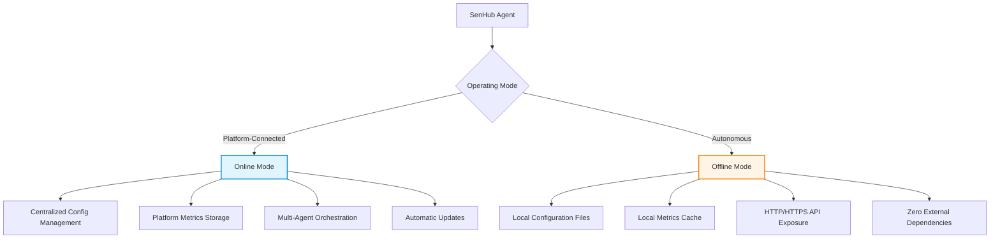
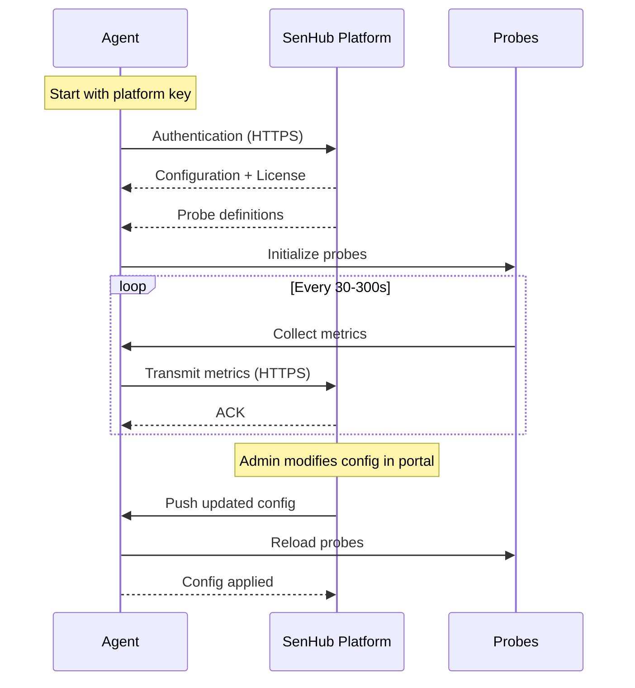
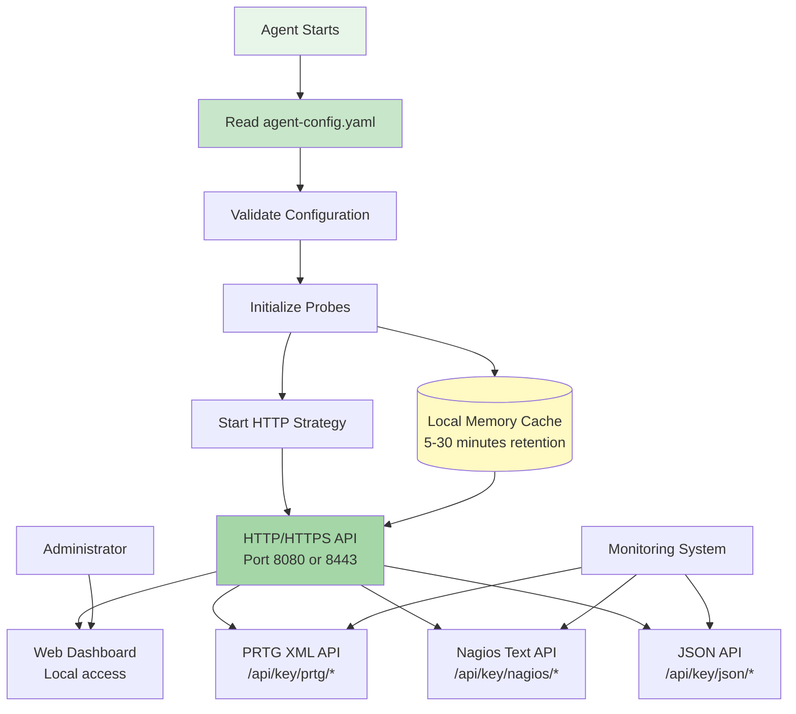
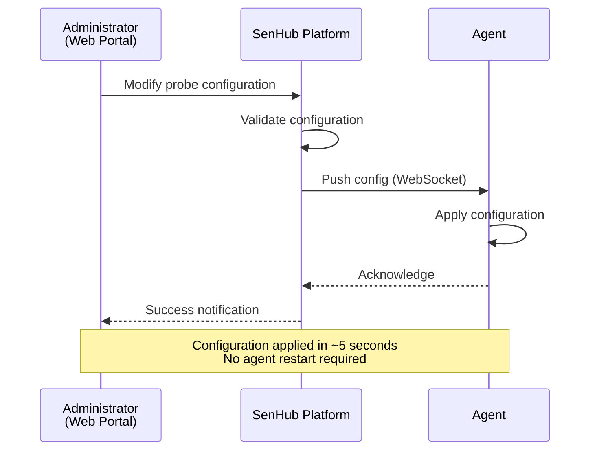
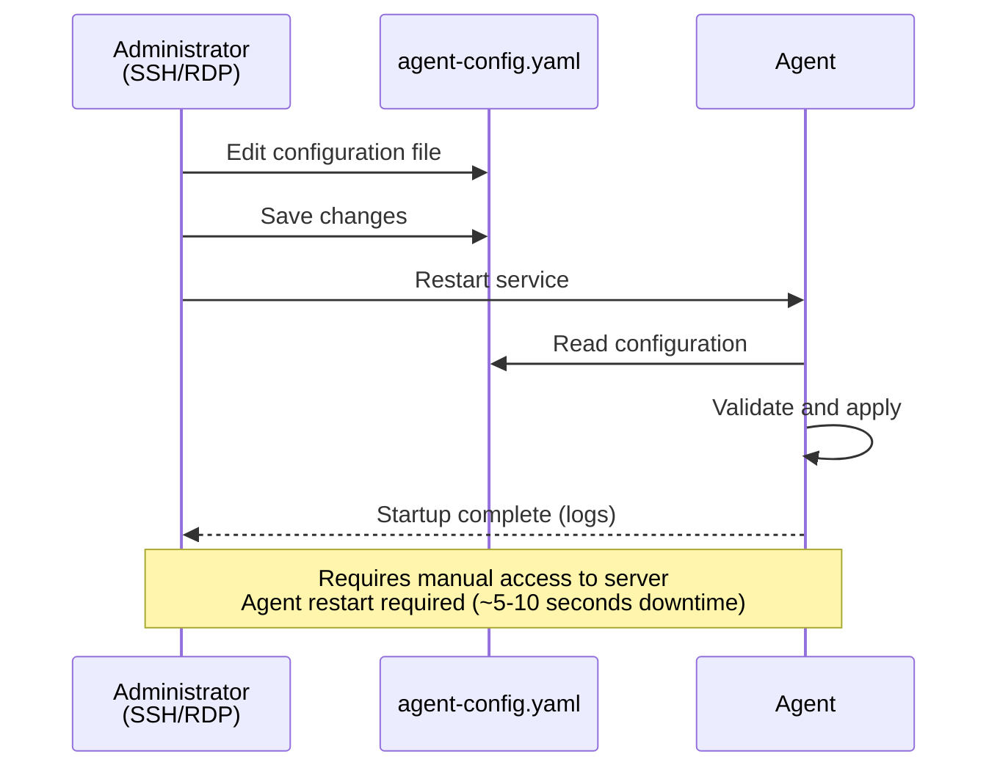
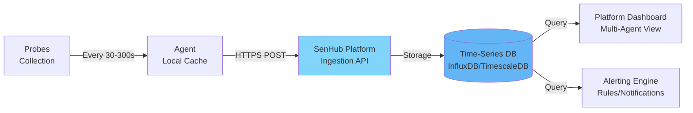
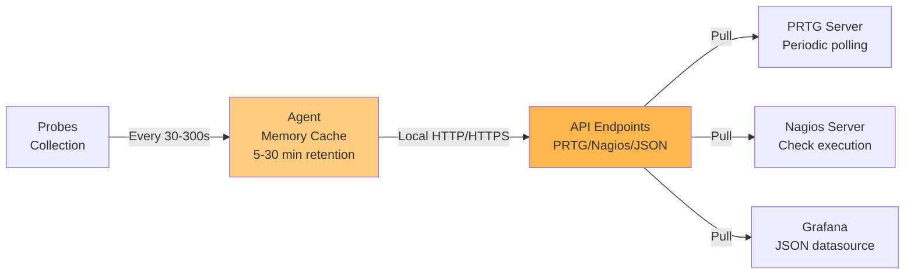
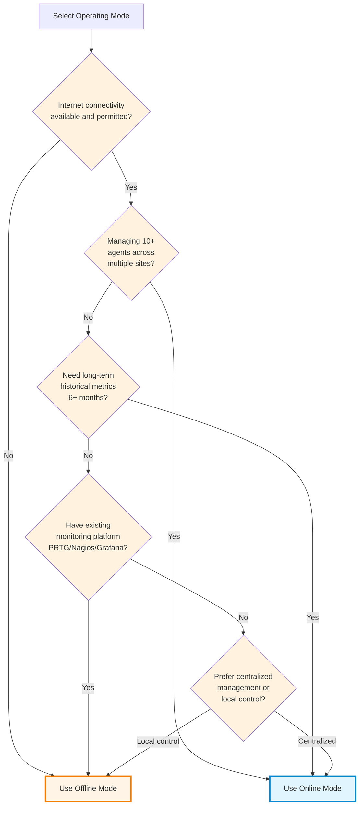
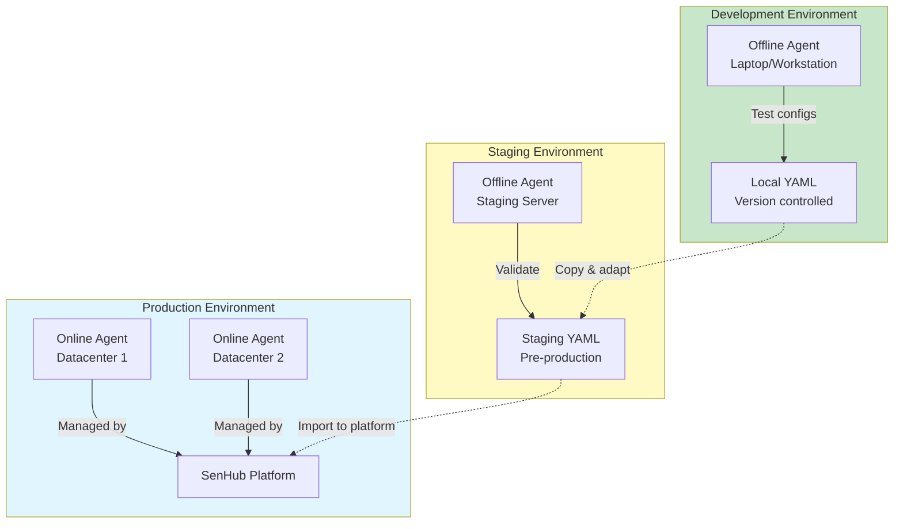

# Operating Modes

This guide explains the two distinct operating modes available in SenHub Agent: online mode (platform-connected) and offline mode (autonomous). Understanding the architectural differences and operational implications of each mode is critical for making the right deployment choice for your environment.

## Table of Contents

- [Understanding Operating Modes](#understanding-operating-modes)
- [Online Mode - Platform-Connected](#online-mode---platform-connected)
- [Offline Mode - Autonomous](#offline-mode---autonomous)
- [Architectural Comparison](#architectural-comparison)
- [Mode Selection Guidelines](#mode-selection-guidelines)
- [Switching Between Modes](#switching-between-modes)

---

## Understanding Operating Modes

Before deploying SenHub Agent, you must choose between two fundamentally different architectures that determine how the agent operates, where configuration is managed, and how metrics are accessed.

### Architectural Distinction

The two modes represent different approaches to the same monitoring problem:



**Online Mode** - Platform-managed configuration
- Configuration stored and managed centrally via SenHub platform
- Metrics transmitted to platform for long-term storage and analysis
- Requires outbound HTTPS connectivity to SenHub servers
- **Use case:** Multi-site deployments requiring centralized management (e.g., 50+ servers across multiple datacenters)

**Offline Mode** - Self-contained operation
- Configuration managed locally via YAML file
- Metrics stored in local memory cache (5-30 minutes retention)
- No outbound connectivity required
- **Use case:** Air-gapped environments, edge computing, development environments

### Key Difference: Configuration Source

The fundamental architectural difference is **where configuration originates**:

| Aspect | Online Mode | Offline Mode |
|--------|-------------|--------------|
| **Configuration source** | Downloaded from platform | Local YAML file |
| **Configuration changes** | Push from web portal (real-time) | Local file edit + agent restart |
| **Metrics storage** | Platform (persistent) + local cache | Local cache only (5-30 minutes) |
| **External connectivity** | Required (HTTPS to platform) | None (fully autonomous) |
| **Multi-agent management** | Centralized dashboard | Independent per-agent |
| **Primary access method** | Platform web interface | Local HTTP/HTTPS API |

### Installation Defaults

**Standard installation uses offline mode** by default:

```bash
# Default installation = offline mode
senhub-agent install --offline

# Online mode requires platform authentication key
senhub-agent install --authentication-key "platform-key-abc123"
```

This reflects the design philosophy: the agent should be **autonomous by default**, capable of running independently without external dependencies. Online mode is an optional integration for organizations requiring centralized multi-agent management.

---

## Online Mode - Platform-Connected

Online mode transforms SenHub Agent into a managed component of a larger monitoring infrastructure, with centralized configuration management and metrics aggregation.

### Operational Architecture



**What happens at startup:**
1. Agent authenticates to platform using provided key
2. Platform responds with configuration (probes, intervals, parameters)
3. Agent applies configuration and starts metric collection
4. Metrics are transmitted to platform every collection cycle
5. Configuration changes from platform are applied in real-time

### Features and Capabilities

#### Centralized Configuration Management

**Benefit:** Configuration for dozens or hundreds of agents managed from a single web interface.

Instead of SSH/RDP access to each server to edit YAML files, configuration is managed centrally. When you add a new probe or modify collection intervals, changes are pushed automatically to all relevant agents.

**Example scenario:** You manage 100 servers across 5 datacenters. A new Redfish probe configuration needs to be deployed to 20 iDRAC-equipped servers. With online mode:
- Add probe configuration once in the platform
- Select target agents (by tag, location, etc.)
- Push configuration (applies in seconds)
- No manual file editing or service restarts required

#### Platform Metrics Storage

**Benefit:** Long-term metrics retention with historical analysis capabilities.

Online mode transmits metrics to the platform where they are stored in a time-series database. This enables:
- Historical trend analysis (6-12 months of data)
- Capacity planning based on growth trends
- Incident correlation across time periods
- Performance baseline establishment

**Contrast with offline mode:** Offline mode retains metrics in memory for 5-30 minutes only. Historical analysis requires external integration with time-series databases like InfluxDB or Prometheus.

#### Multi-Agent Orchestration

**Benefit:** Single dashboard showing metrics from all agents across all locations.

The platform aggregates metrics from all connected agents, providing:
- Unified view of infrastructure health across sites
- Cross-datacenter correlation (identify global vs local issues)
- Fleet-wide statistics and reporting
- Centralized alerting with global context

**Example scenario:** A network issue affects connectivity between datacenters. The platform dashboard shows simultaneous latency increase across 50 agents spanning both sites, immediately identifying a network-level problem rather than individual server issues.

#### Automatic Updates

**Benefit:** Security patches and feature updates deployed automatically without manual intervention.

The platform manages agent updates:
- New versions tested and validated by SenHub
- Staged rollout capability (test on subset before full deployment)
- Rollback capability if issues detected
- No maintenance windows required for updates

### Connectivity Requirements

**Outbound HTTPS required:**
- **Destination:** `eu-west-1.intake.senhub.io`
- **Port:** 443 (HTTPS)
- **Protocol:** WebSocket over HTTPS for real-time configuration push
- **Bandwidth:** Minimal (~10-50 KB/minute per agent, varies by probe count)

**Firewall considerations:**
- Outbound connection only (no inbound ports required)
- Standard HTTPS (port 443) typically allowed by default
- If corporate proxy required, agent supports HTTP_PROXY environment variable

**Fallback behavior when platform unreachable:**

The agent maintains a local replica of the last-known-good configuration. If the platform becomes unreachable, the agent continues operating using this replicated configuration until connectivity is restored.

**Replica location:**
- **Windows:** `C:\ProgramData\SenHub\agent-config-replica.yaml`
- **Linux:** `/var/lib/senhub-agent/agent-config-replica.yaml`
- **macOS:** `/usr/local/var/senhub-agent/agent-config-replica.yaml`

### Installation for Online Mode

```bash
# Obtain authentication key from SenHub platform first
# Platform generates unique key per agent during enrollment

# Windows
.\senhub-agent.exe install --authentication-key "your-platform-key"

# Linux
sudo senhub-agent install --authentication-key "your-platform-key"

# macOS
sudo senhub-agent install --authentication-key "your-platform-key"
```

**Generated configuration file:**

```yaml
config_version: 2

agent:
  key: "platform-provided-key-abc123def456"
  mode: online
  license: "eyJhbGciOiJSUzI1NiIs..."  # If license required

auto_update:
  enabled: true
  url: "https://eu-west-1.intake.senhub.io/releases"

cache:
  retention_minutes: 5

# Configuration downloaded from platform
# Probes, storage, and other settings managed by platform
```

**Key observation:** The configuration file in online mode is minimal. Probe definitions, collection intervals, and other operational parameters are managed by the platform and downloaded at runtime.

### When to Use Online Mode

**Ideal deployment scenarios:**

1. **Multi-site enterprises** managing dozens or hundreds of servers across multiple physical locations
2. **Cloud-native deployments** on AWS, Azure, or GCP where outbound HTTPS is available and cost-effective
3. **Managed service providers** offering monitoring-as-a-service to customers
4. **Organizations requiring centralized audit trails** of all configuration changes

**Resource implications:**
- **Network:** ~10-50 KB/min outbound bandwidth per agent
- **Storage:** None locally (metrics stored on platform)
- **Operational overhead:** Minimal (configuration managed centrally)

---

## Offline Mode - Autonomous

Offline mode provides a completely self-contained monitoring solution that operates independently without external dependencies. This architecture is designed for air-gapped environments, edge computing, and scenarios where external connectivity is unavailable or prohibited.

### Operational Architecture



**What happens at startup:**
1. Agent reads configuration from local YAML file
2. Configuration is validated (syntax, probe types, parameters)
3. Probes are initialized based on configuration
4. HTTP/HTTPS server starts on configured port
5. Metrics become available via local API immediately

**No external connectivity required at any point.**

### Features and Capabilities

#### Local Configuration Management

**Benefit:** Complete control over agent behavior via version-controlled configuration files.

Configuration is managed through direct file editing, enabling:
- **Infrastructure-as-Code:** Configuration files stored in Git, deployed via Ansible/Puppet
- **Change tracking:** Full audit trail via Git history
- **Peer review:** Configuration changes reviewed before deployment
- **Automated deployment:** CI/CD pipelines can modify and deploy configurations

**Example scenario:** You manage a production environment with strict change control procedures. All configuration changes must be:
1. Proposed via pull request
2. Reviewed by senior operations team
3. Approved by security team
4. Deployed during maintenance window

Offline mode's file-based configuration integrates naturally with these processes.

#### Local Metrics API

**Benefit:** Metrics exposed via HTTP/HTTPS interface for consumption by existing monitoring platforms.

The agent provides a multi-format REST API:

**PRTG Network Monitor:**
```
https://server:8443/api/{key}/prtg/metrics/cpu
https://server:8443/api/{key}/prtg/metrics/redfish
```

**Nagios/Icinga:**
```
https://server:8443/api/{key}/nagios/status
https://server:8443/api/{key}/nagios/metrics/memory
```

**Custom integration (JSON):**
```
https://server:8443/api/{key}/json/metrics
https://server:8443/api/{key}/json/metrics/network
```

This architecture allows integration with existing monitoring infrastructure without requiring agent-to-platform connectivity.

#### Zero External Dependencies

**Benefit:** Operates in environments with no internet access, including air-gapped datacenters and secure facilities.

Offline mode requires no external connectivity:
- No outbound connections to SenHub platform
- No DNS lookups for platform endpoints
- No external certificate authorities required (self-signed certs supported)
- No dependency on external services for operation

**Example scenario:** A pharmaceutical manufacturing facility operates an air-gapped network for regulatory compliance (21 CFR Part 11). The monitoring infrastructure must operate entirely within the isolated network. Offline mode satisfies this requirement while providing comprehensive monitoring capabilities.

#### Local Web Dashboard

**Benefit:** Visual monitoring interface accessible via browser without external dependencies.

The built-in web dashboard provides:
- **Real-time metrics display** for all configured probes
- **API Explorer** for testing and debugging API endpoints
- **Probe status diagnostics** showing collection intervals and last update times
- **License information** and expiration status

**Access URL format:**
```
http(s)://server:port/web/{agent-key}/dashboard
```

### Installation for Offline Mode

**HTTP installation (development/testing):**

```bash
# All platforms - binds to localhost only
senhub-agent install --offline

# Access dashboard
http://localhost:8080/web/{generated-uuid}/dashboard
```

**Configuration created:**
- **Port:** 8080
- **Bind address:** 127.0.0.1 (localhost only)
- **Protocol:** HTTP (unencrypted)

**Use case:** Local development, testing configurations before production deployment.

**HTTPS installation (production):**

```bash
# With auto-generated self-signed certificates
senhub-agent install --offline --enable-https

# With custom CA-signed certificates
senhub-agent install --offline --enable-https \
  --cert-file /etc/ssl/certs/monitoring.crt \
  --key-file /etc/ssl/private/monitoring.key
```

**Configuration created:**
- **Port:** 8443
- **Bind address:** 0.0.0.0 (network accessible)
- **Protocol:** HTTPS with TLS 1.2+
- **Certificates:** Auto-generated (365 days validity) or custom

**Use case:** Production deployments where metrics are accessed from network monitoring systems (PRTG, Nagios) running on separate servers.

### Configuration File Structure

**Generated configuration (offline mode):**

```yaml
# SenHub Agent Configuration
# Configuration Version: 2 (automatically managed)
# Agent Version: 0.1.72
# Generated: 2025-12-19 10:30:00 UTC

config_version: 2

# Agent configuration
agent:
  key: "f47ac10b-58cc-4372-a567-0e02b2c3d479"  # Auto-generated UUID
  mode: offline
  # license: ""  # Add Pro/Enterprise license if needed

# Auto-update configuration
auto_update:
  enabled: true  # Checks for updates if internet available
  url: "https://eu-west-1.intake.senhub.io/releases"

# Cache configuration
cache:
  retention_minutes: 5  # Metrics retained in memory

# HTTP/HTTPS interface
storage:
  - name: http
    params:
      port: 8443
      bind_address: "0.0.0.0"
      endpoints: ["prtg", "web", "nagios"]
      tls:
        enabled: true
        cert_file: "/etc/senhub-agent/certs/agent.crt"
        key_file: "/etc/senhub-agent/certs/agent.key"

# Monitoring probes (default: basic system monitoring)
probes:
  - name: cpu
    type: cpu
    params:
      interval: 30

  - name: memory
    type: memory
    params:
      interval: 30

  - name: network
    type: network
    params:
      interval: 60

  - name: logicaldisk
    type: logicaldisk
    params:
      interval: 30
```

**Key characteristics:**
- **Self-contained:** All operational parameters defined in this file
- **Editable:** Modify probes, intervals, bind addresses directly
- **Versionable:** Can be stored in Git for change tracking
- **Portable:** Copy to other servers for consistent configuration

### Modifying Configuration

**Workflow for adding new probes or changing parameters:**

```bash
# Step 1: Edit configuration file
sudo nano /etc/senhub-agent/agent-config.yaml

# Step 2: Add probe configuration
# Example: Add Redfish probe for hardware monitoring
probes:
  - name: "Production Server iDRAC"
    type: redfish
    params:
      endpoint: "https://idrac-srv01.company.com"
      username: "monitoring"
      password: "SecurePassword"
      interval: 300
      verify_ssl: true

# Step 3: Save file

# Step 4: Restart agent to apply changes
sudo systemctl restart senhub-agent  # Linux
Restart-Service SenHubAgent  # Windows PowerShell
sudo launchctl unload /Library/LaunchDaemons/io.senhub.agent.plist && \
sudo launchctl load /Library/LaunchDaemons/io.senhub.agent.plist  # macOS

# Step 5: Verify probe is running
curl http://localhost:8080/api/{key}/json/metrics
```

**Operational consideration:** Configuration changes require agent restart. For production environments, plan configuration changes during maintenance windows or implement blue-green deployment strategies.

### When to Use Offline Mode

**Ideal deployment scenarios:**

1. **Air-gapped datacenters** in military, government, or critical infrastructure where external connectivity is prohibited
2. **Edge computing deployments** at remote sites with expensive or unreliable connectivity (e.g., offshore platforms, remote mining operations)
3. **Regulatory compliance environments** where data transmission outside the facility is restricted (HIPAA, PCI-DSS, classified networks)
4. **Development and testing** where quick setup without platform enrollment is desired
5. **Proof-of-concept demonstrations** for customers requiring rapid deployment

**Resource implications:**
- **Network:** Zero external bandwidth (operates fully offline)
- **Storage:** Minimal (metrics in memory, logs on disk)
- **Operational overhead:** Higher (manual configuration management per agent)

---

## Architectural Comparison

### Configuration Management Workflow

**Online Mode:**



**Operational time:** 5-10 seconds from portal change to active probe.

**Offline Mode:**



**Operational time:** 2-5 minutes depending on remote access speed and restart duration.

### Data Flow Architecture

**Online Mode - Metrics to Platform:**



**Implications:**
- **Retention:** Unlimited historical data (subject to plan limits)
- **Analysis:** Platform-provided analytics and dashboards
- **Alerting:** Integrated alerting with correlation across agents

**Offline Mode - Metrics via Local API:**



**Implications:**
- **Retention:** 5-30 minutes in memory only
- **Analysis:** External monitoring system responsibility
- **Alerting:** External monitoring system provides alerting

### Security Model Differences

| Aspect | Online Mode | Offline Mode |
|--------|-------------|--------------|
| **Authentication** | Platform-issued key (revocable) | Self-generated UUID (local only) |
| **TLS certificates** | Platform-managed or custom | Self-signed or custom |
| **Network exposure** | Outbound HTTPS only | HTTP/HTTPS listener (inbound) |
| **Data transmission** | Metrics leave local network | Metrics remain on local network |
| **Access control** | Platform-based (user accounts, SSO) | HTTP API key-based |
| **Audit logging** | Centralized on platform | Local log files only |

**Security consideration for offline mode:** If the agent is network-accessible (HTTPS enabled with bind_address: "0.0.0.0"), ensure proper firewall rules restrict access to trusted monitoring systems only. The agent key provides authentication, but network segmentation is still critical.

### Resource Consumption Comparison

Based on testing with typical probe configurations (CPU, memory, disk, network, 2x Redfish):

| Resource | Online Mode | Offline Mode | Notes |
|----------|-------------|--------------|-------|
| **CPU usage** | 2-4% | 2-3% | Online mode slightly higher due to HTTPS transmission |
| **Memory usage** | 90-150 MB | 80-120 MB | Online mode maintains websocket connection |
| **Disk I/O** | Minimal (logs only) | Minimal (logs only) | Neither mode persists metrics to disk |
| **Network bandwidth** | 10-50 KB/min outbound | 0 KB (unless polled) | Online mode transmits metrics continuously |
| **Storage requirements** | ~500 MB (binary + logs) | ~500 MB (binary + logs) | Equivalent disk space requirements |

---

## Mode Selection Guidelines

### Decision Criteria

**Choose Online Mode when:**

1. **You manage multiple agents** (10+ servers across multiple sites)
   - Centralized configuration reduces operational overhead significantly
   - Single dashboard view of entire infrastructure
   - Configuration changes deploy in seconds across all agents

2. **Historical analysis is required**
   - Long-term trend analysis (6-12 months of data)
   - Capacity planning based on growth patterns
   - Performance baseline establishment

3. **Outbound HTTPS is available and acceptable**
   - No air-gap requirements
   - Network policy permits outbound HTTPS to external services
   - Bandwidth cost is negligible

4. **Automatic updates are desired**
   - Security patches deployed automatically
   - New features available immediately
   - No manual update coordination required

**Choose Offline Mode when:**

1. **Air-gapped environment**
   - No external connectivity available or permitted
   - Military, government, or critical infrastructure installations
   - Regulatory compliance prohibits external data transmission

2. **Single or small number of agents** (1-10 servers in single location)
   - Configuration management overhead acceptable
   - No need for multi-agent dashboard
   - Prefer direct control over configuration

3. **Integration with existing monitoring**
   - Existing PRTG, Nagios, or Grafana installation
   - Prefer pull-based metrics collection
   - Monitoring system provides alerting and retention

4. **Development and testing**
   - Quick setup without platform enrollment
   - Iterate on configuration rapidly
   - No cloud dependencies during development

### Decision Tree



### Deployment Pattern Examples

**Example 1: Multi-site enterprise**
- **Scenario:** 150 servers across 5 datacenters
- **Choice:** Online Mode
- **Reasoning:** Centralized management essential for this scale; outbound HTTPS acceptable in enterprise datacenter environment; need unified dashboard across all sites

**Example 2: Industrial control system**
- **Scenario:** Manufacturing facility with isolated OT network
- **Choice:** Offline Mode
- **Reasoning:** Air-gapped network required by security policy; monitoring system (PRTG) already deployed within isolated network; external connectivity prohibited

**Example 3: Cloud-native deployment**
- **Scenario:** Microservices on AWS ECS/EKS
- **Choice:** Online Mode
- **Reasoning:** Outbound HTTPS readily available; dynamic scaling requires automated configuration management; metrics aggregation across ephemeral containers

**Example 4: Edge computing**
- **Scenario:** Remote monitoring stations with satellite connectivity
- **Choice:** Offline Mode
- **Reasoning:** Bandwidth expensive and unreliable; local monitoring sufficient; metrics polled by regional PRTG server during scheduled windows

---

## Switching Between Modes

### Online to Offline Conversion

**Scenario:** Converting a platform-managed agent to autonomous operation.

**Use case:** Migrating agent from cloud deployment to air-gapped datacenter, or decommissioning platform subscription while retaining monitoring capabilities.

**Procedure:**

```bash
# Step 1: Stop the agent
sudo systemctl stop senhub-agent  # Linux
Stop-Service SenHubAgent  # Windows PowerShell

# Step 2: Backup current replicated configuration
# Online agents maintain a local replica that can be converted
sudo cp /var/lib/senhub-agent/agent-config-replica.yaml \
        /etc/senhub-agent/agent-config.yaml

# Step 3: Edit configuration to switch mode
sudo nano /etc/senhub-agent/agent-config.yaml

# Change:
agent:
  mode: offline  # Was "online"

# Step 4: Add HTTP strategy for local API access
storage:
  - name: http
    params:
      port: 8443
      bind_address: "0.0.0.0"
      endpoints: ["prtg", "web", "nagios"]
      tls:
        enabled: true
        min_tls_version: "1.2"

# Step 5: Restart agent
sudo systemctl start senhub-agent

# Step 6: Verify local API accessibility
curl -k https://localhost:8443/api/{agent-key}/info/system
```

**Post-conversion considerations:**
- **Metrics access:** Configure PRTG/Nagios to poll local API endpoints
- **Configuration management:** Future changes via file editing, not platform
- **Updates:** Auto-update still works if internet available, otherwise manual
- **License:** Existing license (if any) remains valid

### Offline to Online Conversion

**Scenario:** Converting an autonomous agent to platform-managed operation.

**Use case:** Scaling from single-server deployment to multi-site infrastructure requiring centralized management.

**Prerequisites:**
- Obtain authentication key from SenHub platform (enroll agent in platform)
- Ensure outbound HTTPS connectivity to platform endpoint

**Procedure:**

```bash
# Step 1: Obtain platform key
# Login to SenHub platform → Agents → Enroll New Agent → Generate Key

# Step 2: Stop the agent
sudo systemctl stop senhub-agent

# Step 3: Backup existing offline configuration
sudo cp /etc/senhub-agent/agent-config.yaml \
        /etc/senhub-agent/agent-config-offline-backup.yaml

# Step 4: Modify configuration
sudo nano /etc/senhub-agent/agent-config.yaml

# Replace:
agent:
  key: "your-platform-provided-key"  # Replace local UUID
  mode: online  # Was "offline"

# Remove or comment out local probe definitions
# Probes will now be managed by platform

# Step 5: Restart agent
sudo systemctl start senhub-agent

# Step 6: Verify platform connection
sudo tail -f /var/log/senhub-agent/agent.log
# Wait for log message: "Connected to SenHub platform"

# Step 7: Verify in platform dashboard
# Platform should show agent as "Online" with green status indicator
```

**Post-conversion considerations:**
- **Configuration source:** Local probe definitions ignored; platform configuration takes precedence
- **Metrics destination:** Metrics transmitted to platform; local HTTP API optional (configure via platform)
- **Monitoring integration:** Update PRTG/Nagios to query platform API instead of local agent API (or keep local API enabled via HTTP strategy)

### Hybrid Deployment Strategy

**Scenario:** Using both modes across different environments (development, staging, production).

**Architecture:**



**Workflow:**
1. **Develop:** Test probe configurations in offline mode on local workstation
2. **Stage:** Validate configurations in staging environment (offline mode)
3. **Deploy:** Import validated configuration to platform, push to production agents (online mode)

**Benefits:**
- Development/testing independent of platform connectivity
- Production enjoys centralized management benefits
- Configuration progression follows standard SDLC

---

## Summary

Operating mode selection is a fundamental architectural decision that affects configuration management, metrics storage, network requirements, and operational workflows. Understanding the implications of each mode ensures the deployment aligns with your infrastructure requirements, security policies, and operational capabilities.

**Quick reference:**
- **Online Mode:** Best for multi-site deployments requiring centralized management, long-term metrics storage, and automatic updates
- **Offline Mode:** Best for air-gapped environments, edge computing, single-site deployments, and integration with existing monitoring platforms

**Next steps:**
- [Agent Configuration](./AGENT-CONFIGURATION.md) - Configure license, cache, and auto-update settings
- [HTTP/HTTPS Configuration](./HTTP-HTTPS-CONFIGURATION.md) - Configure local API endpoint and TLS certificates
- [Probes Configuration](./PROBES-CONFIGURATION.md) - Add monitoring probes for your infrastructure
