# SenHub Agent - Operating Modes

## Table of Contents

- [Overview](#overview)
- [Online Mode (Connected)](#online-mode-connected)
- [Offline Mode (Autonomous)](#offline-mode-autonomous)
- [Detailed Comparison](#detailed-comparison)
- [Switching Between Modes](#switching-between-modes)
- [Use Cases by Mode](#use-cases-by-mode)

---

## Overview

SenHub Agent supports two distinct operating modes, adapted to different environments and needs:

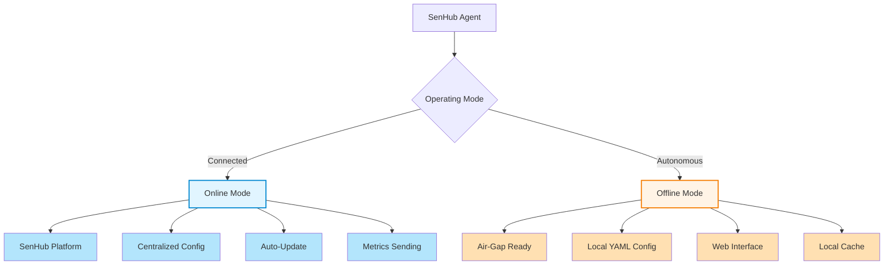

### Quick Comparison Table

| Aspect | Online Mode 🌐 | Offline Mode 🔒 |
|--------|----------------|-----------------|
| **External connection** | ✅ Required (SenHub platform) | ❌ Not needed |
| **Configuration** | Downloaded from server | Local `agent-config.yaml` file |
| **Agent Key** | Provided by platform | Locally generated (UUID v4) |
| **Probe updates** | Automatic push from server | Local file modification |
| **Metrics storage** | SenHub sending + local cache | Local cache only |
| **Web Interface** | Optional (HTTP strategy) | Main access interface |
| **Auto-update agent** | Automatic | Manual or automatic (if internet) |
| **Use case** | Centralized multi-site monitoring | Air-gap, edge, dev, POC |

---

## Online Mode (Connected)

### Operating Principle

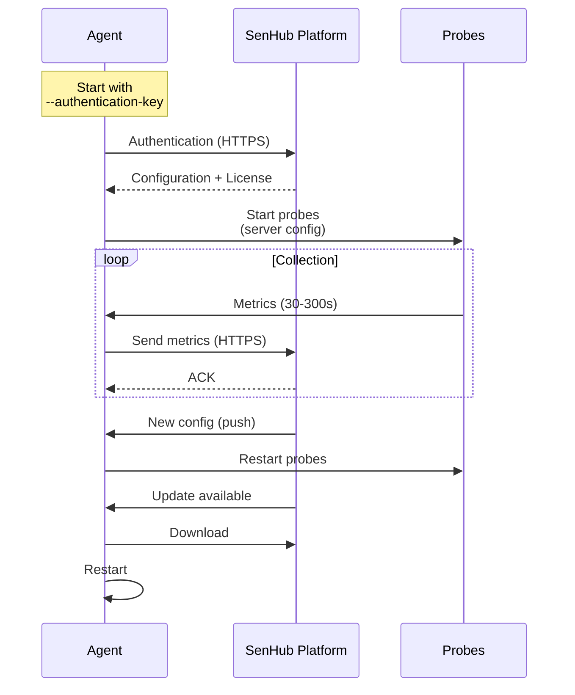

### Features

#### ✅ Advantages

1. **Centralized Configuration**
   - Management from SenHub web platform
   - Real-time configuration push
   - No SSH/RDP needed for modifications

2. **Centralized Monitoring**
   - Multi-agent visualization in single dashboard
   - Centralized alerting
   - Long-term history

3. **Auto-Update**
   - Automatic agent updates
   - New probes deployed automatically
   - Zero-downtime updates

4. **Secure Authentication**
   - Key provided by platform
   - Revocation possible from portal
   - Managed TLS certificates

#### ❌ Limitations

1. **Connection Required**
   - Internet mandatory (HTTPS to `eu-west-1.intake.senhub.io`)
   - Can be blocked by proxy/firewall
   - Latency depends on location

2. **Platform Dependency**
   - If platform unreachable, uses locally replicated config
   - Requires active SenHub account

### Online Mode Installation

```bash
# Windows
.\senhub-agent.exe install --authentication-key "YOUR_PLATFORM_KEY"

# Linux
sudo senhub-agent install --authentication-key "YOUR_PLATFORM_KEY"

# macOS
sudo senhub-agent install --authentication-key "YOUR_PLATFORM_KEY"
```

**📸 SCREENSHOT TO INSERT**: SenHub portal with "Agent Keys" section showing a generated key

### Generated Configuration (Online Mode)

```yaml
config_version: 2

agent:
  key: "platform-provided-key-abc123def456"  # Provided by SenHub
  mode: online
  license: "eyJhbGciOiJSUzI1NiIs..."         # JWT (if applicable)

auto_update:
  enabled: true
  url: "https://eu-west-1.intake.senhub.io/releases"

cache:
  retention_minutes: 5

# Configuration downloaded from server
# Probes, storage, etc. managed by platform
```

### Local Replication (Fallback)

The agent automatically creates a local copy of the server configuration:

**Replication path**
- Windows: `C:\ProgramData\SenHub\agent-config-replica.yaml`
- Linux: `/var/lib/senhub-agent/agent-config-replica.yaml`
- macOS: `/usr/local/var/senhub-agent/agent-config-replica.yaml`

**Usage**
If the platform becomes unreachable, the agent uses the local replication to continue operating.

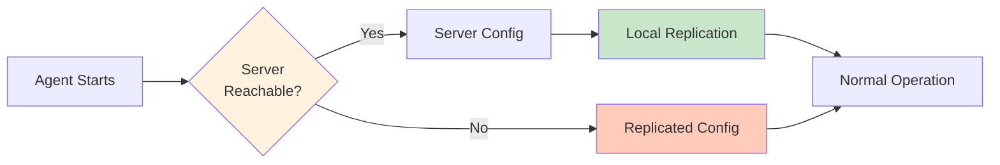

### Typical Environments

- **Datacenters with internet**: Centralized monitoring of dozens/hundreds of servers
- **Cloud**: AWS, Azure, GCP with outbound HTTPS access
- **Remote offices**: Sites with stable internet connection
- **Monitoring-as-a-Service**: Managed monitoring offering for customers

---

## Offline Mode (Autonomous)

### Operating Principle

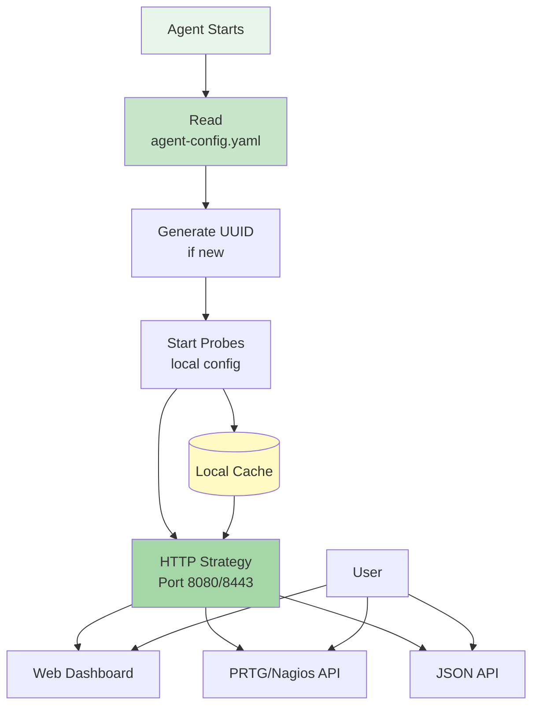

### Features

#### ✅ Advantages

1. **Zero External Dependency**
   - Works without internet
   - Ideal for air-gapped environments
   - No risk of data leakage

2. **Local File Configuration**
   - Complete control via YAML
   - Versionable (Git, Ansible, etc.)
   - Infrastructure as Code

3. **Local Web Interface**
   - Locally accessible monitoring dashboard
   - Complete REST API (PRTG, Nagios, JSON)
   - Downloadable PRTG lookups

4. **Quick to Deploy**
   - 2-minute installation
   - No platform account needed
   - Ideal for POC and development

#### ❌ Limitations

1. **Manual Configuration**
   - Modifications via SSH/RDP + YAML editing
   - No centralized push
   - Requires restart for changes

2. **No Long-Term History**
   - Memory cache only (5-30 minutes)
   - No integrated time-series database
   - Export to external system if needed

3. **Local Monitoring Only**
   - No centralized multi-agent view
   - Alerting managed via PRTG/Nagios/other

### Offline Mode Installation

#### HTTP Installation (Localhost only)

```bash
# All platforms
senhub-agent install --offline

# Access
http://localhost:8080/web/{UUID}/dashboard
```

**Use case**: Development, local testing

#### HTTPS Installation (Production)

```bash
# With auto-generated certificates
senhub-agent install --offline --enable-https

# With custom certificates
senhub-agent install --offline --enable-https \
  --cert-file /etc/ssl/certs/server.crt \
  --key-file /etc/ssl/private/server.key

# Access
https://monitoring.local:8443/web/{UUID}/dashboard
```

**Use case**: Air-gap production, edge computing

**📸 SCREENSHOT TO INSERT**: Terminal showing offline installation with UUID generation and message "Agent key: f47ac10b-58cc-4372-a567-0e02b2c3d479"

### Generated Configuration (Offline Mode)

```yaml
# SenHub Agent Configuration
# Configuration Version: 2 (automatically managed)
# Agent Version: 0.1.80-beta
# Generated: 2025-12-18 10:30:00 CET

config_version: 2

# Agent configuration
agent:
  key: "f47ac10b-58cc-4372-a567-0e02b2c3d479"  # Generated UUID
  mode: offline
  # license: ""  # Uncomment and add license if needed

# Auto-update configuration
auto_update:
  enabled: true  # Checks updates if internet available
  url: "https://eu-west-1.intake.senhub.io/releases"

# Cache configuration
cache:
  retention_minutes: 5  # Metrics retention duration in memory

# Local storage with web interface
storage:
  - name: http
    params:
      port: 8080               # 8443 if HTTPS
      bind_address: "127.0.0.1"  # "0.0.0.0" if HTTPS
      endpoints: ["prtg", "web", "nagios"]

# Active probes (default system monitoring)
probes:
  - name: cpu
    type: cpu
    params:
      interval: 30

  - name: memory
    type: memory
    params:
      interval: 30

  - name: network
    type: network
    params:
      interval: 60

  - name: logicaldisk
    type: logicaldisk
    params:
      interval: 30
```

### Configuration Modification

```bash
# 1. Edit the file
sudo nano /etc/senhub-agent/agent-config.yaml

# 2. Example: Add Redfish probe
probes:
  - name: "Production iDRAC"
    type: redfish
    params:
      endpoint: "https://idrac.company.com"
      username: "admin"
      password: "secret"
      interval: 300

# 3. Restart agent
sudo systemctl restart senhub-agent  # Linux
sudo launchctl unload /Library/LaunchDaemons/io.senhub.agent.plist && \
sudo launchctl load /Library/LaunchDaemons/io.senhub.agent.plist  # macOS
```

**📸 SCREENSHOT TO INSERT**: nano/vi editor with agent-config.yaml file open showing configured redfish probe

### Typical Environments

- **Air-Gapped Datacenters**: Installations without internet connection (security, military, industrial)
- **Edge Computing**: Remote sites with limited or expensive connectivity
- **Local Development**: Testing and development of custom probes
- **POC and Demos**: Quick installation for customer demonstrations
- **Regulated Environments**: Sectors prohibiting external data transmission

---

## Detailed Comparison

### Network Architecture

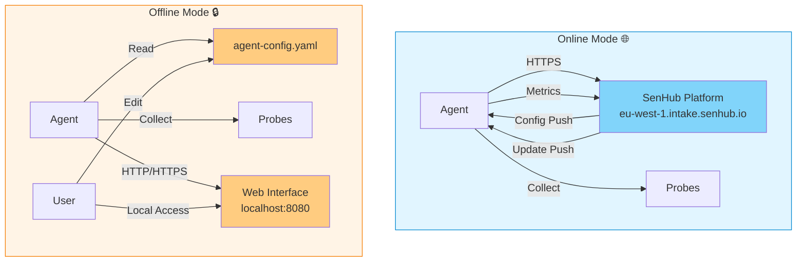

### Configuration Flow

#### Online Mode

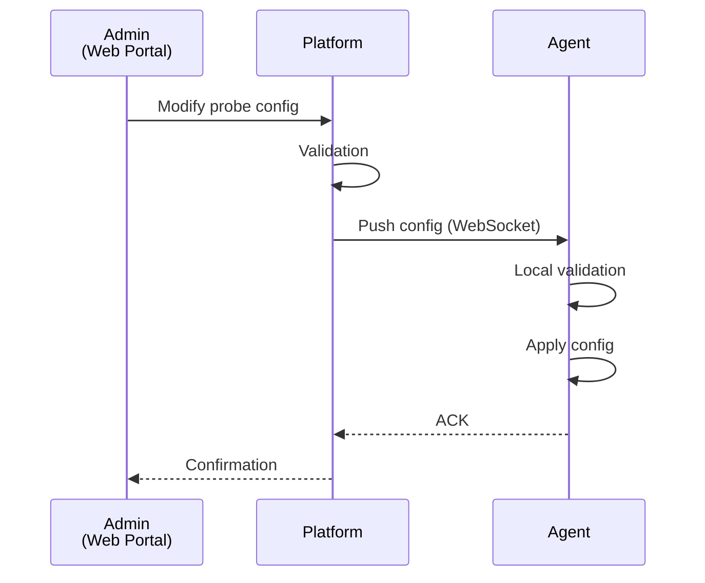

#### Offline Mode

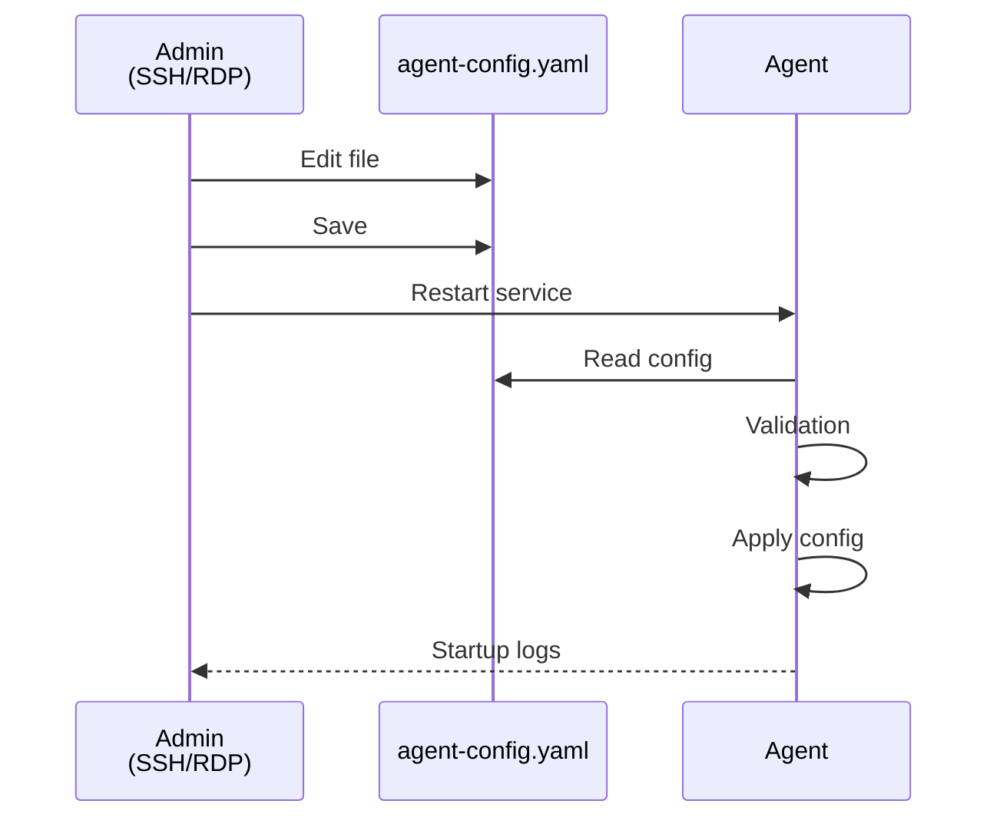

### Data Flow

#### Online Mode

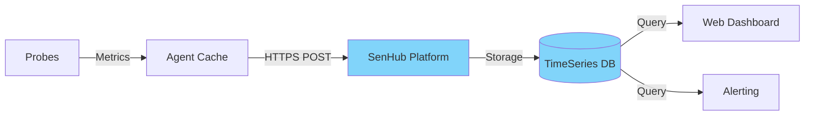

#### Offline Mode

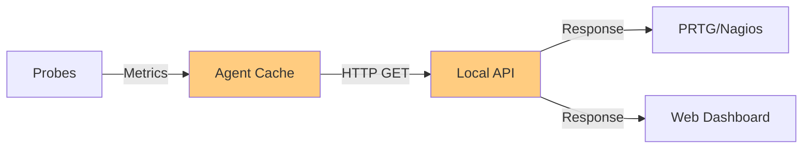

### Feature Matrix

| Feature | Online Mode | Offline Mode | Notes |
|---------|-------------|--------------|-------|
| **Installation** | Key required | Autonomous | Offline: auto-generated UUID |
| **Configuration** | Web portal | YAML file | Online: real-time push |
| **Supported probes** | All | All | According to license |
| **Agent auto-update** | Automatic | Manual/Auto | Offline: if internet available |
| **Web Dashboard** | Optional | Mandatory | Offline: main access |
| **PRTG API** | Via HTTP strategy | Yes (local) | - |
| **Nagios API** | Via HTTP strategy | Yes (local) | - |
| **Alerting** | Integrated platform | Via PRTG/Nagios | - |
| **History** | Unlimited (cloud) | Memory cache | Offline: 5-30 minutes |
| **Multi-agents** | Centralized view | No | Online: global dashboard |
| **Air-gap ready** | No | Yes | Offline: zero dependency |
| **Cost** | According to tier | Free | Online: subscription possible |

---

## Switching Between Modes

### Online → Offline

**Scenario**: Switch from connected installation to autonomous installation

```bash
# 1. Stop agent
sudo systemctl stop senhub-agent

# 2. Backup replicated config
sudo cp /var/lib/senhub-agent/agent-config-replica.yaml \
        /etc/senhub-agent/agent-config.yaml

# 3. Modify mode
sudo nano /etc/senhub-agent/agent-config.yaml

# Change:
agent:
  mode: offline  # Was "online"

# 4. Add HTTP strategy if absent
storage:
  - name: http
    params:
      port: 8080
      bind_address: "127.0.0.1"
      endpoints: ["prtg", "web", "nagios"]

# 5. Restart
sudo systemctl start senhub-agent
```

**📸 SCREENSHOT TO INSERT**: Config file with change from `mode: online` → `mode: offline` highlighted

### Offline → Online

**Scenario**: Connect autonomous agent to platform

```bash
# 1. Obtain authentication key from SenHub portal

# 2. Stop agent
sudo systemctl stop senhub-agent

# 3. Modify configuration
sudo nano /etc/senhub-agent/agent-config.yaml

# Replace:
agent:
  key: "YOUR_PLATFORM_KEY"  # Replace UUID
  mode: online               # Was "offline"

# 4. Restart
sudo systemctl start senhub-agent

# 5. Verify connection
sudo tail -f /var/log/senhub-agent/agent.log
# Wait for: "Connected to SenHub platform"
```

### Hybrid Migration

**Scenario**: Use both modes (dev offline, prod online)

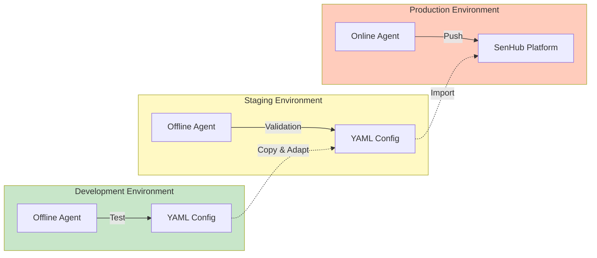

**Workflow**

1. **Development**: Offline mode, test configurations
2. **Staging**: Offline mode, validation before prod
3. **Production**: Online mode, centralized monitoring

---

## Use Cases by Mode

### When to Use Online Mode

#### ✅ Ideal Scenarios

1. **Multi-Site Monitoring**
   - Multiple datacenters/offices to monitor
   - Centralized view needed
   - Unified alerting

2. **Centralized Management**
   - DevOps/SRE team with web portal
   - Need to modify configs remotely
   - Rapid deployment of new probes

3. **Long-Term History**
   - Need metrics over 6-12 months
   - Trend analysis
   - Capacity planning

4. **Critical Auto-Update**
   - Vulnerabilities fixed quickly
   - Automatic new features
   - No manual intervention

#### 📊 Example: Multi-Datacenter E-commerce


**Benefits**
- Single view for 3 datacenters
- Correlated alerts (multi-site incident)
- New probe deployment in 1 click

---

### When to Use Offline Mode

#### ✅ Ideal Scenarios

1. **Air-Gapped Environments**
   - Military, government datacenters
   - Critical industry (energy, healthcare)
   - Mandatory network isolation

2. **Edge Computing**
   - Remote sites without reliable internet
   - Prohibitive connection cost (satellite, 4G)
   - Unacceptable latency

3. **Development and Testing**
   - Custom probe development
   - Customer POC without platform setup
   - CI/CD pipelines

4. **Regulatory Compliance**
   - Strict GDPR (no external data sending)
   - Banking/financial sector
   - Medical data (HIPAA)

#### 📊 Example: Isolated Production Plant


**Benefits**
- Zero internet dependency
- Data doesn't leave the plant
- Real-time supervision via local PRTG

---

## Summary and Recommendations

### Decision Tree

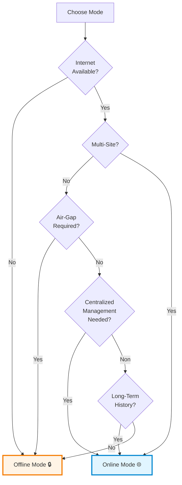

### Final Recommendations

| Environment | Recommended Mode | Reason |
|-------------|------------------|--------|
| **Multi-Site Enterprise** | Online 🌐 | Centralized management, overview |
| **Single Datacenter** | Offline 🔒 | Autonomy, no external dependency |
| **Cloud (AWS/Azure/GCP)** | Online 🌐 | Internet available, easy scaling |
| **Edge/IoT** | Offline 🔒 | Limited connectivity, latency |
| **Development** | Offline 🔒 | Quick setup, no account needed |
| **Air-Gap** | Offline 🔒 | Mandatory isolation |
| **Monitoring as a Service** | Online 🌐 | Multi-tenancy, billing |

---

**Next steps**:
- **Agent configuration**: [AGENT-CONFIGURATION.md](./AGENT-CONFIGURATION.md)
- **HTTPS/TLS configuration**: [HTTP-HTTPS-CONFIGURATION.md](./HTTP-HTTPS-CONFIGURATION.md)
- **Probe configuration**: [PROBES-CONFIGURATION.md](./PROBES-CONFIGURATION.md)
