# SenHub Agent - Modes de Fonctionnement

## Table des Matières

- [Vue d'Ensemble](#vue-densemble)
- [Mode Online (Connecté)](#mode-online-connecté)
- [Mode Offline (Autonome)](#mode-offline-autonome)
- [Comparaison Détaillée](#comparaison-détaillée)
- [Basculement Entre Modes](#basculement-entre-modes)
- [Cas d'Usage par Mode](#cas-dusage-par-mode)

---

## Vue d'Ensemble

L'agent SenHub supporte deux modes de fonctionnement distincts, adaptés à différents environnements et besoins :

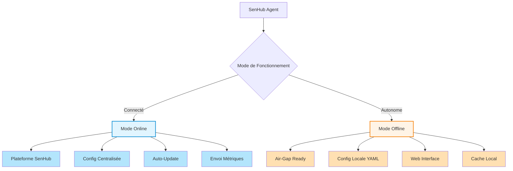

### Tableau Comparatif Rapide

| Aspect | Mode Online 🌐 | Mode Offline 🔒 |
|--------|----------------|-----------------|
| **Connexion externe** | ✅ Requise (plateforme SenHub) | ❌ Aucune nécessaire |
| **Configuration** | Téléchargée depuis serveur | Fichier local `agent-config.yaml` |
| **Agent Key** | Fournie par plateforme | Générée localement (UUID v4) |
| **Updates probes** | Push automatique du serveur | Modification fichier local |
| **Stockage métriques** | Envoi SenHub + cache local | Cache local uniquement |
| **Web Interface** | Optionnelle (HTTP strategy) | Principale interface d'accès |
| **Auto-update agent** | Automatique | Manuel ou automatique (si internet) |
| **Cas d'usage** | Monitoring centralisé multi-sites | Air-gap, edge, dev, POC |

---

## Mode Online (Connecté)

### Principe de Fonctionnement

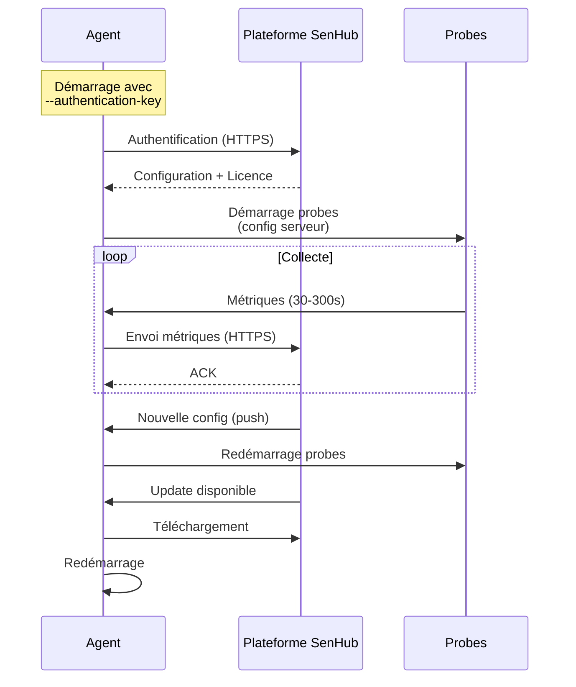

### Caractéristiques

#### ✅ Avantages

1. **Configuration Centralisée**
   - Gestion depuis la plateforme web SenHub
   - Push de configuration en temps réel
   - Pas de SSH/RDP nécessaire pour modifier

2. **Monitoring Centralisé**
   - Visualisation multi-agents dans un dashboard unique
   - Alerting centralisé
   - Historique longue durée

3. **Auto-Update**
   - Mises à jour automatiques de l'agent
   - Nouvelles probes déployées automatiquement
   - Zero-downtime updates

4. **Authentification Sécurisée**
   - Clé fournie par la plateforme
   - Révocation possible depuis le portail
   - Certificats TLS managés

#### ❌ Limitations

1. **Connexion Requise**
   - Internet obligatoire (HTTPS vers `eu-west-1.intake.senhub.io`)
   - Peut être bloqué par proxy/firewall
   - Latence selon localisation

2. **Dépendance Plateforme**
   - Si plateforme inaccessible, utilise config répliquée localement
   - Nécessite compte SenHub actif

### Installation Mode Online

```bash
# Windows
.\senhub-agent.exe install --authentication-key "YOUR_PLATFORM_KEY"

# Linux
sudo senhub-agent install --authentication-key "YOUR_PLATFORM_KEY"

# macOS
sudo senhub-agent install --authentication-key "YOUR_PLATFORM_KEY"
```

**📸 SCREENSHOT À INSÉRER**: Portail SenHub avec section "Agent Keys" montrant une clé générée

### Configuration Générée (Mode Online)

```yaml
config_version: 2

agent:
  key: "platform-provided-key-abc123def456"  # Fournie par SenHub
  mode: online
  license: "eyJhbGciOiJSUzI1NiIs..."         # JWT (si applicable)

auto_update:
  enabled: true
  url: "https://eu-west-1.intake.senhub.io/releases"

cache:
  retention_minutes: 5

# Configuration téléchargée depuis le serveur
# Probes, storage, etc. managés par la plateforme
```

### Réplication Locale (Fallback)

L'agent crée automatiquement une copie locale de la configuration serveur :

**Chemin de réplication**
- Windows : `C:\ProgramData\SenHub\agent-config-replica.yaml`
- Linux : `/var/lib/senhub-agent/agent-config-replica.yaml`
- macOS : `/usr/local/var/senhub-agent/agent-config-replica.yaml`

**Utilisation**
Si la plateforme devient inaccessible, l'agent utilise la réplication locale pour continuer à fonctionner.

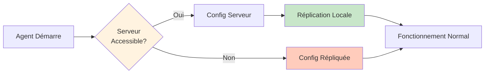

### Environnements Typiques

- **Datacenters avec internet** : Monitoring centralisé de dizaines/centaines de serveurs
- **Cloud** : AWS, Azure, GCP avec accès sortant HTTPS
- **Bureaux distants** : Sites avec connexion internet stable
- **Monitoring-as-a-Service** : Offre de monitoring géré pour clients

---

## Mode Offline (Autonome)

### Principe de Fonctionnement

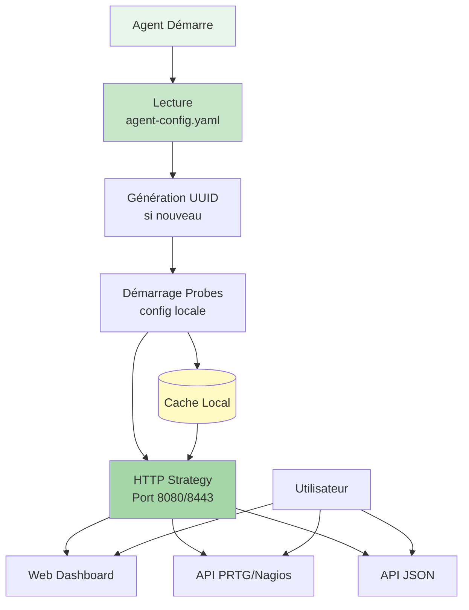

### Caractéristiques

#### ✅ Avantages

1. **Zéro Dépendance Externe**
   - Fonctionne sans internet
   - Idéal pour environnements air-gapped
   - Aucun risque de fuite de données

2. **Configuration Fichier Local**
   - Contrôle total via YAML
   - Versionnable (Git, Ansible, etc.)
   - Infrastructure as Code

3. **Interface Web Locale**
   - Dashboard de monitoring accessible localement
   - API REST complète (PRTG, Nagios, JSON)
   - Lookups PRTG téléchargeables

4. **Rapide à Déployer**
   - Installation en 2 minutes
   - Pas de compte plateforme nécessaire
   - Idéal pour POC et développement

#### ❌ Limitations

1. **Configuration Manuelle**
   - Modifications via SSH/RDP + édition YAML
   - Pas de push centralisé
   - Nécessite redémarrage pour changements

2. **Pas d'Historique Long Terme**
   - Cache mémoire uniquement (5-30 minutes)
   - Pas de base de données time-series intégrée
   - Exporter vers système externe si besoin

3. **Monitoring Local Uniquement**
   - Pas de vue multi-agents centralisée
   - Alerting à gérer via PRTG/Nagios/autre

### Installation Mode Offline

#### Installation HTTP (Localhost uniquement)

```bash
# Toutes plateformes
senhub-agent install --offline

# Accès
http://localhost:8080/web/{UUID}/dashboard
```

**Cas d'usage** : Développement, tests locaux

#### Installation HTTPS (Production)

```bash
# Avec certificats auto-générés
senhub-agent install --offline --enable-https

# Avec certificats personnalisés
senhub-agent install --offline --enable-https \
  --cert-file /etc/ssl/certs/server.crt \
  --key-file /etc/ssl/private/server.key

# Accès
https://monitoring.local:8443/web/{UUID}/dashboard
```

**Cas d'usage** : Production air-gap, edge computing

**📸 SCREENSHOT À INSÉRER**: Terminal montrant l'installation offline avec génération de l'UUID et message "Agent key: f47ac10b-58cc-4372-a567-0e02b2c3d479"

### Configuration Générée (Mode Offline)

```yaml
# SenHub Agent Configuration
# Configuration Version: 2 (automatically managed)
# Agent Version: 0.1.80-beta
# Generated: 2025-12-18 10:30:00 CET

config_version: 2

# Agent configuration
agent:
  key: "f47ac10b-58cc-4372-a567-0e02b2c3d479"  # UUID généré
  mode: offline
  # license: ""  # Décommenter et ajouter licence si nécessaire

# Auto-update configuration
auto_update:
  enabled: true  # Vérifie les updates si internet disponible
  url: "https://eu-west-1.intake.senhub.io/releases"

# Cache configuration
cache:
  retention_minutes: 5  # Durée de rétention métriques en mémoire

# Local storage with web interface
storage:
  - name: http
    params:
      port: 8080               # 8443 si HTTPS
      bind_address: "127.0.0.1"  # "0.0.0.0" si HTTPS
      endpoints: ["prtg", "web", "nagios"]

# Active probes (default system monitoring)
probes:
  - name: cpu
    type: cpu
    params:
      interval: 30

  - name: memory
    type: memory
    params:
      interval: 30

  - name: network
    type: network
    params:
      interval: 60

  - name: logicaldisk
    type: logicaldisk
    params:
      interval: 30
```

### Modification de la Configuration

```bash
# 1. Éditer le fichier
sudo nano /etc/senhub-agent/agent-config.yaml

# 2. Exemple : Ajouter une probe Redfish
probes:
  - name: "Production iDRAC"
    type: redfish
    params:
      endpoint: "https://idrac.company.com"
      username: "admin"
      password: "secret"
      interval: 300

# 3. Redémarrer l'agent
sudo systemctl restart senhub-agent  # Linux
sudo launchctl unload /Library/LaunchDaemons/io.senhub.agent.plist && \
sudo launchctl load /Library/LaunchDaemons/io.senhub.agent.plist  # macOS
```

**📸 SCREENSHOT À INSÉRER**: Éditeur nano/vi avec le fichier agent-config.yaml ouvert montrant une probe redfish configurée

### Environnements Typiques

- **Datacenters Air-Gapped** : Installations sans connexion internet (sécurité, militaire, industrie)
- **Edge Computing** : Sites distants avec connectivité limitée ou coûteuse
- **Développement Local** : Tests et développement de probes personnalisées
- **POC et Démos** : Installation rapide pour démonstrations clients
- **Environnements Réglementés** : Secteurs interdisant l'envoi de données externes

---

## Comparaison Détaillée

### Architecture Réseau

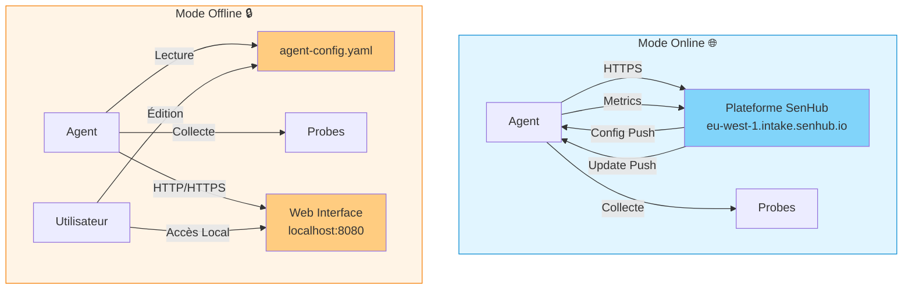

### Flux de Configuration

#### Mode Online

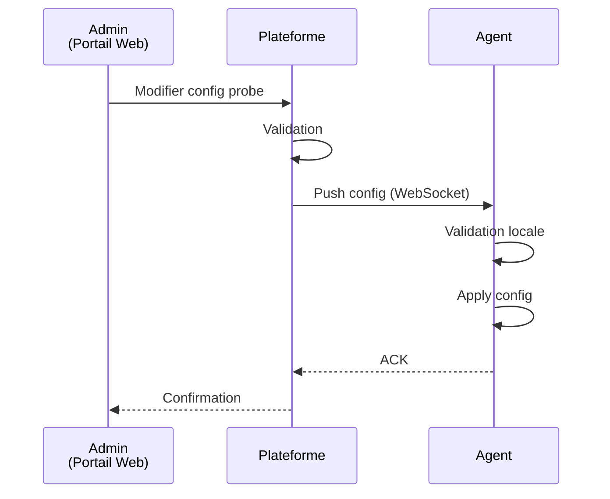

#### Mode Offline

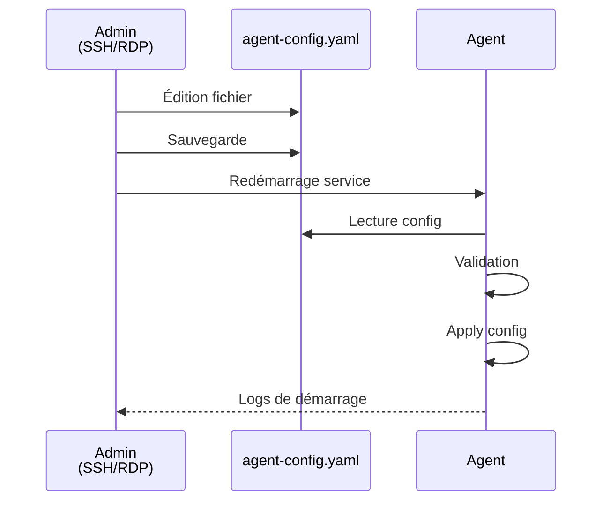

### Flux de Données

#### Mode Online

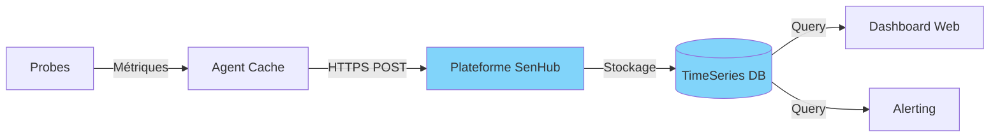

#### Mode Offline

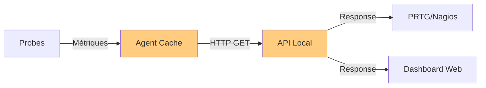

### Tableau de Fonctionnalités

| Fonctionnalité | Mode Online | Mode Offline | Notes |
|----------------|-------------|--------------|-------|
| **Installation** | Key requise | Autonome | Offline : UUID auto-généré |
| **Configuration** | Portail web | Fichier YAML | Online : push temps réel |
| **Probes supportées** | Toutes | Toutes | Selon licence |
| **Auto-update agent** | Automatique | Manuel/Auto | Offline : si internet disponible |
| **Web Dashboard** | Optionnel | Obligatoire | Offline : principal accès |
| **API PRTG** | Via HTTP strategy | Oui (local) | - |
| **API Nagios** | Via HTTP strategy | Oui (local) | - |
| **Alerting** | Intégré plateforme | Via PRTG/Nagios | - |
| **Historique** | Illimité (cloud) | Cache mémoire | Offline : 5-30 minutes |
| **Multi-agents** | Vue centralisée | Non | Online : dashboard global |
| **Air-gap ready** | Non | Oui | Offline : zéro dépendance |
| **Coût** | Selon tier | Gratuit | Online : subscription possible |

---

## Basculement Entre Modes

### Online → Offline

**Scénario** : Passer d'une installation connectée à une installation autonome

```bash
# 1. Arrêter l'agent
sudo systemctl stop senhub-agent

# 2. Sauvegarder la config répliquée
sudo cp /var/lib/senhub-agent/agent-config-replica.yaml \
        /etc/senhub-agent/agent-config.yaml

# 3. Modifier le mode
sudo nano /etc/senhub-agent/agent-config.yaml

# Changer :
agent:
  mode: offline  # Était "online"

# 4. Ajouter HTTP strategy si absente
storage:
  - name: http
    params:
      port: 8080
      bind_address: "127.0.0.1"
      endpoints: ["prtg", "web", "nagios"]

# 5. Redémarrer
sudo systemctl start senhub-agent
```

**📸 SCREENSHOT À INSÉRER**: Fichier de config avec changement de `mode: online` → `mode: offline` surligné

### Offline → Online

**Scénario** : Connecter un agent autonome à la plateforme

```bash
# 1. Obtenir une clé d'authentification depuis le portail SenHub

# 2. Arrêter l'agent
sudo systemctl stop senhub-agent

# 3. Modifier la configuration
sudo nano /etc/senhub-agent/agent-config.yaml

# Remplacer :
agent:
  key: "YOUR_PLATFORM_KEY"  # Remplacer UUID
  mode: online               # Était "offline"

# 4. Redémarrer
sudo systemctl start senhub-agent

# 5. Vérifier connexion
sudo tail -f /var/log/senhub-agent/agent.log
# Attendre : "Connected to SenHub platform"
```

### Migration Hybride

**Scénario** : Utiliser les deux modes (dev offline, prod online)

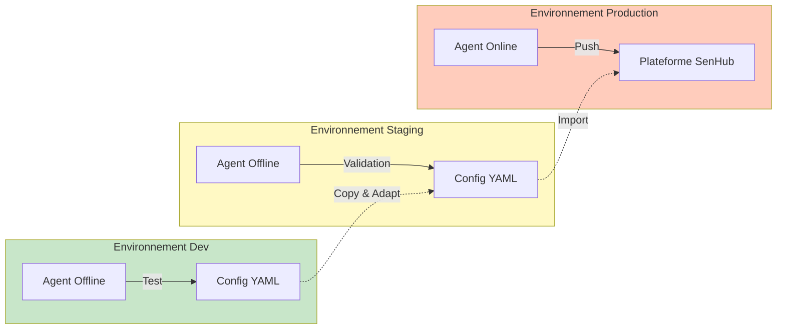

**Workflow**

1. **Développement** : Mode offline, test des configurations
2. **Staging** : Mode offline, validation avant prod
3. **Production** : Mode online, monitoring centralisé

---

## Cas d'Usage par Mode

### Quand Utiliser le Mode Online

#### ✅ Scénarios Idéaux

1. **Monitoring Multi-Sites**
   - Plusieurs datacenters/bureaux à surveiller
   - Vue centralisée nécessaire
   - Alerting unifié

2. **Gestion Centralisée**
   - Équipe DevOps/SRE avec portail web
   - Besoin de modifier configs à distance
   - Déploiement rapide de nouvelles probes

3. **Historique Long Terme**
   - Besoin de métriques sur 6-12 mois
   - Analyse de tendances
   - Capacity planning

4. **Auto-Update Critique**
   - Vulnérabilités corrigées rapidement
   - Nouvelles fonctionnalités automatiques
   - Pas d'intervention manuelle

#### 📊 Exemple : E-commerce Multi-Datacenters

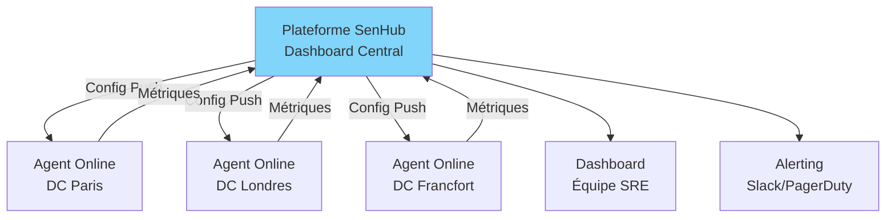

**Bénéfices**
- Vue unique pour 3 datacenters
- Alertes corrélées (incident multi-sites)
- Déploiement nouvelle probe en 1 clic

---

### Quand Utiliser le Mode Offline

#### ✅ Scénarios Idéaux

1. **Environnements Air-Gapped**
   - Datacenters militaires, gouvernementaux
   - Industrie critique (énergie, santé)
   - Isolation réseau obligatoire

2. **Edge Computing**
   - Sites distants sans internet fiable
   - Coût connexion prohibitif (satellite, 4G)
   - Latence inacceptable

3. **Développement et Tests**
   - Développement de probes personnalisées
   - POC client sans setup plateforme
   - CI/CD pipelines

4. **Conformité Réglementaire**
   - RGPD strict (pas d'envoi données externes)
   - Secteur bancaire/financier
   - Données médicales (HIPAA)

#### 📊 Exemple : Usine de Production Isolée

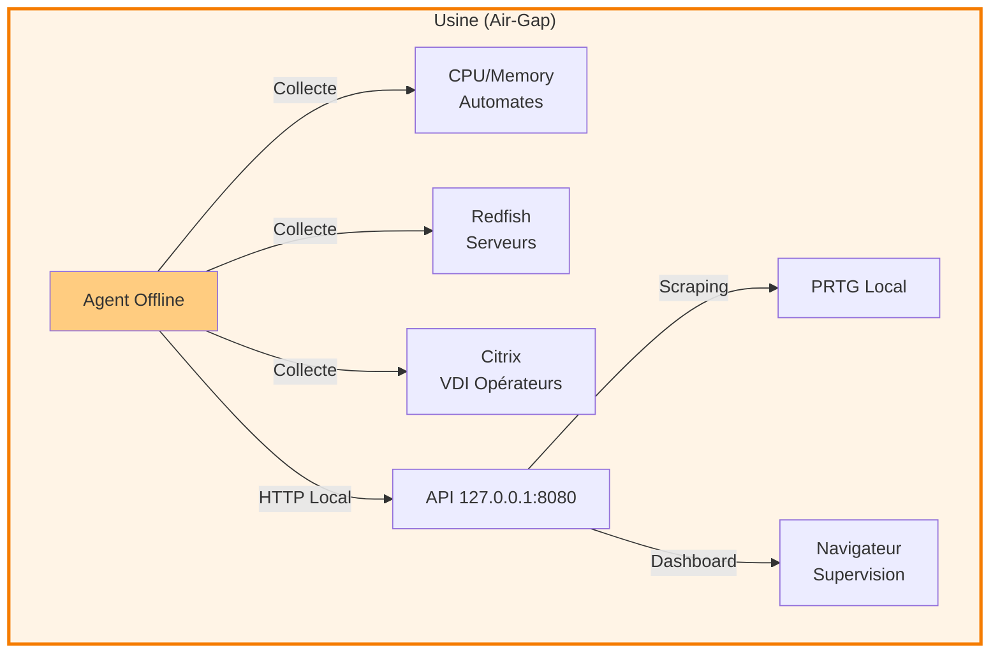

**Bénéfices**
- Zéro dépendance internet
- Données ne quittent pas l'usine
- Supervision temps réel via PRTG local

---

## Résumé et Recommandations

### Arbre de Décision

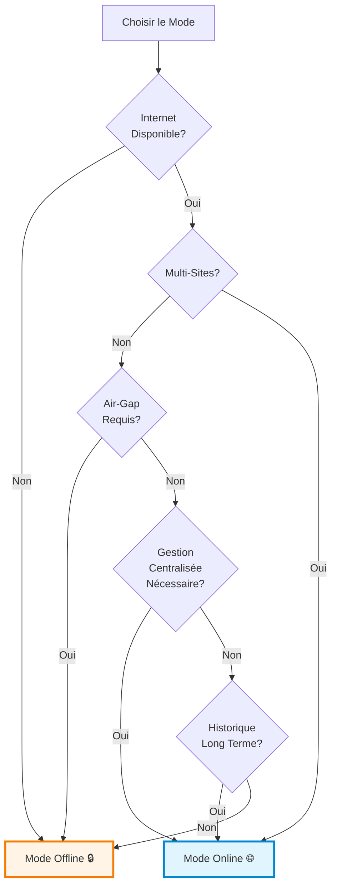

### Recommandations Finales

| Environnement | Mode Recommandé | Raison |
|---------------|-----------------|--------|
| **Entreprise Multi-Sites** | Online 🌐 | Gestion centralisée, vue d'ensemble |
| **Datacenter Unique** | Offline 🔒 | Autonomie, pas de dépendance externe |
| **Cloud (AWS/Azure/GCP)** | Online 🌐 | Internet disponible, scaling facile |
| **Edge/IoT** | Offline 🔒 | Connectivité limitée, latence |
| **Développement** | Offline 🔒 | Setup rapide, pas de compte nécessaire |
| **Air-Gap** | Offline 🔒 | Isolation obligatoire |
| **Monitoring as a Service** | Online 🌐 | Multi-tenancy, facturation |

---

**Prochaines étapes** :
- **Configuration de l'agent** : [AGENT-CONFIGURATION.md](./AGENT-CONFIGURATION.md)
- **Configuration HTTPS/TLS** : [HTTP-HTTPS-CONFIGURATION.md](./HTTP-HTTPS-CONFIGURATION.md)
- **Configuration des probes** : [PROBES-CONFIGURATION.md](./PROBES-CONFIGURATION.md)
