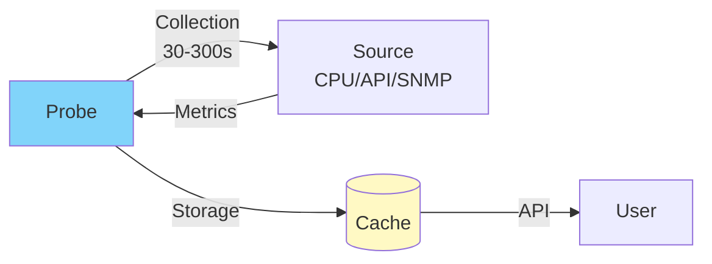

# SenHub Agent - Probes Configuration

## Table of Contents

- [General Concepts](#general-concepts)
- [System Probes (Free Tier)](#system-probes-free-tier)
- [Network Probes (Pro/Enterprise)](#network-probes-proenterprise)
- [Infrastructure Probes (Pro/Enterprise)](#infrastructure-probes-proenterprise)
- [Configuration Examples](#configuration-examples)

---

## General Concepts

### What is a Probe?

A probe collects metrics from a specific source at regular intervals.



### Configuration Structure

```yaml
probes:
  - name: "Display Name"      # Display name (free choice)
    type: probe_type          # Technical type (registry)
    params:
      interval: 60            # Collection interval (seconds)
      # ... specific parameters
```

**Important distinction**:
- `name`: Unique identifier for this **instance** (cache keys, metric tags)
- `type`: Technical probe type (registry, transformers)

### Collection Intervals

| Interval | Usage | Examples |
|----------|-------|----------|
| **10-30s** | High frequency | CPU, Memory (real-time monitoring) |
| **60s** | Standard | Disks, Network |
| **120-300s** | Low frequency | Redfish (hardware), Citrix |

---

## System Probes (Free Tier)

Available without license, included in free tier.

### CPU Monitoring

**Minimal configuration**:
```yaml
probes:
  - name: cpu
    type: cpu
    params:
      interval: 30
```

**Collected metrics**:
- `cpu_usage_total`: Total CPU usage (%)
- `cpu_user`, `cpu_system`: User/system time
- `cpu_load1`, `cpu_load5`, `cpu_load15`: Load average (Linux/macOS)
- Per core: `cpu_core_usage`

**Platforms**: Windows, Linux, macOS, BSD

**📸 SCREENSHOT TO INSERT**: Dashboard showing CPU usage graph with 4 cores

---

### Memory Monitoring

**Minimal configuration**:
```yaml
probes:
  - name: memory
    type: memory
    params:
      interval: 30
```

**Collected metrics**:
- `memory_total`, `memory_available`: Total/available memory
- `memory_used`, `memory_free`: Used/free
- `memory_usage_percent`: Usage percentage
- `swap_total`, `swap_used`: Swap (if present)

**Platforms**: Windows, Linux, macOS, BSD

---

### Logical Disk Monitoring

**Minimal configuration**:
```yaml
probes:
  - name: logicaldisk
    type: logicaldisk
    params:
      interval: 60
```

**Advanced configuration**:
```yaml
probes:
  - name: logicaldisk
    type: logicaldisk
    params:
      interval: 60
      exclude_filesystems: ["tmpfs", "devtmpfs", "squashfs"]  # Linux
      exclude_mount_points: ["/snap/*", "/boot/efi"]          # Patterns
```

**Collected metrics**:
- `disk_total`, `disk_free`, `disk_used`: Space (bytes)
- `disk_free_percent`, `disk_used_percent`: Percentage
- Tags: `disk`, `mount_point`, `filesystem`

**Platforms**: Windows, Linux, macOS

**📸 SCREENSHOT TO INSERT**: PRTG graph showing multiple disks (C:, D:, E:) with % free

---

### Network Monitoring

**Minimal configuration**:
```yaml
probes:
  - name: network
    type: network
    params:
      interval: 60
```

**Advanced configuration**:
```yaml
probes:
  - name: network
    type: network
    params:
      interval: 60
      exclude_interfaces: ["lo", "docker*", "veth*"]  # Exclude loopback, docker
```

**Collected metrics**:
- `network_bytes_sent`, `network_bytes_recv`: Traffic (bytes)
- `network_packets_sent`, `network_packets_recv`: Packets
- `network_errors_in`, `network_errors_out`: Errors
- Tags: `interface`, `mac_address`

**Platforms**: Windows, Linux, macOS

---

## Network Probes (Pro/Enterprise)

Require Pro or Enterprise license.

### Ping Gateway

**Configuration**:
```yaml
probes:
  - name: ping_gateway
    type: ping_gateway
    params: {}  # Auto-detect gateway
```

**Manual configuration**:
```yaml
probes:
  - name: "Ping Main Router"
    type: ping_gateway
    params:
      gateway: "192.168.1.1"  # Custom IP
      count: 4                # Number of pings
      timeout: 5              # Timeout (seconds)
```

**Metrics**:
- `ping_latency_ms`: Average latency
- `ping_packet_loss_percent`: Packet loss
- `ping_min_ms`, `ping_max_ms`: Min/Max

---

### Ping WebApp

**Configuration**:
```yaml
probes:
  - name: "Ping Website"
    type: ping_webapp
    params:
      url: "https://www.example.com"  # REQUIRED
      timeout: 30                      # Optional, default: 30s
```

**Metrics**:
- `webapp_available`: 1 (up) or 0 (down)
- `webapp_response_time_ms`: Response time
- `webapp_status_code`: HTTP code (200, 404, etc.)

---

### Load WebApp

**Configuration**:
```yaml
probes:
  - name: "Site Load Time"
    type: load_webapp
    params:
      url: "https://www.example.com"  # REQUIRED
      timeout: 30
```

**Metrics**:
- `webapp_load_time_ms`: Complete load time
- `webapp_dns_time_ms`: DNS resolution time
- `webapp_connect_time_ms`: TCP connection time
- `webapp_tls_time_ms`: TLS handshake time

---

### WiFi Signal Strength

**Configuration**:
```yaml
probes:
  - name: wifi_signal_strength
    type: wifi_signal_strength
    params: {}  # Auto-detect WiFi
```

**Metrics**:
- `wifi_signal_strength_dbm`: Signal strength (dBm)
- `wifi_quality_percent`: Quality (%)
- Tags: `ssid`, `bssid`, `frequency`

**Note**: Only works if WiFi is active

---

## Infrastructure Probes (Pro/Enterprise)

### Redfish (iDRAC, iLO, BMC)

Server hardware monitoring via Redfish API.

**Complete configuration**:
```yaml
probes:
  - name: "Production Dell iDRAC"
    type: redfish
    params:
      endpoint: "https://idrac.company.com"  # REQUIRED
      username: "monitoring"                  # REQUIRED
      password: "SecurePass123"               # REQUIRED
      interval: 300                           # 5 minutes
      verify_ssl: true                        # Validate certificate
      collections:                            # Optional
        - system       # General system info
        - thermal      # Temperatures, fans
        - power        # Power supply, consumption
        - processor    # CPU hardware
        - memory       # RAM hardware
        - storage      # RAID controllers
        - drives       # Individual drives
        - networkadapter  # Network cards
```

**If collections omitted**: All collections gathered

**Metrics**:
- Temperatures: `redfish_temperature_celsius`
- Fans: `redfish_fan_speed_rpm`, `redfish_fan_speed_percent`
- Power: `redfish_power_consumed_watts`, `redfish_power_capacity_watts`
- Drives: `redfish_drive_capacity_bytes`, `redfish_drive_state`
- Tags: `chassis`, `sensor_name`, `drive_id`, etc.

**SSL Certificates**:
```yaml
# Production with valid CA certificate
verify_ssl: true

# Dev with self-signed certificate
verify_ssl: false
```

**📸 SCREENSHOT TO INSERT**: Redfish dashboard showing CPU temperatures, fans, RAID disks

---

### Citrix Virtual Apps and Desktops (CVAD)

Monitoring Citrix VDI environments.

**Director-only configuration**:
```yaml
probes:
  - name: "Citrix Production"
    type: citrix
    params:
      base_url: "https://director.company.com"  # REQUIRED (without /Director)
      interval: 120
      auth:
        username: "DOMAIN\\monitoring"  # Format DOMAIN\\user
        password: "password"
      tls:
        verify_ssl: true
      timeout: 30
```

**Configuration with Delivery Controller**:
```yaml
probes:
  - name: "Citrix Production"
    type: citrix
    params:
      base_url: "https://director.company.com"

      # Delivery Controller for site filtering
      delivery_controller:
        url: "https://citrix-ddc.company.com"
        fallback_urls:
          - "https://citrix-ddc-backup.company.com"
        site_filter: "SITE-PARIS"  # Filter by site

      interval: 120
      auth:
        username: "DOMAIN\\monitoring"
        password: "password"
      retry:
        max_attempts: 3
        backoff_factor: 2.0
```

**Metrics**:
- Sessions: `citrix_active_sessions`, `citrix_disconnected_sessions`
- Logon: `citrix_logon_duration_seconds`
- Servers: `citrix_server_load_percent`, `citrix_server_session_count`
- Licenses: `citrix_license_usage`, `citrix_license_available`
- Tags: `site`, `delivery_group`, `machine_name`

**Authentication**:
- Director: Automatic NTLM
- Delivery Controller: Automatic Basic

**📸 SCREENSHOT TO INSERT**: Citrix dashboard with active sessions graphs, logon duration, server load

---

### NetScaler ADC (Load Balancer)

Monitoring Citrix NetScaler / ADC.

**Configuration**:
```yaml
probes:
  - name: "NetScaler Production"
    type: netscaler
    params:
      endpoint: "https://netscaler.company.com"  # REQUIRED (NSIP)
      username: "nsroot"                          # REQUIRED
      password: "password"                        # REQUIRED
      interval: 120
      verify_ssl: true
      timeout: 30
```

**Metrics**:
- System: `netscaler_cpu_usage`, `netscaler_memory_usage`
- Virtual Servers: `netscaler_vserver_state`, `netscaler_vserver_hits`, `netscaler_vserver_requests`
- Services: `netscaler_service_state`, `netscaler_service_throughput`
- SSL: `netscaler_ssl_sessions`, `netscaler_ssl_cert_days_to_expire`
- Tags: `vserver_name`, `service_name`, `cert_name`, `metric_view`, `metric_type`

**Filtering by Tags**:
```bash
# Via API - Filter by type
curl "http://localhost:8080/api/{key}/prtg/metrics/netscaler?filter=metric_view:load_balancing"

# Filter by virtual server
curl "http://localhost:8080/api/{key}/prtg/metrics/netscaler?filter=vserver_name:Web-vServer"
```

**📸 SCREENSHOT TO INSERT**: NetScaler dashboard with virtual servers health, SSL certificates expiration

---

### Syslog

Receiving and parsing syslog events.

**Configuration**:
```yaml
probes:
  - name: syslog
    type: syslog
    params:
      port: 514             # Default: 514
      protocol: "udp"       # "udp" or "tcp"
```

**Metrics**:
- `syslog_messages_received`: Number of messages received
- `syslog_errors`: Parsing errors
- Tags: `severity`, `facility`, `hostname`, `app_name`

**Firewall**:
```bash
# Allow syslog port
sudo ufw allow 514/udp
sudo firewall-cmd --permanent --add-port=514/udp
```

---

## Configuration Examples

### Complete Production Configuration

```yaml
config_version: 2

agent:
  key: "f47ac10b-58cc-4372-a567-0e02b2c3d479"
  mode: offline
  license: |
    {
      "tier": "pro",
      "authorized_probes": ["redfish", "citrix", "netscaler", "syslog"],
      "expires_at": "2025-12-31T23:59:59Z",
      "issued_at": "2025-01-01T00:00:00Z",
      "subject": "production-datacenter"
    }

auto_update:
  enabled: true
  url: "https://eu-west-1.intake.senhub.io/releases"

cache:
  retention_minutes: 10

storage:
  - name: http
    params:
      port: 8443
      bind_address: "0.0.0.0"
      endpoints: ["prtg", "web", "nagios"]
      tls:
        enabled: true
        min_tls_version: "1.2"
        cert_file: "/etc/ssl/certs/monitoring.crt"
        key_file: "/etc/ssl/private/monitoring.key"

probes:
  # === FREE TIER ===

  - name: cpu
    type: cpu
    params:
      interval: 30

  - name: memory
    type: memory
    params:
      interval: 30

  - name: logicaldisk
    type: logicaldisk
    params:
      interval: 60
      exclude_filesystems: ["tmpfs", "devtmpfs"]

  - name: network
    type: network
    params:
      interval: 60
      exclude_interfaces: ["lo", "docker*"]

  # === PRO TIER ===

  - name: "Paris iDRAC Server 1"
    type: redfish
    params:
      endpoint: "https://idrac-srv01.company.com"
      username: "monitoring"
      password: "SecurePassword123"
      interval: 300
      verify_ssl: true
      collections:
        - system
        - thermal
        - power
        - storage

  - name: "Paris iDRAC Server 2"
    type: redfish
    params:
      endpoint: "https://idrac-srv02.company.com"
      username: "monitoring"
      password: "SecurePassword123"
      interval: 300
      verify_ssl: true

  - name: "Citrix Production Paris"
    type: citrix
    params:
      base_url: "https://director-paris.company.com"
      delivery_controller:
        url: "https://ddc-paris.company.com"
        site_filter: "SITE-PARIS"
      interval: 120
      auth:
        username: "DOMAIN\\monitoring"
        password: "CitrixPass123"
      tls:
        verify_ssl: true

  - name: "NetScaler Load Balancer"
    type: netscaler
    params:
      endpoint: "https://netscaler.company.com"
      username: "nsroot"
      password: "NSPassword123"
      interval: 120
      verify_ssl: true

  - name: syslog
    type: syslog
    params:
      port: 514
      protocol: "udp"
```

**📸 SCREENSHOT TO INSERT**: Complete configuration file open in VSCode with syntax highlighting

---

### Development Configuration (Free Tier)

```yaml
config_version: 2

agent:
  key: "dev-12345"
  mode: offline

auto_update:
  enabled: false

cache:
  retention_minutes: 5

storage:
  - name: http
    params:
      port: 8080
      bind_address: "127.0.0.1"
      endpoints: ["prtg", "web"]

probes:
  - name: cpu
    type: cpu
    params:
      interval: 10  # High frequency for dev

  - name: memory
    type: memory
    params:
      interval: 10
```

---

**Next steps**:
- [Web Interface Usage](./WEB-INTERFACE.md)
- [Metrics Usage](./METRICS-USAGE.md)
- [Troubleshooting](./TROUBLESHOOTING.md)
