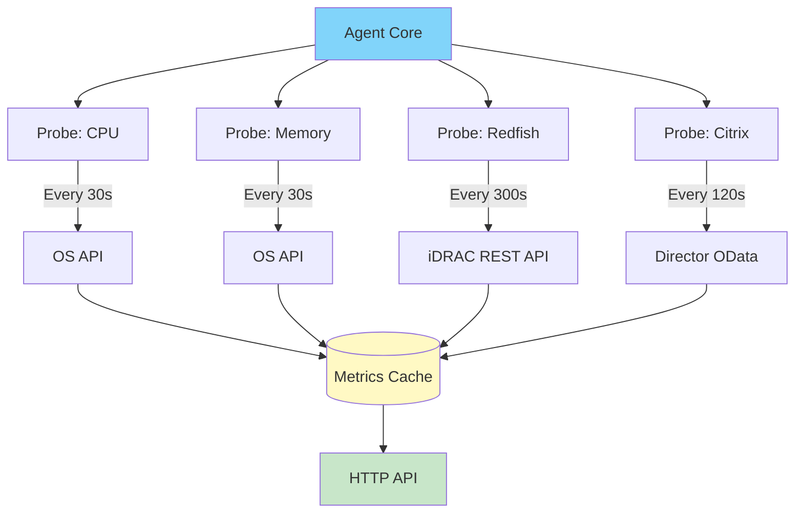

# Probes Configuration

This guide covers all available monitoring probes, from basic system metrics to specialized infrastructure monitoring. Understanding when and how to deploy each probe type enables you to build a monitoring strategy tailored to your infrastructure's specific requirements and constraints.

## Table of Contents

- [Understanding Probes](#understanding-probes)
- [System Probes - Free Tier](#system-probes---free-tier)
- [Network Probes - Pro/Enterprise](#network-probes---proenterprise)
- [Infrastructure Probes - Pro/Enterprise](#infrastructure-probes---proenterprise)
- [Deployment Scenarios](#deployment-scenarios)
- [Probe Configuration Best Practices](#probe-configuration-best-practices)

---

## Understanding Probes

### What Probes Provide

Probes are autonomous data collection components that gather metrics from specific sources at configured intervals. Each probe type specializes in monitoring a particular aspect of your infrastructure, from basic system resources to complex application platforms.



**Key architectural concepts:**

- **Independence:** Probes operate independently; one probe's failure doesn't affect others
- **Scheduled execution:** Each probe runs on its own interval timer
- **Stateless collection:** Probes don't maintain state between collections
- **Error isolation:** Collection failures logged but don't crash agent
- **Resource awareness:** Collection intervals balanced against system load

### Probe Configuration Structure

```yaml
probes:
  - name: "Descriptive Instance Name"  # Human-readable identifier
    type: probe_technical_type         # Probe type from registry
    params:
      interval: 60                     # Collection interval (seconds)
      # Additional probe-specific parameters
```

**Critical distinction between `name` and `type`:**

- **`name`:** Unique identifier for this probe *instance*. Used in cache keys, metric tags, and dashboard labels. Choose descriptive names that identify the monitored resource (e.g., "Production iDRAC Server 1", "Citrix Paris Site").

- **`type`:** Technical probe class from agent registry. Determines what metrics are collected and which collector implementation is used. Must match exactly (case-sensitive).

**Example illustrating the distinction:**

```yaml
probes:
  # Two Redfish probes monitoring different servers
  - name: "Datacenter A - Dell Server 01"
    type: redfish  # Same type
    params:
      endpoint: "https://idrac-dc-a-01.company.com"

  - name: "Datacenter B - HPE Server 01"
    type: redfish  # Same type, different instance
    params:
      endpoint: "https://ilo-dc-b-01.company.com"
```

Both probes share the same `type` (redfish) but have different `name` values to distinguish metrics from each server.

### Collection Intervals

The collection interval determines how frequently the probe queries its data source. Choosing appropriate intervals balances monitoring granularity against system resource consumption and API rate limits.

| Interval Range | Typical Use Cases | Examples | Resource Impact |
|----------------|-------------------|----------|-----------------|
| **10-30s** | Real-time monitoring, rapidly changing metrics | CPU usage, memory consumption | High API calls, high cache growth |
| **60s** | Standard monitoring, moderate change rate | Disk space, network traffic | Balanced resource usage |
| **120-300s** | Low-frequency monitoring, slow-changing metrics | Hardware temps, Citrix sessions, SSL cert expiration | Minimal resource impact |

**Interval selection criteria:**

**Choose shorter intervals (10-30s) when:**
- Monitoring highly volatile metrics (CPU spikes, memory pressure)
- Rapid alerting required (latency-sensitive applications)
- Troubleshooting performance issues (temporary high-frequency collection)

**Choose longer intervals (120-300s) when:**
- Monitoring slow-changing metrics (disk space, hardware temperatures)
- API rate limits constrain frequent polling (vendor API quotas)
- Reducing monitoring overhead on target systems
- Bandwidth-constrained environments (remote sites, satellite links)

**Operational consideration:** Infrastructure probes (Redfish, Citrix, NetScaler) typically use 120-300s intervals because:
1. Hardware metrics change slowly (temperature drift measured in minutes)
2. Vendor APIs have rate limits or performance implications
3. Frequent polling provides diminishing returns (same data repeated)

### License Requirements

Probes are grouped into license tiers based on monitoring complexity and vendor integration requirements:

| Tier | Probes | License Required |
|------|--------|------------------|
| **Free** | `cpu`, `memory`, `logicaldisk`, `network` | No |
| **Pro** | Free + `redfish`, `citrix`, `netscaler`, `syslog`, `ping_gateway`, `ping_webapp`, `load_webapp`, `wifi_signal_strength` | Yes |
| **Enterprise** | All probes (includes future probe types via wildcard) | Yes |

See [Agent Configuration - License System](./AGENT-CONFIGURATION.md#license-system) for license acquisition and installation.

---

## System Probes - Free Tier

System probes monitor operating system-level resources using standard OS APIs. These probes are available without licensing and provide comprehensive server health monitoring for most deployments.

### CPU Monitoring

**Purpose:** Track processor utilization, load average, and per-core usage to identify compute bottlenecks and capacity constraints.

**Configuration:**

```yaml
probes:
  - name: cpu
    type: cpu
    params:
      interval: 30  # 30 seconds recommended for most workloads
```

**Collected metrics:**

| Metric | Description | Unit | Typical Range |
|--------|-------------|------|---------------|
| `cpu_usage_total` | Aggregate CPU utilization across all cores | Percent | 0-100 |
| `cpu_user` | CPU time spent in user space | Percent | 0-100 |
| `cpu_system` | CPU time spent in kernel space | Percent | 0-100 |
| `cpu_idle` | CPU time spent idle | Percent | 0-100 |
| `cpu_iowait` | CPU time waiting for I/O (Linux only) | Percent | 0-100 |
| `cpu_load1`, `cpu_load5`, `cpu_load15` | Load average (Linux/macOS) | Count | Varies by core count |
| `cpu_core_usage` | Per-core utilization | Percent | 0-100 |

**Platform support:** Windows, Linux, macOS, BSD

**Deployment scenarios:**

**Scenario 1: Web server capacity monitoring**
- **Interval:** 30s (captures traffic spikes)
- **Alert threshold:** >80% sustained for 5 minutes
- **Use case:** Identify when to scale horizontally

**Scenario 2: Database server performance**
- **Interval:** 15s (high-frequency for query optimization)
- **Watch metrics:** `cpu_user` (query processing), `cpu_iowait` (disk bottleneck indicator)
- **Use case:** Correlate CPU usage with query execution times

**Scenario 3: Batch processing server**
- **Interval:** 60s (batch jobs run for extended periods)
- **Watch metrics:** `cpu_load15` (sustained load indicator)
- **Use case:** Capacity planning for batch windows

### Memory Monitoring

**Purpose:** Track memory utilization, available capacity, and swap usage to prevent out-of-memory conditions and optimize application memory allocation.

**Configuration:**

```yaml
probes:
  - name: memory
    type: memory
    params:
      interval: 30
```

**Collected metrics:**

| Metric | Description | Unit |
|--------|-------------|------|
| `memory_total` | Total installed RAM | Bytes |
| `memory_available` | Memory available for allocation | Bytes |
| `memory_used` | Memory currently allocated | Bytes |
| `memory_free` | Completely unused memory | Bytes |
| `memory_usage_percent` | Percentage of memory used | Percent |
| `swap_total` | Total swap space configured | Bytes |
| `swap_used` | Swap space currently used | Bytes |
| `swap_free` | Available swap space | Bytes |

**Platform support:** Windows, Linux, macOS, BSD

**Deployment scenarios:**

**Scenario 1: Application server memory leaks**
- **Interval:** 30s
- **Watch metrics:** `memory_available` trending downward over hours
- **Use case:** Detect memory leaks requiring application restart

**Scenario 2: Container host monitoring**
- **Interval:** 30s
- **Watch metrics:** `memory_available`, container memory limits
- **Use case:** Prevent OOMKiller events in Kubernetes/Docker environments

**Scenario 3: Database buffer cache sizing**
- **Interval:** 60s
- **Watch metrics:** `memory_used` vs `memory_available`
- **Use case:** Optimize database buffer pool configuration

**Memory vs swap interpretation:**

- **Low swap usage (<10%):** Healthy system, sufficient RAM
- **Moderate swap usage (10-50%):** Memory pressure, consider RAM upgrade
- **High swap usage (>50%):** Severe memory shortage, performance degraded

### Logical Disk Monitoring

**Purpose:** Track disk space utilization across all mounted filesystems to prevent out-of-space conditions that cause application failures.

**Basic configuration:**

```yaml
probes:
  - name: logicaldisk
    type: logicaldisk
    params:
      interval: 60
```

**Advanced configuration with filtering:**

```yaml
probes:
  - name: logicaldisk
    type: logicaldisk
    params:
      interval: 60
      exclude_filesystems: ["tmpfs", "devtmpfs", "squashfs"]  # Linux pseudo-filesystems
      exclude_mount_points: ["/snap/*", "/boot/efi"]          # Glob patterns supported
```

**Collected metrics:**

| Metric | Description | Unit | Tags |
|--------|-------------|------|------|
| `disk_total` | Total disk capacity | Bytes | `disk`, `mount_point`, `filesystem` |
| `disk_free` | Available space | Bytes | `disk`, `mount_point`, `filesystem` |
| `disk_used` | Used space | Bytes | `disk`, `mount_point`, `filesystem` |
| `disk_free_percent` | Percentage free | Percent | `disk`, `mount_point`, `filesystem` |
| `disk_used_percent` | Percentage used | Percent | `disk`, `mount_point`, `filesystem` |

**Platform support:** Windows (all NTFS/FAT volumes), Linux (all mounted filesystems), macOS (APFS/HFS+)

**Deployment scenarios:**

**Scenario 1: Application log directories**
- **Interval:** 60s
- **Alert threshold:** <10% free space
- **Use case:** Prevent application crashes due to log partition full

**Scenario 2: Database data directories**
- **Interval:** 300s (disk space changes slowly)
- **Alert threshold:** <20% free space (early warning for growth planning)
- **Use case:** Proactive capacity management

**Scenario 3: Backup destinations**
- **Interval:** 300s
- **Watch metrics:** Daily growth rate trend
- **Use case:** Predict when backup storage requires expansion

**Filtering rationale:**

Linux systems expose numerous pseudo-filesystems (tmpfs, devtmpfs) and temporary mounts (/snap/*) that clutter monitoring dashboards without providing actionable data. Filtering these reduces metric cardinality and focuses monitoring on persistent storage.

**Windows example:**
```yaml
exclude_mount_points: ["D:\\Temp", "E:\\PageFile"]  # Exclude temporary volumes
```

### Network Monitoring

**Purpose:** Track network interface traffic, packet rates, and error counts to identify bandwidth saturation and network hardware issues.

**Basic configuration:**

```yaml
probes:
  - name: network
    type: network
    params:
      interval: 60
```

**Advanced configuration with filtering:**

```yaml
probes:
  - name: network
    type: network
    params:
      interval: 60
      exclude_interfaces: ["lo", "docker*", "veth*", "br-*"]  # Exclude loopback and virtual interfaces
```

**Collected metrics:**

| Metric | Description | Unit | Tags |
|--------|-------------|------|------|
| `network_bytes_sent` | Bytes transmitted | Bytes (cumulative) | `interface`, `mac_address` |
| `network_bytes_recv` | Bytes received | Bytes (cumulative) | `interface`, `mac_address` |
| `network_packets_sent` | Packets transmitted | Count (cumulative) | `interface`, `mac_address` |
| `network_packets_recv` | Packets received | Count (cumulative) | `interface`, `mac_address` |
| `network_errors_in` | Inbound errors | Count (cumulative) | `interface`, `mac_address` |
| `network_errors_out` | Outbound errors | Count (cumulative) | `interface`, `mac_address` |

**Platform support:** Windows, Linux, macOS

**Metric interpretation:** All metrics are cumulative counters. Monitoring systems calculate rate-of-change (bytes/sec, packets/sec) by comparing successive samples. First sample after agent start has no delta, so rate calculation begins on second sample.

**Deployment scenarios:**

**Scenario 1: Web server bandwidth monitoring**
- **Interval:** 60s
- **Watch metrics:** `network_bytes_sent` rate (outbound traffic to clients)
- **Alert threshold:** >80% of NIC capacity (e.g., 800 Mbps on 1 Gbps link)
- **Use case:** Identify when to upgrade network infrastructure

**Scenario 2: Database replication lag investigation**
- **Interval:** 30s
- **Watch metrics:** `network_bytes_sent/recv` between primary and replicas
- **Use case:** Correlate replication lag with network saturation

**Scenario 3: Network hardware troubleshooting**
- **Interval:** 60s
- **Watch metrics:** `network_errors_in/out` (non-zero indicates hardware issues)
- **Use case:** Identify failing NICs or switch ports

**Filtering rationale:**

Container environments (Docker, Kubernetes) create numerous virtual network interfaces (veth*, docker*, br-*) that generate high metric cardinality without monitoring value. Physical interfaces (eth0, ens192) provide the relevant data for capacity planning and troubleshooting.

---

## Network Probes - Pro/Enterprise

Network probes monitor network connectivity, application availability, and wireless signal quality. These probes require Pro or Enterprise licensing.

### Ping Gateway

**Purpose:** Monitor gateway reachability and latency to detect network infrastructure failures or degradation.

**Auto-detection configuration:**

```yaml
probes:
  - name: ping_gateway
    type: ping_gateway
    params:
      interval: 60  # Default interval if empty params: {}
```

Agent automatically detects default gateway via OS routing table.

**Manual gateway configuration:**

```yaml
probes:
  - name: "Ping Primary Router"
    type: ping_gateway
    params:
      gateway: "192.168.1.1"  # Explicit gateway IP
      count: 4                # Number of ICMP echo requests per collection
      timeout: 5              # Timeout in seconds
      interval: 60
```

**Collected metrics:**

| Metric | Description | Unit |
|--------|-------------|------|
| `ping_latency_ms` | Average round-trip time | Milliseconds |
| `ping_packet_loss_percent` | Packet loss percentage | Percent (0-100) |
| `ping_min_ms` | Minimum RTT | Milliseconds |
| `ping_max_ms` | Maximum RTT | Milliseconds |

**Deployment scenarios:**

**Scenario 1: Remote site connectivity**
- **Configuration:** Ping gateway at remote site edge
- **Alert threshold:** >5% packet loss or >50ms latency increase
- **Use case:** Detect WAN link degradation before user reports

**Scenario 2: Multi-homed server failover**
- **Configuration:** Multiple ping_gateway probes (one per gateway)
- **Use case:** Monitor primary and backup gateway reachability for failover scenarios

**Scenario 3: Network performance baseline**
- **Configuration:** Ping gateway every 60s, retention 30 minutes
- **Use case:** Establish latency baseline for troubleshooting

### Ping WebApp

**Purpose:** Monitor HTTP/HTTPS endpoint availability and response time for application health checks.

**Configuration:**

```yaml
probes:
  - name: "Monitor Corporate Website"
    type: ping_webapp
    params:
      url: "https://www.company.com"  # REQUIRED: Full URL including protocol
      timeout: 30                      # Request timeout in seconds
      interval: 60
```

**Collected metrics:**

| Metric | Description | Values |
|--------|-------------|--------|
| `webapp_available` | Endpoint reachability | 1 (available) or 0 (unavailable) |
| `webapp_response_time_ms` | HTTP response time | Milliseconds |
| `webapp_status_code` | HTTP status code | 200, 404, 500, etc. |

**Deployment scenarios:**

**Scenario 1: External service availability**
- **Configuration:** Ping public-facing application URL
- **Alert threshold:** `webapp_available` = 0 or status_code != 200
- **Use case:** Detect website outages from agent perspective

**Scenario 2: Internal API monitoring**
- **Configuration:** Ping internal REST API health endpoint
- **Example:** `url: "https://api.internal.company.com/health"`
- **Use case:** Monitor microservices availability

**Scenario 3: Load balancer health check**
- **Configuration:** Ping load balancer VIP
- **Use case:** Verify load balancer responding and backend servers available

**HTTP vs Load WebApp:** ping_webapp performs simple HTTP GET request measuring total response time. For detailed timing breakdown (DNS, TCP connect, TLS handshake), use load_webapp instead.

### Load WebApp

**Purpose:** Measure detailed HTTP request timing breakdown for performance analysis and bottleneck identification.

**Configuration:**

```yaml
probes:
  - name: "Website Performance Breakdown"
    type: load_webapp
    params:
      url: "https://www.company.com"  # REQUIRED
      timeout: 30
      interval: 120
```

**Collected metrics:**

| Metric | Description | Unit |
|--------|-------------|------|
| `webapp_load_time_ms` | Total request time | Milliseconds |
| `webapp_dns_time_ms` | DNS resolution time | Milliseconds |
| `webapp_connect_time_ms` | TCP connection establishment | Milliseconds |
| `webapp_tls_time_ms` | TLS handshake time | Milliseconds |
| `webapp_server_time_ms` | Server processing time | Milliseconds |

**Deployment scenarios:**

**Scenario 1: Performance regression detection**
- **Configuration:** Monitor production application URL
- **Watch metrics:** `webapp_load_time_ms` trending upward over time
- **Use case:** Identify performance degradation after deployments

**Scenario 2: Network vs application bottleneck**
- **Configuration:** Monitor application with timing breakdown
- **Analysis:** High `webapp_dns_time_ms` → DNS issue; high `webapp_server_time_ms` → application issue
- **Use case:** Rapidly isolate performance problem domain

**Scenario 3: TLS performance optimization**
- **Configuration:** Monitor HTTPS endpoint
- **Watch metrics:** `webapp_tls_time_ms`
- **Use case:** Measure TLS handshake performance, validate cipher suite optimization

### WiFi Signal Strength

**Purpose:** Monitor wireless connection quality for mobile devices or servers with WiFi connectivity.

**Configuration:**

```yaml
probes:
  - name: wifi_signal_strength
    type: wifi_signal_strength
    params:
      interval: 60  # Empty params: {} also valid
```

Agent automatically detects active WiFi interface.

**Collected metrics:**

| Metric | Description | Unit | Tags |
|--------|-------------|------|------|
| `wifi_signal_strength_dbm` | Signal strength | dBm (typically -30 to -90) | `ssid`, `bssid`, `frequency` |
| `wifi_quality_percent` | Connection quality | Percent (0-100) | `ssid`, `bssid`, `frequency` |

**Signal strength interpretation:**

| dBm Range | Quality | Description |
|-----------|---------|-------------|
| -30 to -50 | Excellent | Maximum throughput, minimal packet loss |
| -50 to -60 | Good | Reliable connection, some throughput reduction |
| -60 to -70 | Fair | Usable but degraded, increased latency |
| -70 to -80 | Poor | Unstable, frequent disconnects |
| < -80 | Very Poor | Barely connected, unusable for most applications |

**Deployment scenarios:**

**Scenario 1: Remote office connectivity**
- **Configuration:** Monitor WiFi on thin clients
- **Alert threshold:** < -70 dBm
- **Use case:** Identify WiFi coverage gaps requiring access point placement

**Scenario 2: Mobile device monitoring**
- **Configuration:** Monitor signal strength on roaming devices
- **Use case:** Map WiFi coverage across facility

**Platform limitations:**
- Windows: Requires wireless interface active
- Linux: Requires wireless-tools or iw utilities installed
- macOS: Requires CoreWLAN framework access
- **Not available on:** Servers with only wired connectivity

---

## Infrastructure Probes - Pro/Enterprise

Infrastructure probes integrate with vendor-specific APIs to monitor specialized systems: hardware platforms (Redfish), virtualization platforms (Citrix), and network infrastructure (NetScaler).

### Redfish - Hardware Monitoring

**Purpose:** Monitor server hardware health (temperatures, fans, power supplies, RAID status) via Redfish API exposed by BMC/iDRAC/iLO controllers.

**Complete configuration:**

```yaml
probes:
  - name: "Production Dell iDRAC Server 1"
    type: redfish
    params:
      endpoint: "https://idrac-srv01.company.com"  # REQUIRED: iDRAC/iLO management URL
      username: "monitoring"                        # REQUIRED: BMC username
      password: "SecurePassword123"                 # REQUIRED: BMC password
      interval: 300                                 # 5 minutes recommended
      verify_ssl: true                              # Validate BMC certificate
      timeout: 30                                   # API request timeout
      collections:                                  # Optional: specific collections only
        - system          # General system information
        - thermal         # Temperatures and fans
        - power           # Power supplies and consumption
        - processor       # CPU hardware status
        - memory          # RAM module status
        - storage         # RAID controllers
        - drives          # Individual drive status
        - networkadapter  # NIC hardware status
```

**If `collections` omitted:** All collections gathered (comprehensive monitoring).

**Collected metrics:**

| Collection | Metrics | Example |
|------------|---------|---------|
| **thermal** | `redfish_temperature_celsius`, `redfish_fan_speed_rpm`, `redfish_fan_speed_percent` | Inlet temp: 23°C, CPU1 fan: 4200 RPM |
| **power** | `redfish_power_consumed_watts`, `redfish_power_capacity_watts`, `redfish_power_supply_state` | Consumption: 250W, Capacity: 750W, PSU1: OK |
| **storage** | `redfish_controller_state`, `redfish_controller_firmware` | PERC H730: OK, firmware 25.5.2.0001 |
| **drives** | `redfish_drive_capacity_bytes`, `redfish_drive_state`, `redfish_drive_predictive_failure` | Drive 0: 2TB, OK, No failure predicted |
| **memory** | `redfish_memory_capacity_mb`, `redfish_memory_state`, `redfish_memory_ecc_errors` | DIMM A1: 32GB, OK, 0 errors |

All metrics tagged with: `chassis`, `sensor_name`, `drive_id`, `component_id` for granular filtering.

**Platform support:**

- **Dell:** iDRAC 7/8/9 (PowerEdge 12G, 13G, 14G, 15G servers)
- **HPE:** iLO 4/5/6 (ProLiant Gen9, Gen10, Gen10 Plus servers)
- **Supermicro:** IPMI with Redfish support
- **Lenovo:** XClarity Controller
- **Generic:** Any Redfish 1.0+ compliant BMC

**Deployment scenarios:**

**Scenario 1: Datacenter hardware health monitoring**
- **Configuration:** One Redfish probe per physical server
- **Interval:** 300s (hardware changes slowly)
- **Watch metrics:** `redfish_temperature_celsius` (thermal alerts), `redfish_drive_state` (disk failures)
- **Use case:** Proactive hardware failure detection before service impact

**Scenario 2: Power consumption tracking**
- **Configuration:** Redfish probe with `collections: [power]`
- **Interval:** 300s
- **Watch metrics:** `redfish_power_consumed_watts`
- **Use case:** Data center power capacity planning, PUE calculation

**Scenario 3: RAID degradation alerting**
- **Configuration:** Redfish probe with `collections: [storage, drives]`
- **Interval:** 300s
- **Watch metrics:** `redfish_drive_state` != OK
- **Use case:** Immediate alert on RAID degradation for disk replacement

**SSL certificate handling:**

```yaml
# Production with CA-signed BMC certificate
verify_ssl: true

# Development/lab with self-signed certificate
verify_ssl: false
```

**Recommendation:** Use `verify_ssl: false` only in controlled environments. Production deployments should use CA-signed certificates on BMCs or import BMC self-signed certificates into monitoring system trust store.

### Citrix Virtual Apps and Desktops

**Purpose:** Monitor Citrix VDI environment health (session counts, logon duration, server load, license usage) via Director and Delivery Controller APIs.

**Director-only configuration:**

```yaml
probes:
  - name: "Citrix Production Environment"
    type: citrix
    params:
      base_url: "https://director.company.com"  # REQUIRED: Director URL (without /Director path)
      interval: 120                             # 2 minutes recommended
      auth:
        username: "DOMAIN\\monitoring"          # Format: DOMAIN\\username
        password: "SecurePassword"
      tls:
        verify_ssl: true
      timeout: 30
```

**Configuration with Delivery Controller (multi-site):**

```yaml
probes:
  - name: "Citrix Paris Site"
    type: citrix
    params:
      base_url: "https://director-paris.company.com"

      delivery_controller:
        url: "https://citrix-ddc-paris.company.com"
        fallback_urls:
          - "https://citrix-ddc-paris-backup.company.com"
        site_filter: "SITE-PARIS"  # Filter metrics to specific site

      interval: 120
      auth:
        username: "DOMAIN\\monitoring"
        password: "SecurePassword"
      retry:
        max_attempts: 3       # Retry failed API calls
        backoff_factor: 2.0   # Exponential backoff multiplier
```

**Collected metrics:**

| Category | Metrics | Description |
|----------|---------|-------------|
| **Sessions** | `citrix_active_sessions`, `citrix_disconnected_sessions`, `citrix_session_count_by_state` | Current session inventory |
| **Logon Performance** | `citrix_logon_duration_seconds`, `citrix_logon_duration_brokering`, `citrix_logon_duration_vmstart`, `citrix_logon_duration_hdx`, `citrix_logon_duration_authentication`, `citrix_logon_duration_gpo`, `citrix_logon_duration_profile` | Logon time breakdown |
| **Server Load** | `citrix_server_load_percent`, `citrix_server_session_count`, `citrix_server_state` | VDA server health |
| **Licenses** | `citrix_license_usage`, `citrix_license_available`, `citrix_license_percent_used` | License capacity |
| **Applications** | `citrix_app_launch_count`, `citrix_app_failure_count` | Application delivery metrics |

Metrics tagged with: `site`, `delivery_group`, `machine_name`, `desktop_group` for granular analysis.

**Deployment scenarios:**

**Scenario 1: Logon performance monitoring**
- **Configuration:** Citrix probe with Director access
- **Interval:** 120s
- **Watch metrics:** `citrix_logon_duration_seconds` > 30s
- **Use case:** Identify slow logons impacting user experience; breakdown by component (GPO, profile, HDX) isolates bottleneck

**Scenario 2: Capacity planning**
- **Configuration:** Citrix probe with Delivery Controller
- **Interval:** 120s
- **Watch metrics:** `citrix_server_load_percent`, `citrix_active_sessions`
- **Use case:** Determine when to add VDA servers to delivery groups

**Scenario 3: License compliance**
- **Configuration:** Citrix probe monitoring license server
- **Interval:** 300s (licenses change slowly)
- **Watch metrics:** `citrix_license_percent_used` > 90%
- **Use case:** Prevent license exhaustion blocking new sessions

**Scenario 4: Multi-site consolidated monitoring**
- **Configuration:** One Citrix probe per site with site_filter
- **Use case:** Monitor global Citrix deployment from single agent with site-specific metrics

**Authentication methods:**

- **Director API:** NTLM authentication (automatic when using domain credentials)
- **Delivery Controller Odata:** Basic authentication (automatic when using domain credentials)

Ensure monitoring account has "Read Only Administrator" role in Citrix Studio.

### NetScaler ADC - Load Balancer

**Purpose:** Monitor Citrix NetScaler/ADC load balancer health (virtual server states, service health, SSL certificate expiration, throughput) via NITRO API.

**Configuration:**

```yaml
probes:
  - name: "Production NetScaler"
    type: netscaler
    params:
      endpoint: "https://netscaler.company.com"  # REQUIRED: NSIP address
      username: "nsroot"                          # REQUIRED: NetScaler username
      password: "SecurePassword"                  # REQUIRED: NetScaler password
      interval: 120                               # 2 minutes recommended
      verify_ssl: true                            # Validate NetScaler certificate
      timeout: 30
```

**Collected metrics:**

| Category | Metrics | Description | Tags |
|----------|---------|-------------|------|
| **System** | `netscaler_cpu_usage`, `netscaler_memory_usage`, `netscaler_mgmt_cpu_usage` | ADC system resources | - |
| **Virtual Servers** | `netscaler_vserver_state`, `netscaler_vserver_hits`, `netscaler_vserver_requests`, `netscaler_vserver_request_bytes`, `netscaler_vserver_response_bytes`, `netscaler_vserver_active_services` | Load balancer VIP health | `vserver_name`, `vserver_type`, `metric_view`, `metric_type` |
| **Services** | `netscaler_service_state`, `netscaler_service_throughput`, `netscaler_service_active_transactions`, `netscaler_service_surge_count` | Backend service health | `service_name`, `vserver_name`, `metric_view` |
| **SSL** | `netscaler_ssl_sessions`, `netscaler_ssl_transactions_rate`, `netscaler_ssl_cert_days_to_expire`, `netscaler_ssl_cert_status` | SSL offload and certificates | `cert_name`, `vserver_name`, `metric_view` |
| **System Counters** | `netscaler_total_requests`, `netscaler_total_responses`, `netscaler_http_requests_rate` | ADC throughput | `metric_view` |

**Tag-based filtering:**

The NetScaler probe generates high metric cardinality due to numerous virtual servers, services, and certificates. Use tag filters to reduce PRTG sensor count:

```bash
# Filter by metric category
curl "http://localhost:8080/api/{key}/prtg/metrics/netscaler?filter=metric_view:load_balancing"
curl "http://localhost:8080/api/{key}/prtg/metrics/netscaler?filter=metric_view:ssl_certificates"
curl "http://localhost:8080/api/{key}/prtg/metrics/netscaler?filter=metric_view:system"

# Filter by specific virtual server
curl "http://localhost:8080/api/{key}/prtg/metrics/netscaler?filter=vserver_name:Web-vServer"

# Filter by metric type
curl "http://localhost:8080/api/{key}/prtg/metrics/netscaler?filter=metric_type:state"
curl "http://localhost:8080/api/{key}/prtg/metrics/netscaler?filter=metric_type:performance"
```

**Deployment scenarios:**

**Scenario 1: Application availability monitoring**
- **Configuration:** NetScaler probe with all metrics
- **Interval:** 120s
- **Watch metrics:** `netscaler_vserver_state` (UP/DOWN), `netscaler_vserver_active_services`
- **Use case:** Alert when virtual servers transition to DOWN or all backend services fail

**Scenario 2: SSL certificate expiration**
- **Configuration:** NetScaler probe filtered to SSL metrics
- **Interval:** 300s (certificates checked less frequently)
- **Watch metrics:** `netscaler_ssl_cert_days_to_expire` < 30
- **Use case:** Proactive certificate renewal before expiration causes outage

**Scenario 3: Load balancer capacity planning**
- **Configuration:** NetScaler probe with performance metrics
- **Interval:** 60s
- **Watch metrics:** `netscaler_cpu_usage`, `netscaler_vserver_requests`
- **Use case:** Identify when to scale NetScaler horizontally (additional appliances) or vertically (upgrade model)

**Scenario 4: Service health monitoring**
- **Configuration:** NetScaler probe filtered to specific virtual server
- **Interval:** 120s
- **Watch metrics:** `netscaler_service_state` for backend pool members
- **Use case:** Alert when individual backend servers fail health checks

**API user permissions:**

Create dedicated monitoring account with read-only permissions:
```
add system user monitoring SecurePassword
bind system user monitoring monitoring-readonly
```

### Syslog - Event Reception

**Purpose:** Receive and parse syslog messages from network devices, applications, and infrastructure for centralized log aggregation and metrics extraction.

**Configuration:**

```yaml
probes:
  - name: syslog
    type: syslog
    params:
      port: 514          # Standard syslog port (UDP/TCP)
      protocol: "udp"    # "udp" (standard) or "tcp" (reliable)
      interval: 60       # Metric aggregation interval
```

**Collected metrics:**

| Metric | Description | Tags |
|--------|-------------|------|
| `syslog_messages_received` | Total messages received since last collection | `severity`, `facility`, `hostname`, `app_name` |
| `syslog_messages_by_severity` | Message count per severity level | `severity` (emergency, alert, critical, error, warning, notice, info, debug) |
| `syslog_messages_by_facility` | Message count per facility | `facility` (kern, user, mail, daemon, auth, syslog, etc.) |
| `syslog_errors` | Parsing errors (malformed messages) | - |

**Deployment scenarios:**

**Scenario 1: Firewall log aggregation**
- **Configuration:** Syslog probe on UDP 514
- **Sources:** Configure firewalls to send logs to agent IP
- **Watch metrics:** `syslog_messages_by_severity` with severity=alert/critical
- **Use case:** Centralized firewall event monitoring without full SIEM deployment

**Scenario 2: Application error rate monitoring**
- **Configuration:** Syslog probe on TCP 514 (reliable delivery)
- **Sources:** Application servers configured to send logs via syslog
- **Watch metrics:** `syslog_messages_by_severity` with severity=error
- **Use case:** Application error rate as time-series metric

**Scenario 3: Network device health**
- **Configuration:** Syslog probe on UDP 514
- **Sources:** Switches, routers sending SNMP traps as syslog
- **Watch metrics:** `syslog_messages_received` rate change
- **Use case:** Detect network event storms indicating infrastructure issues

**Firewall configuration:**

The syslog probe requires inbound connectivity on configured port:

```bash
# Linux (UFW)
sudo ufw allow 514/udp comment "Syslog UDP"
sudo ufw allow 514/tcp comment "Syslog TCP"

# Linux (firewalld)
sudo firewall-cmd --permanent --add-port=514/udp
sudo firewall-cmd --permanent --add-port=514/tcp
sudo firewall-cmd --reload

# Windows
New-NetFirewallRule -DisplayName "Syslog UDP" -Direction Inbound -Protocol UDP -LocalPort 514 -Action Allow
New-NetFirewallRule -DisplayName "Syslog TCP" -Direction Inbound -Protocol TCP -LocalPort 514 -Action Allow
```

**UDP vs TCP:**

- **UDP (standard):** Connectionless, lower overhead, may lose messages under network congestion
- **TCP (reliable):** Connection-oriented, guaranteed delivery, higher overhead

**Recommendation:** Use UDP for high-volume log sources where occasional message loss acceptable (firewalls, network devices). Use TCP for critical application logs requiring guaranteed delivery.

---

## Deployment Scenarios

### Small Business Server

**Infrastructure:** Single server running applications, database, and file services.

**Configuration:**

```yaml
probes:
  - name: cpu
    type: cpu
    params:
      interval: 30

  - name: memory
    type: memory
    params:
      interval: 30

  - name: logicaldisk
    type: logicaldisk
    params:
      interval: 60

  - name: network
    type: network
    params:
      interval: 60
```

**License:** Free tier sufficient.

**Rationale:** Comprehensive system monitoring without infrastructure probe licensing cost. Covers common failure modes (CPU spike, memory exhaustion, disk full, network saturation).

### Datacenter Physical Infrastructure

**Infrastructure:** 50 Dell PowerEdge servers with iDRAC, centralized PRTG monitoring.

**Configuration (per server):**

```yaml
probes:
  # System probes
  - name: cpu
    type: cpu
    params:
      interval: 30

  - name: memory
    type: memory
    params:
      interval: 30

  - name: logicaldisk
    type: logicaldisk
    params:
      interval: 60
      exclude_filesystems: ["tmpfs", "devtmpfs"]

  - name: network
    type: network
    params:
      interval: 60
      exclude_interfaces: ["lo", "docker*"]

  # Hardware monitoring
  - name: "iDRAC Hardware Health"
    type: redfish
    params:
      endpoint: "https://idrac-${HOSTNAME}.company.com"
      username: "monitoring"
      password: "SecurePassword"
      interval: 300
      verify_ssl: false  # Self-signed iDRAC certificates
      collections:
        - thermal
        - power
        - storage
        - drives
```

**License:** Pro tier (redfish probe).

**Rationale:** Proactive hardware failure detection (failing fans, RAID degradation, PSU failure) prevents unplanned downtime. 300s interval balances monitoring granularity against API load on iDRAC.

### Citrix VDI Environment

**Infrastructure:** Citrix Virtual Apps and Desktops with 2000 concurrent users across 3 sites.

**Configuration (one agent per site):**

```yaml
probes:
  # Agent system monitoring
  - name: cpu
    type: cpu
    params:
      interval: 30

  - name: memory
    type: memory
    params:
      interval: 30

  # Citrix monitoring
  - name: "Citrix Site Paris"
    type: citrix
    params:
      base_url: "https://director-paris.company.com"
      delivery_controller:
        url: "https://ddc-paris.company.com"
        site_filter: "SITE-PARIS"
      interval: 120
      auth:
        username: "DOMAIN\\monitoring"
        password: "SecurePassword"
      tls:
        verify_ssl: true
```

**License:** Pro tier (citrix probe).

**Rationale:** Logon duration monitoring identifies performance issues impacting user experience. Session capacity monitoring enables proactive VDA scaling. License monitoring prevents user lockout.

### Multi-Tier Web Application

**Infrastructure:** Load balancer (NetScaler) → web servers (5) → database servers (2) → storage (NAS).

**Configuration:**

```yaml
# On NetScaler monitoring agent
probes:
  - name: "NetScaler Production"
    type: netscaler
    params:
      endpoint: "https://netscaler.company.com"
      username: "monitoring"
      password: "SecurePassword"
      interval: 120
      verify_ssl: true

# On each web server agent
probes:
  - name: cpu
    type: cpu
    params:
      interval: 30

  - name: memory
    type: memory
    params:
      interval: 30

  - name: network
    type: network
    params:
      interval: 60

  - name: "Monitor Application Endpoint"
    type: ping_webapp
    params:
      url: "https://www.company.com/health"
      interval: 60

# On database server agents
probes:
  - name: cpu
    type: cpu
    params:
      interval: 15  # High frequency for query performance correlation

  - name: memory
    type: memory
    params:
      interval: 30

  - name: logicaldisk
    type: logicaldisk
    params:
      interval: 60
```

**License:** Pro tier (netscaler, ping_webapp probes).

**Rationale:** Comprehensive application stack monitoring from load balancer to database. NetScaler provides frontend visibility (virtual server health, SSL certificates). Application health checks validate end-to-end functionality. Database monitoring correlates query performance with resource utilization.

---

## Probe Configuration Best Practices

### Interval Selection Strategy

1. **Start with defaults:** Use recommended intervals until specific monitoring requirements dictate changes
2. **Monitor monitoring overhead:** High-frequency collection consumes CPU, network bandwidth, and API quota
3. **Consider API rate limits:** Vendor APIs (Redfish, Citrix, NetScaler) have undocumented rate limits; 120-300s intervals safe
4. **Balance granularity vs retention:** Short intervals generate more data; ensure cache retention accommodates interval (retention ≥ 10× interval recommended)

### Probe Naming Conventions

Establish consistent naming convention for multi-agent deployments:

**Recommended pattern:** `${LOCATION}-${RESOURCE_TYPE}-${IDENTIFIER}`

**Examples:**
- `Paris-iDRAC-Server01`
- `London-Citrix-Production`
- `Datacenter-A-NetScaler-Primary`

**Benefits:**
- Rapid identification in dashboards and alerts
- Consistent metric tagging for aggregation
- Simplified troubleshooting across distributed deployment

### Security Considerations

1. **Credential management:**
   - Use dedicated monitoring accounts with read-only permissions
   - Rotate credentials quarterly
   - Store sensitive configuration files with restrictive permissions (chmod 600)

2. **API access:**
   - Restrict BMC/iDRAC/iLO access to management VLAN
   - Use firewall rules to limit NetScaler NITRO API access to monitoring systems
   - Enable API audit logging on Citrix Delivery Controllers

3. **Certificate validation:**
   - Production: `verify_ssl: true` (always)
   - Development: `verify_ssl: false` (acceptable)
   - Document self-signed certificates in use

### Resource Optimization

**Reduce metric cardinality:**
- Use `exclude_interfaces` and `exclude_mount_points` to filter irrelevant resources
- Apply tag filters to infrastructure probes (NetScaler filtering by vserver)
- Disable unused Redfish collections

**Example - optimized disk monitoring:**
```yaml
- name: logicaldisk
  type: logicaldisk
  params:
    interval: 60
    exclude_filesystems: ["tmpfs", "devtmpfs", "squashfs"]
    exclude_mount_points: ["/snap/*", "/boot/efi", "/sys/*", "/proc/*"]
```

**Result:** 20 mounted filesystems → 5 relevant filesystems → 75% metric reduction

---

## Summary

Probe configuration determines what aspects of your infrastructure are monitored and at what granularity. Effective probe deployment balances monitoring comprehensiveness against resource consumption and operational complexity. Start with free-tier system probes for baseline monitoring, then selectively add infrastructure probes as specific monitoring requirements emerge.

**Configuration decision checklist:**
- [ ] Identify monitoring requirements (what metrics matter for your applications)
- [ ] Select probe types matching infrastructure (Redfish for hardware, Citrix for VDI, etc.)
- [ ] Choose collection intervals balancing granularity vs overhead
- [ ] Configure filtering to reduce metric cardinality
- [ ] Establish naming conventions for multi-agent deployments
- [ ] Implement security best practices (read-only accounts, SSL verification)

**Next steps:**
- [Web Interface](./WEB-INTERFACE.md) - Use the dashboard to visualize probe metrics
- [Metrics Usage](./METRICS-USAGE.md) - Integrate probe data with PRTG/Nagios/Grafana
- [Troubleshooting](./TROUBLESHOOTING.md) - Diagnose probe collection failures
