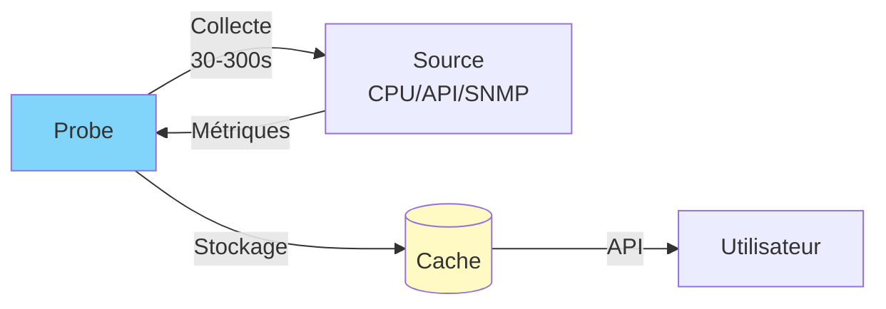

# SenHub Agent - Configuration des Probes

## Table des Matières

- [Concepts Généraux](#concepts-généraux)
- [Probes Système (Free Tier)](#probes-système-free-tier)
- [Probes Réseau (Pro/Enterprise)](#probes-réseau-proenterprise)
- [Probes Infrastructure (Pro/Enterprise)](#probes-infrastructure-proenterprise)
- [Exemples de Configuration](#exemples-de-configuration)

---

## Concepts Généraux

### Qu'est-ce qu'une Probe ?

Une probe collecte des métriques depuis une source spécifique à intervalles réguliers.



### Structure de Configuration

```yaml
probes:
  - name: "Nom Affiché"     # Display name (libre choix)
    type: probe_type        # Type technique (registry)
    params:
      interval: 60          # Intervalle collecte (secondes)
      # ... paramètres spécifiques
```

**Distinction importante** :
- `name` : Identifiant unique pour cette **instance** (cache keys, tags métriques)
- `type` : Type de probe technique (registry, transformers)

### Intervalles de Collecte

| Intervalle | Usage | Exemples |
|------------|-------|----------|
| **10-30s** | Haute fréquence | CPU, Memory (monitoring temps réel) |
| **60s** | Standard | Disques, Network |
| **120-300s** | Basse fréquence | Redfish (hardware), Citrix |

---

## Probes Système (Free Tier)

Disponibles sans licence, incluses dans le free tier.

### CPU Monitoring

**Configuration minimale** :
```yaml
probes:
  - name: cpu
    type: cpu
    params:
      interval: 30
```

**Métriques collectées** :
- `cpu_usage_total` : Usage total CPU (%)
- `cpu_user`, `cpu_system` : Temps user/system
- `cpu_load1`, `cpu_load5`, `cpu_load15` : Load average (Linux/macOS)
- Par core : `cpu_core_usage`

**Plateformes** : Windows, Linux, macOS, BSD

**📸 SCREENSHOT À INSÉRER** : Dashboard montrant graphique CPU usage avec 4 cores

---

### Memory Monitoring

**Configuration minimale** :
```yaml
probes:
  - name: memory
    type: memory
    params:
      interval: 30
```

**Métriques collectées** :
- `memory_total`, `memory_available` : Mémoire totale/disponible
- `memory_used`, `memory_free` : Utilisée/libre
- `memory_usage_percent` : Pourcentage d'utilisation
- `swap_total`, `swap_used` : Swap (si présent)

**Plateformes** : Windows, Linux, macOS, BSD

---

### Logical Disk Monitoring

**Configuration minimale** :
```yaml
probes:
  - name: logicaldisk
    type: logicaldisk
    params:
      interval: 60
```

**Configuration avancée** :
```yaml
probes:
  - name: logicaldisk
    type: logicaldisk
    params:
      interval: 60
      exclude_filesystems: ["tmpfs", "devtmpfs", "squashfs"]  # Linux
      exclude_mount_points: ["/snap/*", "/boot/efi"]          # Patterns
```

**Métriques collectées** :
- `disk_total`, `disk_free`, `disk_used` : Espace (bytes)
- `disk_free_percent`, `disk_used_percent` : Pourcentage
- Tags : `disk`, `mount_point`, `filesystem`

**Plateformes** : Windows, Linux, macOS

**📸 SCREENSHOT À INSÉRER** : Graphique PRTG montrant plusieurs disques (C:, D:, E:) avec % libre

---

### Network Monitoring

**Configuration minimale** :
```yaml
probes:
  - name: network
    type: network
    params:
      interval: 60
```

**Configuration avancée** :
```yaml
probes:
  - name: network
    type: network
    params:
      interval: 60
      exclude_interfaces: ["lo", "docker*", "veth*"]  # Exclure loopback, docker
```

**Métriques collectées** :
- `network_bytes_sent`, `network_bytes_recv` : Trafic (bytes)
- `network_packets_sent`, `network_packets_recv` : Paquets
- `network_errors_in`, `network_errors_out` : Erreurs
- Tags : `interface`, `mac_address`

**Plateformes** : Windows, Linux, macOS

---

## Probes Réseau (Pro/Enterprise)

Nécessitent une licence Pro ou Enterprise.

### Ping Gateway

**Configuration** :
```yaml
probes:
  - name: ping_gateway
    type: ping_gateway
    params: {}  # Auto-détection gateway
```

**Configuration manuelle** :
```yaml
probes:
  - name: "Ping Routeur Principal"
    type: ping_gateway
    params:
      gateway: "192.168.1.1"  # IP personnalisée
      count: 4                # Nombre de pings
      timeout: 5              # Timeout (secondes)
```

**Métriques** :
- `ping_latency_ms` : Latence moyenne
- `ping_packet_loss_percent` : Perte de paquets
- `ping_min_ms`, `ping_max_ms` : Min/Max

---

### Ping WebApp

**Configuration** :
```yaml
probes:
  - name: "Ping Site Web"
    type: ping_webapp
    params:
      url: "https://www.example.com"  # REQUIS
      timeout: 30                      # Optional, défaut: 30s
```

**Métriques** :
- `webapp_available` : 1 (up) ou 0 (down)
- `webapp_response_time_ms` : Temps de réponse
- `webapp_status_code` : Code HTTP (200, 404, etc.)

---

### Load WebApp

**Configuration** :
```yaml
probes:
  - name: "Load Time Site"
    type: load_webapp
    params:
      url: "https://www.example.com"  # REQUIS
      timeout: 30
```

**Métriques** :
- `webapp_load_time_ms` : Temps chargement complet
- `webapp_dns_time_ms` : Temps résolution DNS
- `webapp_connect_time_ms` : Temps connexion TCP
- `webapp_tls_time_ms` : Temps handshake TLS

---

### WiFi Signal Strength

**Configuration** :
```yaml
probes:
  - name: wifi_signal_strength
    type: wifi_signal_strength
    params: {}  # Auto-détection WiFi
```

**Métriques** :
- `wifi_signal_strength_dbm` : Puissance signal (dBm)
- `wifi_quality_percent` : Qualité (%)
- Tags : `ssid`, `bssid`, `frequency`

**Note** : Fonctionne uniquement si WiFi actif

---

## Probes Infrastructure (Pro/Enterprise)

### Redfish (iDRAC, iLO, BMC)

Monitoring matériel serveurs via API Redfish.

**Configuration complète** :
```yaml
probes:
  - name: "Production iDRAC Dell"
    type: redfish
    params:
      endpoint: "https://idrac.company.com"  # REQUIS
      username: "monitoring"                  # REQUIS
      password: "SecurePass123"               # REQUIS
      interval: 300                           # 5 minutes
      verify_ssl: true                        # Valider certificat
      collections:                            # Optionnel
        - system       # Info système générale
        - thermal      # Températures, ventilateurs
        - power        # Alimentation, consommation
        - processor    # CPU hardware
        - memory       # RAM hardware
        - storage      # Contrôleurs RAID
        - drives       # Disques individuels
        - networkadapter  # Cartes réseau
```

**Si collections omis** : Toutes les collections collectées

**Métriques** :
- Températures : `redfish_temperature_celsius`
- Ventilateurs : `redfish_fan_speed_rpm`, `redfish_fan_speed_percent`
- Power : `redfish_power_consumed_watts`, `redfish_power_capacity_watts`
- Disques : `redfish_drive_capacity_bytes`, `redfish_drive_state`
- Tags : `chassis`, `sensor_name`, `drive_id`, etc.

**Certificats SSL** :
```yaml
# Production avec certificat CA valide
verify_ssl: true

# Dev avec certificat auto-signé
verify_ssl: false
```

**📸 SCREENSHOT À INSÉRER** : Dashboard Redfish montrant températures CPU, ventilateurs, disques RAID

---

### Citrix Virtual Apps and Desktops (CVAD)

Monitoring environnements VDI Citrix.

**Configuration Director seul** :
```yaml
probes:
  - name: "Citrix Production"
    type: citrix
    params:
      base_url: "https://director.company.com"  # REQUIS (sans /Director)
      interval: 120
      auth:
        username: "DOMAIN\\monitoring"  # Format DOMAIN\\user
        password: "password"
      tls:
        verify_ssl: true
      timeout: 30
```

**Configuration avec Delivery Controller** :
```yaml
probes:
  - name: "Citrix Production"
    type: citrix
    params:
      base_url: "https://director.company.com"

      # Delivery Controller pour site filtering
      delivery_controller:
        url: "https://citrix-ddc.company.com"
        fallback_urls:
          - "https://citrix-ddc-backup.company.com"
        site_filter: "SITE-PARIS"  # Filtrer par site

      interval: 120
      auth:
        username: "DOMAIN\\monitoring"
        password: "password"
      retry:
        max_attempts: 3
        backoff_factor: 2.0
```

**Métriques** :
- Sessions : `citrix_active_sessions`, `citrix_disconnected_sessions`
- Logon : `citrix_logon_duration_seconds`
- Serveurs : `citrix_server_load_percent`, `citrix_server_session_count`
- Licences : `citrix_license_usage`, `citrix_license_available`
- Tags : `site`, `delivery_group`, `machine_name`

**Authentification** :
- Director : NTLM automatique
- Delivery Controller : Basic automatique

**📸 SCREENSHOT À INSÉRER** : Dashboard Citrix avec graphiques sessions actives, logon duration, server load

---

### NetScaler ADC (Load Balancer)

Monitoring Citrix NetScaler / ADC.

**Configuration** :
```yaml
probes:
  - name: "NetScaler Production"
    type: netscaler
    params:
      endpoint: "https://netscaler.company.com"  # REQUIS (NSIP)
      username: "nsroot"                          # REQUIS
      password: "password"                        # REQUIS
      interval: 120
      verify_ssl: true
      timeout: 30
```

**Métriques** :
- System : `netscaler_cpu_usage`, `netscaler_memory_usage`
- Virtual Servers : `netscaler_vserver_state`, `netscaler_vserver_hits`, `netscaler_vserver_requests`
- Services : `netscaler_service_state`, `netscaler_service_throughput`
- SSL : `netscaler_ssl_sessions`, `netscaler_ssl_cert_days_to_expire`
- Tags : `vserver_name`, `service_name`, `cert_name`, `metric_view`, `metric_type`

**Filtrage par Tags** :
```bash
# Via API - Filtrer par type
curl "http://localhost:8080/api/{key}/prtg/metrics/netscaler?filter=metric_view:load_balancing"

# Filtrer par virtual server
curl "http://localhost:8080/api/{key}/prtg/metrics/netscaler?filter=vserver_name:Web-vServer"
```

**📸 SCREENSHOT À INSÉRER** : Dashboard NetScaler avec virtual servers health, SSL certificates expiration

---

### Syslog

Réception et parsing d'événements syslog.

**Configuration** :
```yaml
probes:
  - name: syslog
    type: syslog
    params:
      port: 514             # Défaut: 514
      protocol: "udp"       # "udp" ou "tcp"
```

**Métriques** :
- `syslog_messages_received` : Nombre de messages reçus
- `syslog_errors` : Erreurs de parsing
- Tags : `severity`, `facility`, `hostname`, `app_name`

**Firewall** :
```bash
# Autoriser port syslog
sudo ufw allow 514/udp
sudo firewall-cmd --permanent --add-port=514/udp
```

---

## Exemples de Configuration

### Configuration Production Complète

```yaml
config_version: 2

agent:
  key: "f47ac10b-58cc-4372-a567-0e02b2c3d479"
  mode: offline
  license: |
    {
      "tier": "pro",
      "authorized_probes": ["redfish", "citrix", "netscaler", "syslog"],
      "expires_at": "2025-12-31T23:59:59Z",
      "issued_at": "2025-01-01T00:00:00Z",
      "subject": "production-datacenter"
    }

auto_update:
  enabled: true
  url: "https://eu-west-1.intake.senhub.io/releases"

cache:
  retention_minutes: 10

storage:
  - name: http
    params:
      port: 8443
      bind_address: "0.0.0.0"
      endpoints: ["prtg", "web", "nagios"]
      tls:
        enabled: true
        min_tls_version: "1.2"
        cert_file: "/etc/ssl/certs/monitoring.crt"
        key_file: "/etc/ssl/private/monitoring.key"

probes:
  # === FREE TIER ===

  - name: cpu
    type: cpu
    params:
      interval: 30

  - name: memory
    type: memory
    params:
      interval: 30

  - name: logicaldisk
    type: logicaldisk
    params:
      interval: 60
      exclude_filesystems: ["tmpfs", "devtmpfs"]

  - name: network
    type: network
    params:
      interval: 60
      exclude_interfaces: ["lo", "docker*"]

  # === PRO TIER ===

  - name: "Paris iDRAC Server 1"
    type: redfish
    params:
      endpoint: "https://idrac-srv01.company.com"
      username: "monitoring"
      password: "SecurePassword123"
      interval: 300
      verify_ssl: true
      collections:
        - system
        - thermal
        - power
        - storage

  - name: "Paris iDRAC Server 2"
    type: redfish
    params:
      endpoint: "https://idrac-srv02.company.com"
      username: "monitoring"
      password: "SecurePassword123"
      interval: 300
      verify_ssl: true

  - name: "Citrix Production Paris"
    type: citrix
    params:
      base_url: "https://director-paris.company.com"
      delivery_controller:
        url: "https://ddc-paris.company.com"
        site_filter: "SITE-PARIS"
      interval: 120
      auth:
        username: "DOMAIN\\monitoring"
        password: "CitrixPass123"
      tls:
        verify_ssl: true

  - name: "NetScaler Load Balancer"
    type: netscaler
    params:
      endpoint: "https://netscaler.company.com"
      username: "nsroot"
      password: "NSPassword123"
      interval: 120
      verify_ssl: true

  - name: syslog
    type: syslog
    params:
      port: 514
      protocol: "udp"
```

**📸 SCREENSHOT À INSÉRER** : Fichier de configuration complet ouvert dans VSCode avec coloration syntaxique

---

### Configuration Développement (Free Tier)

```yaml
config_version: 2

agent:
  key: "dev-12345"
  mode: offline

auto_update:
  enabled: false

cache:
  retention_minutes: 5

storage:
  - name: http
    params:
      port: 8080
      bind_address: "127.0.0.1"
      endpoints: ["prtg", "web"]

probes:
  - name: cpu
    type: cpu
    params:
      interval: 10  # Haute fréquence pour dev

  - name: memory
    type: memory
    params:
      interval: 10
```

---

**Prochaines étapes** :
- [Utilisation Interface Web](./WEB-INTERFACE.md)
- [Utilisation des Métriques](./METRICS-USAGE.md)
- [Troubleshooting](./TROUBLESHOOTING.md)
