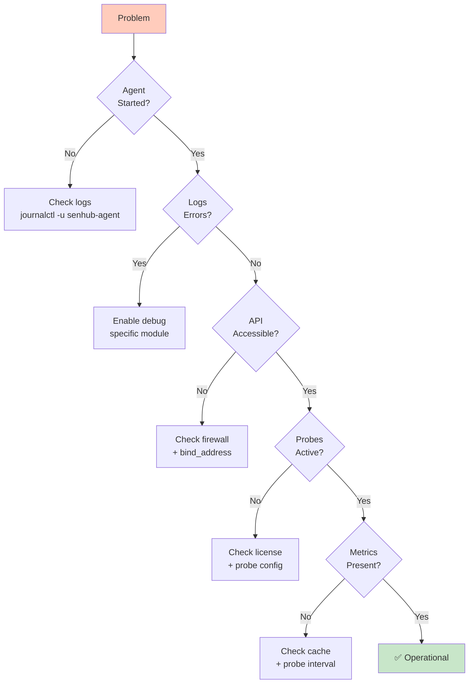

# SenHub Agent - Troubleshooting and Logging

## Table of Contents

- [Logging System](#logging-system)
- [Installation Issues](#installation-issues)
- [Configuration Issues](#configuration-issues)
- [License Issues](#license-issues)
- [Network Issues](#network-issues)
- [Performance Issues](#performance-issues)
- [Probe Issues](#probe-issues)

---

## Logging System

### Logging Architecture

The modular logging system allows enabling detailed logs per component without restarting the agent.


### Log Levels

```
disabled < trace < debug < info < warn < error < fatal < panic
```

### Available Modules

| Module | Component |
|--------|-----------|
| `agent.core` | Main orchestration |
| `configuration.local` | Offline config |
| `configuration.remote` | Online config |
| `probe.cpu` | CPU probe |
| `probe.memory` | Memory probe |
| `probe.logicaldisk` | Disk probe |
| `probe.network` | Network probe |
| `probe.redfish` | Redfish probe |
| `probe.citrix` | Citrix probe |
| `probe.netscaler` | NetScaler probe |
| `strategy.http` | HTTP strategy + cache |

---

### Enabling Logs at Startup

#### Verbose Mode (All Modules)

```bash
senhub-agent run --verbose --offline
```

Equivalent to enabling all modules in debug.

#### Selective Mode (Specific Modules)

```bash
# Debug only Redfish and HTTP
senhub-agent run --debug-modules "probe.redfish,strategy.http" --offline

# Debug configuration
senhub-agent run --debug-modules "configuration.local" --offline
```

**📸 SCREENSHOT TO INSERT**: Terminal with verbose logs showing colored DEBUG messages

---

### Runtime Activation via API

#### View Current Levels

```bash
curl http://localhost:8080/api/{key}/debug/logs
```

**Response**:
```json
{
  "global_level": "info",
  "modules": {
    "probe.redfish": "info",
    "strategy.http": "info",
    "agent.core": "info"
  }
}
```

#### Modify Levels (Without Restart)

```bash
curl -X POST http://localhost:8080/api/{key}/debug/logs \
  -H "Content-Type: application/json" \
  -d '{
    "module_levels": [
      {"module": "probe.redfish", "level": "debug"},
      {"module": "strategy.http", "level": "debug"}
    ]
  }'
```

**Response**:
```json
{
  "status": "success",
  "updated_modules": ["probe.redfish", "strategy.http"]
}
```

**📸 SCREENSHOT TO INSERT**: Web dashboard with "Debug Logs" section allowing module activation

---

### Log Files

| Platform | Path |
|----------|------|
| **Linux** | `/var/log/senhub-agent/agent.log` |
| **macOS** | `/Library/Logs/SenHub/agent.log` |
| **Windows** | `C:\ProgramData\SenHub\Logs\agent.log` |

### Viewing Logs

```bash
# Linux/macOS - Follow in real time
sudo tail -f /var/log/senhub-agent/agent.log

# Filter by module
sudo tail -f /var/log/senhub-agent/agent.log | grep "probe.redfish"

# Filter by level
sudo tail -f /var/log/senhub-agent/agent.log | grep "ERR"

# Windows
Get-Content C:\ProgramData\SenHub\Logs\agent.log -Tail 50 -Wait
```

---

## Installation Issues

### Service Won't Start

**Symptom**: `systemctl status senhub-agent` shows "failed"

**Diagnosis**:
```bash
# Check logs
sudo journalctl -u senhub-agent -n 50

# Test manually
sudo senhub-agent run --offline
```

**Common causes**:
1. Port already in use (8080/8443)
2. Insufficient permissions
3. Invalid configuration

**Solutions**:
```bash
# Port in use - change port
sudo nano /etc/senhub-agent/agent-config.yaml
# Change port: 8080 → 8081

# Permissions - verify
ls -la /usr/local/bin/senhub-agent
sudo chmod +x /usr/local/bin/senhub-agent
```

---

### Invalid HTTPS Certificates

**Symptom**: Error "certificate verify failed"

**Solution**:
```bash
# Regenerate certificates
sudo senhub-agent stop
sudo rm -rf ./certs/
sudo senhub-agent install --offline --enable-https \
  --https-hosts "monitoring.local,192.168.1.100"
sudo senhub-agent start
```

---

## Configuration Issues

### Invalid YAML Configuration

**Symptom**: Agent refuses to start

**Diagnosis**:
```bash
# Enable configuration debug logs
senhub-agent run --debug-modules "configuration.local" --offline
```

**Common errors**:
```yaml
# ❌ Incorrect indentation
agent:
key: "test"  # Missing 2 spaces

# ✅ Correct
agent:
  key: "test"

# ❌ Missing quotes
bind_address: 0.0.0.0

# ✅ Correct
bind_address: "0.0.0.0"
```

---

### Probe Won't Start

**Symptom**: Probe absent from `/api/{key}/info/probes`

**Diagnosis**:
```bash
# Enable debug for probe
curl -X POST http://localhost:8080/api/{key}/debug/logs \
  -d '{"module_levels": [{"module": "probe.redfish", "level": "debug"}]}'

# Check logs
sudo tail -f /var/log/senhub-agent/agent.log | grep "probe.redfish"
```

**Common errors**:
```
ERR Probe failed to start error="endpoint required" probe=redfish
→ Solution: Add endpoint field in params

ERR Probe not authorized tier=free probe=redfish
→ Solution: Add Pro/Enterprise license
```

---

## License Issues

### License Not Recognized

**Symptom**: Paid probes won't start

**Diagnosis**:
```bash
# Check status
curl http://localhost:8080/api/{key}/license/status

# Check logs
sudo tail -100 /var/log/senhub-agent/agent.log | grep -i license
```

**Solutions**:

#### Malformed JSON
```bash
# Test JSON
echo '{"tier":"pro",...}' | jq .

# If error, fix in agent-config.yaml
```

#### Expired License
```bash
# Contact support@senhub.io for renewal

# Meanwhile, check grace period
curl http://localhost:8080/api/{key}/license/status
# "grace_period_days_remaining": 4
```

**📸 SCREENSHOT TO INSERT**: Dashboard with red banner "License Expired - Grace Period: 4 days remaining"

---

## Network Issues

### Web Interface Inaccessible

**Symptom**: `curl http://localhost:8080` → connection refused

**Diagnosis**:
```bash
# Check if agent is listening
sudo lsof -i :8080  # Linux/macOS
netstat -ano | findstr :8080  # Windows

# If nothing → agent not started
sudo systemctl status senhub-agent

# If listening on 127.0.0.1 but remote access doesn't work
# → restrictive bind_address
```

**Solutions**:
```yaml
# Change bind_address for remote access
storage:
  - name: http
    params:
      bind_address: "0.0.0.0"  # Instead of 127.0.0.1
```

---

### Firewall Blocking Access

**Linux (UFW)**:
```bash
sudo ufw allow 8080/tcp
sudo ufw allow 8443/tcp
sudo ufw reload
```

**Linux (firewalld)**:
```bash
sudo firewall-cmd --permanent --add-port=8080/tcp
sudo firewall-cmd --reload
```

**Windows**:
```powershell
New-NetFirewallRule -DisplayName "SenHub HTTP" -Direction Inbound -Protocol TCP -LocalPort 8080 -Action Allow
```

---

## Performance Issues

### High Memory Consumption

**Symptom**: Agent using > 500 MB RAM

**Diagnosis**:
```bash
# Check cache retention
curl http://localhost:8080/api/{key}/info/system

# Response:
# "cache": {"retention_minutes": 30}  # Too high
```

**Solution**:
```yaml
# Reduce retention
cache:
  retention_minutes: 5  # Instead of 30
```

---

### High CPU

**Symptom**: Agent using > 20% CPU constantly

**Common causes**:
1. Collection intervals too short
2. Too many active probes
3. Misconfigured probe (loop)

**Solutions**:
```yaml
# Increase intervals
probes:
  - name: cpu
    type: cpu
    params:
      interval: 60  # Instead of 10

# Disable unused probes
# Comment out unnecessary probes
```

---

## Probe Issues

### Redfish Probe - Connection Impossible

**Error**:
```
ERR Failed to connect to Redfish endpoint="https://idrac.local" error="connection refused"
```

**Solutions**:
1. Verify endpoint is accessible:
```bash
curl -k https://idrac.local/redfish/v1/
```

2. Disable SSL if self-signed certificate:
```yaml
probes:
  - name: "Production iDRAC"
    type: redfish
    params:
      verify_ssl: false
```

3. Verify credentials:
```yaml
params:
  username: "root"  # Not "admin"
  password: "correct-password"
```

---

### Citrix Probe - Authentication Failed

**Error**:
```
ERR Citrix authentication failed error="401 Unauthorized"
```

**Solutions**:
1. Correct username format:
```yaml
params:
  username: "DOMAIN\\user"  # Not "user@domain"
```

2. Verify URL:
```yaml
params:
  base_url: "https://director.company.com"  # Not "/Director"
```

---

### Missing Metrics

**Symptom**: Some metrics missing from `/api/{key}/metrics`

**Diagnosis**:
```bash
# Enable probe debug
curl -X POST http://localhost:8080/api/{key}/debug/logs \
  -d '{"module_levels": [{"module": "probe.cpu", "level": "debug"}]}'

# Check cache
curl http://localhost:8080/api/{key}/info/probes
# "probe_metrics": {"cpu": 12}  # Number of metrics
```

**Common causes**:
1. Probe hasn't collected yet (< interval)
2. Collection error (see logs)
3. Cache expired (increase retention)

---

## Troubleshooting Checklist



### Systematic Steps

1. **Check service**
```bash
sudo systemctl status senhub-agent
```

2. **View logs**
```bash
sudo tail -50 /var/log/senhub-agent/agent.log
```

3. **Enable debug**
```bash
curl -X POST http://localhost:8080/api/{key}/debug/logs \
  -d '{"module_levels": [{"module": "agent.core", "level": "debug"}]}'
```

4. **Test API**
```bash
curl http://localhost:8080/api/{key}/info/system
```

5. **Check probes**
```bash
curl http://localhost:8080/api/{key}/info/probes
```

---

## Support

**Email**: support@senhub.io

**Information to provide**:
- Agent version: `senhub-agent version`
- OS + version
- Config file (anonymized)
- Recent logs (last 50 lines)
- Output of `/api/{key}/info/system`

---

**Documentation**:
- [INSTALLATION.md](./INSTALLATION.md)
- [AGENT-CONFIGURATION.md](./AGENT-CONFIGURATION.md)
- [HTTP-HTTPS-CONFIGURATION.md](./HTTP-HTTPS-CONFIGURATION.md)
