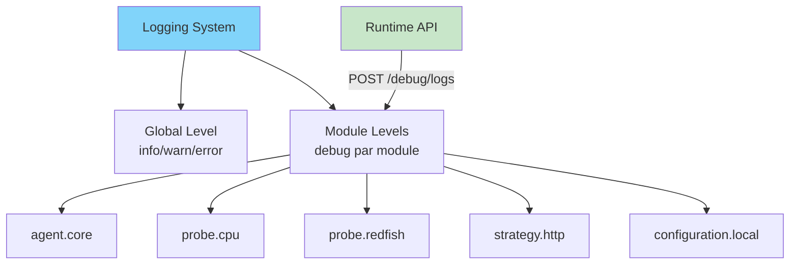
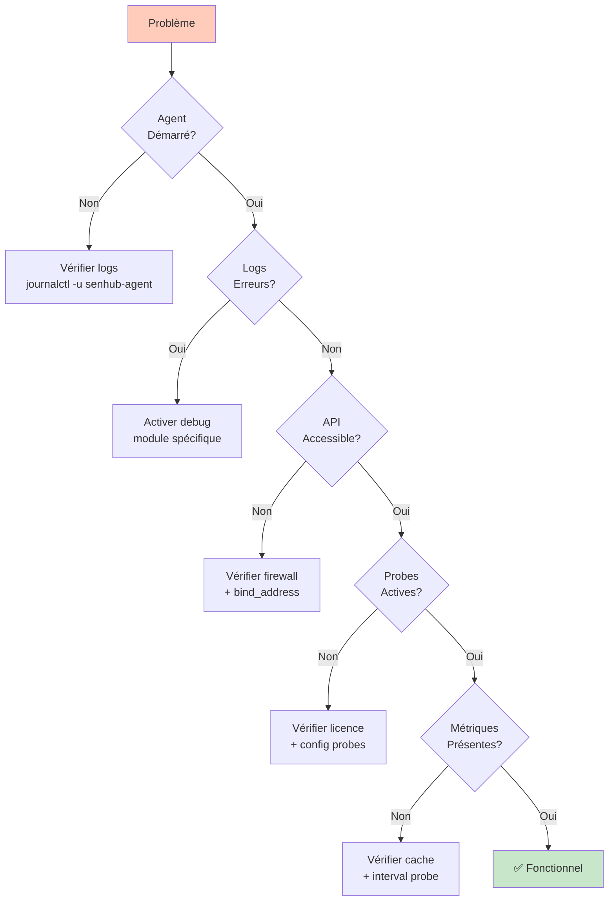

# SenHub Agent - Dépannage et Logging

## Table des Matières

- [Système de Logging](#système-de-logging)
- [Problèmes d'Installation](#problèmes-dinstallation)
- [Problèmes de Configuration](#problèmes-de-configuration)
- [Problèmes de Licence](#problèmes-de-licence)
- [Problèmes Réseau](#problèmes-réseau)
- [Problèmes de Performance](#problèmes-de-performance)
- [Problèmes de Probes](#problèmes-de-probes)

---

## Système de Logging

### Architecture du Logging

Le système de logging modulaire permet d'activer des logs détaillés par composant sans redémarrer l'agent.



### Niveaux de Log

```
disabled < trace < debug < info < warn < error < fatal < panic
```

### Modules Disponibles

| Module | Composant |
|--------|-----------|
| `agent.core` | Orchestration principale |
| `configuration.local` | Config offline |
| `configuration.remote` | Config online |
| `probe.cpu` | Probe CPU |
| `probe.memory` | Probe mémoire |
| `probe.logicaldisk` | Probe disques |
| `probe.network` | Probe réseau |
| `probe.redfish` | Probe Redfish |
| `probe.citrix` | Probe Citrix |
| `probe.netscaler` | Probe NetScaler |
| `strategy.http` | HTTP strategy + cache |

---

### Activation des Logs au Démarrage

#### Mode Verbose (Tous les modules)

```bash
senhub-agent run --verbose --offline
```

Équivalent à activer tous les modules en debug.

#### Mode Sélectif (Modules Spécifiques)

```bash
# Debug uniquement Redfish et HTTP
senhub-agent run --debug-modules "probe.redfish,strategy.http" --offline

# Debug configuration
senhub-agent run --debug-modules "configuration.local" --offline
```

**📸 SCREENSHOT À INSÉRER** : Terminal avec logs verbose montrant les messages DEBUG colorés

---

### Activation Runtime via API

#### Voir les Niveaux Actuels

```bash
curl http://localhost:8080/api/{key}/debug/logs
```

**Réponse** :
```json
{
  "global_level": "info",
  "modules": {
    "probe.redfish": "info",
    "strategy.http": "info",
    "agent.core": "info"
  }
}
```

#### Modifier les Niveaux (Sans Redémarrage)

```bash
curl -X POST http://localhost:8080/api/{key}/debug/logs \
  -H "Content-Type: application/json" \
  -d '{
    "module_levels": [
      {"module": "probe.redfish", "level": "debug"},
      {"module": "strategy.http", "level": "debug"}
    ]
  }'
```

**Réponse** :
```json
{
  "status": "success",
  "updated_modules": ["probe.redfish", "strategy.http"]
}
```

**📸 SCREENSHOT À INSÉRER** : Dashboard web avec section "Debug Logs" permettant d'activer les modules

---

### Fichiers de Logs

| Plateforme | Chemin |
|------------|--------|
| **Linux** | `/var/log/senhub-agent/agent.log` |
| **macOS** | `/Library/Logs/SenHub/agent.log` |
| **Windows** | `C:\ProgramData\SenHub\Logs\agent.log` |

### Consultation des Logs

```bash
# Linux/macOS - Suivre en temps réel
sudo tail -f /var/log/senhub-agent/agent.log

# Filtrer par module
sudo tail -f /var/log/senhub-agent/agent.log | grep "probe.redfish"

# Filtrer par niveau
sudo tail -f /var/log/senhub-agent/agent.log | grep "ERR"

# Windows
Get-Content C:\ProgramData\SenHub\Logs\agent.log -Tail 50 -Wait
```

---

## Problèmes d'Installation

### Service Ne Démarre Pas

**Symptôme** : `systemctl status senhub-agent` montre "failed"

**Diagnostic** :
```bash
# Vérifier les logs
sudo journalctl -u senhub-agent -n 50

# Tester manuellement
sudo senhub-agent run --offline
```

**Causes communes** :
1. Port déjà utilisé (8080/8443)
2. Permissions insuffisantes
3. Configuration invalide

**Solutions** :
```bash
# Port utilisé - changer le port
sudo nano /etc/senhub-agent/agent-config.yaml
# Modifier port: 8080 → 8081

# Permissions - vérifier
ls -la /usr/local/bin/senhub-agent
sudo chmod +x /usr/local/bin/senhub-agent
```

---

### Certificats HTTPS Invalides

**Symptôme** : Erreur "certificate verify failed"

**Solution** :
```bash
# Régénérer certificats
sudo senhub-agent stop
sudo rm -rf ./certs/
sudo senhub-agent install --offline --enable-https \
  --https-hosts "monitoring.local,192.168.1.100"
sudo senhub-agent start
```

---

## Problèmes de Configuration

### Configuration YAML Invalide

**Symptôme** : Agent refuse de démarrer

**Diagnostic** :
```bash
# Activer logs debug configuration
senhub-agent run --debug-modules "configuration.local" --offline
```

**Erreurs communes** :
```yaml
# ❌ Indentation incorrecte
agent:
key: "test"  # Manque 2 espaces

# ✅ Correct
agent:
  key: "test"

# ❌ Guillemets manquants
bind_address: 0.0.0.0

# ✅ Correct
bind_address: "0.0.0.0"
```

---

### Probe Ne Démarre Pas

**Symptôme** : Probe absente de `/api/{key}/info/probes`

**Diagnostic** :
```bash
# Activer debug pour la probe
curl -X POST http://localhost:8080/api/{key}/debug/logs \
  -d '{"module_levels": [{"module": "probe.redfish", "level": "debug"}]}'

# Consulter les logs
sudo tail -f /var/log/senhub-agent/agent.log | grep "probe.redfish"
```

**Erreurs communes** :
```
ERR Probe failed to start error="endpoint required" probe=redfish
→ Solution : Ajouter le champ endpoint dans params

ERR Probe not authorized tier=free probe=redfish
→ Solution : Ajouter une licence Pro/Enterprise
```

---

## Problèmes de Licence

### Licence Non Reconnue

**Symptôme** : Probes payantes ne démarrent pas

**Diagnostic** :
```bash
# Vérifier statut
curl http://localhost:8080/api/{key}/license/status

# Vérifier logs
sudo tail -100 /var/log/senhub-agent/agent.log | grep -i license
```

**Solutions** :

#### JSON Mal Formaté
```bash
# Tester le JSON
echo '{"tier":"pro",...}' | jq .

# Si erreur, corriger dans agent-config.yaml
```

#### Licence Expirée
```bash
# Contacter support@senhub.io pour renouvellement

# En attendant, vérifier période de grâce
curl http://localhost:8080/api/{key}/license/status
# "grace_period_days_remaining": 4
```

**📸 SCREENSHOT À INSÉRER** : Dashboard avec banner rouge "License Expired - Grace Period: 4 days remaining"

---

## Problèmes Réseau

### Interface Web Inaccessible

**Symptôme** : `curl http://localhost:8080` → connection refused

**Diagnostic** :
```bash
# Vérifier si agent écoute
sudo lsof -i :8080  # Linux/macOS
netstat -ano | findstr :8080  # Windows

# Si rien → agent pas démarré
sudo systemctl status senhub-agent

# Si écoute sur 127.0.0.1 mais accès distant ne marche pas
# → bind_address restrictif
```

**Solutions** :
```yaml
# Changer bind_address pour accès distant
storage:
  - name: http
    params:
      bind_address: "0.0.0.0"  # Au lieu de 127.0.0.1
```

---

### Firewall Bloque l'Accès

**Linux (UFW)** :
```bash
sudo ufw allow 8080/tcp
sudo ufw allow 8443/tcp
sudo ufw reload
```

**Linux (firewalld)** :
```bash
sudo firewall-cmd --permanent --add-port=8080/tcp
sudo firewall-cmd --reload
```

**Windows** :
```powershell
New-NetFirewallRule -DisplayName "SenHub HTTP" -Direction Inbound -Protocol TCP -LocalPort 8080 -Action Allow
```

---

## Problèmes de Performance

### Consommation Mémoire Élevée

**Symptôme** : Agent utilise > 500 MB RAM

**Diagnostic** :
```bash
# Vérifier cache retention
curl http://localhost:8080/api/{key}/info/system

# Response:
# "cache": {"retention_minutes": 30}  # Trop élevé
```

**Solution** :
```yaml
# Réduire retention
cache:
  retention_minutes: 5  # Au lieu de 30
```

---

### CPU Élevé

**Symptôme** : Agent utilise > 20% CPU constant

**Causes communes** :
1. Intervalles de collecte trop courts
2. Trop de probes actives
3. Probe mal configurée (boucle)

**Solutions** :
```yaml
# Augmenter intervalles
probes:
  - name: cpu
    type: cpu
    params:
      interval: 60  # Au lieu de 10

# Désactiver probes inutilisées
# Commenter les probes non nécessaires
```

---

## Problèmes de Probes

### Probe Redfish - Connexion Impossible

**Erreur** :
```
ERR Failed to connect to Redfish endpoint="https://idrac.local" error="connection refused"
```

**Solutions** :
1. Vérifier endpoint accessible :
```bash
curl -k https://idrac.local/redfish/v1/
```

2. Désactiver SSL si certificat auto-signé :
```yaml
probes:
  - name: "Production iDRAC"
    type: redfish
    params:
      verify_ssl: false
```

3. Vérifier credentials :
```yaml
params:
  username: "root"  # Pas "admin"
  password: "correct-password"
```

---

### Probe Citrix - Authentication Failed

**Erreur** :
```
ERR Citrix authentication failed error="401 Unauthorized"
```

**Solutions** :
1. Format username correct :
```yaml
params:
  username: "DOMAIN\\user"  # Pas "user@domain"
```

2. Vérifier URL :
```yaml
params:
  base_url: "https://director.company.com"  # Pas "/Director"
```

---

### Métriques Manquantes

**Symptôme** : Certaines métriques absentes de `/api/{key}/metrics`

**Diagnostic** :
```bash
# Activer debug probe
curl -X POST http://localhost:8080/api/{key}/debug/logs \
  -d '{"module_levels": [{"module": "probe.cpu", "level": "debug"}]}'

# Vérifier cache
curl http://localhost:8080/api/{key}/info/probes
# "probe_metrics": {"cpu": 12}  # Nombre de métriques
```

**Causes communes** :
1. Probe pas encore collecté (< interval)
2. Erreur de collecte (voir logs)
3. Cache expiré (augmenter retention)

---

## Checklist de Dépannage



### Étapes Systématiques

1. **Vérifier service**
```bash
sudo systemctl status senhub-agent
```

2. **Consulter logs**
```bash
sudo tail -50 /var/log/senhub-agent/agent.log
```

3. **Activer debug**
```bash
curl -X POST http://localhost:8080/api/{key}/debug/logs \
  -d '{"module_levels": [{"module": "agent.core", "level": "debug"}]}'
```

4. **Tester API**
```bash
curl http://localhost:8080/api/{key}/info/system
```

5. **Vérifier probes**
```bash
curl http://localhost:8080/api/{key}/info/probes
```

---

## Support

**Email** : support@senhub.io

**Informations à fournir** :
- Version agent : `senhub-agent version`
- OS + version
- Fichier config (anonymisé)
- Logs récents (50 dernières lignes)
- Sortie de `/api/{key}/info/system`

---

**Documentation** :
- [INSTALLATION.md](./INSTALLATION.md)
- [AGENT-CONFIGURATION.md](./AGENT-CONFIGURATION.md)
- [HTTP-HTTPS-CONFIGURATION.md](./HTTP-HTTPS-CONFIGURATION.md)
