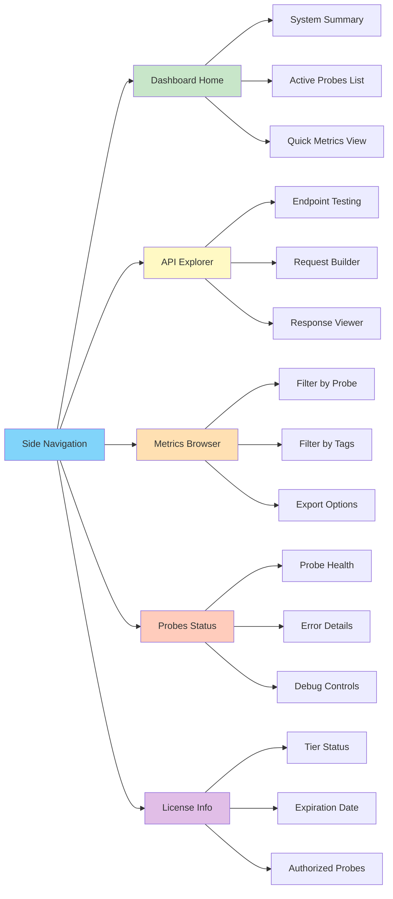

# Web Interface

This guide covers the agent's web dashboard - a browser-based interface for monitoring metrics, testing APIs, and managing configuration. Understanding the workflow-oriented design of each dashboard section enables efficient troubleshooting, integration testing, and daily monitoring operations.

## Table of Contents

- [Accessing the Dashboard](#accessing-the-dashboard)
- [Dashboard Overview](#dashboard-overview)
- [Workflow: Monitoring System Health](#workflow-monitoring-system-health)
- [Workflow: Testing API Integration](#workflow-testing-api-integration)
- [Workflow: Troubleshooting Probe Issues](#workflow-troubleshooting-probe-issues)
- [Workflow: Managing PRTG Integration](#workflow-managing-prtg-integration)
- [Dashboard Sections Reference](#dashboard-sections-reference)

---

## Accessing the Dashboard

### URL Format

```
http(s)://<server>:<port>/web/{agent-key}/dashboard
```

**Examples by deployment mode:**

**Development (HTTP localhost):**
```
http://localhost:8080/web/f47ac10b-58cc-4372-a567-0e02b2c3d479/dashboard
```

**Production (HTTPS network):**
```
https://monitoring.company.com:8443/web/f47ac10b-58cc-4372-a567-0e02b2c3d479/dashboard
```

**By IP address:**
```
https://192.168.1.100:8443/web/f47ac10b-58cc-4372-a567-0e02b2c3d479/dashboard
```

### Authentication

The agent key in the URL provides authentication for all dashboard access. This key is defined in `agent-config.yaml` under `agent.key`.

**Retrieving your agent key:**

```bash
# Linux/macOS
grep "key:" /etc/senhub-agent/agent-config.yaml

# Windows PowerShell
Select-String -Path "C:\Program Files\SenHub\agent-config.yaml" -Pattern "key:"

# Via API (returns system info including key)
curl http://localhost:8080/api/info/system
```

**Security considerations:**

| Deployment | Bind Address | Protocol | Key Security Level |
|------------|--------------|----------|-------------------|
| Development | 127.0.0.1 | HTTP | Low risk (localhost only) |
| Testing | 127.0.0.1 | HTTPS | Low risk (localhost only) |
| Production | 0.0.0.0 | HTTPS | **High risk** - treat as sensitive credential |

**Production recommendation:** With network-accessible deployment (`bind_address: "0.0.0.0"`), treat the agent key as a sensitive credential. Restrict dashboard access via firewall rules limiting source IPs to monitoring systems and administrator workstations only.

---

## Dashboard Overview

### Interface Layout

The dashboard uses a sidebar navigation model with persistent access to all sections:



### Navigation Workflow

**Typical usage patterns:**

1. **Morning health check:** Dashboard Home → verify all probes running → check license expiration
2. **Troubleshooting:** Probes Status → identify failing probe → view error details → enable debug logs
3. **Integration testing:** API Explorer → test endpoint → copy curl command → configure PRTG sensor
4. **Metrics investigation:** Metrics Browser → filter by probe → apply tag filters → identify anomaly
5. **PRTG configuration:** API Explorer → PRTG Lookups Download → install in PRTG

---

## Workflow: Monitoring System Health

**Objective:** Quickly assess agent and infrastructure health during daily operations or incident response.

### Step 1: Access Dashboard Home

Navigate to dashboard URL. First visible screen shows system summary card:

**System Summary displays:**
- **Hostname:** Server identification
- **OS:** Operating system and version
- **Agent Version:** Currently running version
- **Mode:** offline or online
- **Uptime:** Time since last agent restart
- **Cache Retention:** Configured retention period

**Example display:**
```
System Information
Hostname: prod-server-01.company.com
OS: Ubuntu 22.04.3 LTS (linux/amd64)
Agent Version: 0.1.72
Mode: Offline
Uptime: 3 days, 14 hours, 23 minutes
Cache Retention: 10 minutes
```

**Health indicators:**
- **Green:** All systems operational
- **Yellow:** Warnings present (expiring license, probe timeouts)
- **Red:** Critical issues (expired license, probe failures)

### Step 2: Review License Status

**License status card shows:**

**Active License (Green):**
```
✓ License Active
Tier: Pro
Expires: 2025-12-31 (342 days remaining)
Authorized Probes: 8
```

**Expiring Soon (Yellow warning when <30 days):**
```
⚠ License Expiring Soon
Tier: Pro
Expires: 2025-01-25 (15 days remaining)
Action Required: Contact support@senhub.io for renewal
```

**Grace Period (Orange warning):**
```
⚠ LICENSE GRACE PERIOD
License expired on 2025-01-15
Grace period: 4 days remaining
Paid probes still active - renew immediately to avoid service interruption
Contact: support@senhub.io
```

**Expired (Red alert):**
```
✗ LICENSE EXPIRED
License expired 10 days ago
Agent running in Free tier (system probes only)
Paid probes disabled: redfish, citrix, netscaler, syslog
Renewal required to restore full functionality
Contact: support@senhub.io
```

### Step 3: Review Active Probes

**Probes summary table displays:**

| Probe Name | Type | Status | Last Update | Metrics | Action |
|------------|------|--------|-------------|---------|--------|
| cpu | cpu | 🟢 Running | 5 seconds ago | 12 | View Metrics |
| memory | memory | 🟢 Running | 5 seconds ago | 8 | View Metrics |
| logicaldisk | logicaldisk | 🟢 Running | 30 seconds ago | 15 | View Metrics |
| Production iDRAC | redfish | 🟢 Running | 2 minutes ago | 47 | View Metrics |
| NetScaler LB | netscaler | 🟡 Warning | 5 minutes ago | 142 | View Details |
| Citrix Paris | citrix | 🔴 Error | 10 minutes ago | 0 | **View Error** |

**Status interpretations:**

- **🟢 Running:** Probe collecting normally, metrics current
- **🟡 Warning:** Probe operational but experiencing timeouts, partial failures, or approaching collection interval timeout
- **🔴 Error:** Probe failed last collection, no recent metrics
- **⚪ Disabled:** Probe not authorized (license restriction) or manually disabled

**Quick health assessment:**
- All probes green → System healthy
- Yellow warnings → Investigate but not critical
- Red errors → Immediate investigation required

### Step 4: Identify Issues Requiring Action

**Scenario 1: Citrix probe showing Error status**

Click "View Error" button on Citrix probe row reveals:

```
Probe: Citrix Paris
Type: citrix
Status: Error
Last Successful Collection: 2025-01-15 09:45:23
Last Error: 2025-01-15 10:00:15
Error Message: Authentication failed: HTTP 401 Unauthorized
Error Details: NTLM authentication rejected by Director API
Possible Causes:
  - Incorrect username/password in probe configuration
  - Monitoring account password expired in Active Directory
  - Monitoring account lacks required permissions

Troubleshooting Steps:
1. Verify credentials in agent-config.yaml
2. Check monitoring account status in Active Directory
3. Verify account has "Read Only Administrator" role in Citrix Studio
4. Enable debug logging: POST /api/{key}/debug/logs {"module_levels": [{"module": "probe.citrix", "level": "debug"}]}
```

**Immediate actions available:**
- **Enable Debug Logs:** One-click button activates debug logging for this probe
- **View Configuration:** Shows current probe parameters (passwords masked)
- **View Logs:** Links to recent log entries for this probe
- **Retry Collection:** Forces immediate collection attempt

**Scenario 2: License expiring in 10 days**

Dashboard displays persistent banner:

```
⚠ License Expiration Notice
Your Pro license expires in 10 days (2025-01-25)
To avoid service interruption, contact support@senhub.io for renewal
Your current authorized probes: redfish, citrix, netscaler, syslog
```

**Action:** Contact support@senhub.io with license subject ID (shown in License Info section) to request renewal.

---

## Workflow: Testing API Integration

**Objective:** Test API endpoints before configuring PRTG sensors, Nagios checks, or custom scripts.

### Step 1: Navigate to API Explorer

Click "API Explorer" in sidebar navigation. API Explorer provides interactive testing interface for all agent REST API endpoints.

### Step 2: Test System Information Endpoint

**Select endpoint:**
```
GET /api/{key}/info/system
```

**Click "Send Request" button.**

**Response (200 OK):**
```json
{
  "hostname": "prod-server-01",
  "os": "linux",
  "os_version": "Ubuntu 22.04.3 LTS",
  "arch": "amd64",
  "agent_version": "0.1.72",
  "uptime_seconds": 302543,
  "mode": "offline",
  "cache": {
    "retention_minutes": 10,
    "current_metrics_count": 234
  }
}
```

**Use case:** Verify agent reachability and basic system information before proceeding with metrics testing.

### Step 3: Test PRTG XML Endpoint

**Select endpoint:**
```
GET /api/{key}/prtg/metrics/cpu
```

**Optional parameters:**
- **Probe filter:** `?probe=cpu` (already in URL path)
- **Tag filter:** `?filter=tag_name:tag_value` (for probes with tags)

**Click "Send Request".**

**Response (200 OK):**
```xml
<?xml version="1.0" encoding="UTF-8"?>
<prtg>
  <result>
    <channel>CPU Usage Total</channel>
    <value>45.2</value>
    <unit>Percent</unit>
    <limitmode>1</limitmode>
    <limitmaxwarning>80</limitmaxwarning>
    <limitmaxerror>95</limitmaxerror>
    <float>1</float>
  </result>
  <result>
    <channel>CPU Load 1 Min</channel>
    <value>1.23</value>
    <unit>Custom</unit>
    <float>1</float>
  </result>
  <result>
    <channel>CPU Load 5 Min</channel>
    <value>1.45</value>
    <unit>Custom</unit>
    <float>1</float>
  </result>
  <text>CPU monitoring active - 12 metrics collected</text>
</prtg>
```

**Use case:** Verify PRTG XML format before creating sensor. This exact XML will be consumed by PRTG HTTP XML/REST Value sensor.

### Step 4: Copy Integration Command

API Explorer provides **"Copy as cURL"** button for each endpoint test:

**cURL command:**
```bash
curl -X GET "https://monitoring.company.com:8443/api/f47ac10b-58cc-4372-a567-0e02b2c3d479/prtg/metrics/cpu" \
  -H "Accept: application/xml"
```

**Use cases:**
- **PRTG Configuration:** Copy URL for HTTP XML/REST Value sensor configuration
- **Nagios Check:** Adapt curl command for check_http plugin
- **Custom Script:** Integrate into monitoring automation scripts

### Step 5: Test with Filters (NetScaler Example)

**NetScaler probe generates high metric cardinality (150+ metrics). Use filters to reduce sensor count:**

**Select endpoint:**
```
GET /api/{key}/prtg/metrics/netscaler
```

**Apply filter parameter:**
```
?filter=metric_view:load_balancing
```

**Full URL:**
```
GET /api/{key}/prtg/metrics/netscaler?filter=metric_view:load_balancing
```

**Response shows only load balancing metrics (virtual servers, services), excluding SSL certificates and system metrics.**

**Available NetScaler filters:**
- `metric_view:load_balancing` - Virtual servers and services
- `metric_view:ssl_certificates` - SSL certificate expiration
- `metric_view:system` - System resources (CPU, memory)
- `vserver_name:Web-vServer` - Specific virtual server only
- `metric_type:state` - State metrics only (UP/DOWN)
- `metric_type:performance` - Performance metrics only

**Use case:** Create targeted PRTG sensors monitoring specific NetScaler aspects without overwhelming PRTG with 150+ channels per sensor.

### Step 6: Test Nagios Text Format

**Select endpoint:**
```
GET /api/{key}/nagios/status
```

**Response (200 OK):**
```
OK - Agent Status: 6 probes active, 234 metrics cached
CPU: 45.2% | cpu_usage=45.2%;80;95;0;100
Memory: 67.8% | memory_usage=67.8%;80;95;0;100
Disk C: 72.3% | disk_c_usage=72.3%;80;95;0;100
```

**Nagios exit codes:**
- **0 (OK):** All metrics within thresholds
- **1 (WARNING):** At least one metric exceeded warning threshold
- **2 (CRITICAL):** At least one metric exceeded critical threshold
- **3 (UNKNOWN):** Agent error or metrics unavailable

**Use case:** Verify Nagios check output format before configuring check_http command in Nagios/Icinga.

---

## Workflow: Troubleshooting Probe Issues

**Objective:** Diagnose and resolve probe collection failures without restarting the agent.

### Step 1: Identify Failing Probe

Navigate to **Probes Status** section (sidebar).

**Probes table shows:**

| Probe Name | Type | Status | Last Update | Error Count | Action |
|------------|------|--------|-------------|-------------|--------|
| Production iDRAC | redfish | 🔴 Error | 15 minutes ago | 3 consecutive | View Error |

**Click "View Error" button.**

### Step 2: Review Error Details

**Error detail panel displays:**

```
Probe: Production iDRAC
Type: redfish
Endpoint: https://idrac-srv01.company.com
Status: Error (3 consecutive failures)

Last Successful Collection: 2025-01-15 09:30:12
Last Error: 2025-01-15 10:00:45

Error Type: Connection Timeout
Error Message: dial tcp 192.168.1.50:443: i/o timeout
Full Stack Trace: [Expand]

Configured Timeout: 30 seconds
Actual Duration: 30.012 seconds (timeout reached)

Possible Causes:
  1. Network connectivity issue to iDRAC (check routing, firewall)
  2. iDRAC unresponsive (hardware issue, firmware hang)
  3. Timeout too short for slow iDRAC response
  4. SSL/TLS handshake failure (certificate issue)

Troubleshooting Steps:
  1. Test connectivity: ping 192.168.1.50
  2. Test HTTPS access: curl -k https://idrac-srv01.company.com
  3. Check iDRAC web interface accessibility from browser
  4. Increase timeout in probe configuration if iDRAC consistently slow
  5. Enable debug logging for detailed connection diagnostics
```

### Step 3: Enable Debug Logging

**Click "Enable Debug Logging" button in error panel.**

**Action performed:**
```
POST /api/{key}/debug/logs
{
  "module_levels": [
    {"module": "probe.redfish", "level": "debug"}
  ]
}
```

**Confirmation:**
```
✓ Debug logging enabled for probe.redfish
Debug logs will appear in agent log file:
  Linux: /var/log/senhub-agent/agent.log
  Windows: C:\Program Files\SenHub\logs\agent.log
  macOS: /Library/Logs/SenHub/agent.log

Debug logging remains active until agent restart or manually disabled.
```

### Step 4: Force Retry Collection

**Click "Retry Collection Now" button.**

**Agent immediately attempts probe collection (ignores normal interval timer).**

**Scenarios:**

**Success:**
```
✓ Collection successful
Probe status: Running
Metrics collected: 47
Next scheduled collection: 2025-01-15 10:05:00
```

**Failure:**
```
✗ Collection failed
Error: dial tcp 192.168.1.50:443: i/o timeout (after 30s)
Probe remains in Error state
Next retry: 2025-01-15 10:05:00 (automatic retry per interval)
```

### Step 5: Review Debug Logs

**Navigate to log file location or use log viewer in dashboard (if available).**

**Debug log output example:**
```
2025-01-15T10:00:45Z DBG [probe.redfish] Starting collection probe=Production_iDRAC
2025-01-15T10:00:45Z DBG [probe.redfish] Connecting to endpoint endpoint=https://idrac-srv01.company.com
2025-01-15T10:00:45Z DBG [probe.redfish] TLS handshake initiated
2025-01-15T10:00:48Z DBG [probe.redfish] TLS handshake completed cipher=TLS_ECDHE_RSA_WITH_AES_256_GCM_SHA384
2025-01-15T10:00:48Z DBG [probe.redfish] Querying /redfish/v1/Systems
2025-01-15T10:01:15Z DBG [probe.redfish] Timeout waiting for response after=30.001s
2025-01-15T10:01:15Z ERR [probe.redfish] Collection failed error="dial tcp 192.168.1.50:443: i/o timeout"
```

**Diagnosis from logs:** TLS handshake succeeds, but Redfish API query times out. iDRAC responding slowly, likely hardware issue or high BMC load.

**Resolution:** Increase timeout in probe configuration:

```yaml
- name: "Production iDRAC"
  type: redfish
  params:
    endpoint: "https://idrac-srv01.company.com"
    username: "monitoring"
    password: "SecurePassword"
    interval: 300
    timeout: 60  # Increased from 30 to 60 seconds
```

Restart agent to apply configuration change.

### Step 6: Disable Debug Logging

**After troubleshooting completes, disable debug logging to reduce log verbosity:**

**Navigate to API Explorer → Debug Logs endpoint.**

**Or click "Disable Debug Logging" button in Probes Status section.**

**Action:**
```
POST /api/{key}/debug/logs
{
  "module_levels": [
    {"module": "probe.redfish", "level": "info"}
  ]
}
```

**Confirmation:**
```
✓ Debug logging disabled for probe.redfish
Log level restored to: info
```

---

## Workflow: Managing PRTG Integration

**Objective:** Configure PRTG Network Monitor to consume agent metrics using HTTP XML/REST Value sensors and PRTG Lookups.

### Step 1: Test Endpoints in API Explorer

**Before configuring PRTG, verify endpoint accessibility:**

Navigate to API Explorer → test each probe endpoint:
- `GET /api/{key}/prtg/metrics/cpu`
- `GET /api/{key}/prtg/metrics/memory`
- `GET /api/{key}/prtg/metrics/netscaler`

**Verify 200 OK response with valid XML for each endpoint.**

### Step 2: Copy Endpoint URLs

**For each probe, copy full URL from API Explorer:**

```
https://monitoring.company.com:8443/api/f47ac10b-58cc-4372-a567-0e02b2c3d479/prtg/metrics/cpu
https://monitoring.company.com:8443/api/f47ac10b-58cc-4372-a567-0e02b2c3d479/prtg/metrics/netscaler?filter=metric_view:load_balancing
```

### Step 3: Configure PRTG Sensors

**In PRTG:**

1. Navigate to target device
2. Add Sensor → HTTP XML/REST Value Sensor
3. Configure sensor settings:

**Sensor Settings:**
- **Sensor Name:** SenHub - CPU Metrics
- **URL:** `https://monitoring.company.com:8443/api/.../prtg/metrics/cpu`
- **HTTP Method:** GET
- **Authentication:** None (key in URL)
- **Timeout:** 60 seconds
- **Scanning Interval:** 60 seconds

**SSL/TLS Settings:**
- **Verify SSL Certificate:** Yes (if using CA-signed cert) / No (if self-signed)

4. Click "Create" → PRTG tests connection → sensor shows channels

**Expected result:** PRTG sensor displays channels for all CPU metrics (CPU Usage Total, CPU Load 1min, CPU Load 5min, etc.)

### Step 4: Download PRTG Lookups

**PRTG Lookups provide human-readable value mappings for state metrics.**

**Navigate to API Explorer → PRTG Lookups Download section.**

**Or use direct URL:**
```
GET /api/{key}/prtg/lookups/download
```

**Browser downloads:** `prtg-lookups.zip`

**Extract ZIP contents:**
```
prtg-lookups.zip
├── senhub.netscaler.vserver.state.ovl
├── senhub.netscaler.service.state.ovl
├── senhub.netscaler.cert.status.ovl
├── senhub.redfish.drive.state.ovl
├── senhub.redfish.power.state.ovl
└── senhub.citrix.server.state.ovl
```

### Step 5: Install Lookups in PRTG

**Copy .ovl files to PRTG lookups directory:**

```
C:\Program Files (x86)\PRTG Network Monitor\lookups\custom\
```

**In PRTG:**
1. Setup → System Administration → Administrative Tools → Load Lookups
2. Wait for "Lookups loaded successfully" confirmation

**Lookups now available for value mapping in sensors.**

### Step 6: Apply Lookups to Sensors

**Edit NetScaler sensor:**
1. Sensor Settings → Channel Settings → netscaler_vserver_state
2. **Value Lookup:** senhub.netscaler.vserver.state.ovl
3. Save

**Result:** Sensor channel shows "UP" or "DOWN" instead of numeric values (1/0).

**Lookup mappings example:**
```
netscaler_vserver_state.ovl:
  1: UP (green)
  0: DOWN (red)

redfish_drive_state.ovl:
  0: OK (green)
  1: Degraded (yellow)
  2: Failed (red)
```

### Step 7: Configure Thresholds and Alerts

**Edit sensor channels to configure alerting:**

**CPU Usage Total channel:**
- **Warning Threshold:** 80%
- **Error Threshold:** 95%
- **Alert on:** Error (do not alert on warning)

**Disk Free Percent channel:**
- **Warning Threshold:** <20% (low limit)
- **Error Threshold:** <10% (low limit)
- **Alert on:** Error

**NetScaler vServer State channel (with lookup):**
- **Status Mapping:** Use lookup (UP=OK, DOWN=Error)
- **Alert on:** State changes to DOWN

---

## Dashboard Sections Reference

### Dashboard Home

**Purpose:** Quick system overview and health check.

**Key information displayed:**
- System identification (hostname, OS, version)
- Agent operational status (mode, uptime, cache stats)
- License status with expiration warnings
- Active probes summary with status indicators
- Recent alerts or warnings requiring attention

**Typical usage:** First screen viewed during daily health checks or incident response.

### API Explorer

**Purpose:** Interactive testing of all REST API endpoints before integration.

**Available endpoint categories:**
- **Info:** System information, probe list
- **Metrics:** JSON, PRTG XML, Nagios text formats
- **License:** License status and details
- **Debug:** Log level management
- **Lookups:** PRTG lookup file download

**Key features:**
- **Request builder:** Select endpoint, add parameters, send request
- **Response viewer:** Formatted JSON/XML display
- **Copy as cURL:** Generate curl commands for scripting
- **Parameter help:** Inline documentation for query parameters

**Typical usage:** Testing before configuring PRTG sensors, validating API access, debugging integration issues.

### Metrics Browser

**Purpose:** Explore and filter collected metrics by probe, tag, or name.

**Filtering options:**
- **By Probe:** Select specific probe (cpu, memory, redfish, netscaler)
- **By Tag:** Filter using metric tags (interface, vserver_name, disk)
- **By Name:** Search metric names (cpu_usage, temperature_celsius)
- **Combined:** Apply multiple filters simultaneously

**Display modes:**
- **Table View:** Metric name, current value, unit, tags, timestamp
- **Graph View:** Real-time graphs for selected metrics (if supported)
- **Export:** Download metrics as JSON, CSV, or XML

**Typical usage:** Investigating specific metric values, identifying tag-based filtering for PRTG, exporting metrics for external analysis.

### Probes Status

**Purpose:** Diagnose probe health and collection failures.

**Information displayed:**
- **Probe list:** All configured probes with current status
- **Status indicators:** Running (green), Warning (yellow), Error (red), Disabled (gray)
- **Error details:** Error messages, stack traces, troubleshooting suggestions
- **Collection timing:** Last successful collection, last error, next scheduled collection

**Actions available:**
- **View Error:** Detailed error information and troubleshooting steps
- **Enable Debug Logs:** Activate debug logging for specific probe
- **Retry Collection:** Force immediate collection attempt
- **View Configuration:** Display current probe parameters (passwords masked)

**Typical usage:** Troubleshooting probe failures, enabling debug logging, monitoring probe health during infrastructure changes.

### License Information

**Purpose:** View license details, expiration, and authorized probes.

**Information displayed:**
- **License tier:** Free, Pro, or Enterprise
- **Expiration date:** Date and days remaining
- **Status:** Active, Expiring Soon, Grace Period, or Expired
- **Authorized probes:** List of licensed probe types
- **Subject:** License customer identifier

**Alert indicators:**
- **Green:** Valid license with >30 days remaining
- **Yellow:** Expiring within 30 days
- **Orange:** Grace period active (0-7 days post-expiration)
- **Red:** Fully expired, paid probes disabled

**Contact information:** support@senhub.io displayed for renewal requests.

**Typical usage:** Verifying license status, checking probe authorization, monitoring expiration dates.

---

## Summary

The web dashboard provides workflow-oriented interfaces for the three primary use cases: monitoring system health, testing API integrations, and troubleshooting issues. Understanding the workflow approach to each dashboard section enables efficient daily operations and rapid incident response.

**Recommended workflows by role:**

**System Administrator:**
1. Daily: Dashboard Home → verify all probes running → check license expiration
2. During incidents: Probes Status → identify failing probe → enable debug logs → force retry

**Monitoring Engineer:**
1. Integration: API Explorer → test endpoints → copy cURL commands → configure PRTG sensors
2. Optimization: Metrics Browser → filter by tags → identify high-cardinality sources → apply filters

**Operations Team:**
1. Health Check: Dashboard Home → review status indicators → investigate warnings
2. Capacity Planning: Metrics Browser → export historical trends → analyze growth patterns

**Next steps:**
- [Metrics Usage](./METRICS-USAGE.md) - Detailed PRTG/Nagios/Grafana integration guides
- [Troubleshooting](./TROUBLESHOOTING.md) - Comprehensive troubleshooting procedures
- [Agent Configuration](./AGENT-CONFIGURATION.md) - Modify agent settings and license management
