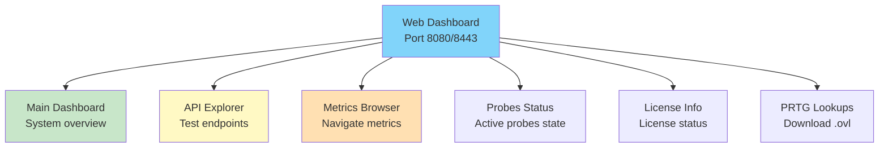
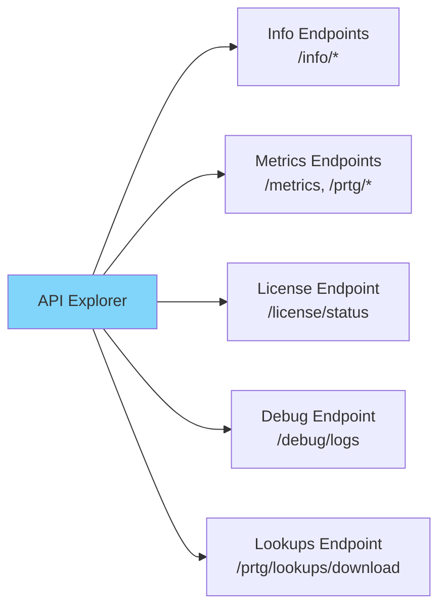
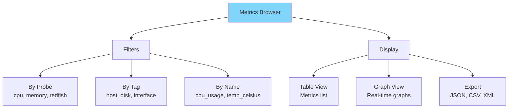
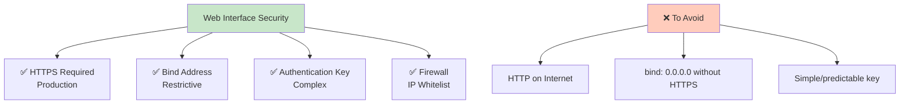

# SenHub Agent - Web Interface

## Table of Contents

- [Overview](#overview)
- [Accessing the Dashboard](#accessing-the-dashboard)
- [Main Dashboard](#main-dashboard)
- [API Explorer](#api-explorer)
- [Metrics Browser](#metrics-browser)
- [Probes Status](#probes-status)
- [License Information](#license-information)
- [PRTG Lookups](#prtg-lookups)
- [Best Practices](#best-practices)

---

## Overview

The SenHub Agent web interface provides comprehensive visual access to agent metrics and configuration via a browser.



### Main Features

| Feature | Description | Use Case |
|---------|-------------|----------|
| **Dashboard** | Real-time overview | Quick visual monitoring |
| **API Explorer** | Interactive endpoint testing | Integration and debugging |
| **Metrics Browser** | Navigate by probe/tag | Detailed exploration |
| **Probes Status** | Probe health status | Problem diagnosis |
| **License Info** | Active license information | Tier/expiration verification |
| **PRTG Lookups** | Download .ovl files | PRTG configuration |

---

## Accessing the Dashboard

### Connection URL

```
Format: http(s)://<host>:<port>/web/{authentication_key}/dashboard
```

**Examples**:

```bash
# Local HTTP (development)
http://localhost:8080/web/f47ac10b-58cc-4372-a567-0e02b2c3d479/dashboard

# Production HTTPS
https://monitoring.company.com:8443/web/f47ac10b-58cc-4372-a567-0e02b2c3d479/dashboard

# Remote access (with bind_address: 0.0.0.0)
https://192.168.1.100:8443/web/f47ac10b-58cc-4372-a567-0e02b2c3d479/dashboard
```

### Authentication

```mermaid
graph LR
    A[User] -->|URL with {key}| B[HTTP Strategy]
    B -->|Valid key| C[Dashboard]
    B -->|Invalid key| D[Error 403]

    style C fill:#c8e6c9
    style D fill:#ffccbc
```

**Authentication key**:
- Defined in `agent-config.yaml`: `agent.authentication_key`
- Used in URL: `/web/{key}/...`
- Validates all API and web requests

**Security**:
- Local access only (`127.0.0.1`): key shareable
- Remote access (`0.0.0.0`): **ALWAYS use HTTPS**
- Key = secret: do not expose publicly

**📸 SCREENSHOT TO INSERT**: Login page or main dashboard with visible URL in address bar

---

## Main Dashboard

### Overview

The main dashboard displays a real-time summary of agent status and collected metrics.

**Dashboard Sections**:

1. **System Header**
   - Hostname / OS
   - Agent version
   - Uptime
   - Mode (Online/Offline)

2. **License Status**
   - Active tier (Free/Pro/Enterprise)
   - Expiration date
   - Authorized probes
   - ⚠️ Expiration / grace period alerts

3. **Active Probes**
   - List of running probes
   - Status (Running/Error)
   - Last update
   - Number of metrics per probe

4. **Key Metrics**
   - Real-time graphs (if available)
   - Current values
   - Alert thresholds

**📸 SCREENSHOT TO INSERT**: Complete dashboard showing all sections with multiple active probes and graphs

---

### License Status

```mermaid
graph TD
    LICENSE[License Status] --> VALID[✅ Valid]
    LICENSE --> GRACE[⚠️ Grace Period]
    LICENSE --> EXPIRED[❌ Expired]

    VALID --> V1[Tier: Pro/Enterprise<br/>Expires: 2025-12-31<br/>Probes: 8/10 active]
    GRACE --> G1[Tier: Pro<br/>Expired: 2025-01-01<br/>Grace: 4 days remaining]
    EXPIRED --> E1[Tier: Free (fallback)<br/>Paid probes disabled]

    style VALID fill:#c8e6c9
    style GRACE fill:#fff9c4
    style EXPIRED fill:#ffccbc
```

**Dashboard Display**:

✅ **Valid License**:
```
License: Pro
Expires: 2025-12-31 (342 days remaining)
Authorized Probes: redfish, citrix, netscaler, syslog
```

⚠️ **Grace Period**:
```
⚠️ LICENSE EXPIRATION WARNING
License expired on 2025-01-01
Grace period: 4 days remaining
Contact support@senhub.io to renew
```

❌ **Expired License**:
```
❌ LICENSE EXPIRED
Agent running in Free tier (limited probes)
Paid probes disabled: redfish, citrix, netscaler
Contact support@senhub.io to renew
```

**📸 SCREENSHOT TO INSERT**: Dashboard with orange/red banner for grace period or expiration

---

### Probes Status

**Probes Table**:

| Probe Name | Type | Status | Last Update | Metrics | Details |
|------------|------|--------|-------------|---------|---------|
| cpu | cpu | 🟢 Running | 5s ago | 12 | View |
| memory | memory | 🟢 Running | 5s ago | 8 | View |
| Production iDRAC | redfish | 🟢 Running | 2m ago | 47 | View |
| Citrix Production | citrix | 🔴 Error | 5m ago | 0 | **View Error** |

**Possible States**:
- 🟢 **Running**: Probe collecting normally
- 🟡 **Warning**: Partial metrics or timeouts
- 🔴 **Error**: Probe in error (see logs)
- ⚪ **Stopped**: Probe disabled

**Actions**:
- **View**: See probe metrics
- **View Error**: Show detailed error message
- **Logs**: Enable debug logs for this probe

**📸 SCREENSHOT TO INSERT**: Probes status table with mix of statuses (Running, Error)

---

## API Explorer

The API Explorer allows interactive testing of all agent endpoints.



### Available Endpoints

#### 1. Info Endpoints

**`GET /api/{key}/info/system`**

Returns agent system information.

**Example response**:
```json
{
  "hostname": "PROD-SERVER-01",
  "os": "linux",
  "os_version": "Ubuntu 22.04.3 LTS",
  "agent_version": "0.1.72",
  "uptime_seconds": 3600,
  "mode": "offline",
  "cache": {
    "retention_minutes": 10
  }
}
```

**📸 SCREENSHOT TO INSERT**: API Explorer showing call to `/info/system` with formatted JSON response

---

**`GET /api/{key}/info/probes`**

Lists active probes with statistics.

**Example response**:
```json
{
  "probes": [
    {
      "name": "cpu",
      "type": "cpu",
      "status": "running",
      "metrics_count": 12,
      "last_update": "2025-01-15T10:30:45Z",
      "interval": 30
    },
    {
      "name": "Production iDRAC",
      "type": "redfish",
      "status": "running",
      "metrics_count": 47,
      "last_update": "2025-01-15T10:29:12Z",
      "interval": 300
    }
  ]
}
```

---

#### 2. Metrics Endpoints

**`GET /api/{key}/metrics`**

Returns all metrics in JSON format.

**Optional parameters**:
- `?probe=cpu` - Filter by probe
- `?format=json|prtg|nagios` - Output format

**JSON Example**:
```json
{
  "metrics": [
    {
      "name": "cpu_usage_total",
      "value": 45.2,
      "unit": "percent",
      "tags": {
        "probe": "cpu",
        "host": "PROD-SERVER-01"
      },
      "timestamp": "2025-01-15T10:30:45Z"
    }
  ]
}
```

**📸 SCREENSHOT TO INSERT**: API Explorer showing metrics response with probe filtering

---

**`GET /api/{key}/prtg/metrics`**

PRTG XML format for all sensors.

**XML Example**:
```xml
<?xml version="1.0" encoding="UTF-8"?>
<prtg>
  <result>
    <channel>CPU Usage Total</channel>
    <value>45.2</value>
    <unit>Percent</unit>
    <limitmode>1</limitmode>
    <limitmaxwarning>80</limitmaxwarning>
    <limitmaxerror>95</limitmaxerror>
  </result>
  <result>
    <channel>Memory Usage</channel>
    <value>67.8</value>
    <unit>Percent</unit>
  </result>
</prtg>
```

**Filter by probe**:
```
GET /api/{key}/prtg/metrics/cpu
GET /api/{key}/prtg/metrics/redfish
GET /api/{key}/prtg/metrics/netscaler
```

**Filter by tags (NetScaler)**:
```
GET /api/{key}/prtg/metrics/netscaler?filter=metric_view:load_balancing
GET /api/{key}/prtg/metrics/netscaler?filter=vserver_name:Web-vServer
```

---

**`GET /api/{key}/nagios/status`**

Nagios text format for checks.

**Example**:
```
OK - CPU: 45.2% | cpu_usage=45.2%;80;95;0;100
OK - Memory: 67.8% | memory_usage=67.8%;80;95;0;100
WARNING - Disk C: 85.3% | disk_c_usage=85.3%;80;95;0;100
```

---

#### 3. License Endpoint

**`GET /api/{key}/license/status`**

Returns complete license status.

**Example**:
```json
{
  "tier": "pro",
  "expires_at": "2025-12-31T23:59:59Z",
  "expires_in_days": 342,
  "is_valid": true,
  "in_grace_period": false,
  "grace_period_days_remaining": 0,
  "authorized_probes": [
    "cpu", "memory", "logicaldisk", "network",
    "redfish", "citrix", "netscaler", "syslog"
  ],
  "subject": "production-datacenter"
}
```

**📸 SCREENSHOT TO INSERT**: API Explorer displaying license status with Pro tier details

---

#### 4. Debug Logs Endpoint

**`GET /api/{key}/debug/logs`**

View current log levels.

**Response**:
```json
{
  "global_level": "info",
  "modules": {
    "agent.core": "info",
    "probe.cpu": "info",
    "probe.redfish": "debug",
    "strategy.http": "info"
  }
}
```

**`POST /api/{key}/debug/logs`**

Modify log levels without restart.

**Body**:
```json
{
  "module_levels": [
    {"module": "probe.redfish", "level": "debug"},
    {"module": "strategy.http", "level": "debug"}
  ]
}
```

**Response**:
```json
{
  "status": "success",
  "updated_modules": ["probe.redfish", "strategy.http"]
}
```

**📸 SCREENSHOT TO INSERT**: Debug logs interface with module and level selectors

---

## Metrics Browser

The Metrics Browser allows navigating and filtering metrics by probe, tag, or name.



### Navigation by Probe

**Probe selection**:
```
[Dropdown: All probes ▼]
├─ cpu (12 metrics)
├─ memory (8 metrics)
├─ logicaldisk (15 metrics)
├─ network (20 metrics)
├─ Production iDRAC (47 metrics)
└─ NetScaler Production (156 metrics)
```

**Metrics display**:

| Metric Name | Value | Unit | Tags | Timestamp |
|-------------|-------|------|------|-----------|
| cpu_usage_total | 45.2 | percent | host=PROD-01 | 10:30:45 |
| cpu_load1 | 1.23 | - | host=PROD-01 | 10:30:45 |
| cpu_load5 | 1.45 | - | host=PROD-01 | 10:30:45 |

**📸 SCREENSHOT TO INSERT**: Metrics Browser with selected probe dropdown and metrics table

---

### Filtering by Tags

**NetScaler Example**:

```
Active Filters:
- probe: netscaler
- metric_view: load_balancing
- vserver_name: Web-vServer
```

**Result**:
| Metric | Value | Tags |
|--------|-------|------|
| netscaler_vserver_state | 1 (UP) | vserver_name=Web-vServer, metric_view=load_balancing |
| netscaler_vserver_hits | 45230 | vserver_name=Web-vServer, metric_view=load_balancing |
| netscaler_vserver_requests | 12450 | vserver_name=Web-vServer, metric_view=load_balancing |

**Available Filters**:
- **Redfish**: `chassis`, `sensor_name`, `drive_id`
- **Citrix**: `site`, `delivery_group`, `machine_name`
- **NetScaler**: `vserver_name`, `service_name`, `metric_view`, `metric_type`
- **Network**: `interface`, `mac_address`
- **Disk**: `disk`, `mount_point`, `filesystem`

**📸 SCREENSHOT TO INSERT**: Active tag filters with filtered results

---

### Metrics Export

**Available formats**:
- **JSON**: Raw API format
- **CSV**: Excel/LibreOffice import
- **XML**: PRTG compatible
- **Nagios**: Text format checks

**Export buttons**:
```
[Export JSON] [Export CSV] [Export PRTG XML] [Export Nagios]
```

**CSV Example**:
```csv
metric_name,value,unit,probe,timestamp
cpu_usage_total,45.2,percent,cpu,2025-01-15T10:30:45Z
memory_usage_percent,67.8,percent,memory,2025-01-15T10:30:45Z
```

---

## Probes Status

### Detailed View per Probe

Clicking **View** in the probes table shows complete details.

**Displayed Information**:

1. **Configuration**
   ```yaml
   Name: Production iDRAC
   Type: redfish
   Interval: 300 seconds (5 minutes)
   Endpoint: https://idrac-srv01.company.com
   ```

2. **Collection State**
   ```
   Status: Running
   Last Successful Collection: 2 minutes ago
   Next Collection: in 3 minutes
   Total Collections: 287
   Failed Collections: 2 (0.7%)
   ```

3. **Collected Metrics**
   ```
   Total Metrics: 47
   ├─ Temperatures: 12 metrics
   ├─ Fan Speeds: 8 metrics
   ├─ Power: 4 metrics
   ├─ Drives: 18 metrics
   └─ System: 5 metrics
   ```

4. **Recent Errors**
   ```
   [2025-01-15 08:15:23] ERR Failed to connect: timeout
   [2025-01-15 08:20:45] ERR Failed to connect: timeout
   ```

**📸 SCREENSHOT TO INSERT**: Probe details page showing configuration, state, metrics and errors

---

### Diagnostic Actions

**Available buttons**:

```
[View Metrics] [Enable Debug Logs] [Test Connection] [View Configuration]
```

**Enable Debug Logs**:
- Enables debug logs for this probe only
- Without agent restart
- Shows real-time logs in interface

**Test Connection**:
- Tests connectivity to endpoint (Redfish, Citrix, etc.)
- Returns detailed error if failed
- Verifies credentials

**📸 SCREENSHOT TO INSERT**: Action buttons with popup "Debug logs enabled for probe: redfish"

---

## License Information

### License Details Page

**URL**: `/web/{key}/license`

**Displayed Information**:

```
╔══════════════════════════════════════════════════════════╗
║              SENHUB AGENT LICENSE                         ║
╠══════════════════════════════════════════════════════════╣
║ Tier:              Pro                                    ║
║ Subject:           production-datacenter                  ║
║ Issued:            2025-01-01 00:00:00 UTC               ║
║ Expires:           2025-12-31 23:59:59 UTC               ║
║ Days Remaining:    342 days                               ║
║ Status:            ✅ Valid                               ║
╠══════════════════════════════════════════════════════════╣
║ Authorized Probes:                                        ║
║ - cpu, memory, logicaldisk, network (Free Tier)          ║
║ - redfish, citrix, netscaler, syslog (Pro Tier)          ║
╚══════════════════════════════════════════════════════════╝
```

**Visual Alerts**:

🟢 **Valid** (> 30 days):
```
License valid until 2025-12-31 (342 days remaining)
```

🟡 **Expiring Soon** (< 30 days):
```
⚠️ LICENSE EXPIRING SOON
Your license expires in 28 days (2025-02-15)
Contact support@senhub.io to renew
```

🟠 **Grace Period** (0-7 days after expiration):
```
⚠️ LICENSE EXPIRED - GRACE PERIOD
License expired 3 days ago
Grace period: 4 days remaining
Paid probes still active
Contact support@senhub.io immediately to renew
```

🔴 **Expired** (> 7 days after expiration):
```
❌ LICENSE EXPIRED
Agent reverted to Free tier
Paid probes disabled: redfish, citrix, netscaler, syslog
Contact support@senhub.io to renew
```

**Action buttons**:
```
[Renew License] → Opens email to support@senhub.io
[View Configuration] → Shows agent-config.yaml license section
```

**📸 SCREENSHOT TO INSERT**: License page with valid/expiring/expired status

---

## PRTG Lookups

### Lookups Download

The agent automatically generates PRTG lookup files (.ovl) for probes using codes or identifiers.

**Download URL**: `/api/{key}/prtg/lookups/download`

**Interface button**:
```
📥 Download PRTG Lookups (.ovl files)
```

**Generated files**:

```
senhub-lookups.zip
├─ netwscaler.metric_type.ovl        # NetScaler metric types
├─ netscaler.metric_view.ovl         # NetScaler metric views
└─ README.txt                         # Installation instructions
```

**Example: netscaler.metric_type.ovl**
```
<?xml version="1.0" encoding="UTF-8"?>
<ValueLookup id="netscaler.metric_type" desiredValue="1" undefinedState="Warning">
  <Lookups>
    <SingleInt state="Ok" value="0">
      <LookupId>Rate</LookupId>
    </SingleInt>
    <SingleInt state="Ok" value="1">
      <LookupId>Counter</LookupId>
    </SingleInt>
    <SingleInt state="Ok" value="2">
      <LookupId>Gauge</LookupId>
    </SingleInt>
  </Lookups>
</ValueLookup>
```

**📸 SCREENSHOT TO INSERT**: Download lookups button in API Explorer + ZIP contents

---

### Installation in PRTG

**Steps**:

1. **Download ZIP** from web interface
2. **Extract .ovl files**
3. **Copy to PRTG**:
   ```
   C:\Program Files (x86)\PRTG Network Monitor\lookups\custom\
   ```
4. **Reload lookups**:
   - PRTG → Setup → Administrative Tools → Load Lookups and File Lists

**Verification**:
- NetScaler sensors now display text labels instead of numeric codes
- Example: "Rate" instead of "0", "Load Balancing" instead of "1"

**📸 SCREENSHOT TO INSERT**: PRTG with NetScaler sensor showing labels after lookups installation

---

## Best Practices

### Security



**✅ Secure Configuration**:

```yaml
storage:
  - name: http
    params:
      port: 8443
      bind_address: "192.168.1.100"  # Specific interface
      endpoints: ["prtg", "web", "nagios"]
      tls:
        enabled: true
        min_tls_version: "1.2"
        cert_file: "/etc/ssl/certs/monitoring.crt"
        key_file: "/etc/ssl/private/monitoring.key"

agent:
  authentication_key: "f47ac10b-58cc-4372-a567-0e02b2c3d479"  # UUID
```

**Firewall**:
```bash
# Allow only internal network
sudo ufw allow from 192.168.1.0/24 to any port 8443
```

---

### Performance

**Recommendations**:

1. **Cache Retention**
   ```yaml
   cache:
     retention_minutes: 10  # Balance memory/freshness
   ```

2. **Probe Intervals**
   ```yaml
   probes:
     - name: cpu
       params:
         interval: 30  # 30s for real-time metrics
     - name: redfish
       params:
         interval: 300  # 5min for hardware (less critical)
   ```

3. **PRTG Filtering**
   - Use `/prtg/metrics/{probe}` instead of global `/prtg/metrics`
   - Filter by NetScaler tags: `?filter=metric_view:load_balancing`
   - Reduce PRTG XML parsing load

---

### Monitoring

**Endpoints to monitor**:

```bash
# Simple healthcheck
curl http://localhost:8080/api/{key}/info/system
# If HTTP 200 → Agent OK

# Check active probes
curl http://localhost:8080/api/{key}/info/probes
# Count probes in "running"

# Check license
curl http://localhost:8080/api/{key}/license/status
# is_valid: true, in_grace_period: false
```

**Alerts to configure**:
- License expires in < 30 days
- Probe in Error state
- Agent unreachable (HTTP 5xx/timeout)

---

### Integrations

**Reverse Proxy (Production)**:

```nginx
# Nginx
server {
    listen 443 ssl;
    server_name monitoring.company.com;

    ssl_certificate /etc/ssl/certs/company.crt;
    ssl_certificate_key /etc/ssl/private/company.key;

    location / {
        proxy_pass http://localhost:8080;
        proxy_set_header Host $host;
        proxy_set_header X-Real-IP $remote_addr;
    }
}
```

**PRTG Sensors**:
```
Sensor Type: HTTP XML/REST Value
URL: https://monitoring.company.com:8443/api/{key}/prtg/metrics/cpu
Authentication: None (key in URL)
```

**Nagios Checks**:
```bash
define command {
    command_name    check_senhub_cpu
    command_line    /usr/lib/nagios/plugins/check_http \
                    -H monitoring.company.com -p 8443 -S \
                    -u /api/KEY/nagios/status \
                    -s "OK - CPU"
}
```

---

**Next steps**:
- [Metrics Usage](./METRICS-USAGE.md)
- [Probes Configuration](./PROBES-CONFIGURATION.md)
- [Troubleshooting](./TROUBLESHOOTING.md)
