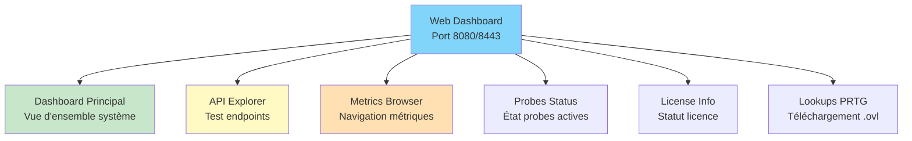
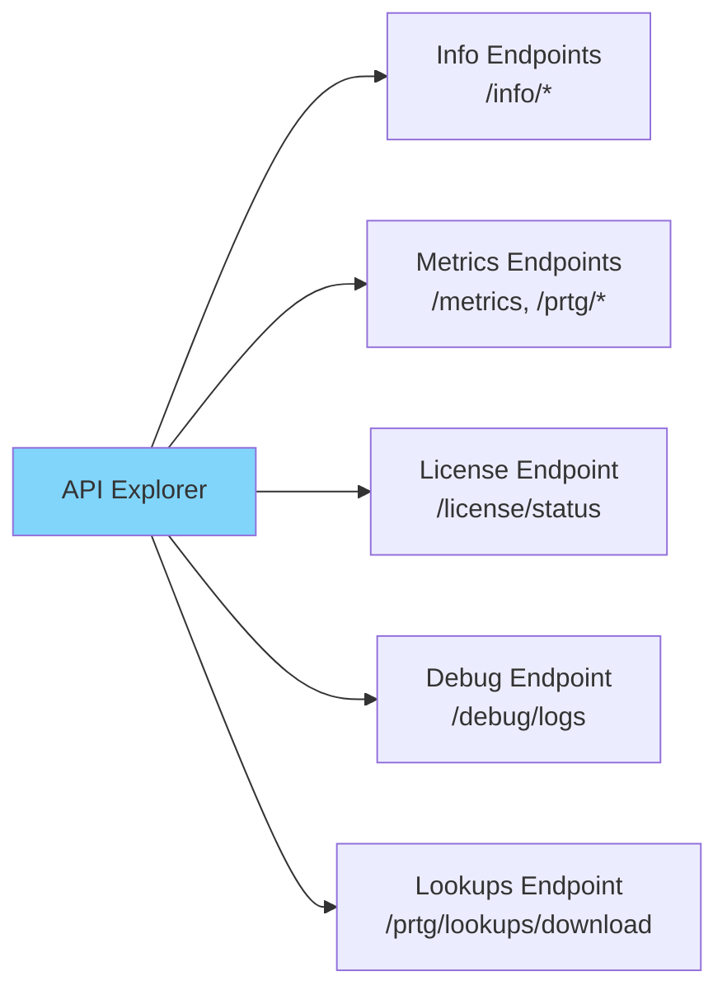
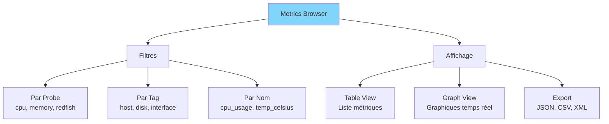
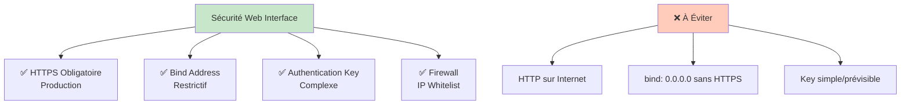

# SenHub Agent - Interface Web

## Table des Matières

- [Vue d'Ensemble](#vue-densemble)
- [Accès au Dashboard](#accès-au-dashboard)
- [Dashboard Principal](#dashboard-principal)
- [API Explorer](#api-explorer)
- [Metrics Browser](#metrics-browser)
- [Probes Status](#probes-status)
- [License Information](#license-information)
- [Lookups PRTG](#lookups-prtg)
- [Best Practices](#best-practices)

---

## Vue d'Ensemble

L'interface web SenHub Agent fournit un accès visuel complet aux métriques et à la configuration de l'agent via un navigateur.



### Fonctionnalités Principales

| Fonctionnalité | Description | Cas d'Usage |
|----------------|-------------|-------------|
| **Dashboard** | Vue d'ensemble temps réel | Monitoring visuel rapide |
| **API Explorer** | Test interactif des endpoints | Intégration et debugging |
| **Metrics Browser** | Navigation par probe/tag | Exploration détaillée |
| **Probes Status** | État santé des probes | Diagnostic problèmes |
| **License Info** | Informations licence active | Vérification tier/expiration |
| **Lookups PRTG** | Téléchargement fichiers .ovl | Configuration PRTG |

---

## Accès au Dashboard

### URL de Connexion

```
Format: http(s)://<host>:<port>/web/{authentication_key}/dashboard
```

**Exemples** :

```bash
# HTTP local (développement)
http://localhost:8080/web/f47ac10b-58cc-4372-a567-0e02b2c3d479/dashboard

# HTTPS production
https://monitoring.company.com:8443/web/f47ac10b-58cc-4372-a567-0e02b2c3d479/dashboard

# Accès distant (avec bind_address: 0.0.0.0)
https://192.168.1.100:8443/web/f47ac10b-58cc-4372-a567-0e02b2c3d479/dashboard
```

### Authentification

```mermaid
graph LR
    A[Utilisateur] -->|URL avec {key}| B[HTTP Strategy]
    B -->|Valide key| C[Dashboard]
    B -->|Key invalide| D[Error 403]

    style C fill:#c8e6c9
    style D fill:#ffccbc
```

**Clé d'authentification** :
- Définie dans `agent-config.yaml` : `agent.authentication_key`
- Utilisée dans l'URL : `/web/{key}/...`
- Valide toutes les requêtes API et web

**Sécurité** :
- Accès local uniquement (`127.0.0.1`) : key partageable
- Accès distant (`0.0.0.0`) : **TOUJOURS utiliser HTTPS**
- Key = secret : ne pas exposer publiquement

**📸 SCREENSHOT À INSÉRER** : Page de login ou dashboard principal avec URL visible dans la barre d'adresse

---

## Dashboard Principal

### Vue d'Ensemble

Le dashboard principal affiche un résumé temps réel de l'état de l'agent et des métriques collectées.

**Sections du Dashboard** :

1. **En-tête Système**
   - Nom d'hôte / OS
   - Version agent
   - Uptime
   - Mode (Online/Offline)

2. **Statut Licence**
   - Tier actif (Free/Pro/Enterprise)
   - Date d'expiration
   - Probes autorisées
   - ⚠️ Alertes expiration / période de grâce

3. **Probes Actives**
   - Liste des probes en cours d'exécution
   - État (Running/Error)
   - Dernier update
   - Nombre de métriques par probe

4. **Métriques Clés**
   - Graphiques temps réel (si disponibles)
   - Valeurs actuelles
   - Seuils d'alerte

**📸 SCREENSHOT À INSÉRER** : Dashboard complet montrant toutes les sections avec plusieurs probes actives et graphiques

---

### Statut Licence

```mermaid
graph TD
    LICENSE[License Status] --> VALID[✅ Valide]
    LICENSE --> GRACE[⚠️ Grace Period]
    LICENSE --> EXPIRED[❌ Expirée]

    VALID --> V1[Tier: Pro/Enterprise<br/>Expires: 2025-12-31<br/>Probes: 8/10 actives]
    GRACE --> G1[Tier: Pro<br/>Expired: 2025-01-01<br/>Grace: 4 jours restants]
    EXPIRED --> E1[Tier: Free (fallback)<br/>Probes payantes désactivées]

    style VALID fill:#c8e6c9
    style GRACE fill:#fff9c4
    style EXPIRED fill:#ffccbc
```

**Affichage dans le Dashboard** :

✅ **Licence Valide** :
```
License: Pro
Expires: 2025-12-31 (342 days remaining)
Authorized Probes: redfish, citrix, netscaler, syslog
```

⚠️ **Période de Grâce** :
```
⚠️ LICENSE EXPIRATION WARNING
License expired on 2025-01-01
Grace period: 4 days remaining
Contact support@senhub.io to renew
```

❌ **Licence Expirée** :
```
❌ LICENSE EXPIRED
Agent running in Free tier (limited probes)
Paid probes disabled: redfish, citrix, netscaler
Contact support@senhub.io to renew
```

**📸 SCREENSHOT À INSÉRER** : Dashboard avec banner orange/rouge pour période de grâce ou expiration

---

### Probes Status

**Tableau des Probes** :

| Probe Name | Type | Status | Last Update | Metrics | Details |
|------------|------|--------|-------------|---------|---------|
| cpu | cpu | 🟢 Running | 5s ago | 12 | View |
| memory | memory | 🟢 Running | 5s ago | 8 | View |
| Production iDRAC | redfish | 🟢 Running | 2m ago | 47 | View |
| Citrix Production | citrix | 🔴 Error | 5m ago | 0 | **View Error** |

**États possibles** :
- 🟢 **Running** : Probe collecte normalement
- 🟡 **Warning** : Métriques partielles ou timeouts
- 🔴 **Error** : Probe en erreur (voir logs)
- ⚪ **Stopped** : Probe désactivée

**Actions** :
- **View** : Voir métriques de la probe
- **View Error** : Afficher message d'erreur détaillé
- **Logs** : Activer debug logs pour cette probe

**📸 SCREENSHOT À INSÉRER** : Tableau probes status avec mix de statuts (Running, Error)

---

## API Explorer

L'API Explorer permet de tester interactivement tous les endpoints de l'agent.



### Endpoints Disponibles

#### 1. Info Endpoints

**`GET /api/{key}/info/system`**

Retourne informations système de l'agent.

**Exemple de réponse** :
```json
{
  "hostname": "PROD-SERVER-01",
  "os": "linux",
  "os_version": "Ubuntu 22.04.3 LTS",
  "agent_version": "0.1.72",
  "uptime_seconds": 3600,
  "mode": "offline",
  "cache": {
    "retention_minutes": 10
  }
}
```

**📸 SCREENSHOT À INSÉRER** : API Explorer montrant appel à `/info/system` avec réponse JSON formatée

---

**`GET /api/{key}/info/probes`**

Liste les probes actives avec statistiques.

**Exemple de réponse** :
```json
{
  "probes": [
    {
      "name": "cpu",
      "type": "cpu",
      "status": "running",
      "metrics_count": 12,
      "last_update": "2025-01-15T10:30:45Z",
      "interval": 30
    },
    {
      "name": "Production iDRAC",
      "type": "redfish",
      "status": "running",
      "metrics_count": 47,
      "last_update": "2025-01-15T10:29:12Z",
      "interval": 300
    }
  ]
}
```

---

#### 2. Metrics Endpoints

**`GET /api/{key}/metrics`**

Retourne toutes les métriques au format JSON.

**Paramètres optionnels** :
- `?probe=cpu` - Filtrer par probe
- `?format=json|prtg|nagios` - Format de sortie

**Exemple JSON** :
```json
{
  "metrics": [
    {
      "name": "cpu_usage_total",
      "value": 45.2,
      "unit": "percent",
      "tags": {
        "probe": "cpu",
        "host": "PROD-SERVER-01"
      },
      "timestamp": "2025-01-15T10:30:45Z"
    }
  ]
}
```

**📸 SCREENSHOT À INSÉRER** : API Explorer montrant réponse metrics avec filtrage par probe

---

**`GET /api/{key}/prtg/metrics`**

Format PRTG XML pour tous les sensors.

**Exemple XML** :
```xml
<?xml version="1.0" encoding="UTF-8"?>
<prtg>
  <result>
    <channel>CPU Usage Total</channel>
    <value>45.2</value>
    <unit>Percent</unit>
    <limitmode>1</limitmode>
    <limitmaxwarning>80</limitmaxwarning>
    <limitmaxerror>95</limitmaxerror>
  </result>
  <result>
    <channel>Memory Usage</channel>
    <value>67.8</value>
    <unit>Percent</unit>
  </result>
</prtg>
```

**Filtrage par probe** :
```
GET /api/{key}/prtg/metrics/cpu
GET /api/{key}/prtg/metrics/redfish
GET /api/{key}/prtg/metrics/netscaler
```

**Filtrage par tags (NetScaler)** :
```
GET /api/{key}/prtg/metrics/netscaler?filter=metric_view:load_balancing
GET /api/{key}/prtg/metrics/netscaler?filter=vserver_name:Web-vServer
```

---

**`GET /api/{key}/nagios/status`**

Format Nagios text pour checks.

**Exemple** :
```
OK - CPU: 45.2% | cpu_usage=45.2%;80;95;0;100
OK - Memory: 67.8% | memory_usage=67.8%;80;95;0;100
WARNING - Disk C: 85.3% | disk_c_usage=85.3%;80;95;0;100
```

---

#### 3. License Endpoint

**`GET /api/{key}/license/status`**

Retourne statut complet de la licence.

**Exemple** :
```json
{
  "tier": "pro",
  "expires_at": "2025-12-31T23:59:59Z",
  "expires_in_days": 342,
  "is_valid": true,
  "in_grace_period": false,
  "grace_period_days_remaining": 0,
  "authorized_probes": [
    "cpu", "memory", "logicaldisk", "network",
    "redfish", "citrix", "netscaler", "syslog"
  ],
  "subject": "production-datacenter"
}
```

**📸 SCREENSHOT À INSÉRER** : API Explorer affichant statut licence avec détails Pro tier

---

#### 4. Debug Logs Endpoint

**`GET /api/{key}/debug/logs`**

Voir niveaux de logs actuels.

**Réponse** :
```json
{
  "global_level": "info",
  "modules": {
    "agent.core": "info",
    "probe.cpu": "info",
    "probe.redfish": "debug",
    "strategy.http": "info"
  }
}
```

**`POST /api/{key}/debug/logs`**

Modifier niveaux de logs sans redémarrage.

**Body** :
```json
{
  "module_levels": [
    {"module": "probe.redfish", "level": "debug"},
    {"module": "strategy.http", "level": "debug"}
  ]
}
```

**Réponse** :
```json
{
  "status": "success",
  "updated_modules": ["probe.redfish", "strategy.http"]
}
```

**📸 SCREENSHOT À INSÉRER** : Interface debug logs avec sélecteurs de modules et niveaux

---

## Metrics Browser

Le Metrics Browser permet de naviguer et filtrer les métriques par probe, tag, ou nom.



### Navigation par Probe

**Sélection de probe** :
```
[Dropdown: Toutes les probes ▼]
├─ cpu (12 métriques)
├─ memory (8 métriques)
├─ logicaldisk (15 métriques)
├─ network (20 métriques)
├─ Production iDRAC (47 métriques)
└─ NetScaler Production (156 métriques)
```

**Affichage des métriques** :

| Metric Name | Value | Unit | Tags | Timestamp |
|-------------|-------|------|------|-----------|
| cpu_usage_total | 45.2 | percent | host=PROD-01 | 10:30:45 |
| cpu_load1 | 1.23 | - | host=PROD-01 | 10:30:45 |
| cpu_load5 | 1.45 | - | host=PROD-01 | 10:30:45 |

**📸 SCREENSHOT À INSÉRER** : Metrics Browser avec dropdown probe sélectionné et table de métriques

---

### Filtrage par Tags

**Exemple NetScaler** :

```
Filtres actifs:
- probe: netscaler
- metric_view: load_balancing
- vserver_name: Web-vServer
```

**Résultat** :
| Metric | Value | Tags |
|--------|-------|------|
| netscaler_vserver_state | 1 (UP) | vserver_name=Web-vServer, metric_view=load_balancing |
| netscaler_vserver_hits | 45230 | vserver_name=Web-vServer, metric_view=load_balancing |
| netscaler_vserver_requests | 12450 | vserver_name=Web-vServer, metric_view=load_balancing |

**Filtres disponibles** :
- **Redfish** : `chassis`, `sensor_name`, `drive_id`
- **Citrix** : `site`, `delivery_group`, `machine_name`
- **NetScaler** : `vserver_name`, `service_name`, `metric_view`, `metric_type`
- **Network** : `interface`, `mac_address`
- **Disk** : `disk`, `mount_point`, `filesystem`

**📸 SCREENSHOT À INSÉRER** : Filtres tags actifs avec résultats filtrés

---

### Export de Métriques

**Formats disponibles** :
- **JSON** : Format brut API
- **CSV** : Import Excel/LibreOffice
- **XML** : PRTG compatible
- **Nagios** : Format texte checks

**Boutons d'export** :
```
[Export JSON] [Export CSV] [Export PRTG XML] [Export Nagios]
```

**Exemple CSV** :
```csv
metric_name,value,unit,probe,timestamp
cpu_usage_total,45.2,percent,cpu,2025-01-15T10:30:45Z
memory_usage_percent,67.8,percent,memory,2025-01-15T10:30:45Z
```

---

## Probes Status

### Vue Détaillée par Probe

Cliquer sur **View** dans le tableau des probes affiche les détails complets.

**Informations affichées** :

1. **Configuration**
   ```yaml
   Name: Production iDRAC
   Type: redfish
   Interval: 300 seconds (5 minutes)
   Endpoint: https://idrac-srv01.company.com
   ```

2. **État de Collecte**
   ```
   Status: Running
   Last Successful Collection: 2 minutes ago
   Next Collection: in 3 minutes
   Total Collections: 287
   Failed Collections: 2 (0.7%)
   ```

3. **Métriques Collectées**
   ```
   Total Metrics: 47
   ├─ Temperatures: 12 metrics
   ├─ Fan Speeds: 8 metrics
   ├─ Power: 4 metrics
   ├─ Drives: 18 metrics
   └─ System: 5 metrics
   ```

4. **Dernières Erreurs**
   ```
   [2025-01-15 08:15:23] ERR Failed to connect: timeout
   [2025-01-15 08:20:45] ERR Failed to connect: timeout
   ```

**📸 SCREENSHOT À INSÉRER** : Page détails probe montrant configuration, état, métriques et erreurs

---

### Actions de Diagnostic

**Boutons disponibles** :

```
[View Metrics] [Enable Debug Logs] [Test Connection] [View Configuration]
```

**Enable Debug Logs** :
- Active logs debug pour cette probe uniquement
- Sans redémarrage de l'agent
- Affiche logs en temps réel dans l'interface

**Test Connection** :
- Teste la connectivité vers l'endpoint (Redfish, Citrix, etc.)
- Retourne erreur détaillée si échec
- Vérifie credentials

**📸 SCREENSHOT À INSÉRER** : Boutons d'actions avec popup "Debug logs enabled for probe: redfish"

---

## License Information

### Page Détails Licence

**URL** : `/web/{key}/license`

**Informations affichées** :

```
╔══════════════════════════════════════════════════════════╗
║              SENHUB AGENT LICENSE                         ║
╠══════════════════════════════════════════════════════════╣
║ Tier:              Pro                                    ║
║ Subject:           production-datacenter                  ║
║ Issued:            2025-01-01 00:00:00 UTC               ║
║ Expires:           2025-12-31 23:59:59 UTC               ║
║ Days Remaining:    342 days                               ║
║ Status:            ✅ Valid                               ║
╠══════════════════════════════════════════════════════════╣
║ Authorized Probes:                                        ║
║ - cpu, memory, logicaldisk, network (Free Tier)          ║
║ - redfish, citrix, netscaler, syslog (Pro Tier)          ║
╚══════════════════════════════════════════════════════════╝
```

**Alertes visuelles** :

🟢 **Valid** (> 30 jours) :
```
License valid until 2025-12-31 (342 days remaining)
```

🟡 **Expiring Soon** (< 30 jours) :
```
⚠️ LICENSE EXPIRING SOON
Your license expires in 28 days (2025-02-15)
Contact support@senhub.io to renew
```

🟠 **Grace Period** (0-7 jours après expiration) :
```
⚠️ LICENSE EXPIRED - GRACE PERIOD
License expired 3 days ago
Grace period: 4 days remaining
Paid probes still active
Contact support@senhub.io immediately to renew
```

🔴 **Expired** (> 7 jours après expiration) :
```
❌ LICENSE EXPIRED
Agent reverted to Free tier
Paid probes disabled: redfish, citrix, netscaler, syslog
Contact support@senhub.io to renew
```

**Boutons d'action** :
```
[Renew License] → Opens email to support@senhub.io
[View Configuration] → Shows agent-config.yaml license section
```

**📸 SCREENSHOT À INSÉRER** : Page licence avec statut valid/expiring/expired

---

## Lookups PRTG

### Téléchargement des Lookups

L'agent génère automatiquement des fichiers lookups PRTG (.ovl) pour les probes qui utilisent des codes ou identifiants.

**URL de téléchargement** : `/api/{key}/prtg/lookups/download`

**Bouton dans l'interface** :
```
📥 Download PRTG Lookups (.ovl files)
```

**Fichiers générés** :

```
senhub-lookups.zip
├─ netwscaler.metric_type.ovl        # Types de métriques NetScaler
├─ netscaler.metric_view.ovl         # Vues de métriques NetScaler
└─ README.txt                         # Instructions d'installation
```

**Exemple: netscaler.metric_type.ovl**
```
<?xml version="1.0" encoding="UTF-8"?>
<ValueLookup id="netscaler.metric_type" desiredValue="1" undefinedState="Warning">
  <Lookups>
    <SingleInt state="Ok" value="0">
      <LookupId>Rate</LookupId>
    </SingleInt>
    <SingleInt state="Ok" value="1">
      <LookupId>Counter</LookupId>
    </SingleInt>
    <SingleInt state="Ok" value="2">
      <LookupId>Gauge</LookupId>
    </SingleInt>
  </Lookups>
</ValueLookup>
```

**📸 SCREENSHOT À INSÉRER** : Bouton download lookups dans API Explorer + contenu du ZIP

---

### Installation dans PRTG

**Étapes** :

1. **Télécharger le ZIP** depuis l'interface web
2. **Extraire les fichiers .ovl**
3. **Copier vers PRTG** :
   ```
   C:\Program Files (x86)\PRTG Network Monitor\lookups\custom\
   ```
4. **Recharger les lookups** :
   - PRTG → Setup → Administrative Tools → Load Lookups and File Lists

**Vérification** :
- Les sensors NetScaler affichent maintenant des labels texte au lieu de codes numériques
- Exemple : "Rate" au lieu de "0", "Load Balancing" au lieu de "1"

**📸 SCREENSHOT À INSÉRER** : PRTG avec sensor NetScaler affichant labels après installation lookups

---

## Best Practices

### Sécurité



**✅ Configuration Sécurisée** :

```yaml
storage:
  - name: http
    params:
      port: 8443
      bind_address: "192.168.1.100"  # Interface spécifique
      endpoints: ["prtg", "web", "nagios"]
      tls:
        enabled: true
        min_tls_version: "1.2"
        cert_file: "/etc/ssl/certs/monitoring.crt"
        key_file: "/etc/ssl/private/monitoring.key"

agent:
  authentication_key: "f47ac10b-58cc-4372-a567-0e02b2c3d479"  # UUID
```

**Firewall** :
```bash
# Autoriser uniquement réseau interne
sudo ufw allow from 192.168.1.0/24 to any port 8443
```

---

### Performance

**Recommandations** :

1. **Cache Retention**
   ```yaml
   cache:
     retention_minutes: 10  # Balance mémoire/freshness
   ```

2. **Intervalles de Probes**
   ```yaml
   probes:
     - name: cpu
       params:
         interval: 30  # 30s pour métriques temps réel
     - name: redfish
       params:
         interval: 300  # 5min pour hardware (moins critique)
   ```

3. **Filtrage PRTG**
   - Utiliser `/prtg/metrics/{probe}` au lieu de `/prtg/metrics` global
   - Filtrer par tags NetScaler : `?filter=metric_view:load_balancing`
   - Réduire charge XML parsing PRTG

---

### Monitoring

**Endpoints à surveiller** :

```bash
# Healthcheck simple
curl http://localhost:8080/api/{key}/info/system
# Si HTTP 200 → Agent OK

# Vérifier probes actives
curl http://localhost:8080/api/{key}/info/probes
# Compter probes en "running"

# Vérifier licence
curl http://localhost:8080/api/{key}/license/status
# is_valid: true, in_grace_period: false
```

**Alertes à configurer** :
- Licence expire dans < 30 jours
- Probe en état Error
- Agent injoignable (HTTP 5xx/timeout)

---

### Intégrations

**Reverse Proxy (Production)** :

```nginx
# Nginx
server {
    listen 443 ssl;
    server_name monitoring.company.com;

    ssl_certificate /etc/ssl/certs/company.crt;
    ssl_certificate_key /etc/ssl/private/company.key;

    location / {
        proxy_pass http://localhost:8080;
        proxy_set_header Host $host;
        proxy_set_header X-Real-IP $remote_addr;
    }
}
```

**PRTG Sensors** :
```
Sensor Type: HTTP XML/REST Value
URL: https://monitoring.company.com:8443/api/{key}/prtg/metrics/cpu
Authentication: None (key in URL)
```

**Nagios Checks** :
```bash
define command {
    command_name    check_senhub_cpu
    command_line    /usr/lib/nagios/plugins/check_http \
                    -H monitoring.company.com -p 8443 -S \
                    -u /api/KEY/nagios/status \
                    -s "OK - CPU"
}
```

---

**Prochaines étapes** :
- [Utilisation des Métriques](./METRICS-USAGE.md)
- [Configuration des Probes](./PROBES-CONFIGURATION.md)
- [Troubleshooting](./TROUBLESHOOTING.md)
