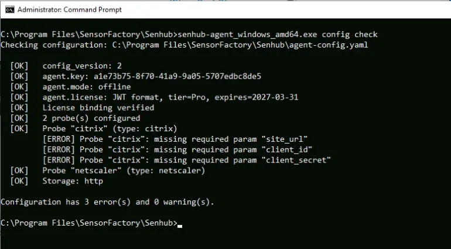
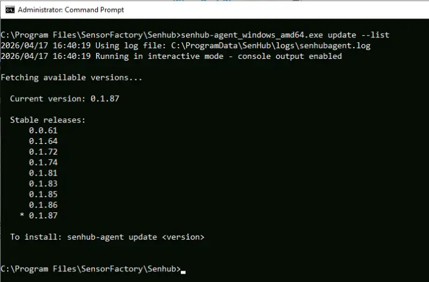

# CLI Reference

All commands are run from the agent binary. Release artifacts are ZIP archives named `senhub-agent-<os>-<arch>.zip` (e.g. `senhub-agent-linux-amd64.zip`, `senhub-agent-windows-amd64.zip`). Each ZIP contains a binary already named `senhub-agent` (Linux/macOS) or `senhub-agent.exe` (Windows) — no renaming needed after extraction. See the [Installation guide](installation.md) for details.

## Output conventions

CLI output is plain text with no decorative symbols. Data and command results are written to stdout, so a command can be piped or captured without post-processing. Diagnostic errors and warnings go to stderr, and a fatal error prints a single `Error: <message>` line to stderr before the process exits non-zero. Destructive commands (`uninstall`, `secret rm`, `license remove`) prompt for confirmation before acting; each accepts a flag to skip the prompt for unattended runs (see the relevant sections below).

## Service Management

| Command | Description |
|---------|-------------|
| `install` | Install as system service |
| `uninstall` | Remove the system service (prompts before deleting config/certs/logs) |
| `uninstall --yes` | Remove the system service without confirmation |
| `start` | Start the service |
| `stop` | Stop the service |
| `restart` | Restart the service |
| `status` | Show service status and health |
| `status --otlp` | Same as `status`, plus an OTLP pipeline self-metrics block |
| `run` | Run interactively in console mode |

### Status

```bash
senhub-agent status
senhub-agent status --otlp
```

The default `status` view prints service state, version, health, probes summary and resource usage. `--otlp` appends a four-section block summarising the OTLP push pipeline:

| Section | What it shows |
|---|---|
| Pipeline | Metrics / logs pushed totals, export errors, drops by reason |
| Store & Export | Store size, log buffer fill, last and mean export duration |
| Checkpoint | On-disk checkpoint size, age, restored-at-boot count, errors by stage |
| Parallel export | Number of sub-batches in the last push (1 = single-batch, >1 = fan-out by probe) |

Drops with `reason=probe_cardinality` indicate the per-probe cardinality budget was hit; `store_cap`, `memory_soft_limit` and `memory_hard_limit` flag other backpressure paths. See the [OTLP guide](otlp.md#monitoring-the-otlp-pipeline) for how to interpret each field.

`--otlp` calls the local HTTP strategy on port 8080 — the agent must have the `web` (or any other HTTP) endpoint enabled for the flag to return data. If the call fails, the standard `status` output still prints; a single-line note explains what went wrong.

### Run (Console Mode)

```bash
senhub-agent run
senhub-agent run --verbose
senhub-agent run --filter probe.veeam
```

The agent reads its configuration from the YAML file pointed at by `--config-path`. The default path is OS-specific: `/etc/senhub-agent/agent.yaml` (Linux), `%ProgramData%\SenHub\agent.yaml` (Windows), `/usr/local/etc/senhub-agent/agent.yaml` (macOS).

| Flag | Description |
|------|-------------|
| `--verbose`, `-v` | Enable debug logging for all modules |
| `--filter MODULES` | Filter debug logs by module prefix (implies verbose) |
| `--config-path PATH` | Configuration file path (default: OS canonical path) |

### Debug Filter Examples

```bash
senhub-agent run --filter probe.veeam           # Veeam probe only
senhub-agent run --filter probe                  # All probes
senhub-agent run --filter strategy.http,sensor   # HTTP API + probe management
```

Use `debug-modules-list` to see all available filters.

## Configuration

### config init

Creates the default configuration for an unattended install (for example a silent MSI install or a scripted provisioning step), then applies the fields an installer can pass. It is idempotent: if a configuration already exists at the target path it is left untouched.

```bash
senhub-agent config init
senhub-agent config init --license <jwt> --tags env=prod,site=paris
senhub-agent config init --otlp-endpoint otlp.example.com:4317
```

| Flag | Description |
|------|-------------|
| `--config-path PATH` | Target configuration file (default: OS canonical path) |
| `--license JWT` | License token to seed (unlocks paid probe tiers) |
| `--tags k=v,k2=v2` | Host-level global tags applied to the generated config |
| `--otlp-endpoint HOST:PORT` | Provision an OTLP push endpoint as a strategy fragment |

The generated layout is the multi-file form (`agent.yaml` + `probes.d/` + `strategies.d/`). By default the generated configuration pushes to no collector; `--otlp-endpoint` is what wires up a push.

### config check

Validates a configuration file and reports errors and warnings.

```bash
senhub-agent config check
senhub-agent config check /path/to/agent-config.yaml
```

Checks performed:
- YAML syntax (with line-level error context)
- Required fields (`config_version`, `agent.key`)
- License validity and agent binding
- Probe types against the registry
- Required probe parameters (endpoint, credentials)
- Storage strategy names

Fragments under `probes.d/` and `strategies.d/` are covered when a multi-file layout is present.



### config show

Prints the merged and resolved configuration as YAML. Secret handling depends on the flag:

```bash
senhub-agent config show
senhub-agent config show --raw
senhub-agent config show --resolved
senhub-agent config show /path/to/agent.yaml
```

| Flag | Description |
|------|-------------|
| `--redact` | Substitute `${env:}` / `${file:}` / `${secret:}` references but mask secret values (default) |
| `--resolved` | Substitute all references, printing secret values in cleartext |
| `--raw` | Leave references exactly as written in the file |

An optional trailing path selects a config file other than the OS default.

### config migrate

Converts a legacy monolithic `agent-config.yaml` into the multi-file layout (`agent.yaml` + `probes.d/` + `strategies.d/`), writing a timestamped backup of the original. It is idempotent: a config that is already multi-file reports nothing to do and exits 0.

```bash
senhub-agent config migrate
senhub-agent config migrate /path/to/agent-config.yaml
```

### debug-modules-list

Lists all available debug filter names.

```bash
senhub-agent debug-modules-list
```

## Secret Store

The `secret` command manages the OS-native secret store that backs `${secret:NAME}` references in the configuration, so that passwords and tokens never sit in plaintext in `agent.yaml`, `probes.d/*.yaml` or `strategies.d/*.yaml`. See the [Secret Store guide](secret-store.md) for the backends and the full workflow.

A secret value is never passed on the command line — it would leak through the process list and shell history. `secret set` reads the value from a hidden terminal prompt, from stdin, or from a file via `--from-file`.

| Command | Description |
|---------|-------------|
| `secret set <name>` | Store or replace a secret (hidden prompt, stdin, or `--from-file <path>`) |
| `secret get <name>` | Print a secret value to stdout (a deliberate reveal) |
| `secret list` | List secret names (never values) |
| `secret rm <name>` | Delete a secret (prompts to confirm; `--yes` to skip) |
| `secret status` | Show the active backend and store location |
| `secret migrate` | Move inline plaintext secrets from the config into the store |
| `secret wire-unit` | Regenerate the systemd unit credential drop-in (Linux/systemd-creds only) |

```bash
senhub-agent secret set veeam_password          # hidden prompt
senhub-agent secret set veeam_password --from-file /root/veeam.pw
printf '%s' "$PW" | senhub-agent secret set veeam_password
senhub-agent secret list
senhub-agent secret status
```

Once stored, reference the secret from the configuration as `${secret:veeam_password}`.

### Agent key

```bash
senhub-agent key show
```

Prints the configured agent key — the bearer token needed to reach the web interface and to configure PRTG / Nagios scrapers. It resolves the key whether it is still inline in the config or has been sealed into the store as `${secret:agent.key}`. Because it reveals a sealed value, the command runs behind the same privilege gate as the service commands.

## Database Helpers

### db-monitoring init

Generates the least-privilege SQL needed to provision a monitoring user for the database probes. The command never connects to a database — it prints the `GRANT` block to stdout for a DBA to review and run. It requires no license tier, and no administrator privileges on Windows.

```bash
senhub-agent db-monitoring init --engine postgresql
senhub-agent db-monitoring init --engine mysql --user mon_user --host 10.0.0.5
```

| Flag | Description |
|------|-------------|
| `--engine NAME` | `mysql`, `mariadb`, or `postgresql` (required) |
| `--user NAME` | Monitoring user to create (default: `senhub_monitor`) |
| `--host HOST` | Source host for the MySQL grant (default: `%`, all hosts) |
| `--version N` | Major engine version, to gate version-specific grants (optional) |

## Update

### Check for updates

```bash
senhub-agent update
```

Checks if a newer version is available and displays it.

### List available versions

```bash
senhub-agent update --list
```

Lists all stable versions. If `auto_update.include_beta: true` is set in the configuration, beta versions are also listed.



### Install a specific version

```bash
senhub-agent update 0.1.87
```

Downloads and installs the specified version. Restart the service to apply.

## License

### Show license status

```bash
senhub-agent license show
```

### Activate a license

```bash
senhub-agent license activate <license-jwt>
```

Validates the license and writes it to the `license.jwt` file next to
`agent.yaml`. Restart the agent for the change to take effect. You can also
simply place the `license.jwt` file next to the config yourself and restart —
no CLI needed.

### Remove license

```bash
senhub-agent license remove
senhub-agent license remove --force
```

Reverts to the free tier: deletes `license.jwt` and clears any inline license. The command prompts for confirmation before writing; pass `--force` (`-f`) to skip the prompt for unattended runs. Restart the agent for the change to take effect.

## Other

| Command | Description |
|---------|-------------|
| `version` | Show agent version and build information |
