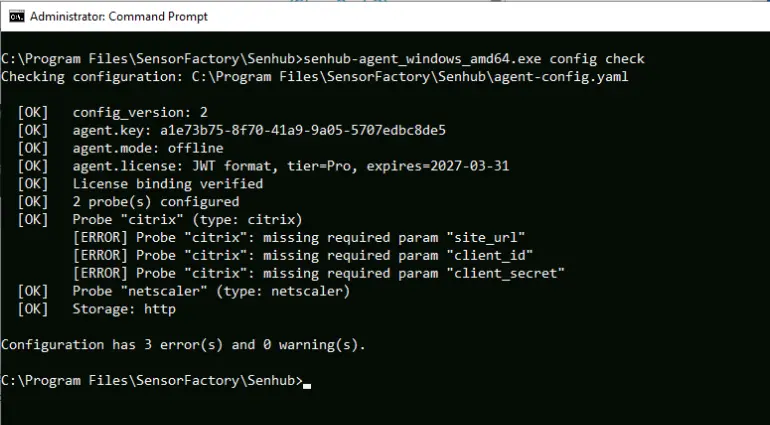
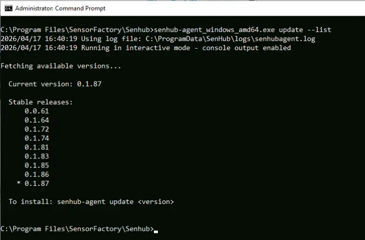

# CLI Reference

All commands are run from the agent binary. Release artifacts are ZIP archives named `senhub-agent-<os>-<arch>.zip` (e.g. `senhub-agent-linux-amd64.zip`, `senhub-agent-windows-amd64.zip`). Each ZIP contains a binary already named `senhub-agent` (Linux) or `senhub-agent.exe` (Windows) — no renaming needed after extraction. See the [Installation guide](installation.md) for details.

## Output conventions

CLI output is plain text with no decorative symbols. Data and command results are written to stdout, so a command can be piped or captured without post-processing. Diagnostic errors and warnings go to stderr, and a fatal error prints a single `Error: <message>` line to stderr before the process exits non-zero. Destructive commands (`uninstall`, `refresh-unit`, `secret rm`, `license remove`) prompt for confirmation before acting; each accepts a flag to skip the prompt for unattended runs (see the relevant sections below).

On Linux, commands that touch the service, the secret store or the binary run as root with the full path of the installed binary: `sudo /usr/local/bin/senhub-agent <command>`. On RHEL, AlmaLinux and Rocky Linux, the `sudo` search path leaves out `/usr/local/bin`, so `sudo senhub-agent` is not found there. The short `senhub-agent` form below stands for that full invocation; on Windows, run `senhub-agent.exe` from an elevated prompt.

## Exit codes

Every command ends with one of four codes, so a script can branch without reading the text.

| Code | Meaning |
|------|---------|
| `0` | Done: the command did what was asked |
| `1` | Warning: the command ran, but something needs attention |
| `2` | Failure: the command could not do what was asked, including a malformed command line |
| `3` | Unchanged: the machine was already in the requested state and nothing was written |

Which commands use which codes:

| Command | `1` Warning | `2` Failure | `3` Unchanged |
|---------|-------------|-------------|---------------|
| `config check` | warnings only (no licence is not one: the free tier is reported as information) | an error, or a configuration that cannot be read | |
| `status` | service stopped, agent not answering, agent unhealthy, with a dead output or a probe in error | the service manager could not be queried | |
| `doctor` | at least one check is a warning | at least one check failed | |
| `config init` | | invalid value, port in use, nothing written | configuration already present |
| `config set` | | unknown key, invalid value | the key already holds the value |
| `install` | | any error | service already installed, configuration present, binary current |

Any other command exits `0` on success and `2` on failure. Before this contract, failures exited `1`; a script that tests only for a non-zero code is unaffected, one that compares with `1` must now compare with `2`.

A command that exits `3` has written nothing: no file is rewritten, and its modification time is unchanged. A script that provisions a machine can run `config init`, `config set` and `install` again and treat `0` and `3` as success.

## JSON output

`version`, `status`, `doctor`, `config check`, `config show`, `config set`, `config init` and `secret status` accept `--json`. The command then prints a single JSON object on stdout and nothing else there; diagnostics still go to stderr. Without the flag the output is the text described below.

Every object starts with the same fields:

| Field | Type | Meaning |
|-------|------|---------|
| `schema` | string | Document identifier, `senhub.cli.<command>/v1` |
| `ok` | boolean | `false` only when the command failed (exit code `2`) |
| `status` | string | `ok`, `warning`, `failure` or `unchanged`, the name of the exit code |
| `exit_code` | integer | The exit code the process returns |
| `error` | string | The reason, present when `ok` is `false` |

A failure in JSON mode is still a JSON object, with `ok` set to `false` and `error` set, and the process still exits `2`. The `v1` suffix changes only when a field is removed or changes meaning; new fields can appear under `v1`.

| Schema | Fields after the common ones |
|--------|------------------------------|
| `senhub.cli.version/v1` | `version`, `commit`, `build_time`, `go_version`, `environment`, and `service_binary` (`path`, `version`, `skew`) when the systemd service runs another build |
| `senhub.cli.status/v1` | `service` (`state`, `manager_available`, `detail`), `source` (`daemon`, `local`, `minimal` or `none`), `notice`, `agent` (health, connection, probes, performance and agent blocks, as the agent reports them), `otlp` with `--otlp` |
| `senhub.cli.doctor/v1` | `config_path`, `summary` (`ok`, `warn`, `fail`, `skip` counts), `checks` (a list of `section`, `id`, `level`, `message`, `fix`) |
| `senhub.cli.config.check/v1` | `config_path`, `errors`, `warnings`, `findings` (a list of `level`, one of `ok`, `warn`, `error`, `off`, and `message`) |
| `senhub.cli.config.show/v1` | `config_path`, `mode` (`redact`, `resolved` or `raw`), `config` (the merged configuration as an object) |
| `senhub.cli.config.set/v1` | `key`, `value`, `config_path`, `file`, `changed` |
| `senhub.cli.config.init/v1` | `config_path`, `changed`, `created`, `written` (the files it wrote) |
| `senhub.cli.secret.status/v1` | `backend`, `store`, `secrets` (a count; names and values never appear) |

`config show --json` applies the same redaction as the text view: secret values are masked unless `--resolved` is passed.

```bash
senhub-agent config check --json | jq '.findings[] | select(.level == "error")'
senhub-agent status --json | jq -r '.agent.health.status'
senhub-agent config set http.port 9080 --json; echo "exit $?"
```

## Service Management

| Command | Description |
|---------|-------------|
| `install` | Install as system service. On a machine where the service is already installed, the configuration is present and (Linux) the system binary is the one running, it changes nothing and exits `3` |
| `uninstall` | Remove the system service and delete the configuration directory, including the sealed secret store and the agent key. Irreversible; prompts first |
| `uninstall --yes` | Same, without confirmation |
| `refresh-unit` | Linux: bring the installed systemd unit up to date with the one embedded in this binary |
| `refresh-unit --yes` | Same, without confirmation |
| `start` | Start the service |
| `stop` | Stop the service |
| `restart` | Restart the service |
| `status` | Show service status and health |
| `status --otlp` | Same as `status`, plus an OTLP pipeline self-metrics block |
| `status --json` | The status as one JSON object (see [JSON output](#json-output)) |
| `run` | Run interactively in console mode |

### Status

```bash
sudo /usr/local/bin/senhub-agent status
sudo /usr/local/bin/senhub-agent status --otlp
```

`status` exits `1` when the service is stopped, when the running agent does not answer, or when it reports itself unhealthy or with an output that is not running; it exits `0` for a healthy agent.

The default `status` view prints service state, version, health, probes summary and resource usage. `--otlp` appends a four-section block summarising the OTLP push pipeline:

| Section | What it shows |
|---|---|
| Pipeline | Metrics / logs pushed totals, export errors, drops by reason |
| Store & Export | Store size, log buffer fill, last and mean export duration |
| Checkpoint | On-disk checkpoint size, age, restored-at-boot count, errors by stage |
| Parallel export | Number of sub-batches in the last push (1 = single-batch, >1 = fan-out by probe) |

Drops with `reason=probe_cardinality` indicate the per-probe cardinality budget was hit; `store_cap`, `memory_soft_limit` and `memory_hard_limit` flag other backpressure paths. See the [OTLP guide](otlp.md#monitoring-the-otlp-pipeline) for how to interpret each field.

`--otlp` calls the local HTTP strategy on port 8080 — the agent must have the `web` (or any other HTTP) endpoint enabled for the flag to return data. If the call fails, the standard `status` output still prints; a single-line note explains what went wrong.

### Refresh unit

```bash
sudo /usr/local/bin/senhub-agent refresh-unit
sudo /usr/local/bin/senhub-agent refresh-unit --yes
```

Linux only, as root. Compares `/etc/systemd/system/senhub-agent.service` with the unit embedded in the running binary, prints the difference and, once confirmed, rewrites the unit and runs `systemctl daemon-reload`. It keeps the `User=` / `Group=` the unit runs as and its `ExecStart` line while that binary still exists, creates the service user if it is missing, and keeps the systemd-creds drop-in in line with the secret store. It does not restart the service: run `restart` afterwards.

This is the way to move an existing install to the hardened unit. Do not use `uninstall` followed by `install` for that: `uninstall` deletes the configuration directory, the sealed secret store and the agent key with it.

### Doctor

```bash
senhub-agent doctor
senhub-agent doctor --json
senhub-agent doctor --config-path /etc/senhub-agent/agent.yaml
```

`doctor` runs the checks an operator would otherwise chain by hand (`status`, `config check`, `secret status`, the console's output test, `refresh-unit` in comparison mode) and prints one line per check, grouped by section. Each line that is not `OK` carries a `fix`: the command or action that clears it. It changes nothing on the machine, needs no root and works with the service stopped: a check it cannot make is reported `SKIP` with the reason (for example the running binary of the service, which only root can read).

```
Install
  [WARN] install.unit: the systemd unit differs from the one this binary ships (2 lines)
         fix: sudo senhub-agent refresh-unit
Configuration
  [OK]   config.check: the configuration is valid
```

Levels: `OK`, `WARN`, `FAIL` and `SKIP`. The exit code is `2` when a check failed, `1` when none failed and one warned, `0` otherwise; `SKIP` counts for neither.

| Section | Check | What it looks at |
|---------|-------|------------------|
| install | `install.service` | The service manager's answer, as `status` reads it |
| install | `install.unit` | Linux: the installed systemd unit against the one embedded in this binary (the comparison `refresh-unit` makes) |
| install | `install.binary` | Linux: the service runs the binary that is on disk (not replaced or deleted since it started); needs root to read the process |
| install | `install.skew` | The service copy of the binary is on the same version as this command |
| install | `install.log_group` | Linux: the service user is in the `adm` group when a `filetail` probe reads system logs under `/var/log` |
| install | `install.log_dir` | The log directory exists and the service user can write it |
| configuration | `config.check` | One line per error or warning of `config check`; the free tier is not a warning |
| configuration | `config.secrets` | The secret store, when there is one, can be read (`secret status`) |
| configuration | `config.license` | The licence expiry: a warning under 30 days, a failure once expired. Validity and binding come from `config.check` |
| configuration | `config.http_port` | The HTTP port is served by this agent, or is free |
| outputs | `outputs.<name>` | Each configured output is reached, with the console's connection test (DNS, TCP, TLS, authentication as the output allows) |
| outputs | `outputs.running` | Outputs that failed to start inside the running agent |
| probes | `probes.<name>` | From the running agent: last cycle, last error, and a warning for a probe that has produced no data |
| host | `host.disk` | Free space of the log volume: a warning under 10 %, a failure under 2 % |
| host | `host.memory` | Memory used by the running agent |

The probes section and `host.memory` need the agent to answer over HTTP; when it does not, they are skipped and say why. In JSON, the document is `senhub.cli.doctor/v1`:

```json
{
  "schema": "senhub.cli.doctor/v1",
  "ok": true,
  "status": "warning",
  "exit_code": 1,
  "config_path": "/etc/senhub-agent/agent.yaml",
  "summary": { "ok": 9, "warn": 1, "fail": 0, "skip": 2 },
  "checks": [
    {
      "section": "install",
      "id": "install.unit",
      "level": "warn",
      "message": "the systemd unit differs from the one this binary ships (2 lines)",
      "fix": "sudo senhub-agent refresh-unit"
    }
  ]
}
```

```bash
senhub-agent doctor --json | jq -r '.checks[] | select(.level != "ok" and .level != "skip") | "\(.id): \(.fix)"'
```

### Run (Console Mode)

```bash
senhub-agent run
senhub-agent run --verbose
senhub-agent run --filter probe.veeam
```

The agent reads its configuration from the YAML file pointed at by `--config-path`. The default path is OS-specific: `/etc/senhub-agent/agent.yaml` (Linux), `%ProgramData%\SenHub\agent.yaml` (Windows), `/usr/local/etc/senhub-agent/agent.yaml` (macOS).

| Flag | Description |
|------|-------------|
| `--verbose`, `-v` | Enable debug logging for all modules |
| `--filter MODULES` | Filter debug logs by module prefix (implies verbose) |
| `--config-path PATH` | Configuration file path (default: OS canonical path; a relative path resolves next to the binary) |
| `--log-format text\|json` | Layout of the log file: `text` (default) or `json`. Also read from `SENHUB_LOG_FORMAT`. The console output stays readable text |

### Debug Filter Examples

```bash
senhub-agent run --filter probe.veeam           # Veeam probe only
senhub-agent run --filter probe                  # All probes
senhub-agent run --filter strategy.http,sensor   # HTTP API + probe management
```

Use `debug-modules-list` to see all available filters.

## Web console

### console

Opens the built-in web console in the default browser, or prints its address with `--print`. The address carries the administration key, the key of the `http` output's `admin_key` setting, which the agent generates when it writes its configuration (or, on an older install, at its first start after the upgrade) and seals. It is not the agent key PRTG, Nagios or a Prometheus scrape read with: the console and the administration API answer only the administration key. Reading it needs the rights of the service account or an administrator. On Windows, a non-elevated call asks for elevation once, then opens the browser with the user's own rights. The command waits up to fifteen seconds for the agent to answer on its port before opening the page.

```bash
senhub-agent console
sudo /usr/local/bin/senhub-agent console --print
sudo /usr/local/bin/senhub-agent console --print --config-path /etc/senhub-agent/agent.yaml
```

| Flag | Description |
|------|-------------|
| `--print` | Print the address, do not open a browser |
| `--config-path PATH` | Configuration file to read (default: OS canonical path) |

The Windows MSI creates a "SenHub Agent Console" desktop shortcut that runs this command.

## Configuration

### config set

Changes one setting in the multi-file layout without editing YAML by hand. It writes the matching fragment under `strategies.d/`, preserving the file's comments and key order, and the running agent reloads the change on its own — no restart. An invalid value is refused and the file is left untouched.

```bash
senhub-agent config set http.port 9080
senhub-agent config set http.bind_address 0.0.0.0
```

| Key | Value |
|-----|-------|
| `http.port` | Port of the local HTTP endpoints (1-65535) |
| `http.bind_address` | Address the HTTP server binds to |

A key that already holds the value is not written again: the file keeps its content and its modification time, the command prints that there is nothing to do and exits `3`. `--json` prints the key, the value, the fragment edited and `changed`.

Changing `http.port` moves the web console and the PRTG / Nagios / Prometheus endpoints to the new port; reconnect on the new address.

### config init

Creates the default configuration for an unattended install (for example a silent MSI install or a scripted provisioning step), then applies the fields an installer can pass. It is idempotent: if a configuration already exists at the target path it is left untouched, and the command exits `3`. A kept configuration still receives an OTLP or Zabbix fragment the run asks for when that fragment is missing; the command then exits `0`.

```bash
senhub-agent config init
senhub-agent config init --license <jwt> --tags env=prod,site=paris
senhub-agent config init --otlp-endpoint otlp.example.com:4317
senhub-agent config init --otlp-endpoint vm.example.com:4318 --otlp-protocol http
senhub-agent config init --http-port 9080
senhub-agent config init --zabbix-server zabbix.example.com:10051
senhub-agent config init --license-file /tmp/customer.jwt
senhub-agent config init --license-dir /mnt/install
```

Before writing anything, `config init` binds the HTTP port it is about to configure and releases it. A port already in use is refused with the reason and the command exits non-zero, so an unattended install fails visibly instead of leaving a service that runs and answers nothing.

| Flag | Description |
|------|-------------|
| `--config-path PATH` | Target configuration file (default: OS canonical path) |
| `--http-port PORT` | Port of the local HTTP endpoints, PRTG / Web UI / Nagios / Prometheus (default `8080`) |
| `--http-bind ADDRESS` | Address the HTTP endpoints listen on (default `127.0.0.1`; the container image passes `0.0.0.0`) |
| `--license JWT` | License token to seed (unlocks paid probe tiers) |
| `--license-file PATH` | Read the licence token from this file; it takes precedence over `--license` unless the file is empty |
| `--license-dir DIR` | Look for a single `*.jwt` file in this directory and use it as `--license-file`. No file installs on the Free tier; more than one is refused |
| `--tags k=v,k2=v2` | Host-level global tags applied to the generated config |
| `--otlp-endpoint HOST:PORT` | Provision an OTLP push endpoint as a strategy fragment (metrics + logs) |
| `--otlp-protocol grpc\|http` | OTLP transport (default `grpc`; use `http` for a native VictoriaMetrics / Grafana Alloy OTLP/HTTP endpoint) |
| `--zabbix-server HOST:PORT` | Provision the Zabbix output (`strategies.d/20-zabbix.yaml`); several addresses separated by commas name a proxy group. With a server prepared by `zabbix setup`, the host registers at its first contact |
| `--zabbix-host-metadata TEXT` | Host metadata the autoregistration action matches (default `senhub-agent`); needs `--zabbix-server` |
| `--json` | Print one JSON object: `changed`, `created` and the files written |
| `--ok-if-unchanged` | Exit `0` instead of `3` when the configuration was already there, for an installer that treats any non-zero code as a failure (the Windows MSI and the container image use it) |

The generated layout is the multi-file form (`agent.yaml` + `probes.d/` + `strategies.d/`), the same one `install` and the Windows MSI write. By default the generated configuration pushes to no collector; `--otlp-endpoint` is what wires up a push.

### config check

Validates a configuration file and reports errors and warnings.

```bash
senhub-agent config check
senhub-agent config check /path/to/agent-config.yaml
senhub-agent config check --json
```

Exit code `0` means no finding, `1` warnings only, `2` an error or a file that cannot be read. With `--json` every status line of the report becomes an entry of `findings`.

Checks performed:
- YAML syntax (with line-level error context)
- Required fields (`config_version`, `agent.key`)
- License validity and agent binding
- Probe types against the registry
- Required probe parameters (endpoint, credentials)
- Storage strategy names

Fragments under `probes.d/` and `strategies.d/` are covered when a multi-file layout is present.



### config show

Prints the merged and resolved configuration as YAML. Secret handling depends on the flag:

```bash
senhub-agent config show
senhub-agent config show --raw
senhub-agent config show --resolved
senhub-agent config show /path/to/agent.yaml
senhub-agent config show --json
```

| Flag | Description |
|------|-------------|
| `--redact` | Substitute `${env:}` / `${file:}` / `${secret:}` references but mask secret values (default) |
| `--resolved` | Substitute all references, printing secret values in cleartext |
| `--raw` | Leave references exactly as written in the file |
| `--json` | Print the configuration inside one JSON object (see [JSON output](#json-output)); the redaction mode applies as in text |

An optional trailing path selects a config file other than the OS default.

### config migrate

Converts a legacy monolithic `agent-config.yaml` into the multi-file layout (`agent.yaml` + `probes.d/` + `strategies.d/`), writing a timestamped backup of the original. It is idempotent: a config that is already multi-file reports nothing to do and exits 0.

```bash
senhub-agent config migrate
senhub-agent config migrate /path/to/agent-config.yaml
```

### debug-modules-list

Lists all available debug filter names.

```bash
senhub-agent debug-modules-list
```

## Secret Store

The `secret` command manages the OS-native secret store that backs `${secret:NAME}` references in the configuration, so that passwords and tokens never sit in plaintext in `agent.yaml`, `probes.d/*.yaml` or `strategies.d/*.yaml`. See the [Secret Store guide](secret-store.md) for the backends and the full workflow.

A secret value is never passed on the command line — it would leak through the process list and shell history. `secret set` reads the value from a hidden terminal prompt, from stdin, or from a file via `--from-file`.

| Command | Description |
|---------|-------------|
| `secret set <name>` | Store or replace a secret (hidden prompt, stdin, or `--from-file <path>`) |
| `secret get <name>` | Print a secret value to stdout (a deliberate reveal) |
| `secret list` | List secret names (never values) |
| `secret rm <name>` | Delete a secret (prompts to confirm; `--yes` to skip) |
| `secret status` | Show the active backend and store location (`--json` for a JSON object) |
| `secret migrate` | Move inline plaintext secrets from the config into the store (`--wire-unit` also wires the systemd-creds drop-in) |
| `secret wire-unit` | Regenerate the systemd unit credential drop-in (Linux/systemd-creds only) |

```bash
sudo /usr/local/bin/senhub-agent secret set veeam_password          # hidden prompt
sudo /usr/local/bin/senhub-agent secret set veeam_password --from-file /root/veeam.pw
printf '%s' "$PW" | sudo /usr/local/bin/senhub-agent secret set veeam_password
sudo /usr/local/bin/senhub-agent secret list
sudo /usr/local/bin/senhub-agent secret status
```

On Linux the backend is chosen automatically (see the [Secret Store guide](secret-store.md#backends-per-os)). `SENHUB_SECRET_BACKEND=age` or `SENHUB_SECRET_BACKEND=systemd-creds` forces one, for example `sudo SENHUB_SECRET_BACKEND=systemd-creds /usr/local/bin/senhub-agent secret migrate --wire-unit`.

Once stored, reference the secret from the configuration as `${secret:veeam_password}`.

### Agent key

```bash
sudo /usr/local/bin/senhub-agent key show
sudo /usr/local/bin/senhub-agent key show --config-path /etc/senhub-agent/agent.yaml
```

Prints the configured agent key: the key PRTG, Nagios and a Prometheus scrape read the agent with. It does not open the web console or the administration API, which answer only the administration key; open the console with `senhub-agent console`. It resolves the key whether it is still inline in the config or has been sealed into the store as `${secret:agent.key}`. Because it reveals a sealed value, the command runs behind the same privilege gate as the service commands.

```bash
sudo /usr/local/bin/senhub-agent key instance-id
sudo /usr/local/bin/senhub-agent key instance-id --config-path /etc/senhub-agent/agent.yaml
```

Prints the agent's instance id: the `service.instance.id` its telemetry and its topology entity carry, an RFC 4122 UUID derived from the agent key. Use it to find this agent in a metrics store or in a topology graph. It is not a credential; `senhub-agent status`, the **Identity** card of the console's Settings page and the **Agent** card of its Overview show it too.

## Database Helpers

### db-monitoring init

Generates the least-privilege SQL needed to provision a monitoring user for the database probes. The command never connects to a database — it prints the `GRANT` block to stdout for a DBA to review and run. It requires no license tier, and no administrator privileges on Windows.

```bash
senhub-agent db-monitoring init --engine postgresql
senhub-agent db-monitoring init --engine mysql --user mon_user --host 10.0.0.5
```

| Flag | Description |
|------|-------------|
| `--engine NAME` | `mysql`, `mariadb`, or `postgresql` (required) |
| `--user NAME` | Monitoring user to create (default: `senhub_monitor`) |
| `--host HOST` | Source host for the MySQL grant (default: `%`, all hosts) |
| `--version N` | Major engine version, to gate version-specific grants (optional) |

## Update

### Check for updates

```bash
senhub-agent update
```

Checks if a newer version is available and displays it.

### List available versions

```bash
senhub-agent update --list
```

Lists all stable versions. If `auto_update.include_beta: true` is set in the configuration, beta versions are also listed.



### Install a specific version

```bash
sudo /usr/local/bin/senhub-agent update 0.6.0
sudo /usr/local/bin/senhub-agent update 0.6.0 --dry-run
sudo /usr/local/bin/senhub-agent update 0.6.0 --registry-url https://releases.example.com
```

Downloads and installs the specified version. On Linux, when the systemd service is running, it is then restarted and the command checks that the new process runs the binary just installed, printing the version it runs; if it does not, the command fails. Updating replaces the binary and needs the same privileges as the service commands. On Windows, the MSI restarts the service itself.

| Flag | Description |
|------|-------------|
| `--dry-run`, `-d` | Do not install; print the version that would be installed |
| `--registry-url URL` | Release registry to download from, instead of the built-in one |
| `--no-restart` | Install the binary and leave the running service as it is, for a script that restarts it itself. Until the service restarts it keeps running the previous version, whatever `senhub-agent version` says: that command reads the file on disk |
| `--verbose`, `-v` | Enable verbose logging |

## Zabbix

### zabbix setup

Prepares a Zabbix server for the agent in one call: it imports the
generated templates, creates the host group, and creates the
autoregistration action that turns an agent's first contact into a host
carrying them. After it, a machine needs the agent and two lines naming
the server, with nothing typed in the Zabbix interface.

It is an administrator command, run once. A deployed agent never holds
an API token and still registers by itself. Every step is idempotent, so
re-running it is safe and is also how a template is refreshed after an
upgrade.

```bash
senhub-agent zabbix setup --url https://zabbix.example.com --token-file ~/.zbx-token
senhub-agent zabbix setup --url https://zabbix.example.com --token-file ~/.zbx-token \
  --probe cpu --probe memory --probe veeam --group "SenHub agents"
senhub-agent zabbix setup --url https://zabbix.example.com --dry-run
```

| Flag | Description |
|------|-------------|
| `--url URL` | Zabbix frontend, required. The agent pushes to the trapper port, not this one |
| `--token-file PATH` | File holding the API token. Preferred: a token on the command line is visible to every process on the machine |
| `--token VALUE` | API token. Read after `--token-file` and before `SENHUB_ZABBIX_TOKEN` |
| `--probe TYPE` | Probe whose template is linked to every host that registers. Repeatable. Without it, the probes every machine runs: cpu, memory, network, logicaldisk, process |
| `--group NAME` | Host group the registering hosts join |
| `--metadata STRING` | Host metadata the autoregistration action matches on; must equal the agent's `host_metadata` |
| `--action-name NAME` | Name of the autoregistration action it writes |
| `--discovery-delay INTERVAL` | Update interval of the discovery rules, which Zabbix sets to one hour by default |
| `--no-discovery-delay` | Leave the discovery rules as the template declares them |
| `--prefix PREFIX` | First segment of the item keys; must match the output's `key_prefix` |
| `--version 6.0\|7.0` | Export format of the templates written |
| `--dry-run` | Describe what it would do and change nothing. Works without a token |

The token is read from `--token-file`, then `--token`, then the
environment variable `SENHUB_ZABBIX_TOKEN`.

`setup` also names any other enabled autoregistration action a
registering agent would match. Zabbix runs every matching action, and
two that both link templates do not merge: the second link fails,
because Zabbix refuses two linked templates declaring one key, and it
fails silently. The host then comes up with whichever set won and items
that never fill. `setup` reports it rather than disabling it, since an
action you wrote may do things it knows nothing about.

Every template is imported, including the probes not named with
`--probe`; only the linking is narrowed. A template linked to a host
whose agent does not run that probe adds discovery rules that never
answer, which is why the default is the universal set.

### zabbix template

Writes the Zabbix templates generated from the probe definitions, one
file per probe type, without touching a server. Use it to read what will
be imported, to keep the templates under version control, or to import
them by a route of your own.

```bash
senhub-agent zabbix template --out ./templates
senhub-agent zabbix template --probe memory --platform linux
senhub-agent zabbix template --probe veeam --version 6.0
```

| Flag | Description |
|------|-------------|
| `--probe TYPE` | Probe type to generate. Repeatable. Without it, every definition |
| `--platform linux\|windows` | Keep only the metrics that platform can produce. Without it, the definition whole |
| `--version 6.0\|7.0` | Export format, `7.0` by default |
| `--prefix PREFIX` | First segment of the item keys; must match the output's `key_prefix` |
| `--delay INTERVAL` | Update interval of the item prototypes |
| `--out DIR` | Directory to write into. Without it, and with a single `--probe`, the template goes to standard output |

With `--out`, a small **SenHub Agent** template is written beside the
others, carrying the agent's own items. Link it on every host: it is
what turns the host's availability green.

## License

### Show license status

```bash
senhub-agent license show
```

### Print the agent key for a licence

```bash
sudo /usr/local/bin/senhub-agent license key
```

Prints this agent's key, the value to give Sensor Factory when a licence is ordered for this agent, and the value `license activate` checks the licence binding against.

### Activate a license

```bash
sudo /usr/local/bin/senhub-agent license activate - < license.jwt
cat license.jwt | sudo /usr/local/bin/senhub-agent license activate -
sudo /usr/local/bin/senhub-agent license activate <license-jwt>
```

With `-`, or with no argument and a file or pipe on standard input, the
token is read from standard input and never appears in the process list
or the shell history. Validates the license and writes it to the `license.jwt` file next to
`agent.yaml`. Restart the agent for the change to take effect. You can also
simply place the `license.jwt` file next to the config yourself and restart —
no CLI needed.

### Remove license

```bash
sudo /usr/local/bin/senhub-agent license remove
sudo /usr/local/bin/senhub-agent license remove --force
```

Reverts to the free tier: deletes `license.jwt` and clears any inline license. The command prompts for confirmation before writing; pass `--force` (`-f`) to skip the prompt for unattended runs. Restart the agent for the change to take effect.

## Other

| Command | Description |
|---------|-------------|
| `version` | Show agent version and build information (`--json` for a JSON object) |
