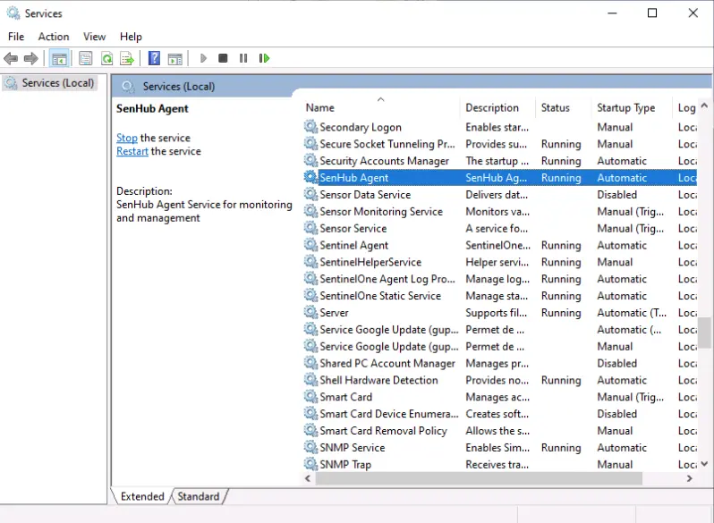

# Installation

SenHub Agent is a monitoring collector that runs on your infrastructure and collects metrics from various sources (servers, applications, network devices). It installs as a system service and runs in the background.

## System Requirements

| Platform | Versions | Architecture |
|----------|----------|--------------|
| **Windows** | Server 2016+, Windows 10+ | x64 |
| **Linux** | RHEL 7+, Ubuntu 18.04+, Debian 10+ | x64, ARM64 |

**Resource requirements**: 1 CPU core, 512 MB RAM, 500 MB disk space.

**Network requirements**: outbound HTTPS from the agent host to whichever sink you configure (Prometheus scraper, OTLP collector, vmagent, Grafana Cloud OTLP). For an agent that only exposes data through its local HTTPS endpoint, no outbound connection is required at all.

## Obtaining the Agent

Contact SenHub support (support@senhub.io) or download from the [GitHub releases page](https://github.com/senhub-io/senhub-agent/releases). You will receive:

- On Windows, the signed MSI installer (`senhub-agent-<version>-amd64.msi`) or the agent ZIP
- On Linux, the agent ZIP for your architecture (see naming convention below)
- A license token (required for premium probes: Citrix, NetScaler, Redfish, etc.)

### Release Artifact Naming

Release artifacts are ZIP archives named with dashes between OS and architecture:

| Platform | ZIP filename | Binary inside ZIP |
|----------|-------------|-------------------|
| Windows x86_64 | `senhub-agent-windows-amd64.zip` | `senhub-agent.exe` |
| Linux x86_64 | `senhub-agent-linux-amd64.zip` | `senhub-agent` |
| Linux ARM64 | `senhub-agent-linux-arm64.zip` | `senhub-agent` |
| macOS Intel | `senhub-agent-darwin-amd64.zip` | `senhub-agent` |
| macOS Apple Silicon | `senhub-agent-darwin-arm64.zip` | `senhub-agent` |

Each ZIP contains a binary already named `senhub-agent` (or `senhub-agent.exe` on Windows). No renaming is needed after extraction.

On Windows, the release also ships a Windows Installer package, `senhub-agent-<version>-amd64.msi` (amd64 only), which is the recommended way to install on servers and managed fleets.

## Windows Installation

Two paths are supported on Windows:

- The **MSI installer** — a guided wizard for interactive installs, and a silent, property-driven install for GPO / SCCM / Intune fleets. This is the recommended path.
- The **ZIP + `install` command** — extract the binary and register the service by hand, useful for quick local setups.

### MSI installer (recommended)

The MSI (built with WiX 5.0.2) installs `senhub-agent.exe` into `%ProgramFiles%\SenHub Agent\`, registers and starts the `senhub-agent` Windows service (display name **SenHub Agent**, running as `LocalSystem`, with restart-on-failure recovery), and provisions the configuration on first install.

On first install the MSI runs `senhub-agent config init`, which writes the default multi-file configuration under `%ProgramData%\SenHub\` (`agent.yaml` + `probes.d\` + `strategies.d\`) with no interactive step, and applies any license key, tags or OTLP endpoint you provide. Provisioning is idempotent: an upgrade or reinstall never overwrites an existing configuration, and operator config under `%ProgramData%\SenHub\` is preserved on uninstall.

!!! note "Signed installer"
    The MSI, the bundled `senhub-agent.exe` and the installer's PowerShell payload are code-signed with an HSM-backed **Certum** code-signing certificate. Windows shows the `SENSOR FACTORY SAS` publisher, and SmartScreen does not raise an unknown-publisher warning. You can confirm the signature with `Get-AuthenticodeSignature .\senhub-agent-<version>-amd64.msi | Format-List` — status `Valid` with the `SENSOR FACTORY SAS` publisher.

#### Interactive install

Double-click `senhub-agent-<version>-amd64.msi` and follow the guided wizard (Welcome → license → install directory → ready → progress → finish). With nothing provided, the agent installs in the Free-tier default (local scrape endpoints only, no push).

#### Silent / unattended install

Public MSI properties drive an unattended install from the `msiexec` command line (or an MST for GPO). All are optional; with none set the agent installs in the Free-tier default (local endpoints only, no push).

| Property | Purpose |
|---|---|
| `LICENSE_KEY` | JWT license token — unlocks Pro/Enterprise probes (Free needs none) |
| `TAGS` | Comma-separated `k=v` list applied as host `global_tags` (e.g. `site=paris,env=prod`) |
| `OTLP_ENDPOINT` | Optional collector `host:port` — writes an OTLP push strategy (`strategies.d\10-otlp.yaml`) |
| `INSTALLFOLDER` | Override the install directory (default `%ProgramFiles%\SenHub Agent\`) |
| `ADOPT` | `ADOPT=1` takes over an agent installed outside the MSI (see below) |

Properties are consumed only on first install; they do not overwrite an existing `agent.yaml`.

```bat
msiexec /i senhub-agent-<version>-amd64.msi /qn ^
  LICENSE_KEY=eyJhbGciOi... ^
  TAGS=site=paris,env=prod ^
  OTLP_ENDPOINT=collector.company.com:4317 ^
  /l* %TEMP%\senhub-agent-install.log
```

Free tier, no provisioning:

```bat
msiexec /i senhub-agent-<version>-amd64.msi /qn
```

!!! warning "The license key is a secret"
    A verbose install log (`/l*v`) records property values and custom-action command lines, so a `LICENSE_KEY` passed on the `msiexec` line can appear in that log. When provisioning a license silently, use a non-verbose log level (`/l*`) or omit logging entirely for the install that carries `LICENSE_KEY`; if you must capture a verbose log for troubleshooting, treat it as sensitive and delete it once the install is confirmed. The token equally lands in the deployment tool's job output — scrub it the same way.

For GPO, SCCM and Intune deployment (including the MST transform GPO needs to pass properties), see the [Windows MSI deployment guide](https://github.com/senhub-io/senhub-agent/blob/dev/docs/deployment/windows-msi.md).

#### Adopting an existing agent

If the machine already runs an agent installed **outside** the MSI (a `senhub-agent install`, ZIP or auto-update deploy), the installer detects the foreign service and, by default, stops with a clear message rather than colliding on service creation. Pass `ADOPT=1` to take it over:

```bat
msiexec /i senhub-agent-<version>-amd64.msi /qn ADOPT=1 /l* %TEMP%\senhub-adopt.log
```

`ADOPT=1` stops and deletes the existing service, then installs the MSI-managed one. Configuration under `%ProgramData%\SenHub\` is preserved, so migrating a fleet from a script or auto-update install to MSI management is a single `ADOPT=1` install. An MSI installed by this MSI upgrades cleanly on its own — `ADOPT` is only for foreign installs.

!!! note "Auto-update on MSI installs"
    An MSI-managed install does **not** self-replace its binary. Auto-update stays automatic but applies a **new signed MSI** instead: when an update is available the agent downloads `senhub-agent-<version>-amd64.msi`, verifies its signature, and runs `msiexec /i /qn` (a clean MajorUpgrade that preserves `%ProgramData%\SenHub\` and restarts the service). The agent detects the MSI registry marker and switches to this path automatically; a non-MSI (ZIP / script) install keeps the binary self-replace flow. To manage updates yourself instead, disable `auto_update` and push new MSIs through your management tool (Intune / SCCM / WSUS).

### ZIP install

For a quick local setup you can install from the ZIP and register the service by hand.

#### 1. Prepare the binary

Download `senhub-agent-windows-amd64.zip`, then extract it to your installation directory:

```powershell
mkdir C:\SenHub
Expand-Archive .\senhub-agent-windows-amd64.zip -DestinationPath C:\SenHub\
```

The ZIP contains `senhub-agent.exe`, already correctly named.

#### 2. Install the service

Open a **PowerShell terminal as Administrator** and run:

```powershell
cd C:\SenHub\
.\senhub-agent.exe install
```

This registers `SenHub Agent` as a Windows Service with automatic restart on failure. A UUID agent key is generated automatically and saved to the configuration file.

To install with HTTPS enabled on the local API:

```powershell
.\senhub-agent.exe install --enable-https --https-port 8443
```

#### 3. Start the service

```powershell
.\senhub-agent.exe start
```

#### 4. Verify the installation

```powershell
.\senhub-agent.exe status
```

You can also check the health endpoint:

```powershell
Invoke-WebRequest -Uri "http://localhost:8080/health"
```

Expected response:
```json
{"status":"ok","version":"0.1.87","uptime":"1m30s","probes_active":2,"metrics_cached":12}
```



### Log file location

Windows logs are stored at:
```
%ProgramData%\SenHub\logs\senhubagent.log
```

Typically: `C:\ProgramData\SenHub\logs\senhubagent.log`

Log rotation: 10 MB max per file, 5 backup files, 30-day retention, compressed.

## Linux Installation

### 1. Prepare the binary

Download the ZIP for your architecture (`senhub-agent-linux-amd64.zip` or `senhub-agent-linux-arm64.zip`), then extract it:

```bash
sudo mkdir -p /opt/senhub/bin
sudo unzip senhub-agent-linux-amd64.zip -d /opt/senhub/bin/
sudo chmod +x /opt/senhub/bin/senhub-agent
```

The ZIP contains `senhub-agent`, already correctly named.

### 2. Install the service

```bash
sudo /opt/senhub/bin/senhub-agent install
```

This creates and registers a hardened systemd service (`senhub-agent.service`) that runs the agent as a dedicated unprivileged system user (`senhub`, created during install if missing) with all Linux capabilities dropped — the same unit the `.deb`/`.rpm` packages ship. A UUID agent key is generated automatically and saved to the configuration file, and the configuration and log directories are handed to the `senhub` user.

If a probe needs a privilege the default unit does not grant (for example `snmp_trap` on UDP/162 or ICMP raw sockets), grant the single capability with a unit drop-in — see [Running the agent least-privilege](https://github.com/senhub-io/senhub-agent/blob/dev/docs/admin-guide/LEAST-PRIVILEGE.md). To keep the previous behavior of running the service as root:

```bash
sudo /opt/senhub/bin/senhub-agent install --user root
```

!!! note "Upgrading from an earlier version"
    `install` never touches an existing `senhub-agent.service` unit — it fails with "Init already exists". Existing installs keep running as before. The hardened unit applies only after an explicit `uninstall` followed by `install`; at that point review any probe that relied on root (privileged ports, raw sockets) against the per-probe privilege map in the least-privilege guide, or reinstall with `--user root`.

To install with HTTPS enabled and a custom certificate hostname:

```bash
sudo /opt/senhub/bin/senhub-agent install \
  --enable-https \
  --https-hosts "agent.company.com,192.168.1.100" \
  --https-port 8443
```

### 3. Start the service

```bash
sudo /opt/senhub/bin/senhub-agent start
```

### 4. Verify the installation

```bash
sudo /opt/senhub/bin/senhub-agent status
```

Or check the health endpoint:

```bash
curl http://localhost:8080/health
```

### Log file location

Linux logs are stored at:
```
/var/log/senhub-agent/senhubagent.log
```

If this directory is not writable, logs fall back to the binary directory.

Log rotation: 10 MB max per file, 5 backup files, 30-day retention, compressed.

## Installation Options

The `install` command accepts the following options:

### Configuration

| Flag | Default | Description |
|------|---------|-------------|
| `--config-path PATH` | OS canonical path | Path to the configuration file |
| `--user USER` | `senhub` | System user the installed Linux service runs as. Use `root` to keep the legacy root unit. Ignored on Windows and macOS. |

### HTTPS / TLS

| Flag | Default | Description |
|------|---------|-------------|
| `--enable-https` | disabled | Enable HTTPS on the agent API |
| `--https-port PORT` | `8443` | HTTPS listening port |
| `--https-hosts HOSTS` | `localhost,127.0.0.1` | Hostnames for the auto-generated certificate (comma-separated) |
| `--cert-file PATH` | auto-generated | Path to a custom TLS certificate file |
| `--key-file PATH` | auto-generated | Path to a custom TLS private key file |
| `--min-tls-version VER` | `1.2` | Minimum TLS version (1.2 or 1.3) |

### Logging

| Flag | Description |
|------|-------------|
| `--verbose` or `-v` | Enable verbose logging for all modules |
| `--filter MODULES` | Filter debug logs by module prefix (implies verbose). Example: `--filter probe.veeam` |

## What Happens During Installation

When you run `senhub-agent install`, the agent:

1. Checks for administrator/root privileges (required on Windows and Linux)
2. On Linux: creates the dedicated `senhub` system user and group if they do not exist (skipped with `--user root`)
3. Registers the system service (`SenHub Agent` on Windows, the hardened `senhub-agent.service` running as `senhub` on Linux)
4. Configures automatic restart on failure
5. Generates the **multi-file configuration layout** at the OS canonical path: a globals-only `agent.yaml` plus sibling `probes.d/` and `strategies.d/` directories prefilled with sane defaults (host probes + HTTP strategy). A fresh UUID is generated for the agent key.
6. If `--enable-https` is specified: creates a `certs/` directory with a self-signed certificate and private key (valid for 365 days), and configures the HTTP strategy fragment to use them.
7. On Linux: hands the configuration, log and certificate files to the service user so the unprivileged daemon can read them.

The Windows MSI installs the same service and configuration layout, driving the provisioning step through `config init` instead of an interactive `install` (see [MSI installer](#msi-installer-recommended) above).

### Files Created

| File | Permissions | Description |
|------|-------------|-------------|
| `agent.yaml` | `0600` (owner only) | Globals only (agent identity, auto-update, cache). At the OS canonical path. |
| `probes.d/00-host.yaml` | `0600` (owner only) | Default host probes: cpu, memory, network, logicaldisk. |
| `strategies.d/00-http.yaml` | `0600` (owner only) | Default HTTP strategy (PRTG / Web / Nagios on 127.0.0.1:8080). |
| `certs/agent-cert.pem` | `0600` (owner only) | TLS certificate (if HTTPS enabled). |
| `certs/agent-key.pem` | `0600` (owner only) | TLS private key (if HTTPS enabled). |

Add additional probes by creating new fragment files under `probes.d/` (e.g. `10-mysql.yaml` — files load alphabetically). Add another strategy by creating a new file under `strategies.d/` with exactly one top-level key (the strategy name). Disable any fragment by renaming it to `*.disabled` — no deletion required. The agent watches both directories with fsnotify, so add/modify/remove reloads automatically without a restart.

### Migrating an existing monolithic install

If you upgraded from a pre-0.2.x agent that used the single-file `agent-config.yaml` layout, the agent keeps loading it transparently — no immediate action required. To move to the multi-file layout cleanly:

```bash
sudo senhub-agent config migrate /etc/senhub-agent/agent-config.yaml
```

The command takes a timestamped backup of the original, splits globals into `agent.yaml`, probes into `probes.d/00-host.yaml`, and strategies into per-strategy files under `strategies.d/`. It then verifies the post-split data matches the original (and restores the backup on any mismatch). Comments from the monolithic file are NOT carried into the fragments — they live in the backup for reference. The command is idempotent: running it on an already-multi-file install reports "nothing to do" and exits 0.

## Service Management Commands

The agent binary provides built-in service management:

| Command | Description |
|---------|-------------|
| `senhub-agent install` | Install the system service |
| `senhub-agent uninstall` | Remove the system service and clean up files |
| `senhub-agent start` | Start the service |
| `senhub-agent stop` | Stop the service |
| `senhub-agent restart` | Restart the service |
| `senhub-agent status` | Show service status, health, and resource usage |
| `senhub-agent status --otlp` | Same as above, plus a block showing the OTLP push pipeline self-metrics |
| `senhub-agent version` | Show agent version and build information |
| `senhub-agent run` | Run interactively in console mode (for debugging) |
| `senhub-agent config check` | Validate configuration file |
| `senhub-agent update` | Check for updates |
| `senhub-agent update --list` | List available versions |
| `senhub-agent update VERSION` | Install a specific version |

### Console Mode

The `run` command starts the agent interactively in the foreground (not as a service). This is useful for debugging:

```bash
senhub-agent run
senhub-agent run --verbose
senhub-agent run --filter probe.veeam
```

All logs are printed to the console. Press Ctrl+C to stop.

Use `--filter` to limit debug output to specific modules (see [CLI Reference](cli.md)).

### Updating the Agent

Check for available updates:

```bash
senhub-agent update --list
```

Install a specific version:

```bash
senhub-agent update 0.1.87
```

On an MSI-managed Windows install, auto-update applies a new signed MSI rather than swapping the binary in place — see the note under [MSI installer](#msi-installer-recommended).

## Post-Installation Checklist

After installing and starting the agent, verify the following:

1. The service is running: `senhub-agent status`
2. The health endpoint responds: `curl http://localhost:8080/health`
3. The web dashboard is accessible: open `http://localhost:8080/web/{key}/` in a browser
4. Probes are collecting metrics: check the probes endpoint `curl http://localhost:8080/api/{key}/info/probes`
5. The log file exists and is being written to

## Next Steps

After installation:

1. Configure your monitoring probes (see [Configuration](configuration.md))
2. Activate your license if you have premium probes (see License section in [Configuration](configuration.md))
3. Set up HTTPS if required (see [HTTP/HTTPS Configuration](http-https.md))
4. Configure your monitoring system (PRTG, Nagios) to collect metrics (see [Web Interface](web-interface.md))

## Uninstallation

**Windows (MSI install):**
```bat
msiexec /x senhub-agent-<version>-amd64.msi /qn
```

Or use **Apps & features** / **Programs and Features** interactively.

By default, uninstalling keeps the operator state under `%ProgramData%\SenHub\` — configuration, sealed secret store, and license — while removing the transient `logs\` and `update\` folders (regenerated on the next run). A later reinstall or upgrade picks the existing setup back up. To delete that data tree as well when decommissioning a host, opt in with `PURGE_DATA=1`:

```bat
msiexec /x senhub-agent-<version>-amd64.msi /qn PURGE_DATA=1
```

The purge is not recoverable and never applies during an upgrade. An interactive uninstall always keeps the data; use the command line to purge.

**Windows (ZIP install):**
```powershell
.\senhub-agent.exe stop
.\senhub-agent.exe uninstall
```

**Linux:**
```bash
sudo /opt/senhub/bin/senhub-agent stop
sudo /opt/senhub/bin/senhub-agent uninstall
```

The `uninstall` command stops the service, removes the service registration, and cleans up generated files (configuration, certificates, logs).
