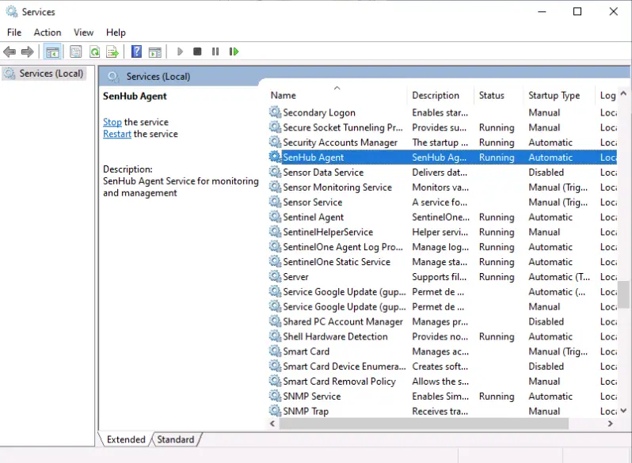

# Installation

SenHub Agent is a monitoring collector that runs on your infrastructure and collects metrics from various sources (servers, applications, network devices). It installs as a system service and runs in the background.

## System Requirements

| Platform | Versions | Architecture |
|----------|----------|--------------|
| **Windows** | Server 2016+, Windows 10+ | x64 |
| **Linux** | RHEL 7+, Ubuntu 18.04+, Debian 10+ | x64, ARM64 |
| **Container** | any host running a container runtime | x64, ARM64 |

A container is a supported deployment and has its own page: see [Running the agent in a container](container.md). The rest of this page installs the agent as a system service.

**Resource requirements**: 1 CPU core, 512 MB RAM, 500 MB disk space.

**Network requirements**: outbound HTTPS from the agent host to whichever sink you configure (Prometheus scraper, OTLP collector, vmagent, Grafana Cloud OTLP). For an agent that only exposes data through its local HTTPS endpoint, no outbound connection is required at all.

## Obtaining the Agent

Contact SenHub support (support@senhub.io) or download from the [GitHub releases page](https://github.com/senhub-io/senhub-agent/releases). You will receive:

- On Windows, the signed MSI installer (`senhub-agent-<version>-amd64.msi`) or the agent ZIP
- On Linux, the agent ZIP for your architecture (see naming convention below)
- A license token (required for premium probes: Citrix, NetScaler, Redfish, etc.)

### Direct download URLs

For a Dockerfile, an air-gapped copy or a configuration-management
recipe, you need the URL rather than a browser. Two sources serve the
same artifacts:

```bash
# GitHub — public, and the one to prefer for a container build
https://github.com/senhub-io/senhub-agent/releases/download/0.6.0/senhub-agent-linux-amd64.zip

# SenHub release server
https://eu-west-1.intake.senhub.io/download/0.6.0/senhub-agent-linux-amd64.zip
```

!!! warning "Release tags carry no `v` prefix"

    The tag is `0.6.0`, not `v0.6.0`. A URL built with the `v` returns
    404, which reads like a missing file rather than a wrong name — this
    is the single most common reason a direct download fails.

Substitute the version you want. To discover what is published:

```bash
curl -s https://eu-west-1.intake.senhub.io/releases/releases.json
```

That endpoint lists every stable version, newest first; `latest` is an
alias for the newest. Beta versions are at
`/releases/beta/releases.json`.

!!! note "`/releases` lists, `/download` serves"

    The two are different paths on purpose: `/releases/...` is the
    index, `/download/<version>/...` is where the files are. Do not put
    either of them into `auto_update.url` — that setting is the **base**
    the agent appends to, so a value carrying one of these paths makes
    every derived URL double it. `agent config check` reports this and
    tells you what to write instead.

### Verifying a download

Every artifact is published with a [minisign](https://jedisct1.github.io/minisign/)
signature next to it. Verify before you run it, especially in an
automated build:

```bash
VERSION=0.6.0
BASE=https://github.com/senhub-io/senhub-agent/releases/download/$VERSION
curl -fsSLO "$BASE/senhub-agent-linux-amd64.zip"
curl -fsSLO "$BASE/senhub-agent-linux-amd64.zip.minisig"

minisign -Vm senhub-agent-linux-amd64.zip \
  -P RWRlfkyeLpjI0MjTSfuvT/bDNHHaVJhRirQN8Z8LTAM+n4LKVbpjrlRh
```

That public key is the one the agent itself embeds to verify its own
auto-updates. There is no `SHA256SUMS` file — minisign is the
verification path.

### Release Artifact Naming

Release artifacts are ZIP archives named with dashes between OS and architecture:

| Platform | ZIP filename | Binary inside ZIP |
|----------|-------------|-------------------|
| Windows x86_64 | `senhub-agent-windows-amd64.zip` | `senhub-agent.exe` |
| Linux x86_64 | `senhub-agent-linux-amd64.zip` | `senhub-agent` |
| Linux ARM64 | `senhub-agent-linux-arm64.zip` | `senhub-agent` |

Each ZIP contains a binary already named `senhub-agent` (or `senhub-agent.exe` on Windows). No renaming is needed after extraction.

These three are the platforms the release publishes. The agent also builds and runs on macOS, but no macOS archive is published: it is a development target, and a build from source is the way to get one.

On Windows, the release also ships a Windows Installer package, `senhub-agent-<version>-amd64.msi` (amd64 only), which is the recommended way to install on servers and managed fleets.

## Windows Installation

Two paths are supported on Windows:

- The **MSI installer** — a guided wizard for interactive installs, and a silent, property-driven install for GPO / SCCM / Intune fleets. This is the recommended path.
- The **ZIP + `install` command** — extract the binary and register the service by hand, useful for quick local setups.

### MSI installer (recommended)

The MSI (built with WiX 5.0.2) installs `senhub-agent.exe` into `%ProgramFiles%\SenHub Agent\`, registers and starts the `senhub-agent` Windows service (display name **SenHub Agent**, running as `LocalSystem`, with restart-on-failure recovery), and provisions the configuration on first install.

On first install the MSI runs `senhub-agent config init`, which writes the default multi-file configuration under `%ProgramData%\SenHub\` (`agent.yaml` + `probes.d\` + `strategies.d\`) with no interactive step, and applies any license key, tags or OTLP endpoint you provide. Provisioning is idempotent: an upgrade never overwrites an existing configuration. A genuine uninstall removes `%ProgramData%\SenHub\` in full (see [Uninstallation](#uninstallation)), so a fresh install starts from the installer's inputs.

!!! note "Signed installer"
    The MSI, the bundled `senhub-agent.exe` and the installer's PowerShell payload are code-signed with an HSM-backed **Certum** code-signing certificate. Windows shows the `SENSOR FACTORY SAS` publisher, and SmartScreen does not raise an unknown-publisher warning. You can confirm the signature with `Get-AuthenticodeSignature .\senhub-agent-<version>-amd64.msi | Format-List` — status `Valid` with the `SENSOR FACTORY SAS` publisher.

#### Interactive install

Double-click `senhub-agent-<version>-amd64.msi` and follow the guided wizard (Welcome → licence agreement → install directory → agent options → ready → progress → finish). With nothing provided, the agent installs in the Free-tier default (local scrape endpoints only, no push).

#### Silent / unattended install

Public MSI properties drive an unattended install from the `msiexec` command line (or an MST for GPO). All are optional; with none set the agent installs in the Free-tier default (local endpoints only, no push).

| Property | Purpose |
|---|---|
| `LICENSE_FILE` | Path to the licence file (`.jwt`), what the wizard's Browse button fills in (local or UNC path) |
| `LICENSE_KEY` | The licence token itself, for scripted installs |
| `TAGS` | Comma-separated `k=v` list applied as host `global_tags` (e.g. `site=paris,env=prod`) |
| `OTLP_ENDPOINT` | Optional collector `host:port` — writes an OTLP push strategy (`strategies.d\10-otlp.yaml`) |
| `ZABBIX_SERVER` | Optional Zabbix server or proxy `host:port` — writes the Zabbix output (`strategies.d\20-zabbix.yaml`); the host then registers in Zabbix at its first contact |
| `ZABBIX_HOST_METADATA` | Host metadata the Zabbix autoregistration action matches (default `senhub-agent`) |
| `HTTP_PORT` | Port of the local HTTP endpoints, PRTG / Web UI / Nagios / Prometheus (default `8080`). A port already in use fails the install. |
| `DESKTOP_SHORTCUT` | `1` (default) creates a "SenHub Agent Console" desktop shortcut; `0` skips it |
| `INSTALLFOLDER` | Override the install directory (default `%ProgramFiles%\SenHub Agent\`) |
| `ADOPT` | `ADOPT=1` takes over an agent installed outside the MSI (see below) |

Properties are consumed only on first install; they do not overwrite an existing `agent.yaml`.

The guided install (double-click) asks for the licence file, the port, the desktop shortcut and whether to open the web console at the end, all on one page. The console address carries the administration key, generated on the machine and kept sealed, so the wizard does not print it: the desktop shortcut and `senhub-agent console` open it, and `senhub-agent console --print` (as administrator) prints it. The administration key is not the agent key given to PRTG, Nagios or a Prometheus scrape, which only reads metrics.

```bat
msiexec /i senhub-agent-<version>-amd64.msi /qn ^
  LICENSE_KEY=eyJhbGciOi... ^
  TAGS=site=paris,env=prod ^
  OTLP_ENDPOINT=collector.company.com:4317 ^
  /l* %TEMP%\senhub-agent-install.log
```

Free tier, no provisioning:

```bat
msiexec /i senhub-agent-<version>-amd64.msi /qn
```

!!! warning "The license key is a secret"
    A verbose install log (`/l*v`) records property values and custom-action command lines, so a `LICENSE_KEY` passed on the `msiexec` line can appear in that log. When provisioning a license silently, use a non-verbose log level (`/l*`) or omit logging entirely for the install that carries `LICENSE_KEY`; if you must capture a verbose log for troubleshooting, treat it as sensitive and delete it once the install is confirmed. The token equally lands in the deployment tool's job output — scrub it the same way.

For GPO, SCCM and Intune deployment (including the MST transform GPO needs to pass properties), see [Windows: Intune, GPO and SCCM](deploying/windows-intune-gpo.md). Other tools (Ansible, cloud-init, Docker Compose, Helm, Podman) are in [Deploying at scale](deploying/index.md).

#### Adopting an existing agent

If the machine already runs an agent installed **outside** the MSI (a `senhub-agent install`, ZIP or auto-update deploy), the installer detects the foreign service and, by default, stops with a clear message rather than colliding on service creation. Pass `ADOPT=1` to take it over:

```bat
msiexec /i senhub-agent-<version>-amd64.msi /qn ADOPT=1 /l* %TEMP%\senhub-adopt.log
```

`ADOPT=1` stops and deletes the existing service, then installs the MSI-managed one. Configuration under `%ProgramData%\SenHub\` is preserved, so migrating a fleet from a script or auto-update install to MSI management is a single `ADOPT=1` install. An MSI installed by this MSI upgrades cleanly on its own — `ADOPT` is only for foreign installs.

!!! note "Auto-update on MSI installs"
    An MSI-managed install does **not** self-replace its binary. Auto-update stays automatic but applies a **new signed MSI** instead: when an update is available the agent downloads `senhub-agent-<version>-amd64.msi`, verifies its signature, and runs `msiexec /i /qn` (a clean MajorUpgrade that preserves `%ProgramData%\SenHub\` and restarts the service). The agent detects the MSI registry marker and switches to this path automatically; a non-MSI (ZIP / script) install keeps the binary self-replace flow. To manage updates yourself instead, disable `auto_update` and push new MSIs through your management tool (Intune / SCCM / WSUS).

### ZIP install

For a quick local setup you can install from the ZIP and register the service by hand.

#### 1. Prepare the binary

Download `senhub-agent-windows-amd64.zip`, then extract it to your installation directory:

```powershell
mkdir C:\SenHub
Expand-Archive .\senhub-agent-windows-amd64.zip -DestinationPath C:\SenHub\
```

The ZIP contains `senhub-agent.exe`, already correctly named.

#### 2. Install the service

Open a **PowerShell terminal as Administrator** and run:

```powershell
cd C:\SenHub\
.\senhub-agent.exe install
```

This registers `SenHub Agent` as a Windows Service with automatic restart on failure. A UUID agent key is generated automatically and saved to the configuration file.

To install with HTTPS enabled on the local API:

```powershell
.\senhub-agent.exe install --enable-https --https-port 8443
```

#### 3. Start the service

```powershell
.\senhub-agent.exe start
```

#### 4. Verify the installation

```powershell
.\senhub-agent.exe status
```

You can also check the health endpoint:

```powershell
Invoke-WebRequest -Uri "http://localhost:8080/health"
```

Expected response:
```json
{"status":"ok","version":"0.6.0","uptime":"1m30s","probes_active":2,"metrics_cached":12}
```



### Log file location

Windows logs are stored at:
```
%ProgramData%\SenHub\logs\senhubagent.log
```

Typically: `C:\ProgramData\SenHub\logs\senhubagent.log`

Log rotation: 10 MB max per file, 5 backup files, 30-day retention, compressed.

## Linux Installation

### 1. Prepare the binary

Download the ZIP for your architecture (`senhub-agent-linux-amd64.zip` or `senhub-agent-linux-arm64.zip`), then extract it:

```bash
sudo mkdir -p /opt/senhub/bin
sudo unzip senhub-agent-linux-amd64.zip -d /opt/senhub/bin/
sudo chmod +x /opt/senhub/bin/senhub-agent
```

The ZIP contains `senhub-agent`, already correctly named.

### 2. Install the service

```bash
sudo /opt/senhub/bin/senhub-agent install
```

This creates and registers a hardened systemd service (`senhub-agent.service`) that runs the agent as a dedicated unprivileged system user (`senhub`, created during install if missing) with all Linux capabilities dropped — the same unit the `.deb`/`.rpm` packages ship. A UUID agent key is generated automatically and saved to the configuration file, and the configuration and log directories are handed to the `senhub` user.

`install` copies the binary to `/usr/local/bin/senhub-agent` and the service runs that copy; the one you extracted is no longer used, and you may delete `/opt/senhub/bin` once the install has succeeded. Every later command that touches the service, the secret store or the binary runs as root and calls the installed binary by its full path, `sudo /usr/local/bin/senhub-agent ...`. On RHEL, AlmaLinux and Rocky Linux, `sudo` leaves `/usr/local/bin` out of its search path, so `sudo senhub-agent status` answers "command not found" there while `sudo /usr/local/bin/senhub-agent status` works.

To send to Zabbix, give the agent its server once the service is
installed; the running agent picks the output up and the host registers
in Zabbix at its first contact (see [Zabbix](zabbix.md#deploying)):

```bash
sudo /usr/local/bin/senhub-agent config init --zabbix-server zabbix.example.com:10051
```

If a probe needs a privilege the default unit does not grant (for example `snmp_trap` on UDP/162 or ICMP raw sockets), grant the single capability with a unit drop-in — see [Running the agent least-privilege](https://github.com/senhub-io/senhub-agent/blob/dev/docs/admin-guide/LEAST-PRIVILEGE.md). To keep the previous behavior of running the service as root:

```bash
sudo /opt/senhub/bin/senhub-agent install --user root
```

!!! note "Upgrading from an earlier version"
    `install` never touches an existing `senhub-agent.service` unit; it fails with "Init already exists", and existing installs keep running as before. To move an existing install to the hardened unit, refresh the unit in place:

    ```bash
    sudo /usr/local/bin/senhub-agent refresh-unit
    ```

    `refresh-unit` compares the installed unit with the one embedded in the binary, prints the difference, asks for confirmation (`--yes` skips it), then rewrites `/etc/systemd/system/senhub-agent.service` and reloads systemd. It keeps the `User=` / `Group=` the unit already runs as and its `ExecStart` line while that binary still exists, and creates the service user if it is missing. Restart the service afterwards. Before moving a root install to the `senhub` user, review any probe that relied on root (privileged ports, raw sockets) against the per-probe privilege map in the least-privilege guide.

    Do not use `uninstall` followed by `install` for this: `uninstall` deletes the configuration directory, including the sealed secret store and the agent key. Keep that sequence for a host being re-provisioned from scratch.

To install with HTTPS enabled and a custom certificate hostname:

```bash
sudo /opt/senhub/bin/senhub-agent install \
  --enable-https \
  --https-hosts "agent.company.com,192.168.1.100" \
  --https-port 8443
```

### 3. Start the service

```bash
sudo /usr/local/bin/senhub-agent start
```

### 4. Verify the installation

```bash
sudo /usr/local/bin/senhub-agent status
```

Or check the health endpoint:

```bash
curl http://localhost:8080/health
```

### Log file location

Linux logs are stored at:
```
/var/log/senhub-agent/senhubagent.log
```

If this directory is not writable, logs fall back to the binary directory.

Log rotation: 10 MB max per file, 5 backup files, 30-day retention, compressed.

### Install from packages

The agent is also available as a `.deb` (Debian, Ubuntu) and an `.rpm` (RHEL, Rocky Linux, openSUSE) for amd64 and arm64, in two editions. Download the file for your edition, distribution and architecture, then install it with your package manager:

| Edition | Package name | Choose it when |
|---------|--------------|----------------|
| Open source | `senhub-agent-oss` | You use the free probes (OS and host, logs, network checks, applications, databases and brokers). Licensed under Apache-2.0. |
| Full | `senhub-agent` | You use the paid probes (Citrix, NetScaler, Veeam, Redfish and the other deep vendor probes), with a license token. |

Both editions install the same files and the same service, so only one can be installed at a time.

```bash
# Debian, Ubuntu
sudo apt install ./senhub-agent-oss_<version>-1_amd64.deb

# RHEL, Rocky Linux, AlmaLinux
sudo dnf install ./senhub-agent-oss-<version>-1.x86_64.rpm

# openSUSE, SLES
sudo zypper install --allow-unsigned-rpm ./senhub-agent-oss-<version>-1.x86_64.rpm
```

For the full edition, use the `senhub-agent` file in the same commands. A beta carries its number after a tilde, for example `senhub-agent-oss_0.6.2~beta.1-1_amd64.deb`: the package manager sorts `0.6.2~beta.1` and `0.6.2~beta.2` before the final `0.6.2`, so the release replaces its betas as an ordinary upgrade.

#### Switching edition

Install the other edition in place of the installed one. The service restarts on the new package, and your configuration, agent key, secrets and data are kept. Switching in either direction works the same way. On Debian and Ubuntu one install command does it; on the rpm distributions the two editions conflict, so the switch is an explicit swap.

```bash
# from the open source edition to the full edition
sudo apt install ./senhub-agent_<version>-1_amd64.deb                          # Debian, Ubuntu
sudo dnf swap senhub-agent-oss ./senhub-agent-<version>-1.x86_64.rpm            # RHEL, Rocky Linux, AlmaLinux
sudo zypper install --force-resolution ./senhub-agent-<version>-1.x86_64.rpm    # openSUSE, SLES
```

From the package repositories, use the package name instead of the file: `sudo dnf swap senhub-agent-oss senhub-agent` or `sudo zypper install --force-resolution senhub-agent`. Going back uses the same commands with the names exchanged.

The package creates the `senhub` service user, installs the binary at `/usr/bin/senhub-agent` and the hardened `senhub-agent.service` unit, writes the default configuration to `/etc/senhub-agent/` with a key of its own for this host, and starts the service. It does not run `senhub-agent install`; do not run both.

- **Upgrade**: install the newer file the same way. Your edits to the configuration are kept and the service restarts on the new binary.
- **Version**: the package manager owns it. `auto_update` is `false` in the packaged configuration, so the agent never replaces itself; leave it that way.
- **Removal**: `sudo apt remove senhub-agent-oss` (or `dnf remove`, `zypper remove`; use the package name of your edition) stops and disables the service and keeps `/etc/senhub-agent`, `/var/lib/senhub-agent` and the logs. `sudo apt purge senhub-agent-oss` also deletes them, and the `senhub` user.

- **Host already installed with `senhub-agent install`**: installing the package takes over. It stops the service, removes the unit in `/etc/systemd/system` and the binary in `/usr/local/bin` (a copy is kept as `/var/lib/senhub-agent/senhub-agent.pre-package`), and starts the packaged service. Your configuration, agent key, secrets and data are not touched. The reverse (going back from a package to `install`) is not supported: remove the package first, then install from the ZIP.

#### Install from the package repositories

Signed APT and YUM/DNF/Zypper repositories are served at `https://packages.senhub.io`. They go live with the first published beta: until then, install from the downloaded file as above. Two channels exist, `stable` (final releases) and `beta` (pre-releases, `X.Y.Z~beta.N`); pick one per machine, and replace `beta` by `stable` in the commands below to follow final releases. The same page, <https://packages.senhub.io>, carries these commands for both channels. The package names are the ones of the table above: `senhub-agent-oss` (open source edition) and `senhub-agent` (full edition).

The signing key is served at `https://packages.senhub.io/gpg.key`; its fingerprint is printed on the repository page. The repository metadata and every package are signed with it, and the clients check both.

Debian, Ubuntu:

```bash
sudo install -d -m 0755 /etc/apt/keyrings
curl -fsSL https://packages.senhub.io/gpg.key | sudo gpg --dearmor --yes -o /etc/apt/keyrings/senhub.gpg
echo "deb [arch=$(dpkg --print-architecture) signed-by=/etc/apt/keyrings/senhub.gpg] https://packages.senhub.io/apt beta main" | sudo tee /etc/apt/sources.list.d/senhub.list
sudo apt update
sudo apt install senhub-agent-oss
```

RHEL, Rocky Linux, AlmaLinux, Fedora:

```bash
sudo curl -fsSLo /etc/yum.repos.d/senhub.repo https://packages.senhub.io/rpm/beta/senhub.repo
sudo dnf install senhub-agent-oss
```

openSUSE, SLES:

```bash
sudo rpm --import https://packages.senhub.io/gpg.key
sudo curl -fsSLo /etc/zypp/repos.d/senhub.repo https://packages.senhub.io/rpm/beta/senhub-zypper.repo
sudo zypper refresh
sudo zypper install senhub-agent-oss
```

For the full edition, install `senhub-agent` instead. Updates then arrive with the system's own updates (`apt upgrade`, `dnf upgrade`, `zypper update`).

## Installation Options

The `install` command accepts the following options:

### Configuration

| Flag | Default | Description |
|------|---------|-------------|
| `--config-path PATH` | OS canonical path | Path to the configuration file |
| `--user USER` | `senhub` | System user the installed Linux service runs as. Use `root` to keep the legacy root unit. Ignored on Windows and macOS. |

### HTTPS / TLS

| Flag | Default | Description |
|------|---------|-------------|
| `--http-port PORT` | `8080` | HTTP listening port (PRTG / Web UI / Nagios / Prometheus endpoints) |
| `--enable-https` | disabled | Enable HTTPS on the agent API |
| `--https-port PORT` | `8443` | HTTPS listening port |
| `--https-hosts HOSTS` | `localhost,127.0.0.1` | Hostnames for the auto-generated certificate (comma-separated) |
| `--cert-file PATH` | auto-generated | Path to a custom TLS certificate file |
| `--key-file PATH` | auto-generated | Path to a custom TLS private key file |
| `--min-tls-version VER` | `1.2` | Minimum TLS version (1.2 or 1.3) |

### Logging

| Flag | Description |
|------|-------------|
| `--verbose` or `-v` | Enable verbose logging for all modules |
| `--filter MODULES` | Filter debug logs by module prefix (implies verbose). Example: `--filter probe.veeam` |

## What Happens During Installation

When you run `senhub-agent install`, the agent:

1. Checks for administrator/root privileges (required on Windows and Linux)
2. On Linux: creates the dedicated `senhub` system user and group if they do not exist (skipped with `--user root`)
3. Registers the system service (`SenHub Agent` on Windows, the hardened `senhub-agent.service` running as `senhub` on Linux)
4. Configures automatic restart on failure
5. Generates the **multi-file configuration layout** at the OS canonical path: a globals-only `agent.yaml` plus sibling `probes.d/` and `strategies.d/` directories prefilled with sane defaults (host probes + HTTP strategy). A fresh UUID is generated for the agent key.
6. If `--enable-https` is specified: creates a `certs/` directory with a self-signed certificate and private key (valid for 365 days), and configures the HTTP strategy fragment to use them.
7. On Linux: hands the configuration, log and certificate files to the service user so the unprivileged daemon can read them.

The Windows MSI installs the same service and configuration layout, driving the provisioning step through `config init` instead of an interactive `install` (see [MSI installer](#msi-installer-recommended) above).

### Files Created

| File | Permissions | Description |
|------|-------------|-------------|
| `agent.yaml` | `0600` (owner only) | Globals only (agent identity, auto-update, cache). At the OS canonical path. |
| `probes.d/00-host.yaml` | `0600` (owner only) | Default host probes: cpu, memory, network, logicaldisk. |
| `strategies.d/00-http.yaml` | `0600` (owner only) | Default HTTP strategy (PRTG / Web / Nagios on 127.0.0.1:8080). |
| `certs/agent-cert.pem` | `0600` (owner only) | TLS certificate (if HTTPS enabled). |
| `certs/agent-key.pem` | `0600` (owner only) | TLS private key (if HTTPS enabled). |

Add additional probes by creating new fragment files under `probes.d/` (e.g. `10-mysql.yaml` — files load alphabetically). Add another strategy by creating a new file under `strategies.d/` with exactly one top-level key (the strategy name). Disable any fragment by renaming it to `*.disabled` — no deletion required. The agent watches both directories with fsnotify, so add/modify/remove reloads automatically without a restart.

### Migrating an existing monolithic install

If you upgraded from a pre-0.2.x agent that used the single-file `agent-config.yaml` layout, the agent keeps loading it transparently — no immediate action required. To move to the multi-file layout cleanly:

```bash
sudo /usr/local/bin/senhub-agent config migrate /etc/senhub-agent/agent-config.yaml
```

The command takes a timestamped backup of the original, splits globals into `agent.yaml`, probes into `probes.d/00-host.yaml`, and strategies into per-strategy files under `strategies.d/`. It then verifies the post-split data matches the original (and restores the backup on any mismatch). Comments from the monolithic file are NOT carried into the fragments — they live in the backup for reference. The command is idempotent: running it on an already-multi-file install reports "nothing to do" and exits 0.

## Service Management Commands

The agent binary provides built-in service management. On Linux, run these as root with the full path of the installed binary (`sudo /usr/local/bin/senhub-agent ...`); on Windows, from an elevated prompt.

| Command | Description |
|---------|-------------|
| `senhub-agent install` | Install the system service |
| `senhub-agent uninstall` | Remove the system service and delete the configuration directory, including the sealed secret store and the agent key (irreversible) |
| `senhub-agent refresh-unit` | Linux: bring the installed systemd unit up to date with this binary (`--yes` skips the confirmation) |
| `senhub-agent start` | Start the service |
| `senhub-agent stop` | Stop the service |
| `senhub-agent restart` | Restart the service |
| `senhub-agent status` | Show service status, health, and resource usage |
| `senhub-agent status --otlp` | Same as above, plus a block showing the OTLP push pipeline self-metrics |
| `senhub-agent version` | Show agent version and build information |
| `senhub-agent run` | Run interactively in console mode (for debugging) |
| `senhub-agent config check` | Validate configuration file |
| `senhub-agent update` | Check for updates |
| `senhub-agent update --list` | List available versions |
| `senhub-agent update VERSION` | Install a specific version |

### Console Mode

The `run` command starts the agent interactively in the foreground (not as a service). This is useful for debugging:

```bash
sudo /usr/local/bin/senhub-agent run
sudo /usr/local/bin/senhub-agent run --verbose
sudo /usr/local/bin/senhub-agent run --filter probe.veeam
```

All logs are printed to the console. Press Ctrl+C to stop.

Use `--filter` to limit debug output to specific modules (see [CLI Reference](cli.md)).

### Updating the Agent

Check for available updates:

```bash
sudo /usr/local/bin/senhub-agent update --list
```

Install a specific version:

```bash
sudo /usr/local/bin/senhub-agent update 0.6.0
```

On an MSI-managed Windows install, auto-update applies a new signed MSI rather than swapping the binary in place — see the note under [MSI installer](#msi-installer-recommended).

## Post-Installation Checklist

After installing and starting the agent, verify the following:

1. The service is running: `sudo /usr/local/bin/senhub-agent status` (Linux) or `.\senhub-agent.exe status` from an elevated prompt (Windows)
2. The health endpoint responds: `curl http://localhost:8080/health`
3. The web console is accessible: `sudo /usr/local/bin/senhub-agent console --print` prints its address, `http://localhost:8080/web/{admin-key}/dashboard`, which carries the administration key
4. Probes are collecting metrics: check the probes endpoint `curl http://localhost:8080/api/{key}/info/probes`, where `{key}` is the agent key (`sudo /usr/local/bin/senhub-agent key show`)
5. The log file exists and is being written to

## Next Steps

After installation:

1. Configure your monitoring probes (see [Configuration](configuration.md))
2. Activate your license if you have premium probes (see License section in [Configuration](configuration.md))
3. Set up HTTPS if required (see [HTTP/HTTPS Configuration](http-https.md))
4. Configure your monitoring system (PRTG, Nagios) to collect metrics (see [Web console](web-interface.md))

## Uninstallation

**Windows (MSI install):**
```bat
msiexec /x senhub-agent-<version>-amd64.msi /qn
```

Or use **Apps & features** / **Programs and Features** interactively.

Uninstalling removes the whole `%ProgramData%\SenHub\` tree — configuration, sealed secret store, license, and the transient `logs\` and `update\` folders — so removing the product leaves the machine clean, whether you uninstall from **Apps & features** or with `msiexec /x`. A later fresh install then starts from the installer's inputs (licence, port) rather than a stale kept configuration.

This is not recoverable. To move a host to a newer version while keeping its licence and configuration, **upgrade in place** (install the newer MSI over the older one) instead of uninstalling: an in-place major upgrade preserves everything under `%ProgramData%\SenHub\`.

`PURGE_DATA` is accepted for backward compatibility but no longer changes anything, since a genuine uninstall already removes the full tree.

**Windows (ZIP install):**
```powershell
.\senhub-agent.exe stop
.\senhub-agent.exe uninstall
```

**Linux:**
```bash
sudo /usr/local/bin/senhub-agent stop
sudo /usr/local/bin/senhub-agent uninstall
```

The `uninstall` command asks for confirmation (`--yes` skips it), stops the service, removes the service registration, and deletes the whole configuration directory: `agent.yaml`, `probes.d/`, `strategies.d/`, `certs/`, the logs and the sealed secret store, which holds the agent key and every credential the agent sealed.

!!! warning "Uninstall is irreversible"
    Sealed values cannot be recovered after `uninstall`, and a later `install` generates a new agent key, so PRTG sensors and Nagios checks that carry the old key, and a licence bound to it, stop matching. Use `uninstall` only on a host being re-provisioned. To update the systemd unit of an existing install, use `refresh-unit` instead (see the upgrade note under [Linux Installation](#linux-installation)).
