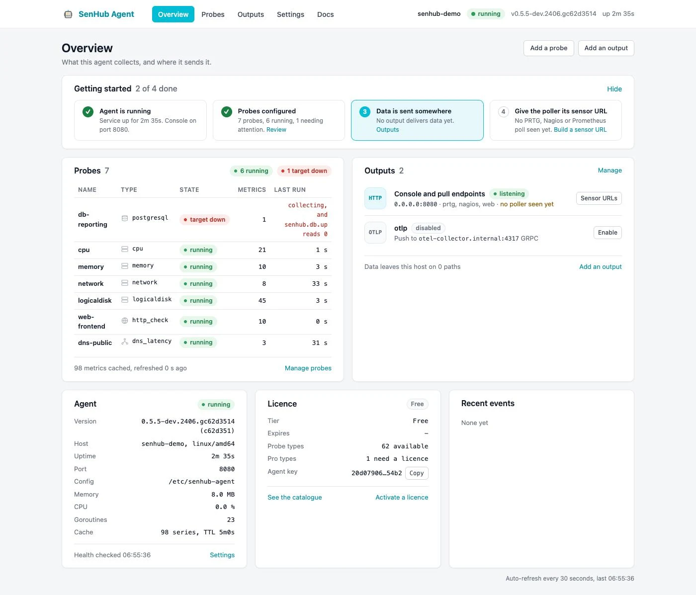
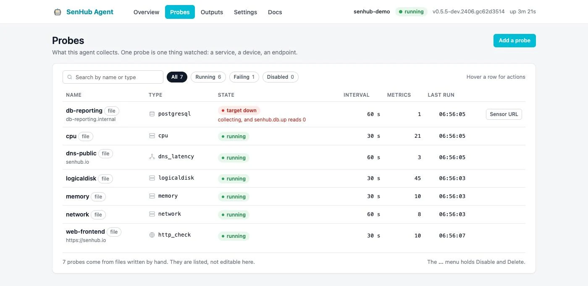
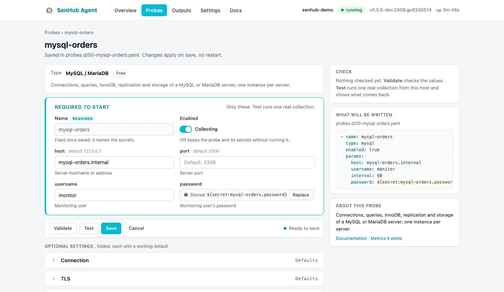
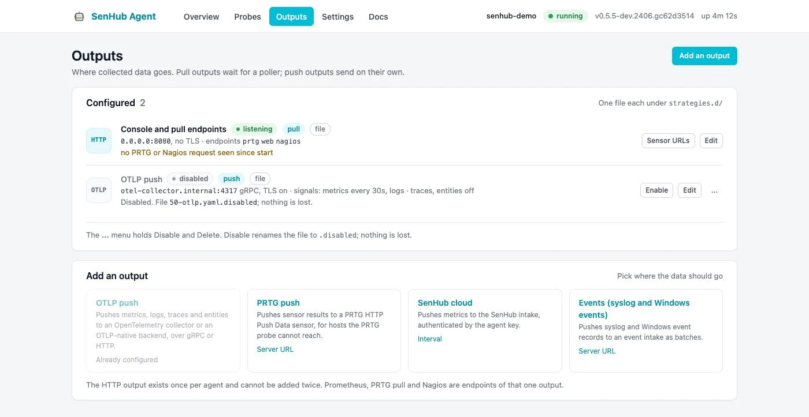
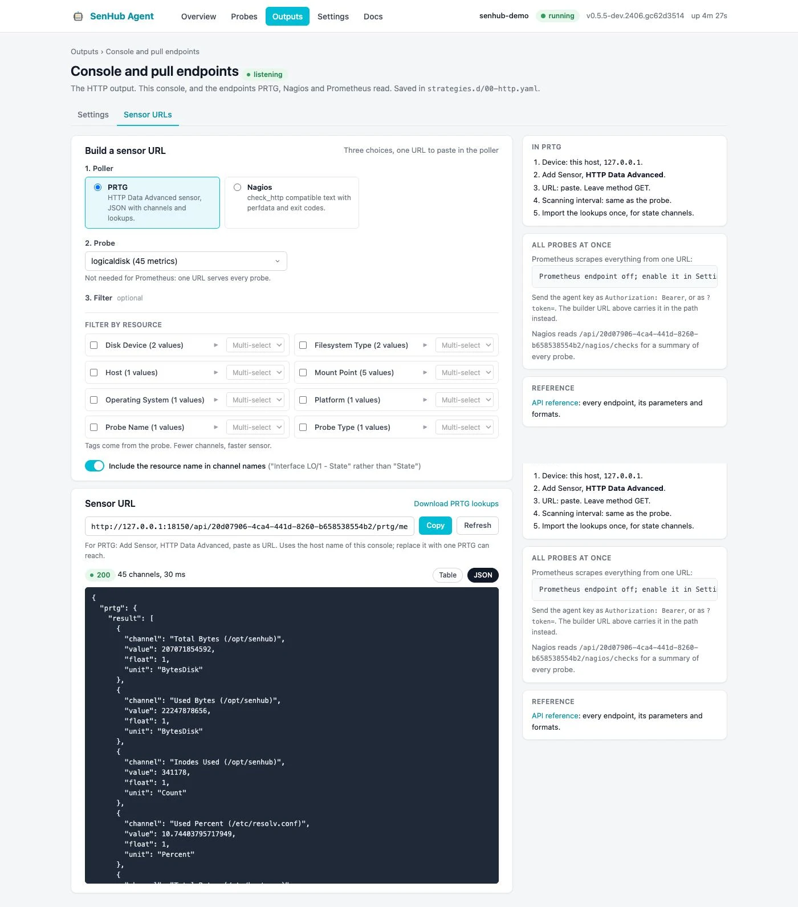
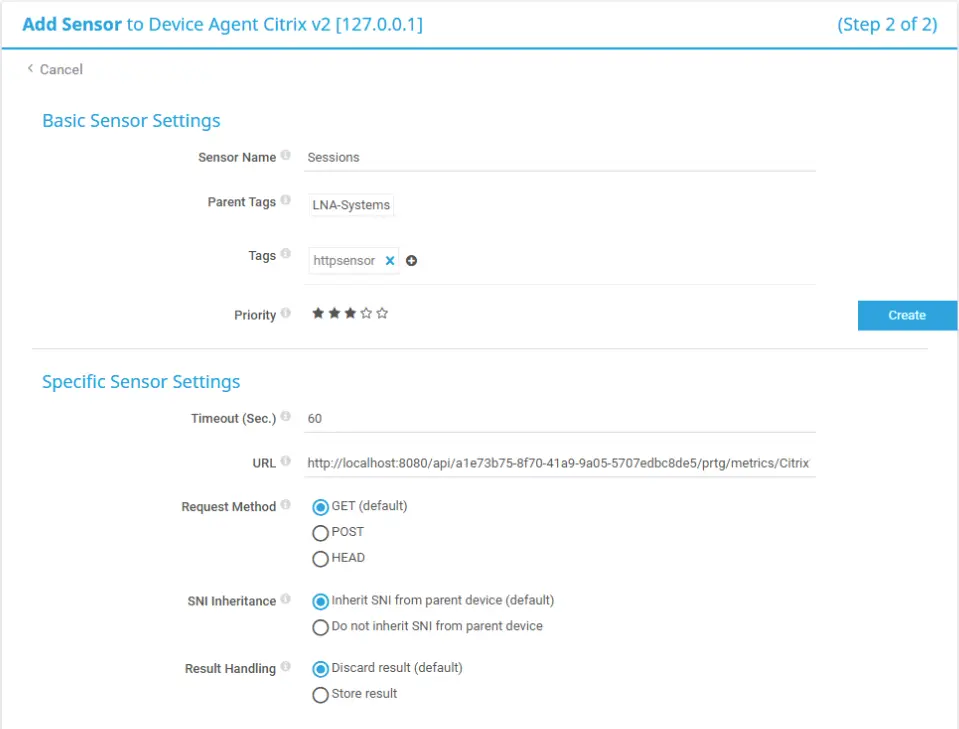

# Web console

SenHub Agent ships a web console. It answers the questions an operator asks in the order they ask them: is the agent running, what does it collect, where does the data go, and what URL does the poller need.

## Opening the console

The console is served by the `http` output on the agent's port. Open:

```
http://agent-server:8080/web/{agent-key}/
```

Replace `agent-server` with the address of the machine running the agent and `{agent-key}` with the agent's key. The key is printed by `senhub-agent key show` and by `senhub-agent console --print`; on Windows the installer creates a Start Menu shortcut that opens the console directly. With HTTPS enabled, use `https://` and the HTTPS port (8443 by default).

The console requires the `web` endpoint of the `http` output, which the installer enables:

```yaml
http:
  port: 8080
  bind_address: "127.0.0.1"
  endpoints: ["prtg", "web", "nagios"]
```

The header of every page shows the host name, the agent's state, its version and its uptime, so you can see that the agent runs without leaving the page you are on. The menu has five entries: Overview, Probes, Outputs, Settings and Docs. Docs opens this documentation on [agent.senhub.io](https://agent.senhub.io/docs); the API reference embedded in the agent remains available at `/web/{agent-key}/docs`.

## Overview

The Overview is the landing page.



- **Getting started** lists four steps and computes their state from the agent: the agent runs, probes are configured, data is sent somewhere, the poller has its sensor URL. The current step is highlighted and carries the link that resolves it. Hide it once you are done; it disappears on its own when every step is complete.
- **Probes** is a compact table of the configured probes, failing ones first, with their state, the number of series they hold and the time of their last collection.
- **Outputs** lists every output with its state and the action that matters: build a sensor URL for the HTTP output, edit a push output, enable a disabled one.
- **Agent** merges the former status, health and resources cards: version, host, uptime, port, memory, CPU, goroutines and cache size. A warning appears when the configuration watch is off, because edits made by hand then need a restart.
- **Licence** shows the tier, the expiry date, how many probe types are available and how many need a licence, and the agent key with a copy button.
- **Recent events** shows the last transitions: a probe that started failing or recovered, an output that could not start, a save made from the console, a configuration reloaded from disk. The agent keeps the last fifty in memory; they do not survive a restart.

The page refreshes every thirty seconds.

## Probes

The Probes page lists what the agent collects and lets you add, edit, enable, disable and delete probe instances without editing YAML on the server.



### The list

Each row shows the probe's name, its type, its state (running, failing with the reason, starting, disabled, not licensed, or not on this platform), its interval, the number of series it holds and the time of its last collection. Failing rows come first and keep their actions visible; other rows show them on hover: Edit, Sensor URL, Enable or Disable, Delete. Chips filter the list by state and a search box filters by name or type.

Probes declared in files written by hand carry a `file` pill: they are listed but left to the file. Only the fragments the console wrote, one file per instance under `probes.d` with a header comment, are edited from the page.

On a fresh install the page shows four starters instead of an empty table: **This host** creates the CPU, memory, disk and network probes in one click; **A database**, **A network device** and **A web endpoint** open the editor on the matching type.

### The editor



The editor puts first what the probe needs to start, and folds everything else.

- **Type** is chosen in a grid of cards, filterable by name and by category. Pro types show a lock until a licence is activated; a type that does not run on this operating system says so instead (Windows only, Linux only), so a lock always means a licence and never a platform. Once chosen, the type collapses to one line with a Change link.
- **Required to start** holds the name, the enabled switch and the parameters the probe does nothing useful without: for MySQL the host, port, user and password; for SNMP the target, version and community, replaced by the v3 credentials when the version is v3; for an HTTP check the URLs. Everything below this block has a working default.
- The **action bar** stays visible while you scroll: Validate checks the values against the schema and asks the probe what it would refuse; Test runs one real collection from this host and shows the first metrics that came back; Save (Save and start for a new probe) writes the file, and the agent starts, restarts or stops the probe on its own. Save stays disabled until the name and every required value are present, and the bar says what is missing.
- **Optional settings** are one collapsed section per group of the schema. A section whose values are all at their default says so in grey; a section with a value set shows a count and the values, so you know what is set without opening it. A section holding an error opens on its own with a red mark.
- **Governance and tags** is one section: owning team and contact, criticality, lifecycle, location, the application chain (the `application` label) and other labels. It is stamped on the entities, metrics and logs of this probe only; see [Governance per probe](configuration.md#governance-per-probe).
- **Edit as YAML** shows the fragment as it will be written and accepts edits, checked with the same rules as the form.
- The right column shows the result of the last Validate or Test, the file that will be written with a live YAML preview, and a link to the probe's documentation.

Validation and test errors are anchored: the banner lists them, each one is a link to its field, and the message is repeated under the field. When a test fails, the raw message of the probe is shown together with a plain-language explanation for the common cases (refused credentials, a host that does not answer, an untrusted certificate).

### Secrets

A password typed in the form goes to the agent's secret store; the file holds a `${secret:...}` reference. A stored secret is shown as a state, not as a value: the word Stored, the reference, and a Replace button. Leaving it alone keeps it; the form never sends a stored value back to the agent. Replace clears the field: type a new value to change the secret, or leave the field empty and save to drop it. This holds for a secret inside a block and inside a list of blocks, such as the users of an SNMP v3 device. A field can also take a reference you already have, `${secret:...}` or `${env:...}`. Without a usable secret store the save is refused with the alternative rather than writing a password in clear.

Delete removes the file and its stored secrets; Disable keeps them, which is the better choice during an incident.

## Outputs

The Outputs page shows where the collected data goes. Pull outputs wait for a poller; push outputs send on their own.



Each output is one file under `strategies.d`. The list shows, per output, its state and a line of life: which poller last read an endpoint and when, or when the last export succeeded and when the last one failed and why.

| State | Meaning |
|---|---|
| listening | The HTTP output serves its endpoints; the life line says which poller came and when. |
| exporting | A push output delivered its last batch. |
| idle | A push output is enabled and has delivered nothing yet, for instance traces without an `otlp_receiver` probe. |
| failing | The last delivery failed, or the output could not start; the reason is on the line. |
| disabled | The file is renamed `.disabled`; nothing is lost. |

Add an output picks a type: OTLP push, PRTG push, SenHub cloud, or events. The HTTP output exists once per agent and is created by the installer; PRTG pull, Nagios and Prometheus are endpoints of that one output.

The switch at the top of the editor, Starts as soon as saved, can be turned off before the first save: the file is then written as `.disabled` from the start, so an output can be prepared before its collector exists and enabled later from the list.

A file under `strategies.d` the agent cannot read, because of a YAML error or because it holds more than one output, is listed as failing with that error rather than left out, so the list shows every file on disk.

### OTLP output

The OTLP editor follows the probe editor: the endpoint, the transport, TLS and the authorization header in the block at the top; signals, authentication and routing, TLS details, resource attributes, delivery, memory and persistence in collapsed sections; the YAML at the bottom.

**Test connection** opens a fresh connection with the values on the page, saved or not, and reports each step: name resolution, TCP, the TLS handshake with the certificate's subject and expiry, and the export of one test metric the receiver has to accept. A failing step is shown with its error, so a dead collector is diagnosed from the page.

The right column carries the counters of the OTLP pipeline (exports, errors, dropped points, mean export time, log queue, store size) that used to live on the dashboard.

### HTTP output

The HTTP output page has two tabs.

**Settings** holds the port, whether the console is reachable from this machine only or from other machines, and which endpoints answer: PRTG, Nagios, Prometheus and the web console itself. TLS and the cache are collapsed sections. The right column says who is reading: the last request per endpoint, or that a poller has never come, which is the usual sign that the URL is not yet in its sensor.

**Sensor URLs** replaces the former Sensor Builder. Three choices, one URL:

1. The poller: PRTG, Nagios or Prometheus.
2. The probe.
3. An optional filter on the probe's tags, for probes that return many components.

Copy pastes the URL into the poller's sensor; Preview shows the response as a table or as JSON. The page also offers the PRTG lookups for download and lists the steps on the PRTG side. The old address `/web/{agent-key}/explorer` redirects here.



## Settings

The Settings page changes the agent's own configuration from the browser, so a Windows operator does not have to edit YAML on the server.

- **Connection** shows the port and bind address of the HTTP output, the same values the Outputs page edits, and links to it for the endpoints, TLS and the sensor URLs. Changing the port moves the console to the new address; the page tells you where to reconnect. The change is applied live, with no restart.
- **Licence** uploads the licence file you received, or takes the pasted token. A customer licence is valid across the whole fleet, so the same file activates every agent; a licence issued for one specific agent is checked against that agent. The card shows how many Pro probe types are locked and links to the catalogue.

These changes are written to the multi-file configuration and picked up by the running agent, exactly as the `senhub-agent config set` command does.

## Monitoring system integration

### PRTG Network Monitor

#### Sensor type

Use the **HTTP Data Advanced** sensor type in PRTG. This sensor sends an HTTP request to the agent and parses the JSON response.

#### Creating a PRTG sensor

For each probe you want to monitor in PRTG:

1. In PRTG, right-click a device and select **Add Sensor**.
2. Search for **HTTP Data Advanced** and select it.
3. Configure the sensor:
   - **URL**: `http://agent-server:8080/api/{key}/prtg/metrics/{probe-name}`, as built by the Sensor URLs tab.
   - **Request Method**: GET.
   - **Content Type**: leave the default.



The agent returns metrics in the PRTG JSON format:

```json
{
  "prtg": {
    "result": [
      {
        "channel": "CPU Usage",
        "value": 45.2,
        "float": 1,
        "unit": "Percent"
      },
      {
        "channel": "Memory Available",
        "value": 8192,
        "float": 1,
        "unit": "BytesMemory"
      }
    ]
  }
}
```

Each channel becomes a separate metric in PRTG with its own graph and alerting thresholds.

#### Finding available probe names

To see which probe names are available for PRTG sensors:

```bash
curl http://agent-server:8080/api/{key}/prtg/probes
```

Or open the Sensor URLs tab of the HTTP output in the console.

#### Filtering metrics by tags

Some probes (Citrix, NetScaler, SNMP) return metrics for multiple components. You can filter by tags:

```
http://agent-server:8080/api/{key}/prtg/metrics/{probe}?tags=vserver_name:vs_web
```

This returns only the metrics for the virtual server named `vs_web`. The Sensor URLs tab builds this filter from the tags the probe reports.

#### Installing PRTG value lookups

SenHub Agent provides custom PRTG lookup files that translate numeric status values into meaningful text (for instance "Up" instead of "1"):

1. Download the lookups from the agent API:
   ```bash
   curl -o senhub-prtg-lookups.zip http://agent-server:8080/api/{key}/lookups/prtg
   ```
   Or use the download link of the Sensor URLs tab.

2. Extract the ZIP file to the PRTG custom lookups directory on your PRTG server:
   ```powershell
   Expand-Archive senhub-prtg-lookups.zip `
     -DestinationPath "C:\Program Files (x86)\PRTG Network Monitor\lookups\custom\"
   ```

3. In the PRTG web interface, go to **Administration > Administrative Tools** and click **Load Lookups and File Lists**.

After loading the lookups, PRTG sensors display human-readable status values instead of raw numbers. The ZIP file contains lookup files in the PRTG `.ovl` format:

```
senhub-prtg-lookups.zip
  netscaler.lbvserver.state.ovl
  netscaler.service.state.ovl
  netscaler.ha.node.state.ovl
  ...
```

### Nagios

For Nagios, use the Nagios-formatted endpoints:

```
http://agent-server:8080/api/{key}/nagios/metrics/{probe-name}
```

The response follows the standard Nagios plugin output format:

```
OK - Probe has 12 metrics | cpu_usage=45.2% memory_available=8192MB
```

This can be used with `check_http` or a custom check command. Example Nagios command definition:

```
define command {
    command_name    check_senhub
    command_line    /usr/lib/nagios/plugins/check_http -H $HOSTADDRESS$ -p 8080 -u '/api/{key}/nagios/metrics/$ARG1$'
}
```

To list available checks:

```bash
curl http://agent-server:8080/api/{key}/nagios/checks
```

### Prometheus

Prometheus scrapes every probe from one URL, `/metrics` on the agent's port, with the agent key as bearer token. See [Prometheus](prometheus/index.md).

## The console's API

Everything the console does goes through the agent's JSON API, so scripts can do the same.

| Route | Purpose |
|---|---|
| `GET /api/{key}/catalog/probes` | Probe types with their parameter schema, tier and licence verdict |
| `GET /api/{key}/config/probes` | Configured probes with their live state, interval, series count and last update |
| `POST /api/{key}/config/probes`, `PUT` and `DELETE` on `.../{name}` | Create, update, delete a probe fragment |
| `POST /api/{key}/config/validate`, `POST /api/{key}/config/test` | Check values against the schema; run one real collection |
| `GET /api/{key}/catalog/outputs` | Output types with their parameter schema |
| `GET /api/{key}/config/outputs` | Configured outputs with their state, delivery record and, for HTTP, the last poller per endpoint |
| `POST /api/{key}/config/outputs`, `PUT` and `DELETE` on `.../{name}` | Create (with `enabled: false` to write the file as `.disabled`), update, delete an output file |
| `POST /api/{key}/config/outputs/validate`, `POST /api/{key}/config/outputs/test` | Check values; test the connection step by step |
| `GET /api/{key}/config/settings`, `POST` | Port, bind address, licence |
| `GET /api/{key}/info/events` | The recent events shown on the Overview |

An update sends only what it changes. A `PUT` on an output without `enabled` keeps it in its current state, so a parameter edit never re-enables what an operator disabled. A stored secret the body does not mention is kept, for probes and outputs alike; to drop one, send its key with the value `null`, inside a block or a list of blocks as well.

## Useful API queries

### Check agent health

```bash
curl http://agent-server:8080/health
```

Response:
```json
{
  "status": "ok",
  "version": "0.5.5",
  "uptime": "2h30m",
  "probes_active": 4,
  "metrics_cached": 156
}
```

### List collected probes

```bash
curl http://agent-server:8080/api/{key}/info/probes
```

Response:
```json
{
  "probes": ["cpu", "memory", "core-sw-01", "mysql-prod"],
  "probe_metrics": {
    "cpu": 4,
    "memory": 3,
    "core-sw-01": 85,
    "mysql-prod": 64
  },
  "total_metrics": 156
}
```

### View system information

```bash
curl http://agent-server:8080/api/{key}/info/system
```

Returns the host name, version, uptime, memory usage, CPU usage, cache statistics, service health and the outputs that are not running.

### Check licence status

```bash
curl http://agent-server:8080/api/{key}/license/status
```

Response:
```json
{
  "status": "active",
  "tier": "pro",
  "expires_at": "2026-06-30T23:59:59Z",
  "days_remaining": 120,
  "authorized_probes": ["cpu", "memory", "citrix", "netscaler", "redfish"],
  "free_tier_probes": ["cpu", "memory", "logicaldisk", "network"]
}
```

### OTLP counters

```bash
curl http://agent-server:8080/api/{key}/info/otlp
```

Returns the counters of the OTLP pipeline shown on the OTLP output page; see [Monitoring the OTLP pipeline](otlp.md#monitoring-the-otlp-pipeline).

### Cache statistics

```bash
curl http://agent-server:8080/api/{key}/stats/cache
```

Returns the number of cached metrics, memory usage, and the cache's time to live.

### Clear the cache

If you need to force a fresh collection:

```bash
curl -X POST http://agent-server:8080/api/{key}/admin/cache/clear
```

This clears all cached metrics. The next collection cycle repopulates the cache.
